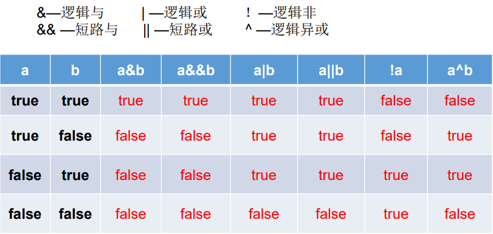
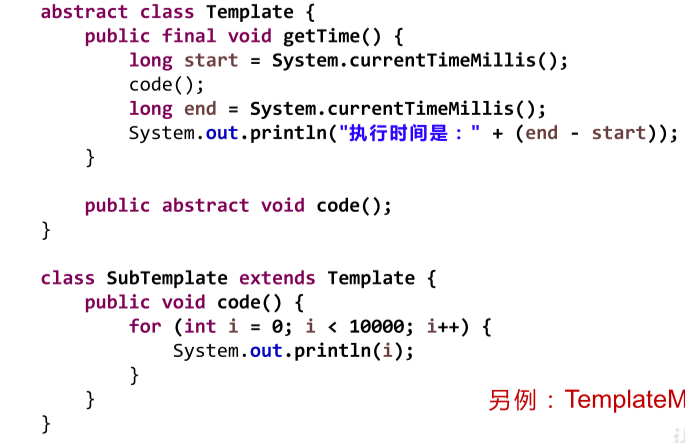
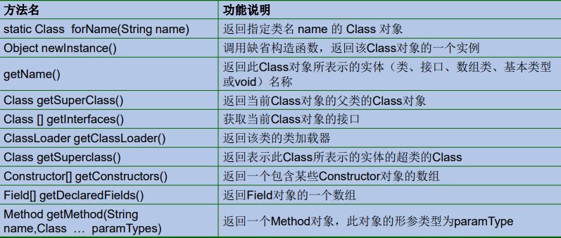

# Java学习

## Java语言概述

### 编写-编译-运行

- 编写：我们将编写的java代码保存在以".java"结尾的源文件中
-  编译：使用javac.exe命令编译我们的java源文件（.class文件)如果程序中有多个class，则生成星相对个数的 .class文件（字节码文件）。格式：javac 源文件名.java
- 运行：使用java.exe命令解释运行我们的字节码文件。格式：java 类名
- 在一个java源文件中可以声明多个class。但是，只能最多有--个类声明为public的。而且要求声明为public的类的类名必须与源文件名相同

### JDK,JRE,JVM

- JDK = JRE + Java的开发工具（javac.exe,java.exe,javadoc.exe）；
- JRE = JVM + Java核心类库

### 常用DOS命令

- 

## java基本语法

### 关键字

- 
- 

### 命名规范

- 

### 变量

- 概念

	- 1、内存中的一个存储区域（变量作用：内存中储存数据）
2、该区域的数据可以在同一类型范围内不断变化
3、变量是程序中最基本的存储单元。包含变量类型、变量名和存储的值

- 注意事项

	- 1、Java中每个变量必须先声明，后使用（先赋值）
2、使用变量名来访问这块区域的数据
3、变量的作用域：其定义所在的一对{ }内
4、变量只有在其作用域内才有效（局部性作用）
5、同一个作用域内，不能定义重名的变量

- 使用语法

	- <数据类型> <变量名> = <初始化值>（必须要有初始化值）

- 变量分类

	- 数据类型划分

		- 

	- 声明位置划分

		-  在方法体外，类体内声明的变量称为成员变量。
在方法体内部声明的变量称为局部变量
		- 

	- 注意事项

		- java的整型常量默认为 int 型，声明long型常量须后加‘l’或‘L’
		- Java 的浮点型常量默认为double型，声明float型常量，须后加‘f’或‘F’，不然无法用正常浮点型。
		- 字符型：char 是16位，char c = '';编译不通过，不成立

			- 字母与ASCLL码对应：a:97        A:65  

		- 数据类型转化

			- 自动转化（小——大）

				- byte、short、char—> int —> long —> float —>double
				- byte short char 类型进行运算将转化成 int类型
				- string只能与数据类型进行连接运算结果为string类型，可以将其他数据强制转化成，本身不可以强制转化。
				- char + int = int     char + char =int(做运算输出int类型，做连接时需要用双引号，而不是单引号。）

			- 强制转化(大——小)

				- 表达式

					- <转化的类型>  变量  =  （转化的类型） <需要转化的类型>     小括号很重要

				- 字符串不能直接转换为基本类型，但通过基本类型对应的包装类则可以实现把字符串转换成基本类型

					- String a = “43”; int i = Integer.parseInt(a)

### 全局常量定义

- private static final double PI = 3.1415926535;

### 进制

- 正数的原码、反码、补码都相同
负数的补码是其反码+1（补码符号位不变，其他位反转）
所有的数值，不管正负，底层都以补码的方式存储
- 进制转化

	- 十进制转化

		- Integer.toBinaryString(n);
10进制转2进制
		- Integer.toOctalString(n);
10进制转8进制
		- Integer.toHexString(n);
10进制转16进制
		- Integer.toString(n，r);
10进制转r进制

	- r进制转10进制

		- Integer.parseInt((String) s,(int) radix);

	- 计算十进制的二进制表达式中1的个数

		- Integer.bitCount(十进制数)

	- 在数据输出层使用控制符进行进制转化

		- 
		- 

### 运算符

- 算术运算符

	- 
	- 扩展赋值运算符： +=先格式化转变, -=先计算后转化, *=先计算后转化, /=先计算在转化, %=，进行不同类型数据运算时，除加法会根据四舍五入的运算将结果进行赋值
	- 如果对负数取模，可以把模数负号忽略不记，如：5%-2=1。 但被模数是 负数则不可忽略。此外，取模运算的结果不一定总是整数，pyhton会向下取整，结果不同。

- 逻辑运算符

	- 

- 位运算

	- 
	- <<左移几位，原结果乘2的几次方，可能还会生成负数（符号位变化）
>> 右移几位，原结果除2的几次方，生成的空位需要用符号位进行填充
无符号位移动，只用0进行填充。
取反码时，符号位不变，其他位取相反数。取反运算时，包括符号位在内，都取反

- 三元运算

	- 三元运算 ： (条件表达式)?表达式1：表达式2；（两个表达式类型一致）
	- 处理char类型时要注意

		- 如果其中有一个是变量，按照自动类型转换规则处理成一致的类型
		- 如果都是常量

			- 如果一个是char，如果另一个是[0~65535]之间的整数按char处理
			- 如果一个是char，另一个是其他，按照自动类型转换规则处理成一致的类型；

- 运算符优先级

	- 

### 程序流程控制

- 顺序结构

	- 程序从上到下逐行地执行，中间没有任何判断和跳转

- 分支结构

	- 根据条件，选择性地执行某段代码
	- if…else

		- 条件表达式必须是布尔表达式（关系表达式或逻辑表达式）、布尔变量
		- 语句块只有一条执行语句时，一对{}可以省略，但建议保留
		- if-else语句结构，根据需要可以嵌套使用
		- 当if-else结构是“多选一”时，最后的else是可选的，根据需要可以省略
		- 当多个条件是“互斥”关系时，条件判断语句及执行语句间顺序无所谓 当多个条件是“包含”关系时，“小上大下 / 子上父下”

	- switch-case

		- switch(表达式)中表达式的值类型：byte，short， char，int，枚举，String
		- case子句中的值必须是常量，不能是变量名或不确定的表达式值
		- 同一个switch语句，所有case子句中的常量值互不相同
		- break语句用来在执行完一个case分支后使程序跳出switch语句块；如 果没有break，程序会顺序执行到switch结尾
		-  default子句是可任选的。同时，位置也是灵活的。当没有匹配的case时， 执行default

- 循环结构

	- 根据循环条件，重复性的执行某段代码
	- ①初始化部分 while(②循环条件部分)｛ ③循环体部分; ④迭代部分; }

		- 声明④迭代部分，避免死循环

	- do{ ③循环体部分 ④迭代部分 }while(②循环条件部分); 

		- 至少执行一次循环体

	- for (①初始化部分; ②循环条件部分; ④迭代部分)｛ ③循环体部分; ｝ 

		- ①可以声明多个变量，但必须是同一个类型，用逗号分隔
		- ④可有多个变量更新，用逗号分隔

- 特殊语句

	- break语句用于终止某个语句块的执行 { …… break; …… }

		- 只能用于switch语句和循环语句中

	- continue

		- 只能用于循环语句中
		- 用于跳过其所在循环语句块的一次执行，继续下一次循环
		- 出现在多层嵌套的循环语句体中时，可以通过标签指明要跳过的是哪一层循环

	-  return结束一整个方法

### 输入输出

- 资料链接

- 输出输入语句

	- 输出

		- System.out.print()用于直接输出
System.out.println()也是直接输出，但在结束的地方会加一个换行

	- 输入

		- 				i. 导入包：
				import java.io.*;
				import java.util.*;
				public class Main{
				    public static void main(String[] args)throws IOException{
				       
					Scanner in = new Scanner(System.in);

String s = in.next();

char c = s.charAt(0); //输入单个字符
				        System.out.println(c);
				
					 Scanner cin=new Scanner(System.in);
				         
				        int a=cin.nextInt();//输入一个整数
				        System.out.println(a);
				         
				        double b=cin.nextDouble();//输入一个双精度的浮点数
				        System.out.println(b);
				         
				        String str=cin.next();//输入一个单词，遇到分号则输入终止
				        System.out.println(str);
				         
				        String str2=cin.nextLine();//输入一行，中间可有多个空格
				        System.out.println(str2);
					
					BufferedReader cin=new BufferedReader(new InputStreamReader(System.in));
				        String str=cin.readLine();//输入一行
				        System.out.println(str);
				         
				        String str2=cin.readLine();
				        int a=Integer.parseInt(str2);//将str2转换为int,并复制给a
				        System.out.println(a);
				         
				        String str3=cin.readLine();
				        double b=Double.parseDouble(str3);//将str3转换为double,并复制给b
				        System.out.println(b);
				    }
				}

### 数组

- 概述

	- 数组本身是引用数据类型，而数组中的元素可以是任何数据类型，包括 基本数据类型和引用数据类型。
	- 创建数组对象会在内存中开辟一整块连续的空间，而数组名中引用的是 这块连续空间的首地址；数组的长度一旦确定，就不能修改
	- 具有索引的性质

- 一维数组

	- type var[] 或 type[] var；定义并用运算符new为之分配空间后，才可以引用数组中的每个元素     int[] arr = new int[3]
	- 初始化方式

		- 动态初始化：数组声明且为数组元素分配空间与赋值的操作分开进行
		- 静态初始化：在定义数组的同时就为数组元素分配空间并赋值

	- 数组元素类型默认值

		- 
		- 引用类型的数组为String,自定义数组类型（个人声明的class类）

- 多维数组

	- 将低一维数组作为元素，多层嵌套
	- 数组初始化值

		- int[][] arr = new int[4][3];
		- int[][] arr = new int[4][];

- Arrays工具类的使用

	- 必须使用Arrays类

### 排序算法学习

- 插入排序

	- 直接插入

		- 把n个待排序的元素看成为一个有序表和一个无序表，开始时有序表中只包含一个元素，无序表中包含有n-1个元素，排序过程中每次从无序表中取出第一个元素，把它的排序码依次与有序表元素的排序码进行比较，将它插入到有序表中的适当位置，使之成为新的有序表。
		- 时间复杂度为O（n*n）,是稳定方法
		- 

	- 希尔排序（缩小增量排序）

		- 先将整个待排元素序列分割成若干个子序列（由相隔某个“增量”的元素组成的）分别进行直接插入排序，待整个序列中的元素基本有序（增量足够小）时，再对全体元素进行一次直接插入排序。
		- 

- 交换排序

	- 冒泡排序

		- 通过对待排序序列从前向后，依次比较相邻元素的排序码，若发现逆序则交换，使排序码较大的元素逐渐从前部移向后部。
		- 
		- 时间复杂度为O(n*n),只进行元素的顺序移动，是稳定算法。

	- 快速排序（分区交换排序）

		- 任取待排序序列中的某个元素作为标准（也称为支点、界点，一般取第一个元素），通过一次划分，将待排元素分为左右两个子序列，左子序列元素的排序码均小于基准元素的排序码，右子序列的排序码则大于或等于基准元素的排序码，然后分别对两个子序列继续进行划分，直至每一个序列只有一个元素为止。
		- 
		- 时间复杂度为O(n*n),是不稳定算法。

- 选择排序

	- 简单选择排序

		- 
		-     在一组元素R[i]到R[n]中选择具有最小关键码的元素若它不是这组元素中的第一个元素，则将它与这组元素中的第一个元素对调。
    除去具有最小关键字的元素，在剩下的元素中重复第（1）、（2）步，直到剩余元素只有一个为止。
		- 时间复杂度为O(n*n),是一个不稳定排序算法

	- 堆排序

		- 
		- 

			- 

		- 时间复杂度为O(nlogn),比较次数与初始状态有关，是不稳定排序

- 二路归并排序

	- 
	- 将两个已排序的顺序表合并成一个已排序表。顺序比较两者的相应元素，小者移入另一表中，反复如此，直至其中任一表都移入另一表为止。
	- 稳定排序法

- 基数排序
- 选择最佳的排序方法

	-     （1）当待排序记录数n较大时，若要求排序稳定，则采用归并排序。
    （2)当待排序记录数n较大，关键字分布随机，而且不要求稳定时，可采用快速排序； 
    （3）当待排序记录数n较大，关键字会出现正、逆序情形，可采用堆排序（或归并排序）。
    （4)当待排序记录数n较小，记录已接近有序或随机分布时，又要求排序稳定，可采用直接插入排序。
    （5）当待排序记录数n较小，且对稳定性不作要求时，可采用直接选择排序。

## 面向对象

### 类的构成

- 基本构成

	- 修饰符 数据类型 属性名 = 初始化值 ; 

		- 修饰符

			- 常用的权限修饰符有：private、缺省、protected、public
			- 其他修饰符：static、final

		- 数据类型

			- 任何基本数据类型(如int、Boolean) 或 任何引用数据类型

		- 属性名

			- 属于标识符，符合命名规则和规范即可

- 类是并列的，也可以写在某个类里面，作为内部类。
- 变量的分类

	- 成员变量和局部变量

		- 在方法体外，类体内声明的变量称为成员变量
		- 在方法体内部声明的变量称为局部变量。
		- 

	- 
	- 初始值

		- 类的属性，根据其类型，都默认初始化值。
 整型（byte、short、int、long：0）
 浮点型（float、double：0.0）
 字符型（char：0  （或'\u0000'））
 布尔型（boolean：false）
引用数据类型（类、数组、接口：null）
局部变量：没默认初始化值，一定要显式赋值
		- 属性：加载到堆空间中   （非static）
局部变量：加载到栈空间

- 方法

	- 方法实现功能封装，必须定义在类中
	- 声明格式

		- 

	- 方法声明时要有  static 属性

- 引用数据（数组）

	- 声明对象数组时，先声明相对应的数组变量，然后重新声明单个数组变量。

		- 

- 构造器

	- 特征

		- 它具有与类相同的名称
它不声明返回值类型。（与声明为void不同）
不能被static、final、synchronized、abstract、native修饰，不能有return语句返回值

	- 语法格式：
修饰符 类名 (参数列表) {
初始化语句；
}

		- 

	- Java语言中，每个类都至少有一个构造器
默认构造器的修饰符与所属类的修饰符一致
一旦显式定义了构造器，则系统不再提供默认构造器
一个类可以创建多个重载的构造器
父类的构造器不可被子类继承

- Object 类

	- Object类是所有Java类的根父类，如果在类的声明中未使用extends关键字指明其父类，则默认父类为java.lang.Object类
	- Object 类的使用

		- 

	- 扩展

		- == 和 equals的不同

			- 比较基本类型时，两者都是比较基本类型的值
			- 比较引用数据类型时，==和未重写的（object)中的equals比较的是两者的指向地址，在重写的equals比较的是两者的值

		- toString方法

			- ·toString()方法在Object类中定义，其返回值是String类型，返回类名和它的引用地址。

- 包装类

	- 
	- 装箱和拆箱

		- 装箱是使用包装类的对象类型
拆箱是使用调用包装类的.xxxValue（）方法：实现类型转换。

- 类之间得转化

	- 
	- 基本数据类型<--->包装类：自动装箱 与自动拆箱
基本数据类型、包装类--->String:调用String重载的valueOf(Xxx xxx)
String--->基本数据类型、包装类:调用包装类的parseXxx(String s)
注意：转换时，可能会报NumberFormatException
	- 字符串与基本数据类型转换

		- 转化为基本数据

			- 

		- 转化为字符串

			- 

	- 注意

		-         Object o1 = true ? new Integer(1) : new Integer(2);
会进行统一格式的转化，然后再比较输出
		- Integer的范围是-128~127

- 代码块

	- 
	- 

- 接口

	- 
	- 
	- 
	- 使用接口时，直接接口及父接口的所有方法都要实现，不然实现类仍为abstract
	- 接口与抽象类的对比

		- 
		- 
		- 

			- 

- 内部类

	- 

		- 

	- 

		- 

	- 

		- 

	- 

		- 

- 面试题

	- 重载（overload)和重写(overried，有的书也叫做“覆盖”）的区别？
答：方法的重写Overriding和重载Overloading是Java多态性的不同表现。重写Overriding是父类与子类之间多态性的一种表现，重载Overloading是一个类中多态性的一种表现。如果在子类中定义某方法与其父类有相同的名称和参数，我们说该方法被重写 (Overriding)。子类的对象使用这个方法时，将调用子类中的定义，对它而言，父类中的定义如同被"屏蔽"了。如果在一个类中定义了多个同名的方法，它们或有不同的参数个数或有不同的参数类型，则称为方法的重载(Overloading)。

### 方法学习

- 方法重载

	- 在同一个类中，允许存在一个以上的同名方法，只要它们的参数个数或者参数类型不同以及参数顺序不同即可。
   与返回值类型无关，只看参数列表，且参数列表必须不同。（参数个数或参数类型）。调用时，根据方法参数列表的不同来区别。
	- 

- 可变形参方法

	- 1. 声明格式：方法名(参数的类型名 ...参数名)
2. 可变参数：方法参数部分指定类型的参数个数是可变多个：0个，1个或多个
3. 可变个数形参的方法与同名的方法之间，彼此构成重载
4. 可变参数方法的使用与方法参数部分使用数组是一致的
5. 方法的参数部分有可变形参，需要放在形参声明的最后
6. 在一个方法的形参位置，最多只能声明一个可变个数形参

- 方法参数的值传递机制

	- 注意参数传递及参数的变化
	- 定义整数型数组和字符型数组时，调用数组名时整数数组输出地址值，而字符型数组输出null

- 递归方法
- 方法的重写：override/overwrite

	- 定义：
在子类中可以根据需要对从父类中继承来的方法进行改造，也称为方法的重置、覆盖。在程序执行时，子类的方法将覆盖父类的方法
	- 要求：
1. 子类重写的方法必须和父类被重写的方法具有相同的方法名称、参数列表
2. 子类重写的方法的返回值类型不能大于父类被重写的方法的返回值类型
3. 子类重写的方法使用的访问权限不能小于父类被重写的方法的访问权限
     子类不能重写父类中声明为private权限的方法
4. 子类方法抛出的异常不能大于父类被重写方法的异常
	- 注意：
子类与父类中同名同参数的方法必须同时声明为非static的(即为重写)，或者同时声明为static的（不是重写）。因为static方法是属于类的，子类无法覆盖父类的方法。

### 对象的内存解析

-     ·堆（Heap)，此内存区域的唯一目的就是存放对象实例，几乎所有的对象实例都在这里分配内存，所有的对象实例以及数组都要在堆上分配。
     栈（Stack)，是指虚拟机栈。虚拟机栈用于存储局部变量等。局部变量表存放了编译期可知长度的各种基本数据类型。方法执行完，自动释放。
    方法区（Method Area)，用于存储已被虚拟机加载的类信息、常量、静态变量、即时编译器编译后的代码等数据。
- 匿名对象

	- 我们也可以不定义对象的句柄，而直接调用这个对象的方法。这样的对象叫做匿名对象。
	- 使用情况

		- 如果对一个对象只需要进行一次方法调用，那么就可以使用匿名对象；如：new Person().shout();
		- 我们经常将匿名对象作为实参传递给一个方法调用

### 面向对象特征

- 封装与隐藏
访问权限修饰符

	- 

- 继承性

	- class Subclass extends SuperClass{ }
	- 子类不能直接访问父类中私有的(private)的成员变量和方法

		- 一个子类只能有一个父类
一个父类可以派生出多个子类

- 多态性

	- 对象的多态性：父类的引用指向子类的对象，可以直接应用在抽象类和接口上

		- 在Java中,子类的对象可以替代父类的对象使用
一个变量只能有一种确定的数据类型
一个引用类型变量可能指向(引用)多种不同类型的对象

	- 编译时类型和运行时类型。编译时类型（早绑定）由声明该变量时使用的类型决定，运行时类型（晚绑定）由实际赋给该变量的对象决定。主要是区别父类的引用（左边）和子类的对象（右边）

		- 

	- 注意

		- 一个引用类型变量如果声明为父类的类型，但实际引用的是子类对象，那么该变量就不能再访问子类中添加的属性和方法

			- 

	- instanceof 操作符

		- x instanceof A：检验x是否为类A的对象，返回值为boolean型。
 要求x所属的类与类A必须是子类和父类的关系，否则编译错误。
 如果x属于类A的子类B，x instanceof A值也为true。

	- 对象类型转换 (Casting )

		- 自动类型转换：小的数据类型可以自动转换成大的数据类型
强制类型转换：可以把大的数据类型强制转换(casting)成小的数据类型
		- 对Java对象的强制类型转换称为造型
从子类到父类的类型转换可以自动进行
从父类到子类的类型转换必须通过造型(强制类型转换)实现
无继承关系的引用类型间的转换是非法的
在造型前可以使用instanceof操作符测试一个对象的类型

	- 子类继承父类

		- 若子类重写了父类方法，就意味着子类里定义的方法彻底覆盖了父类里的同名方法，系统将不可能把父类里的方法转移到子类中。
对于实例变量则不存在这样的现象，即使子类里定义了与父类完全相同的实例变量，这个实例变量依然不可能覆盖父类中定义的实例变量（注意变量的调用还是类本身的实例变量，不管子类）

### 关键字

- this  关键字

	- 它在方法内部使用，即这个方法所属对象的引用；
 它在构造器内部使用，表示该构造器正在初始化的对象。
可以调用类的属性，方法和构造器。主要用于区分属性和局部变量。
	-    当形参与成员变量同名时，如果在方法内或构造器内需要
使用成员变量，必须添加this来表明该变量是类的成员变量
   使用this访问属性和方法时，如果在本类中未找到，会从父类中查找
	- 注意
 可以在类的构造器中使用"this(形参列表)"的方式，调用本类中重载的其他的构造器！
 明确：构造器中不能通过"this(形参列表)"的方式调用自身构造器
 如果一个类中声明了n个构造器，则最多有 n - 1个构造器中使用了
"this(形参列表)"
 "this(形参列表)"必须声明在类的构造器的首行！
 在类的一个构造器中，最多只能声明一个"this(形参列表)"

- package

	- package语句作为Java源文件的第一条语句，指明该文件中定义的类所在的包。
格式为： package 顶层包名.子包名 ;
	- MVC设计模式

		- 

	- JDK的主要包

		- 1. java.lang----包含一些Java语言的核心类，如String、Math、Integer、 System和Thread，提供常用功能
2. java.net----包含执行与网络相关的操作的类和接口。
3. java.io ----包含能提供多种输入/输出功能的类。
4. java.util----包含一些实用工具类，如定义系统特性、接口的集合框架类、使用与日期日历相关的函数。
5. java.text----包含了一些java格式化相关的类
6. java.sql----包含了java进行JDBC数据库编程的相关类/接口
7. java.awt----包含了构成抽象窗口工具集（abstract window toolkits）的多个类，这些类被用来构建和管理应用程序的图形用户界面(GUI)。 B/S C/S

- import

	- 为使用定义在不同包中的Java类，需用import语句来引入指定包层次下所需要的类或全部类(.*)。import语句告诉编译器到哪里去寻找类
格式： import 包名. 类名;
	- import static组合的使用：调用指定类或接口下的静态的属性或方法

- super

	- 定义
super可用于访问父类中定义的属性
super可用于调用父类中定义的成员方法
super可用于在子类构造器中调用父类的构造器
	- 注意：
1、尤其当子父类出现同名成员时，可以用super表明调用的是父类中的成员
2、super的追溯不仅限于直接父类
3、super和this的用法相像，this代表本类对象的引用，super代表父类的内存空间的标识
	- 调用父类构造器

		- 子类中所有的构造器默认都会访问父类中空参数的构造器
 当父类中没有空参数的构造器时，子类的构造器必须通过this(参
数列表)或者super(参数列表)语句指定调用本类或者父类中相应的
构造器。同时，只能”二选一”，且必须放在构造器的首行
如果子类构造器中既未显式调用父类或本类的构造器，且父类中又
没有无参的构造器，则编译出错

	- 

- static

	- 
	- 可以实现不用创建对象就可以访问，访问方式：类名.类属性，类名.类方法
	-     ·没有对象的实例时，可以用类名.方法名（）的形式访问由static修饰的类方法。
    ·在static方法内部只能访问类的static修饰的属性或方法，不能访问类的非static的结构。

- final

	- 

- abstract

	- 

### 设计模式

- 单例设计模式

	- 介绍：减少系统性能开销
	- 懒汉式

		- 

	- 饿汉式

		- 

- 代理模式

	- 代理模式是Java开发中使用较多的一种设计模式。代理设计就是为其他对象提供一种代理以控制对这个对象的访问。

		- 

- 设计模板

	- 

		- 

- 工厂模式

### Java的垃圾回收

- 分配：由JVM自动为其分配相应的内存空间
释放：由JVM提供垃圾回收机制自动的释放内存空间
垃圾回收机制（GC：Garbage Collection）：将垃圾对象所占用的堆内存进行回收。Java的垃圾回收机制是JVM提供的能力，由单独的系统级垃圾回收线程在空闲时间以不定时的方式动态回收。
垃圾对象：不再被任何引用指向的对象。
- 面试题：
问：在程序中是否可以通知垃圾回收机制过来回收垃圾？
能，通过调用System.gc();或Runtime.getRuntime().gc();

再问：调用了System.gc();或Runtime.getRuntime().gc();后是立刻执行垃圾回收吗？
不是，该调用并不会立刻启动垃圾回收机制开始回收，但会加快垃圾回收机制的运行。

## 异常处理

### 简介

- 
- Throwable类有两个直接子类：
（1）Exception：出现的问题是可以被捕获的
（2）Error：系统错误，通常由JVM处理

	- 被捕获的异常分类
（1）Check异常: 派生自Exception的异常类，必须被捕获或再次声明抛出
（2）Runtime异常：派生自RuntimeException的异常类。使用throw语句可以随时抛出这种异常对象 throw new ArithmeticException(…);

### 异常分类

- 发生异常的原因
1、用户输入了非法数据。
2、要打开的文件不存在。
3、网络通信是连接中断
4、JVM内存溢出
- 1、java.lang.NullpointerException(空指针异常)
原因：这个异常经常遇到，异常的原因是程序中有空指针，即程序中调用了未经初始化的对象或者是不存在的对象。经常出现在创建对象，调用数组这些代码中，比如对象未经初始化，或者图片创建时的路径错误等等。对数组代码中出现空指针，是把数组的初始化和数组元素的初始化搞混淆了。数组的初始化是对数组分配空间，而数组元素的初始化，是给数组中的元素赋初始值

2、 java.lang.ClassNotFoundException（指定的类不存在）
原因：当试图将一个String类型数据转换为指定的数字类型，但该字符串不满足数值型数据的要求时，就抛出这个异常。例如将String类型的数据"123456"转换为数值型数据时，是可以转换的的。但是如果String类型的数据中包含了非数字型的字符，如123*56，此时转换为数值型时就会出现异常。系统就会捕捉到这个异常，并进行处理

3、java.lang.ClassNotFoundExceptio（指定的类不存在）
原因：是因为类的名称和路径不正确，通常都是程序试图通过字符串来加载某个类的时候可能会引发异常。例如：调用Class.forName()、或者调用ClassLoad的finaSystemClass()、或者是LoadClass()时出现异常

4、java.lang.IndexOutOfBoundsException（数组下标越界异常）
原因：查看程序中调用的数组或者字符串的下标值是不是超出了数组的范围，一般来说，显示调用数组不太容易出这样的错，但隐式调用就有可能出错了，还有一种情况，是程序中定义的数组的长度是通过某些特定方法决定的，不是事先声明的，这个时候可以先查看一下数组的length，以免出现这个异常

5、java.lang.IllegalArgumentException（方法的参数错误）
例如g.setColor(int red,int green,int blue)这个方法中的三个值，如果有超过２５５的会出现这个异常，如果程序中存在这个异常，就要去检查一下方法调用中的参数传递或参数值是不是有错

6、java.lang.IllegalAccessException（没有访问权限）
当程序要调用一个类，但当前的方法即没有对该类的访问权限便会出现这个异常。如果程序中用了Package的情况下有可能出现这个异常

7、java.lang.ArithmeticException（数学运算异常）
当数学运算中出现了除以零这样的运算就会出这样的异常。

8、java.lang.ClassCastException（数据类型转换异常）
当试图将对某个对象强制执行向下转换，但该对象又不可转换或又不可转换为其子类的实例时将出现该异常

9、 java.lang.FileNotFoundException（文件未找到异常）
当程序打开一个不存在的文件来进行读写时将会引发该异常。该异常由FileInputStream,FileOutputStream,
RandomAccessFile的构造器声明抛出，即使被操作的文件存在，但是由于某些原因不可访问，比如打开一个
只有只读权限的文件并向其中写入数据，以上构造方法依然会引发异常

10、java.lang.ArrayStoreException（数组存储异常）
当试图将类型为不兼容类型的对象存入一个Object[]数组时将引发异常

11、java.lang.NoSuchMethodException（方法不存在异常）
当程序试图通过反射来创建对象，访问(修改或读取)某个方法，但是该方法不存在就会引发异常。

12、 java.lang.EOFException（文件已结束异常）
当程序在输入的过程中遇到文件或流的结尾时，引发异常。因此该异常用于检查是否达到文件或流的结尾

13、java.lang.InstantiationException（实例化异常）
当试图通过Class的newInstance()方法创建某个类的实例,但程序无法通过该构造器来创建该对象时引发。Class对象表示一个抽象类，接口，数组类，基本类型 。该Class表示的类没有对应的构造器。

14、java.lang.InterruptedException（被中止异常）
当某个线程处于长时间的等待、休眠或其他暂停状态，而此时其他的线程通过Thread的interrupt方法终止该线程时抛出该异常。

15、java.lang.CloneNotSupportedException （不支持克隆异常）
当没有实现Cloneable接口或者不支持克隆方法时,调用其clone()方法则抛出该异常

16、java.lang.OutOfMemoryException （内存不足错误）
当可用内存不足以让Java虚拟机分配给一个对象时抛出该错误

17、java.lang.NoClassDefFoundException （未找到类定义错误）

当Java虚拟机或者类装载器试图实例化某个类，而找不到该类的定义时抛出该错误

### 异常处理

- try-catch-finally

	- 简介

		- Java提供的是异常处理的抓抛模型。
Java程序的执行过程中如出现异常，会生成一个异常类对象，
该异常对象将被提交给Java运行时系统，这个过程称为抛出
(throw)异常。
异常对象的生成
由虚拟机自动生成：程序运行过程中，虚拟机检测到程序发生了问题，如果在当前代码中没有找到相应的处理程序，就会在后台自动创建一个对应异常类的实例对象并抛出——自动抛出
由开发人员手动创建：Exception exception = new ClassCastException();——创建好的异常对象不抛出对程序没有任何影响，和创建一个普通对象一样

	- 格式

		- try{
...... //可能产生异常的代码
}
catch( ExceptionName1 e ){
...... //当产生ExceptionName1型异常时的处置措施
}
catch( ExceptionName2 e ){
...... //当产生ExceptionName2型异常时的处置措施
}
[ finally{
...... //无论是否发生异常，都无条件执行的语句
} ]

			- 所有异常的父类Exception类作为参数或者具体的异常或RuntimeException类作为参数

	- 捕获异常

		- e是Exception类，可以进行异常的信息返回的手段
e.getMessage() 获取异常信息，返回字符串
e.printStackTrace() 获取异常类名和异常信息，以及异常出现在程序中的位置。返回值void。
		- 其他扩展

			- FileInputStream类的成员方法read()的功能是每次从相应的(本地为ASCII码编码格式)文件中读取一个字节，并转换成0~255之间的int型整数返回，到达文件末尾时则返回-1。
			- 抛出的异常是IOException等类型的非运行时异常，则必须捕获，否则编译错误。也就是说，我们必须处理编译时异常，将异常进行捕捉，转化为运行时异常

- throws + 异常类型

	- 重写方法声明抛出异常的原则

		- 重写方法不能抛出比被重写方法范围更大的异常类型。在多态的情况下，
对methodA()方法的调用-异常的捕获按父类声明的异常处理。
		- 格式

			- public class A {
    public void methodA() throws IOException {
……
} }
public class B1 extends A {
    public void methodA() throws FileNotFoundException {
……
} }
public class B2 extends A {
    public void methodA() throws Exception { //报错
……
} }

	- 用户自定义异常类

		- 一般地，用户自定义异常类都是RuntimeException的子类。
 自定义异常类通常需要编写几个重载的构造器。
 自定义异常需要提供serialVersionUID
 自定义的异常通过throw抛出。
 自定义异常最重要的是异常类的名字，当异常出现时，可以根据名字判断异常类型。
		- 用户自定义异常类MyException，用于描述数据取值范围错误信息。用户自己的异常类必须继承现有的异常类

			- 
			- 

## 多线程

### 基本概念

- 程序、进程、线程

	- 程序(program)是为完成特定任务、用某种语言编写的一组指令的集合。即指一
段静态的代码，静态对象。
进程(process)是程序的一次执行过程，或是正在运行的一个程序。是一个动态
的过程：有它自身的产生、存在和消亡的过程。——生命周期
如：运行中的QQ，运行中的MP3播放器
程序是静态的，进程是动态的
进程作为资源分配的单位，系统在运行时会为每个进程分配不同的内存区域
线程(thread)，进程可进一步细化为线程，是一个程序内部的一条执行路径。
若一个进程同一时间并行执行多个线程，就是支持多线程的
线程作为调度和执行的单位，每个线程拥有独立的运行栈和程序计数器(pc)，线程切换的开销小
一个进程中的多个线程共享相同的内存单元/内存地址空间它们从同一堆中分配对象，可以访问相同的变量和对象。这就使得线程间通信更简便、高效。但多个线程操作共享的系统资源可能就会带来安全的隐患

- 单核与多核CPU

	- 单核CPU和多核CPU的理解
 单核CPU，其实是一种假的多线程，因为在一个时间单元内，也只能执行一个线程的任务。例如：虽然有多车道，但是收费站只有一个工作人员在收费，只有收了费才能通过，那么CPU就好比收费人员。如果有某个人不想交钱，那么收费人员可以把他“挂起”（晾着他，等他想通了，准备好了钱，再去收费）。但是因为CPU时间单元特别短，因此感觉不出来。
 如果是多核的话，才能更好的发挥多线程的效率。（现在的服务器都是多核的）
 一个Java应用程序java.exe，其实至少有三个线程：main()主线程，gc()
垃圾回收线程，异常处理线程。当然如果发生异常，会影响主线程
	- 并行：多个CPU同时执行多个任务。比如：多个人同时做不同的事。
 并发：一个CPU(采用时间片)同时执行多个任务。比如：秒杀、多个人做同一件事

- 多线程的作用

	- 优点

		- 1. 提高应用程序的响应。对图形化界面更有意义，可增强用户体验。
2. 提高计算机系统CPU的利用率
3. 改善程序结构。将既长又复杂的进程分为多个线程，独立运行，利于理解和修改

	- 使用

		- 程序需要同时执行两个或多个任务。
 程序需要实现一些需要等待的任务时，如用户输入、文件读写操作、网络操作、搜索等。
 需要一些后台运行的程序时

### 创建与使用

- Java语言的JVM允许程序运行多个线程，它通过java.lang.Thread类来体现。
Thread类的特性
每个线程都是通过某个特定Thread对象的run()方法来完成操作的，经常把run()方法的主体称为线程体
通过该Thread对象的start()方法来启动这个线程，而非直接调用run()

	- 构造器
Thread()：创建新的Thread对象
Thread(String threadname)：创建线程并指定线程实例名
Thread(Runnable target)：指定创建线程的目标对象，它实现了Runnable接口中的run方法
Thread(Runnable target, String name)：创建新的Thread对象

- JDK1.5之前创建新执行线程有两种方法：
 继承Thread类的方式
 实现Runnable接口的方式

	-  方式一：继承Thread类
1) 定义子类继承Thread类。
2) 子类中重写Thread类中的run方法。
3) 创建Thread子类对象，即创建了线程对象。
4) 调用线程对象start方法：启动线程，调用run方法

		-  注意点：
1. 如果自己手动调用run()方法，那么就只是普通方法，没有启动多线程模式。
2. run()方法由JVM调用，什么时候调用，执行的过程控制都有操作系统的CPU调度决定。
3. 想要启动多线程，必须调用start方法。
4. 一个线程对象只能调用一次start()方法启动，如果重复调用了，则将抛出以上
的异常“IllegalThreadStateException”。

	-  方式二：实现Runnable接口
1) 定义子类，实现Runnable接口。
2) 子类中重写Runnable接口中的run方法。
3) 通过Thread类含参构造器创建线程对象。
4) 将Runnable接口的子类对象作为实际参数传递给Thread类的构造器中。
5) 调用Thread类的start方法：开启线程，调用Runnable子类接口的run方法。

		- public class Thread extends Object implements Runnable

	- 继承方式和实现方式的联系与区别

		-  区别
 继承Thread：线程代码存放Thread子类run方法中。
 实现Runnable：线程代码存在接口的子类的run方法。
 实现方式的好处
 避免了单继承的局限性
 多个线程可以共享同一个接口实现类的对象，非常适合多个相同线程来处理同一份资源

- 新增线程创建方式

实现Callable接口
使用线程池

	- 实现Callable接口
与使用Runnable相比， Callable功能更强大些
 相比run()方法，可以有返回值
 方法可以抛出异常
 支持泛型的返回值
 需要借助FutureTask类，比如获取返回结果

		- Future接口
 可以对具体Runnable、Callable任务的执行结果进行取消、查询是否完成、获取结果等。
 FutrueTask是Futrue接口的唯一的实现类
 FutureTask 同时实现了Runnable, Future接口。它既可以作为
Runnable被线程执行，又可以作为Future得到Callable的返回值

	- 使用线程池
 背景：经常创建和销毁、使用量特别大的资源，比如并发情况下的线程，对性能影响很大。
 思路：提前创建好多个线程，放入线程池中，使用时直接获取，使用完放回池中。可以避免频繁创建销毁、实现重复利用。类似生活中的公共交通工具。
 好处：
 提高响应速度（减少了创建新线程的时间）
 降低资源消耗（重复利用线程池中线程，不需要每次都创建）
 便于线程管理
 corePoolSize：核心池的大小
 maximumPoolSize：最大线程数
 keepAliveTime：线程没有任务时最多保持多长时间后会终止

		- 线程池相关API

 JDK 5.0起提供了线程池相关API：ExecutorService 和 Executors
 ExecutorService：真正的线程池接口。常见子类ThreadPoolExecutor
 void execute(Runnable command) ：执行任务/命令，没有返回值，一般用来执行Runnable
 <T> Future<T> submit(Callable<T> task)：执行任务，有返回值，一般又来执行Callable
 void shutdown() ：关闭连接池
 Executors：工具类、线程池的工厂类，用于创建并返回不同类型的线程池
 Executors.newCachedThreadPool()：创建一个可根据需要创建新线程的线程池
 Executors.newFixedThreadPool(n); 创建一个可重用固定线程数的线程池
 Executors.newSingleThreadExecutor() ：创建一个只有一个线程的线程池
 Executors.newScheduledThreadPool(n)：创建一个线程池，它可安排在给定延迟后运行命令或者定期地执行。

- Thread类的有关方法

	- void start(): 启动线程，并执行对象的run()方法
run(): 线程在被调度时执行的操作
String getName(): 返回线程的名称
void setName(String name):设置该线程名称
static Thread currentThread(): 返回当前线程。在Thread子类中就
是this，通常用于主线程和Runnable实现类
	- static void yield()：线程让步
暂停当前正在执行的线程，把执行机会让给优先级相同或更高的线程
若队列中没有同优先级的线程，忽略此方法
join() ：当某个程序执行流中调用其他线程的 join() 方法时，调用线程将被阻塞，直到 join() 方法加入的 join 线程执行完为止
低优先级的线程也可以获得执行
static void sleep(long millis)：(指定时间:毫秒)
令当前活动线程在指定时间段内放弃对CPU控制,使其他线程有机会被执行,时间到后重排队。
抛出InterruptedException异常
stop(): 强制线程生命期结束，不推荐使用
boolean isAlive()：返回boolean，判断线程是否还活着

- 线程的调度

	- 调度策略
时间片
抢占式：高优先级的线程抢占CPU
Java的调度方法
同优先级线程组成先进先出队列（先到先服务），使用时间片策略
对高优先级，使用优先调度的抢占式策略
	- 线程优先级

		- 线程的优先级等级
MAX_PRIORITY：10
MIN _PRIORITY：1
NORM_PRIORITY：5
 涉及的方法
getPriority() ：返回线程优先值
setPriority(int newPriority) ：改变线程的优先级
 说明
线程创建时继承父线程的优先级
低优先级只是获得调度的概率低，并非一定是在高优先级线程之后才被调用

- 线程的分类

	- Java中的线程分为两类：一种是守护线程，一种是用户线程。
 它们在几乎每个方面都是相同的，唯一的区别是判断JVM何时离开。
 守护线程是用来服务用户线程的，通过在start)方法前调用thread.setDaemon(true)可以把一个用户线程变成一个守护线程。
 Java垃圾回收就是一个典型的守护线程。
 若JVM中都是守护线程，当前JVM将退出

### 线程的生命周期

- JDK中用Thread.State类定义了线程的几种状态
要想实现多线程，必须在主线程中创建新的线程对象。Java语言使用Thread类及其子类的对象来表示线程，在它的一个完整的生命周期中通常要经历如下的五种状态：
新建： 当一个Thread类或其子类的对象被声明并创建时，新生的线程对象处于新建状态
就绪：处于新建状态的线程被start()后，将进入线程队列等待CPU时间片，此时它已具备了运行的条件，只是没分配到CPU资源
运行：当就绪的线程被调度并获得CPU资源时,便进入运行状态， run()方法定义了线程的操作和功能
阻塞：在某种特殊情况下，被人为挂起或执行输入输出操作时，让出 CPU 并临时中止自己的执行，进入阻塞状态
死亡：线程完成了它的全部工作或线程被提前强制性地中止或出现异常导致结束
- 

### 线程同步

- 方法概念

	-  Java对于多线程的安全问题提供了专业的解决方式：同步机制
1. 同步代码块：
synchronized (对象){
// 需要被同步的代码；
}
2. synchronized还可以放在方法声明中，表示整个方法为同步方法。
例如：
public synchronized void show (String name){
….
}

- 同步锁

	-  synchronized的锁是什么？
 任意对象都可以作为同步锁。所有对象都自动含有单一的锁（监视器）。
 同步方法的锁：静态方法（类名.class）、非静态方法（this）
 同步代码块：自己指定，很多时候也是指定为this或类名.class
 注意：
 必须确保使用同一个资源的多个线程共用一把锁，这个非常重要，否则就无法保证共享资源的安全
 一个线程类中的所有静态方法共用同一把锁（类名.class），所有非静态方法共用同一把锁（this），同步代码块（指定需谨慎）

- 同步的范围

	- 1、如何找问题，即代码是否存在线程安全？（非常重要）
（1）明确哪些代码是多线程运行的代码
（2）明确多个线程是否有共享数据
（3）明确多线程运行代码中是否有多条语句操作共享数据
2、如何解决呢？（非常重要）
对多条操作共享数据的语句，只能让一个线程都执行完，在执行过程中，其
他线程不可以参与执行。
即所有操作共享数据的这些语句都要放在同步范围中
3、切记：
 范围太小：没锁住所有有安全问题的代码
 范围太大：没发挥多线程的功能。

- 释放锁

	-  当前线程的同步方法、同步代码块执行结束。
 当前线程在同步代码块、同步方法中遇到break、return终止了该代码块、该方法的继续执行。
 当前线程在同步代码块、同步方法中出现了未处理的Error或Exception，导致异常结束。
 当前线程在同步代码块、同步方法中执行了线程对象的wait()方法，当前线程暂停，并释放锁。
	- 释放锁失败

		- 线程执行同步代码块或同步方法时，程序调用Thread.sleep()、
Thread.yield()方法暂停当前线程的执行
线程执行同步代码块时，其他线程调用了该线程的suspend()方法将该线程挂起，该线程不会释放锁（同步监视器）。
应尽量避免使用suspend()和resume()来控制线程

	- 死锁

		- 死锁
不同的线程分别占用对方需要的同步资源不放弃，都在等待对方放弃
自己需要的同步资源，就形成了线程的死锁
出现死锁后，不会出现异常，不会出现提示，只是所有的线程都处于阻塞状态，无法继续
解决方法
专门的算法、原则
尽量减少同步资源的定义
尽量避免嵌套同步

- Lock(锁)

	-  从JDK 5.0开始，Java提供了更强大的线程同步机制——通过显式定义同
步锁对象来实现同步。同步锁使用Lock对象充当。
 java.util.concurrent.locks.Lock接口是控制多个线程对共享资源进行访问的
工具。锁提供了对共享资源的独占访问，每次只能有一个线程对Lock对象
加锁，线程开始访问共享资源之前应先获得Lock对象。
 ReentrantLock 类实现了 Lock ，它拥有与 synchronized 相同的并发性和
内存语义，在实现线程安全的控制中，比较常用的是ReentrantLock，可以
显式加锁、释放锁。
	- 
	- synchronized 与 Lock 的对比

		- 1. Lock是显式锁（手动开启和关闭锁，别忘记关闭锁），synchronized是隐式锁，出了作用域自动释放
2. Lock只有代码块锁，synchronized有代码块锁和方法锁
3. 使用Lock锁，JVM将花费较少的时间来调度线程，性能更好。并且具有更好的扩展性（提供更多的子类）
优先使用顺序：
Lock  同步代码块（已经进入了方法体，分配了相应资源）  同步方法（在方法体之外）

- 线程通信

	- 
	-  wait() 与 notify() 和 notifyAll()
 wait()：令当前线程挂起并放弃CPU、同步资源并等待，使别的线程可访问并修改共享资源，而当前线程排队等候其他线程调用notify()或notifyAll()方法唤醒，唤醒后等待重新获得对监视器的所有权后才能继续执行。
 notify()：唤醒正在排队等待同步资源的线程中优先级最高者结束等待
 notifyAll ()：唤醒正在排队等待资源的所有线程结束等待.
 这三个方法只有在synchronized方法或synchronized代码块中才能使用，否则会报
java.lang.IllegalMonitorStateException异常。
 因为这三个方法必须有锁对象调用，而任意对象都可以作为synchronized的同步锁，因此这三个方法只能在Object类中声明。

### 代码

- ThreadPool.java
- ThreadNew.java
- DeadLock.java
- ThreadLock.java

## 常用类

### 字符串类型

- String类：代表字符串，不可变

	- 1、String是一个final类，代表不可变的字符序列。
2、字符串是常量，用双引号引起来表示。它们的值在创建之后不能更改。
 3、String对象的字符内容是存储在一个字符数组value[]中的
	- String对象创建
String str = "hello";
//本质上this.value = new char[0];
String s1 = new String(); 
//this.value = original.value;
String s2 = new String(String original); 
//this.value = Arrays.copyOf(value, value.length);
String s3 = new String(char[] a); 
String s4 = new String(char[] a,int startIndex,int count);

		-  字符串常量存储在字符串常量池，目
的是共享
 字符串非常量对象存储在堆中。（创建新Sting对象）

	- String常用方法

		-  int length()：返回字符串的长度： return value.length
 char charAt(int index)： 返回某索引处的字符return value[index]
 boolean isEmpty()：判断是否是空字符串：return value.length == 0
 String toLowerCase()：使用默认语言环境，将 String 中的所有字符转换为小写
 String toUpperCase()：使用默认语言环境，将 String 中的所有字符转换为大写
 String trim()：返回字符串的副本，忽略前导空白和尾部空白
 boolean equals(Object obj)：比较字符串的内容是否相同
 boolean equalsIgnoreCase(String anotherString)：与equals方法类似，忽略大小写
 String concat(String str)：将指定字符串连接到此字符串的结尾。 等价于用“+”
 int compareTo(String anotherString)：比较两个字符串的大小
 String substring(int beginIndex)：返回一个新的字符串，它是此字符串的从beginIndex开始截取到最后的一个子字符串。
 String substring(int beginIndex, int endIndex) ：返回一个新字符串，它是此字符串从beginIndex开始截取到endIndex(不包含)的一个子字符串。
		-  boolean endsWith(String suffix)：测试此字符串是否以指定的后缀结束
 boolean startsWith(String prefix)：测试此字符串是否以指定的前缀开始
 boolean startsWith(String prefix, int toffset)：测试此字符串从指定索引开始的子字符串是否以指定前缀开始
 boolean contains(CharSequence s)：当且仅当此字符串包含指定的 char 值序列时，返回 true
 int indexOf(String str)：返回指定子字符串在此字符串中第一次出现处的索引
 int indexOf(String str, int fromIndex)：返回指定子字符串在此字符串中第一次出现处的索引，从指定的索引开始
 int lastIndexOf(String str)：返回指定子字符串在此字符串中最右边出现处的索引
 int lastIndexOf(String str, int fromIndex)：返回指定子字符串在此字符串中最后一次出现处的索引，从指定的索引开始反向搜索
注：indexOf和lastIndexOf方法如果未找到都是返回-1
		-  String replace(char oldChar, char newChar)：返回一个新的字符串，它是通过用 newChar 替换此字符串中出现的所有 oldChar 得到的。
 String replace(CharSequence target, CharSequence replacement)：使用指定的字面值替换序列替换此字符串所有匹配字面值目标序列的子字符串。
 String replaceAll(String regex, String replacement) ： 使 用 给 定 的replacement 替换此字符串所有匹配给定的正则表达式的子字符串。
 String replaceFirst(String regex, String replacement) ： 使 用 给 定 replacement 替换此字符串匹配给定的正则表达式的第一个子字符串。
 boolean matches(String regex)：告知此字符串是否匹配给定的正则表达式。
 String[] split(String regex)：根据给定正则表达式的匹配拆分此字符串。
 String[] split(String regex, int limit)：根据匹配给定的正则表达式来拆分此字符串，最多不超过limit个，如果超过了，剩下的全部都放到最后一个元素中。

			- 操作实例

				- String str = "12hello34world5java7891mysql456";
//把字符串中的数字替换成,，如果结果中开头和结尾有，的话去掉
String string = str.replaceAll("\\d+", ",").replaceAll("^,|,$", "");
System.out.println(string);
				- String str = "12345";
//判断str字符串中是否全部有数字组成，即有1-n个数字组成
boolean matches = str.matches("\\d+");
System.out.println(matches);
String tel = "0571-4534289";
//判断这是否是一个杭州的固定电话
boolean result = tel.matches("0571-\\d{7,8}");
System.out.println(result);

			- 正则表达式

	- 数据转换

		- 字符串 —>基本数据类型、包装类 : parseXXX(String s)
基本数据类型、包装类 ——>字符串 :  valueOf(int n)等
		- 字符数组 ——>字符串
String 类的构造器：String(char[]) 和 String(char[]，int offset，int
length) 分别用字符数组中的全部字符和部分字符创建字符串对象。

 字符串 ——>字符数组
public char[] toCharArray()：将字符串中的全部字符存放在一个字符数组中的方法。
public void getChars(int srcBegin, int srcEnd, char[] dst, 
int dstBegin)：提供了将指定索引范围内的字符串存放到数组中的方法。
		- 字节数组 ——> 字符串
String(byte[])：通过使用平台的默认字符集解码指定的 byte 数组，构造一个新的 String。
String(byte[]，int offset，int length) ：用指定的字节数组的一部分，即从数组起始位置offset开始取length个字节构造一个字符串对象。

字符串——> 字节数组
public byte[] getBytes() ：使用平台的默认字符集将此 String 编码为
byte 序列，并将结果存储到一个新的 byte 数组中。
public byte[] getBytes(String charsetName) ：使用指定的字符集将此 String 编码到 byte 序列，并将结果存储到新的 byte 数组。

- StringBuffer类，表可变的字符序列

	- StringBuffer类不同于String，其对象必须使用构造器生成。有三个构造器：
StringBuffer()：初始容量为16的字符串缓冲区
StringBuffer(int size)：构造指定容量的字符串缓冲区
StringBuffer(String str)：将内容初始化为指定字符串内容
	- 常用方法

		- StringBuffer append(xxx)：提供了很多的append()方法，用于进行字符串拼接
StringBuffer delete(int start,int end)：删除指定位置的内容
StringBuffer replace(int start, int end, String str)：把[start,end)位置替换为str
StringBuffer insert(int offset, xxx)：在指定位置插入xxx
StringBuffer reverse() ：把当前字符序列逆转
public int indexOf(String str)
public String substring(int start,int end)
public int length()
public char charAt(int n )
public void setCharAt(int n ,char ch)

- StringBuilder类（与StringBuffer类相似）

	- String(JDK1.0)：不可变字符序列
StringBuffer(JDK1.0)：可变字符序列、效率低、线程安全
StringBuilder(JDK 5.0)：可变字符序列、效率高、线程不安全
注意：作为参数传递的话，方法内部String不会改变其值，StringBuffer和StringBuilder会改变其值。

### 日期时间API

- java.lang.System类

	- System类提供的public static long currentTimeMillis()用来返回当前时间与1970年1月1日0时0分0秒之间以毫秒为单位的时间差。
 此方法适于计算时间差。
	- 计算世界时间的主要标准有：
UTC(Coordinated Universal Time)
GMT(Greenwich Mean Time)
CST(Central Standard Time)

-  java.util.Date类，表示特定的瞬间，精确到毫秒

	-  构造器：
 Date()：使用无参构造器创建的对象可以获取本地当前时间。
 Date(long date)
 常用方法
 getTime():返回自 1970 年 1 月 1 日 00:00:00 GMT 以来此 Date 对象表示的毫秒数。
 toString():把此 Date 对象转换为以下形式的 String： dow mon dd
hh:mm:ss zzz yyyy 其中： dow 是一周中的某一天 (Sun, Mon, Tue, 
Wed, Thu, Fri, Sat)，zzz是时间标准。
 其它很多方法都过时了。

-  java.text.SimpleDateFormat类

	-  Date类的API不易于国际化，大部分被废弃了，java.text.SimpleDateFormat
类是一个不与语言环境有关的方式来格式化和解析日期的具体类。
 它允许进行格式化：日期——>文本、解析：文本——>日期
 格式化：
 SimpleDateFormat() ：默认的模式和语言环境创建对象
 public SimpleDateFormat(String pattern)：该构造方法可以用参数pattern
指定的格式创建一个对象，该对象调用：
 public String format(Date date)：方法格式化时间对象date
 解析：
 public Date parse(String source)：从给定字符串的开始解析文本，以生成
一个日期。

		- 

- java.util.Calendar(日历)类

	-  Calendar是一个抽象基类，主用用于完成日期字段之间相互操作的功能。
 获取Calendar实例的方法
 使用Calendar.getInstance()方法
 调用它的子类GregorianCalendar的构造器。
 一个Calendar的实例是系统时间的抽象表示，通过get(int field)方法来取得想要的时间信息。比如YEAR、MONTH、DAY_OF_WEEK、HOUR_OF_DAY 、
MINUTE、SECOND
 public void set(int field,int value)
 public void add(int field,int amount)
 public final Date getTime()
 public final void setTime(Date date)
 注意:
 获取月份时：一月是0，二月是1，以此类推，12月是11
 获取星期时：周日是1，周二是2 ， 。。。。周六是7
	- Calendar并不比Date好多少。它们面临的问题是：
可变性：像日期和时间这样的类应该是不可变的。
偏移性：Date中的年份是从1900开始的，而月份都从0开始。
格式化：格式化只对Date有用，Calendar则不行。
此外，它们也不是线程安全的；不能处理闰秒等。

- 新日期API

	- 新时间日期API
java.time – 包含值对象的基础包
java.time.chrono – 提供对不同的日历系统的访问
java.time.format – 格式化和解析时间和日期
java.time.temporal – 包括底层框架和扩展特性
java.time.zone – 包含时区支持的类
	-  LocalDate、LocalTime、LocalDateTime 类是其中较重要的几个类，它们的实例
是不可变的对象，分别表示使用 ISO-8601日历系统的日期、时间、日期和时间。
它们提供了简单的本地日期或时间，并不包含当前的时间信息，也不包含与时区
相关的信息。
LocalDate代表IOS格式（yyyy-MM-dd）的日期,可以存储 生日、纪念日等日期。
LocalTime表示一个时间，而不是日期。
LocalDateTime是用来表示日期和时间的，这是一个最常用的类之一。
	- 
	- 
	- java.time.format.DateTimeFormatter 类：该类提供了三种格式化方法：
 预定义的标准格式。如：
ISO_LOCAL_DATE_TIME;ISO_LOCAL_DATE;ISO_LOCAL_TIME
 本地化相关的格式。如：ofLocalizedDateTime(FormatStyle.LONG)
 自定义的格式。如：ofPattern(“yyyy-MM-dd hh:mm:ss”)

		- 

	- 其他API

		-  ZoneId：该类中包含了所有的时区信息，一个时区的ID，如 Europe/Paris
 ZonedDateTime：一个在ISO-8601日历系统时区的日期时间，如 2007-12-03T10:15:30+01:00 Europe/Paris。
 其中每个时区都对应着ID，地区ID都为“{区域}/{城市}”的格式，例如：Asia/Shanghai等
 Clock：使用时区提供对当前即时、日期和时间的访问的时钟。
 持续时间：Duration，用于计算两个“时间”间隔
 日期间隔：Period，用于计算两个“日期”间隔
 TemporalAdjuster : 时间校正器。有时我们可能需要获取例如：将日期调整到“下一个工作日”等操作。
 TemporalAdjusters : 该类通过静态方法(firstDayOfXxx()/lastDayOfXxx()/nextXxx())提供了大量的常用TemporalAdjuster 的实现。

			- //ZoneId:类中包含了所有的时区信息
// ZoneId的getAvailableZoneIds():获取所有的ZoneId
Set<String> zoneIds = ZoneId.getAvailableZoneIds();
for (String s : zoneIds) {
System.out.println(s);
}
// ZoneId的of():获取指定时区的时间
LocalDateTime localDateTime = LocalDateTime.now(ZoneId.of("Asia/Tokyo"));
System.out.println(localDateTime);
//ZonedDateTime:带时区的日期时间
// ZonedDateTime的now():获取本时区的ZonedDateTime对象
ZonedDateTime zonedDateTime = ZonedDateTime.now();
System.out.println(zonedDateTime);
// ZonedDateTime的now(ZoneId id):获取指定时区的ZonedDateTime对象
ZonedDateTime zonedDateTime1 = ZonedDateTime.now(ZoneId.of("Asia/Tokyo"));
System.out.println(zonedDateTime1);
			- //Duration:用于计算两个“时间”间隔，以秒和纳秒为基准
LocalTime localTime = LocalTime.now();
LocalTime localTime1 = LocalTime.of(15, 23, 32);
//between():静态方法，返回Duration对象，表示两个时间的间隔
Duration duration = Duration.between(localTime1, localTime);
System.out.println(duration);
System.out.println(duration.getSeconds());
System.out.println(duration.getNano());
LocalDateTime localDateTime = LocalDateTime.of(2016, 6, 12, 15, 23, 32);
LocalDateTime localDateTime1 = LocalDateTime.of(2017, 6, 12, 15, 23, 32);
Duration duration1 = Duration.between(localDateTime1, localDateTime);
System.out.println(duration1.toDays());
			- //Period:用于计算两个“日期”间隔，以年、月、日衡量
LocalDate localDate = LocalDate.now();
LocalDate localDate1 = LocalDate.of(2028, 3, 18);
Period period = Period.between(localDate, localDate1);
System.out.println(period);
System.out.println(period.getYears());
System.out.println(period.getMonths());
System.out.println(period.getDays());
Period period1 = period.withYears(2);
System.out.println(period1);
			- // TemporalAdjuster:时间校正器
// 获取当前日期的下一个周日是哪天？
TemporalAdjuster temporalAdjuster = TemporalAdjusters.next(DayOfWeek.SUNDAY);
LocalDateTime localDateTime = LocalDateTime.now().with(temporalAdjuster);
System.out.println(localDateTime);
// 获取下一个工作日是哪天？
LocalDate localDate = LocalDate.now().with(new TemporalAdjuster() {
@Override
public Temporal adjustInto(Temporal temporal) {
LocalDate date = (LocalDate) temporal;
if (date.getDayOfWeek().equals(DayOfWeek.FRIDAY)) {
return date.plusDays(3);
} else if (date.getDayOfWeek().equals(DayOfWeek.SATURDAY)) {
return date.plusDays(2);
} else {
return date.plusDays(1);
}
}
});
System.out.println("下一个工作日是：" + localDate);

		- 

### java比较器

-  自然排序：java.lang.Comparable

	- 方式一：自然排序：java.lang.Comparable
 Comparable接口强行对实现它的每个类的对象进行整体排序。这种排序被称为类的自然排序。
 实现 Comparable 的类必须实现 compareTo(Object obj) 方法，两个对象即通过 compareTo(Object obj) 方法的返回值来比较大小。如果当前对象this大于形参对象obj，则返回正整数，如果当前对象this小于形参对象obj，则返回负整数，如果当前对象this等于形参对象obj，则返回零。
 实现Comparable接口的对象列表（和数组）可以通过 Collections.sort 或Arrays.sort进行自动排序。实现此接口的对象可以用作有序映射中的键或有序集合中的元素，无需指定比较器。
 对于类 C 的每一个 e1 和 e2 来说，当且仅当 e1.compareTo(e2) == 0 与e1.equals(e2) 具有相同的 boolean 值时，类 C 的自然排序才叫做与 equals 一致。建议（虽然不是必需的）最好使自然排序与 equals 一致。
	- Comparable 的典型实现：(默认都是从小到大排列的)
String：按照字符串中字符的Unicode值进行比较
Character：按照字符的Unicode值来进行比较
数值类型对应的包装类以及BigInteger、BigDecimal：按照它们对应的数值大小进行比较
Boolean：true 对应的包装类实例大于 false 对应的包装类实例
Date、Time等：后面的日期时间比前面的日期时间大

-  定制排序：java.util.Comparator

	- 方式二：定制排序：java.util.Comparator
 当元素的类型没有实现java.lang.Comparable接口而又不方便修改代码，
或者实现了java.lang.Comparable接口的排序规则不适合当前的操作，那
么可以考虑使用 Comparator 的对象来排序，强行对多个对象进行整体排
序的比较。
 重写compare(Object o1,Object o2)方法，比较o1和o2的大小：如果方法返回正整数，则表示o1大于o2；如果返回0，表示相等；返回负整数，表示
o1小于o2。
 可以将 Comparator 传递给 sort 方法（如 Collections.sort 或 Arrays.sort），从而允许在排序顺序上实现精确控制。
 还可以使用 Comparator 来控制某些数据结构（如有序 set或有序映射）的顺序，或者为那些没有自然顺序的对象 collection 提供排序。

### System类

-  System类代表系统，系统级的很多属性和控制方法都放置在该类的内部。该类位于java.lang包。
 由于该类的构造器是private的，所以无法创建该类的对象，也就是无法实例化该类。其内部的成员变量和成员方法都是static的，所以也可以很方便的进行调用。
 成员变量
 System类内部包含in、out和err三个成员变量，分别代表标准输入流
(键盘输入)，标准输出流(显示器)和标准错误输出流(显示器)。
 成员方法
 native long currentTimeMillis()：
该方法的作用是返回当前的计算机时间，时间的表达格式为当前计算机时间和GMT时间(格林威治时间)1970年1月1号0时0分0秒所差的毫秒数。
 void exit(int status)：
该方法的作用是退出程序。其中status的值为0代表正常退出，非零代表
异常退出。使用该方法可以在图形界面编程中实现程序的退出功能等。
-  void gc()：
该方法的作用是请求系统进行垃圾回收。至于系统是否立刻回收，则
取决于系统中垃圾回收算法的实现以及系统执行时的情况。
 String getProperty(String key)：
该方法的作用是获得系统中属性名为key的属性对应的值。系统中常见
的属性名以及属性的作用如下表所示：

	- 

### Math类

- java.lang.Math提供了一系列静态方法用于科学计算。其方法的参数和返回值类型一般为double型。
abs 绝对值
acos,asin,atan,cos,sin,tan 三角函数
sqrt 平方根
pow(double a,doble b) a的b次幂
log 自然对数
exp e为底指数
max(double a,double b)
min(double a,double b)
random() 返回0.0到1.0的随机数
long round(double a) double型数据a转换为long型（四舍五入）
toDegrees(double angrad) 弧度—>角度
toRadians(double angdeg) 角度—>弧度

### BigInteger与BigDecimal

- BigInteger

	-  Integer类作为int的包装类，能存储的最大整型值为231-1，Long类也是有限的，最大为263-1。如果要表示再大的整数，不管是基本数据类型还是他们的包装类都无能为力，更不用说进行运算了。
 java.math包的BigInteger可以表示不可变的任意精度的整数。BigInteger 提供所有 Java 的基本整数操作符的对应物，并提供 java.lang.Math 的所有相关方法。
另外，BigInteger 还提供以下运算：模算术、GCD 计算、质数测试、素数生成、位操作以及一些其他操作。
 构造器
 BigInteger(String val)：根据字符串构建BigInteger对象
	- 常用方法

		-  public BigInteger abs()：返回此 BigInteger 的绝对值的 BigInteger。
 BigInteger add(BigInteger val) ：返回其值为 (this + val) 的 BigInteger
 BigInteger subtract(BigInteger val) ：返回其值为 (this - val) 的 BigInteger
 BigInteger multiply(BigInteger val) ：返回其值为 (this * val) 的 BigInteger
 BigInteger divide(BigInteger val) ：返回其值为 (this / val) 的 BigInteger。整数相除只保留整数部分。
 BigInteger remainder(BigInteger val) ：返回其值为 (this % val) 的 BigInteger。
 BigInteger[] divideAndRemainder(BigInteger val)：返回包含 (this / val) 后跟
(this % val) 的两个 BigInteger 的数组。
 BigInteger pow(int exponent) ：返回其值为 (thisexponent) 的 BigInteger。

- BigDecimal

	-  一般的Float类和Double类可以用来做科学计算或工程计算，但在商业计算中，要求数字精度比较高，故用到java.math.BigDecimal类。
 BigDecimal类支持不可变的、任意精度的有符号十进制定点数。
 构造器
 public BigDecimal(double val)
 public BigDecimal(String val)
 常用方法
 public BigDecimal add(BigDecimal augend)
 public BigDecimal subtract(BigDecimal subtrahend)
 public BigDecimal multiply(BigDecimal multiplicand)
 public BigDecimal divide(BigDecimal divisor, int scale, int roundingMode)

## 枚举和注解

### 枚举类

- 枚举类对象的属性不应允许被改动, 所以应该使用 private final 修饰
枚举类的使用 private final 修饰的属性应该在构造器中为其赋值
若枚举类显式的定义了带参数的构造器, 则在列出枚举值时也必须对应的传入参数
- 自定义枚举类

	- 1. 私有化类的构造器，保证不能在类的外部创建其对象
2. 在类的内部创建枚举类的实例。声明为：public static final 
3. 对象如果有实例变量，应该声明为private final，并在构造器中初始化
	- class Season{
private final String SEASONNAME;//季节的名称
private final String SEASONDESC;//季节的描述
private Season(String seasonName,String seasonDesc){
this.SEASONNAME = seasonName;
this.SEASONDESC = seasonDesc;
}
public static final Season SPRING = new Season("春天", "春暖花开");
public static final Season SUMMER = new Season("夏天", "夏日炎炎");
public static final Season AUTUMN = new Season("秋天", "秋高气爽");
public static final Season WINTER = new Season("冬天", "白雪皑皑");
}

- enum定义枚举

	- 使用说明
使用 enum 定义的枚举类默认继承了 java.lang.Enum类，因此不能再继承其他类
枚举类的构造器只能使用 private 权限修饰符
枚举类的所有实例必须在枚举类中显式列出(, 分隔 ; 结尾)。列出的实例系统会自动添加 public static final 修饰
必须在枚举类的第一行声明枚举类对象
JDK 1.5 中可以在 switch 表达式中使用Enum定义的枚举类的对象作为表达式, case 子句可以直接使用枚举值的名字, 无需添加枚举类作为限定。

		- public enum SeasonEnum {
SPRING("春天","春风又绿江南岸"),
SUMMER("夏天","映日荷花别样红"),
AUTUMN("秋天","秋水共长天一色"),
WINTER("冬天","窗含西岭千秋雪");
private final String seasonName;
private final String seasonDesc;
private SeasonEnum(String seasonName, String seasonDesc) {
this.seasonName = seasonName;
this.seasonDesc = seasonDesc;
}
public String getSeasonName() {
return seasonName;
}
public String getSeasonDesc() {
return seasonDesc;
}
}

	- 常用方法

		- 
		-  values()方法：返回枚举类型的对象数组。该方法可以很方便地遍历所有的枚举值。
 valueOf(String str)：可以把一个字符串转为对应的枚举类对象。要求字符串必须是枚举类对象的“名字”。如不是，会有运行时异常：
IllegalArgumentException。
 toString()：返回当前枚举类对象常量的名称

### 注解

- 从 JDK 5.0 开始, Java 增加了对元数据(MetaData) 的支持, 也就是
Annotation(注解)
Annotation 其实就是代码里的特殊标记, 这些标记可以在编译, 类加载, 运行时被读取, 并执行相应的处理。通过使用 Annotation, 程序员可以在不改变原有逻辑的情况下, 在源文件中嵌入一些补充信息。代码分析工具、开发工具和部署工具可以通过这些补充信息进行验证或者进行部署。
Annotation 可以像修饰符一样被使用, 可用于修饰包,类, 构造器, 方
法, 成员变量, 参数, 局部变量的声明, 这些信息被保存在 Annotation 
的 “name=value” 对中
- 使用

	- 使用 Annotation 时要在其前面增加 @ 符号, 并把该 Annotation 当成一个修饰符使用。用于修饰它支持的程序元素

示例二：在编译时进行格式检查(JDK内置的三个基本注解)
@Override: 限定重写父类方法, 该注解只能用于方法
@Deprecated: 用于表示所修饰的元素(类, 方法等)已过时。通常是因为
所修饰的结构危险或存在更好的选择
@SuppressWarnings: 抑制编译器警告

 示例三：跟踪代码依赖性，实现替代配置文件功能
 Servlet3.0提供了注解(annotation),使得不再需要在web.xml文件中进行Servlet的部署。
@WebServlet("/login")
 spring框架中关于“事务”的管理
@Transactional(propagation=Propagation.REQUIRES_NEW,
isolation=Isolation.READ_COMMITTED,readOnly=false,timeout=3)
	- 自定义 Annotation

		-  定义新的 Annotation 类型使用 @interface 关键字
 自定义注解自动继承了java.lang.annotation.Annotation接口
 Annotation 的成员变量在 Annotation 定义中以无参数方法的形式来声明。其方法名和返回值定义了该成员的名字和类型。我们称为配置参数。类型只能是八种基本数据类型、String类型、Class类型、enum类型、Annotation类型、以上所有类型的数组。
 可以在定义 Annotation 的成员变量时为其指定初始值, 指定成员变量的初始值可使用 default 关键字
 如果只有一个参数成员，建议使用参数名为value
 如果定义的注解含有配置参数，那么使用时必须指定参数值，除非它有默认值。格式是“参数名 = 参数值”，如果只有一个参数成员，且名称为value，可以省略“value=”
 没有成员定义的 Annotation 称为标记; 包含成员变量的 Annotation 称为元数据 Annotation注意：自定义注解必须配上注解的信息处理流程才有意义。
		- @MyAnnotation(value="尚硅谷")
public class MyAnnotationTest {
public static void main(String[] args) {
Class clazz = MyAnnotationTest.class;
Annotation a = clazz.getAnnotation(MyAnnotation.class);
MyAnnotation m = (MyAnnotation) a;
String info = m.value();
System.out.println(info);
}
}
@Retention(RetentionPolicy.RUNTIME)
@Target(ElementType.TYPE)
@interface MyAnnotation{
String value() default "auguigu";
}

- 元注解

	- Retention
Target
Documented
Inherited

		- @Retention: 只能用于修饰一个 Annotation 定义, 用于指定该 Annotation 的生命
周期, @Rentention 包含一个 RetentionPolicy 类型的成员变量, 使用
@Rentention 时必须为该 value 成员变量指定值:
RetentionPolicy.SOURCE:在源文件中有效（即源文件保留），编译器直接丢弃这种策略的注释
RetentionPolicy.CLASS:在class文件中有效（即class保留） ， 当运行 Java 程序时, JVM 不会保留注解。 这是默认值
RetentionPolicy.RUNTIME:在运行时有效（即运行时保留），当运行 Java 程序时, JVM 会保留注释。程序可以通过反射获取该注释。

			- public enum RetentionPolicy{
SOURCE,
CLASS,
RUNTIME
}
			- @Retention(RetentionPolicy.SOURCE)
@interface MyAnnotation1{ }
@Retention(RetentionPolicy.RUNTIME)
@interface MyAnnotation2{ }

		- @Target: 用于修饰 Annotation 定义, 用于指定被修饰的 Annotation 能用于修饰哪些程序元素。 @Target 也包含一个名为 value 的成员变量。

			- 

		- @Documented: 用于指定被该元 Annotation 修饰的 Annotation 类将被javadoc 工具提取成文档。默认情况下，javadoc是不包括注解的。
定义为Documented的注解必须设置Retention值为RUNTIME。
@Inherited: 被它修饰的 Annotation 将具有继承性。如果某个类使用了被@Inherited 修饰的 Annotation, 则其子类将自动具有该注解。
比如：如果把标有@Inherited注解的自定义的注解标注在类级别上，子类则可以继承父类类级别的注解
实际应用中，使用较少
		- JDK 5.0 在 java.lang.reflect 包下新增了 AnnotatedElement 接口, 该接口代
表程序中可以接受注解的程序元素
当一个 Annotation 类型被定义为运行时 Annotation 后, 该注解才是运行时
可见, 当 class 文件被载入时保存在 class 文件中的 Annotation 才会被虚拟
机读取
程序可以调用 AnnotatedElement对象的如下方法来访问 Annotation 信息

			- 

		- Java 8对注解处理提供了两点改进：可重复的注解及可用于类型的注解。此外，反射也得到了加强，在Java8中能够得到方法参数的名称。这会简化标注在方法参数上的注解。

			- 

		- 类型注解：
 JDK1.8之后，关于元注解@Target的参数类型ElementType枚举值多了两个：TYPE_PARAMETER,TYPE_USE。
 在Java 8之前，注解只能是在声明的地方所使用，Java8开始，注解可以应用在任何地方。
 ElementType.TYPE_PARAMETER 表示该注解能写在类型变量的声明语句中（如：泛型声明）。
 ElementType.TYPE_USE 表示该注解能写在使用类型的任何语句中。

			- public class TestTypeDefine<@TypeDefine() U> {
private U u;
public <@TypeDefine() T> void test(T t){
}
}
@Target({ElementType.TYPE_PARAMETER})
@interface TypeDefine{
}
			- @MyAnnotation
public class AnnotationTest<U> {
@MyAnnotation
private String name;
public static void main(String[] args) {
AnnotationTest<@MyAnnotation String> t = null;
int a = (@MyAnnotation int) 2L;
@MyAnnotation
int b = 10;
}
public static <@MyAnnotation T> void method(T t) {
}
public static void test(@MyAnnotation String arg) throws @MyAnnotation Exception {
}
}
@Target(ElementType.TYPE_USE)
@interface MyAnnotation {
}

## java集合

### Collection接口：单列数据，定义了存取一组对象的方法的集合
List：元素有序、可重复的集合
Set：元素无序、不可重复的集合

 Map接口：双列数据，保存具有映射关系“key-value对”的集合

- 
- 

### Collection 接口

- Collection 接口是 List、Set 和 Queue 接口的父接口，该接口里定义的方法既可用于操作 Set 集合，也可用于操作 List 和 Queue 集合。
JDK不提供此接口的任何直接实现，而是提供更具体的子接口(如：Set和List)实现。
在 Java5 之前，Java 集合会丢失容器中所有对象的数据类型，把所有对象都当成 Object 类型处理；从 JDK 5.0 增加了泛型以后，Java 集合可以记住容器中对象的数据类型。
- 接口方法

	- 1、添加
 add(Object obj)
 addAll(Collection coll)
2、获取有效元素的个数
 int size()
3、清空集合
 void clear()
4、是否是空集合
 boolean isEmpty()
5、是否包含某个元素
 boolean contains(Object obj)：是通过元素的equals方法来判断是否是同一个对象
 boolean containsAll(Collection c)：也是调用元素的equals方法来比较的。拿两个集合的元素挨个比较。
	- 6、删除
 boolean remove(Object obj) ：通过元素的equals方法判断是否是要删除的那个元素。只会删除找到的第一个元素
 boolean removeAll(Collection coll)：取当前集合的差集
7、取两个集合的交集
 boolean retainAll(Collection c)：把交集的结果存在当前集合中，不影响c
8、集合是否相等
 boolean equals(Object obj)
9、转成对象数组
 Object[] toArray()
10、获取集合对象的哈希值
 hashCode()
11、遍历
 iterator()：返回迭代器对象，用于集合遍历

- Iterator迭代器接口（遍历集合元素）

	-  Iterator对象称为迭代器(设计模式的一种)，主要用于遍历 Collection 集合中的元素。
 GOF给迭代器模式的定义为：提供一种方法访问一个容器(container)对象中各个元素，而又不需暴露该对象的内部细节。迭代器模式，就是为容器而生。类似于“公交车上的售票员”、“火车上的乘务员”、“空姐”。
 Collection接口继承了java.lang.Iterable接口，该接口有一个iterator()方法，那么所有实现了Collection接口的集合类都有一个iterator()方法，用以返回一个实现了Iterator接口的对象。
 Iterator 仅用于遍历集合，Iterator 本身并不提供承装对象的能力。如果需要创建Iterator 对象，则必须有一个被迭代的集合。
 集合对象每次调用iterator()方法都得到一个全新的迭代器对象，默认游标都在集合的第一个元素之前。
	- 方法

		- 
		- 在调用it.next()方法之前必须要调用it.hasNext()进行检测。若不调用，且下一条记录无效，直接调用it.next()会抛出NoSuchElementException异常。

//hasNext():判断是否还有下一个元素
while(iterator.hasNext()){
//next():①指针下移 ②将下移以后集合位置上的元素返回
System.out.println(iterator.next());
}
		- remove()方法
 Iterator可以删除集合的元素，但是是遍历过程中通过迭代器对象的remove方
法，不是集合对象的remove方法。
 如果还未调用next()或在上一次调用 next 方法之后已经调用了 remove 方法，
再调用remove都会报IllegalStateException。

Iterator iter = coll.iterator();//回到起点
while(iter.hasNext()){
Object obj = iter.next();
if(obj.equals("Tom")){
iter.remove();
}
}
		- 使用 foreach 循环遍历集合元素

 Java 5.0 提供了 foreach 循环迭代访问 Collection和数组。
 遍历操作不需获取Collection或数组的长度，无需使用索引访问元素。
 遍历集合的底层调用Iterator完成操作。
 foreach还可以用来遍历数组。

- List接口

	-  鉴于Java中数组用来存储数据的局限性，我们通常使用List替代数组
 List集合类中元素有序、且可重复，集合中的每个元素都有其对应的顺序索引。
 List容器中的元素都对应一个整数型的序号记载其在容器中的位置，可以根据序号存取容器中的元素。
 JDK API中List接口的实现类常用的有：ArrayList、LinkedList和Vector。
	- 接口方法

		-  List除了从Collection集合继承的方法外，List 集合里添加了一些根据索引来操作集合元素的方法。
void add(int index, Object ele):在index位置插入ele元素
boolean addAll(int index, Collection eles):从index位置开始将eles中的所有元素添加进来
Object get(int index):获取指定index位置的元素
int indexOf(Object obj):返回obj在集合中首次出现的位置
int lastIndexOf(Object obj):返回obj在当前集合中末次出现的位置
Object remove(int index):移除指定index位置的元素，并返回此元素
Object set(int index, Object ele):设置指定index位置的元素为ele
List subList(int fromIndex, int toIndex):返回从fromIndex到toIndex位置的子集合

	- 实现类

		- ArrayList

			- ArrayList 是 List 接口的典型实现类、主要实现类
本质上，ArrayList是对象引用的一个”变长”数组
ArrayList的JDK1.8之前与之后的实现区别？
 JDK1.7：ArrayList像饿汉式，直接创建一个初始容量为10的数组
 JDK1.8：ArrayList像懒汉式，一开始创建一个长度为0的数组，当添加第一个元素时再创建一个始容量为10的数组
Arrays.asList(…) 方法返回的 List 集合，既不是 ArrayList 实例，也不是Vector 实例。 Arrays.asList(…) 返回值是一个固定长度的 List 集合

		- LinkedList

			-  对于频繁的插入或删除元素的操作，建议使用LinkedList类，效率较高
 新增方法：
 void addFirst(Object obj)
 void addLast(Object obj)
 Object getFirst()
 Object getLast()
 Object removeFirst()
 Object removeLast()
			-  LinkedList：双向链表，内部没有声明数组，而是定义了Node类型的first和last，
用于记录首末元素。同时，定义内部类Node，作为LinkedList中保存数据的基
本结构。Node除了保存数据，还定义了两个变量：
 prev变量记录前一个元素的位置
 next变量记录下一个元素的位置

				- private static class Node<E> {
E item;
Node<E> next;
Node<E> prev;
Node(Node<E> prev, E element, Node<E> next) {
this.item = element;
this.next = next;
this.prev = prev;
}
}

		- Vector

			- Vector 是一个古老的集合，JDK1.0就有了。大多数操作与ArrayList相同，区别之处在于Vector是线程安全的。
在各种list中，最好把ArrayList作为缺省选择。当插入、删除频繁时，使用LinkedList；Vector总是比ArrayList慢，所以尽量避免使用。
新增方法：
 void addElement(Object obj)
 void insertElementAt(Object obj,int index)
 void setElementAt(Object obj,int index)
 void removeElement(Object obj)
 void removeAllElements()

		- 请问ArrayList/LinkedList/Vector的异同？谈谈你的理解？ArrayList底层是什么？扩容机制？Vector和ArrayList的最大区别?

			-  ArrayList和LinkedList的异同
二者都线程不安全，相对线程安全的Vector，执行效率高。此外，ArrayList是实现了基于动态数组的数据结构，LinkedList基于链表的数据结构。对于随机访问get和set，ArrayList觉得优于LinkedList，因为LinkedList要移动指针。对于新增和删除操作add(特指插入)和remove，LinkedList比较占优势，因ArrayList要移动数据。
 ArrayList和Vector的区别
Vector和ArrayList几乎是完全相同的,唯一的区别在于Vector是同步类(synchronized)，属于强同步类。因此开销就比ArrayList要大，访问要慢。正常情况下,大多数的Java程序员使用ArrayList而不是Vector,因为同步完全可以由程序员自己来控制。Vector每次扩容请求其大小的2倍空间，而ArrayList是1.5倍。Vector还有一个子类Stack。

- Set 接口

	-  Set接口是Collection的子接口，set接口没有提供额外的方法
 Set 集合不允许包含相同的元素，如果试把两个相同的元素加入同一个Set 集合中，则添加操作失败。
 Set 判断两个对象是否相同不是使用 == 运算符，而是根据 equals() 方法
	- 实现类

		- HashSet

			- HashSet 是 Set 接口的典型实现，大多数时候使用 Set 集合时都使用这个实现类。
HashSet 按 Hash 算法来存储集合中的元素，因此具有很好的存取、查找、删除性能。
HashSet 具有以下特点：
不能保证元素的排列顺序
HashSet 不是线程安全的
集合元素可以是 null
HashSet 集合判断两个元素相等的标准：两个对象通过 hashCode() 方法比较相等，并且两个对象的 equals() 方法返回值也相等。
对于存放在Set容器中的对象，对应的类一定要重写equals()和hashCode(Object obj)方法，以实现对象相等规则。即：“相等的对象必须具有相等的散列码”。
			- 向HashSet中添加元素的过程：
 当向 HashSet 集合中存入一个元素时，HashSet 会调用该对象的 hashCode() 方法来得到该对象的 hashCode 值，然后根据 hashCode 值，通过某种散列函数决定该对象在 HashSet 底层数组中的存储位置。（这个散列函数会与底层数组的长度相计算得到在数组中的下标，并且这种散列函数计算还尽可能保证能均匀存储元素，越是散列分布，该散列函数设计的越好）
 如果两个元素的hashCode()值相等，会再继续调用equals方法，如果equals方法结果为true，添加失败；如果为false，那么会保存该元素，但是该数组的位置已经有元素了，那么会通过链表的方式继续链接。
如果两个元素的 equals() 方法返回 true，但它们的 hashCode() 返回值不相
等，hashSet 将会把它们存储在不同的位置，但依然可以添加成功。
			- 
			- hashCode()

				-  在程序运行时，同一个对象多次调用 hashCode() 方法应该返回相同的值。
 当两个对象的 equals() 方法比较返回 true 时，这两个对象的 hashCode() 方法的返回值也应相等。
 对象中用作 equals() 方法比较的 Field，都应该用来计算 hashCode 值。
				- 以自定义的Customer类为例，何时需要重写equals()？
 当一个类有自己特有的“逻辑相等”概念,当改写equals()的时候，总是要改写hashCode()，根据一个类的equals方法（改写后），两个截然不同的实例有可能在逻辑上是相等的，但是，根据Object.hashCode()方法，它们仅仅是两个对象。
 因此，违反了“相等的对象必须具有相等的散列码”。
 结论：复写equals方法的时候一般都需要同时复写hashCode方法。通常参与计算hashCode的对象的属性也应该参与到equals()中进行计算。
				- 以Eclipse/IDEA为例，在自定义类中可以调用工具自动重写equals和hashCode。问题：为什么用Eclipse/IDEA复写hashCode方法，有31这个数字？

					-  选择系数的时候要选择尽量大的系数。因为如果计算出来的hash地址越大，所谓的“冲突”就越少，查找起来效率也会提高。（减少冲突）
 并且31只占用5bits,相乘造成数据溢出的概率较小。
 31可以 由i*31== (i<<5)-1来表示,现在很多虚拟机里面都有做相关优化。（提高算法效率）
 31是一个素数，素数作用就是如果我用一个数字来乘以这个素数，那么最终出来的结果只能被素数本身和被乘数还有1来整除！(减少冲突)

		- LinkedHashSet

			- LinkedHashSet 是 HashSet 的子类
LinkedHashSet 根据元素的 hashCode 值来决定元素的存储位置，但它同时使用双向链表维护元素的次序，这使得元素看起来是以插入顺序保存的。
LinkedHashSet插入性能略低于 HashSet，但在迭代访问 Set 里的全部元素时有很好的性能。
LinkedHashSet 不允许集合元素重复。
			- Set set = new LinkedHashSet();
set.add(new String("AA"));
set.add(456);
set.add(456);
set.add(new Customer("刘德华", 1001));

		- TreeSet

			- TreeSet 是 SortedSet 接口的实现类，TreeSet 可以确保集合元素处于排序状态。
TreeSet底层使用红黑树结构存储数据
 新增的方法如下： (了解)
Comparator comparator()
Object first()
Object last()
Object lower(Object e)
Object higher(Object e)
SortedSet subSet(fromElement, toElement)
SortedSet headSet(toElement)
SortedSet tailSet(fromElement)
TreeSet 两种排序方法：自然排序和定制排序。默认情况下，TreeSet 采用自然排序。
			- 
			- 排序

				- 自然排序

					- 自然排序：TreeSet 会调用集合元素的 compareTo(Object obj) 方法来比较元素之间的大小关系，然后将集合元素按升序(默认情况)排列
如果试图把一个对象添加到 TreeSet 时，则该对象的类必须实现 Comparable 接口。
实现 Comparable 的类必须实现 compareTo(Object obj) 方法，两个对象即通过compareTo(Object obj) 方法的返回值来比较大小。
 Comparable 的典型实现：
BigDecimal、BigInteger 以及所有的数值型对应的包装类：按它们对应的数值大小进行比较
Character：按字符的 unicode值来进行比较
Boolean：true 对应的包装类实例大于 false 对应的包装类实例
String：按字符串中字符的 unicode 值进行比较
Date、Time：后边的时间、日期比前面的时间、日期大
					- 向 TreeSet 中添加元素时，只有第一个元素无须比较compareTo()方法，后面添加的所有元素都会调用compareTo()方法进行比较。
因为只有相同类的两个实例才会比较大小，所以向 TreeSet 中添加的应该是同一个类的对象。
对于 TreeSet 集合而言，它判断两个对象是否相等的唯一标准是：两个对象通过 compareTo(Object obj) 方法比较返回值。
当需要把一个对象放入 TreeSet 中，重写该对象对应的 equals() 方法时，应保证该方法与 compareTo(Object obj) 方法有一致的结果：如果两个对象通过equals() 方法比较返回 true，则通过 compareTo(Object obj) 方法比较应返回 0。否则，让人难以理解。

				- 定制排序

					- TreeSet的自然排序要求元素所属的类实现Comparable接口，如果元素所属的类没有实现Comparable接口，或不希望按照升序(默认情况)的方式排列元素或希望按照其它属性大小进行排序，则考虑使用定制排序。定制排序，通过Comparator接口来实现。需要重写compare(T o1,T o2)方法。
利用int compare(T o1,T o2)方法，比较o1和o2的大小：如果方法返回正整数，则表示o1大于o2；如果返回0，表示相等；返回负整数，表示o1小于o2。
要实现定制排序，需要将实现Comparator接口的实例作为形参传递给TreeSet的构造器。
此时，仍然只能向TreeSet中添加类型相同的对象。否则发生ClassCastException异常。
使用定制排序判断两个元素相等的标准是：通过Comparator比较两个元素返回了0。

### Map接口

-  Map与Collection并列存在。用于保存具有映射关系的数据:key-value
 Map 中的 key 和 value 都可以是任何引用类型的数据
 Map 中的 key 用Set来存放，不允许重复，即同一个 Map 对象所对应的类，须重写hashCode()和equals()方法
 常用String类作为Map的“键”
 key 和 value 之间存在单向一对一关系，即通过指定的 key 总能找到唯一的、确定的 value
 Map接口的常用实现类：HashMap、TreeMap、LinkedHashMap和Properties。其中，HashMap是 Map 接口使用频率最高的实现类
- 常用方法

	-  添加、删除、修改操作：
 Object put(Object key,Object value)：将指定key-value添加到(或修改)当前map对象中
 void putAll(Map m):将m中的所有key-value对存放到当前map中
 Object remove(Object key)：移除指定key的key-value对，并返回value
 void clear()：清空当前map中的所有数据
 元素查询的操作：
 Object get(Object key)：获取指定key对应的value
 boolean containsKey(Object key)：是否包含指定的key
 boolean containsValue(Object value)：是否包含指定的value
 int size()：返回map中key-value对的个数
 boolean isEmpty()：判断当前map是否为空
 boolean equals(Object obj)：判断当前map和参数对象obj是否相等
 元视图操作的方法：
 Set keySet()：返回所有key构成的Set集合
 Collection values()：返回所有value构成的Collection集合
 Set entrySet()：返回所有key-value对构成的Set集合
	- Map map = new HashMap();
//map.put(..,..)省略
System.out.println("map的所有key:");
Set keys = map.keySet();// HashSet
for (Object key : keys) {
System.out.println(key + "->" + map.get(key));
}
System.out.println("map的所有的value：");
Collection values = map.values();
Iterator iter = values.iterator();
while (iter.hasNext()) {
System.out.println(iter.next());
}
System.out.println("map所有的映射关系：");
// 映射关系的类型是Map.Entry类型，它是Map接口的内部接口
Set mappings = map.entrySet();
for (Object mapping : mappings) {
Map.Entry entry = (Map.Entry) mapping;
System.out.println("key是：" + entry.getKey() + "，value是：" + entry.getValue());
}

- 实现类

	- HashMap

		- HashMap是 Map 接口使用频率最高的实现类。
允许使用null键和null值，与HashSet一样，不保证映射的顺序。
所有的key构成的集合是Set:无序的、不可重复的。所以，key所在的类要重写：equals()和hashCode()
所有的value构成的集合是Collection:无序的、可以重复的。所以，value所在的类要重写：equals()
一个key-value构成一个entry
所有的entry构成的集合是Set:无序的、不可重复的
HashMap 判断两个 key 相等的标准是：两个 key 通过 equals() 方法返回 true，hashCode 值也相等。
HashMap 判断两个 value相等的标准是：两个 value 通过 equals() 方法返回 true。
		- 储存结构

			- 

				-  HashMap的内部存储结构其实是数组和链表的结合。当实例化一个HashMap时，系统会创建一个长度为Capacity的Entry数组，这个长度在哈希表中被称为容量(Capacity)，在这个数组中可以存放元素的位置我们称之为“桶”(bucket)，每个bucket都有自己的索引，系统可以根据索引快速的查找bucket中的元素。

 每个bucket中存储一个元素，即一个Entry对象，但每一个Entry对象可以带一个引用变量，用于指向下一个元素，因此，在一个桶中，就有可能生成一个Entry链。而且新添加的元素作为链表的head。

 添加元素的过程：
向HashMap中添加entry1(key，value)，需要首先计算entry1中key的哈希值(根据key所在类的hashCode()计算得到)，此哈希值经过处理以后，得到在底层Entry[]数组中要存储的位置i。如果位置i上没有元素，则entry1直接添加成功。如果位置i上已经存在entry2(或还有链表存在的entry3，entry4)，则需要通过循环的方法，依次比较entry1中key和其他的entry。如果彼此hash值不同，则直接添加成功。如果hash值不同，继续比较二者是否equals。如果返回值为true，则使用entry1的value去替换equals为true的entry的value。如果遍历一遍以后，发现所有的equals返回都为false,则entry1仍可添加成功。entry1指向原有的entry元素。
				- HashMap的扩容
当HashMap中的元素越来越多的时候，hash冲突的几率也就越来越高，因为数组的长度是固定的。所以为了提高查询的效率，就要对HashMap的数组进行扩容，而在HashMap数组扩容之后，最消耗性能的点就出现了：原数组中的数据必须重新计算其在新数组中的位置，并放进去，这就是resize。

那么HashMap什么时候进行扩容呢？
当HashMap中的元素个数超过数组大小(数组总大小length,不是数组中个数
size)*loadFactor 时 ， 就 会 进 行 数 组 扩 容 ， loadFactor 的默认 值
(DEFAULT_LOAD_FACTOR)为0.75，这是一个折中的取值。也就是说，默认情况下，数组大小(DEFAULT_INITIAL_CAPACITY)为16，那么当HashMap中元素个数超过16*0.75=12（这个值就是代码中的threshold值，也叫做临界值）的时候，就把数组的大小扩展为 2*16=32，即扩大一倍，然后重新计算每个元素在数组中的位置，而这是一个非常消耗性能的操作，所以如果我们已经预知HashMap中元素的个数，那么预设元素的个数能够有效的提高HashMap的性能。

			- 

				-  HashMap的内部存储结构其实是数组+链表+树的结合。当实例化一个HashMap时，会初始化initialCapacity和loadFactor，在put第一对映射关系时，系统会创建一个长度为initialCapacity的Node数组，这个长度在哈希表中被称为容量(Capacity)，在这个数组中可以存放元素的位置我们称之为“桶”(bucket)，每个bucket都有自己的索引，系统可以根据索引快速的查找bucket中的元素。
 每个bucket中存储一个元素，即一个Node对象，但每一个Node对象可以带一个引用变量next，用于指向下一个元素，因此，在一个桶中，就有可能生成一个Node链。也可能是一个一个TreeNode对象，每一个TreeNode对象可以有两个叶子结点left和right，因此，在一个桶中，就有可能生成一个TreeNode树。而新添加的元素作为链表的last，或树的叶子结点
				- 那么HashMap什么时候进行扩容和树形化呢？
当HashMap中的元素个数超过数组大小(数组总大小length,不是数组中个数size)*loadFactor 时 ， 就会进行数组扩容 ， loadFactor 的默认 值
(DEFAULT_LOAD_FACTOR)为0.75，这是一个折中的取值。也就是说，默认情况下，数组大小(DEFAULT_INITIAL_CAPACITY)为16，那么当HashMap中元素个数超过16*0.75=12（这个值就是代码中的threshold值，也叫做临界值）的时候，就把数组的大小扩展为 2*16=32，即扩大一倍，然后重新计算每个元素在数组中的位置，而这是一个非常消耗性能的操作，所以如果我们已经预知HashMap中元素的个数，那么预设元素的个数能够有效的提高HashMap的性能。
当HashMap中的其中一个链的对象个数如果达到了8个，此时如果capacity没有达到64，那么HashMap会先扩容解决，如果已经达到了64，那么这个链会变成树，结点类型由Node变成TreeNode类型。当然，如果当映射关系被移除后，下次resize方法时判断树的结点个数低于6个，也会把树再转为链表。
				- 关于映射关系的key是否可以修改？answer：不要修改
映射关系存储到HashMap中会存储key的hash值，这样就不用在每次查找时重新计算每一个Entry或Node（TreeNode）的hash值了，因此如果已经put到Map中的映射关系，再修改key的属性，而这个属性又参与hashcode值的计算，那么会导致匹配不上。
总结：JDK1.8相较于之前的变化：
1.HashMap map = new HashMap();//默认情况下，先不创建长度为16的数组
2.当首次调用map.put()时，再创建长度为16的数组
3.数组为Node类型，在jdk7中称为Entry类型
4.形成链表结构时，新添加的key-value对在链表的尾部（七上八下）
5.当数组指定索引位置的链表长度>8时，且map中的数组的长度> 64时，此索引位置
上的所有key-value对使用红黑树进行存储

		- 源码分析

			- DEFAULT_INITIAL_CAPACITY : HashMap的默认容量，16
MAXIMUM_CAPACITY ： HashMap的最大支持容量，2^30
DEFAULT_LOAD_FACTOR：HashMap的默认加载因子
TREEIFY_THRESHOLD：Bucket中链表长度大于该默认值，转化为红黑树
UNTREEIFY_THRESHOLD：Bucket中红黑树存储的Node小于该默认值，转化为链表
MIN_TREEIFY_CAPACITY：桶中的Node被树化时最小的hash表容量。（当桶中Node的数量大到需要变红黑树时，若hash表容量小于MIN_TREEIFY_CAPACITY时，此时应执行resize扩容操作这个MIN_TREEIFY_CAPACITY的值至少是TREEIFY_THRESHOLD的4倍。）
table：存储元素的数组，总是2的n次幂
entrySet：存储具体元素的集
size：HashMap中存储的键值对的数量
modCount：HashMap扩容和结构改变的次数。
threshold：扩容的临界值，=容量*填充因子
loadFactor：填充因子

		- 面试题：负载因子值的大小，对HashMap有什么影响

 负载因子的大小决定了HashMap的数据密度。
 负载因子越大密度越大，发生碰撞的几率越高，数组中的链表越容易长,
造成查询或插入时的比较次数增多，性能会下降。
 负载因子越小，就越容易触发扩容，数据密度也越小，意味着发生碰撞的
几率越小，数组中的链表也就越短，查询和插入时比较的次数也越小，性
能会更高。但是会浪费一定的内容空间。而且经常扩容也会影响性能，建
议初始化预设大一点的空间。
 按照其他语言的参考及研究经验，会考虑将负载因子设置为0.7~0.75，此
时平均检索长度接近于常数。

	- LinkedHashMap

		- LinkedHashMap 是 HashMap 的子类
在HashMap存储结构的基础上，使用了一对双向链表来记录添加元素的顺序
与LinkedHashSet类似，LinkedHashMap 可以维护 Map 的迭代顺序：迭代顺序与 Key-Value 对的插入顺序一致
		- HashMap中的内部类：Node

			- static class Node<K,V> implements Map.Entry<K,V> {
final int hash;
final K key;
V value;
Node<K,V> next;
}

		- LinkedHashMap中的内部类：Entry

			- static class Entry<K,V> extends HashMap.Node<K,V> {
Entry<K,V> before, after;
Entry(int hash, K key, V value, Node<K,V> next) {
super(hash, key, value, next);
}
}

	- TreeMap

		- TreeMap存储 Key-Value 对时，需要根据 key-value 对进行排序。TreeMap 可以保证所有的 Key-Value 对处于有序状态。
TreeSet底层使用红黑树结构存储数据
TreeMap 的 Key 的排序：
自然排序：TreeMap 的所有的 Key 必须实现 Comparable 接口，而且所有的 Key 应该是同一个类的对象，否则将会抛出 ClasssCastException
定制排序：创建 TreeMap 时，传入一个 Comparator 对象，该对象负责对TreeMap 中的所有 key 进行排序。此时不需要 Map 的 Key 实现Comparable 接口
 TreeMap判断两个key相等的标准：两个key通过compareTo()方法或者compare()方法返回0。

	- Hashtable

		-  Hashtable是个古老的 Map 实现类，JDK1.0就提供了。不同于HashMap，
Hashtable是线程安全的。
 Hashtable实现原理和HashMap相同，功能相同。底层都使用哈希表结构，查询速度快，很多情况下可以互用。
 与HashMap不同，Hashtable 不允许使用 null 作为 key 和 value
 与HashMap一样，Hashtable 也不能保证其中 Key-Value 对的顺序
 Hashtable判断两个key相等、两个value相等的标准，与HashMap一致。

	- Properties

		- Properties 类是 Hashtable 的子类，该对象用于处理属性文件
由于属性文件里的 key、value 都是字符串类型，所以 Properties 里的 key 和 value 都是字符串类型
存取数据时，建议使用setProperty(String key,String value)方法和
getProperty(String key)方法
		- Properties pros = new Properties();
pros.load(new FileInputStream("jdbc.properties"));
String user = pros.getProperty("user");
System.out.println(user);

### Collections工具类

- Collections 是一个操作 Set、List 和 Map 等集合的工具类
Collections 中提供了一系列静态的方法对集合元素进行排序、查询和修改等操作，
还提供了对集合对象设置不可变、对集合对象实现同步控制等方法
排序操作：（均为static方法）
reverse(List)：反转 List 中元素的顺序
shuffle(List)：对 List 集合元素进行随机排序
sort(List)：根据元素的自然顺序对指定 List 集合元素按升序排序
sort(List，Comparator)：根据指定的 Comparator 产生的顺序对 List 集合元素进行排序
swap(List，int， int)：将指定 list 集合中的 i 处元素和 j 处元素进行交换
- 查找、替换
Object max(Collection)：根据元素的自然顺序，返回给定集合中的最大元素
Object max(Collection，Comparator)：根据 Comparator 指定的顺序，返回给定集合中的最大元素
Object min(Collection)
Object min(Collection，Comparator)
int frequency(Collection，Object)：返回指定集合中指定元素的出现次数
void copy(List dest,List src)：将src中的内容复制到dest中
boolean replaceAll(List list，Object oldVal，Object newVal)：使用新值替换List 对象的所有旧值
- Collections 类中提供了多个 synchronizedXxx() 方法，该方法可使将指定集合包装成线程同步的集合，从而可以解决多线程并发访问集合时的线程安全问题
- Enumeration 接口是 Iterator 迭代器的 “古老版本

Enumeration stringEnum = new StringTokenizer("a-b*c-d-e-g", "-");
while(stringEnum.hasMoreElements()){
Object obj = stringEnum.nextElement();
System.out.println(obj); 
}

## 泛型

### 概念

-  所谓泛型，就是允许在定义类、接口时通过一个标识表示类中某个属性的类型或者是某个方法的返回值及参数类型。这个类型参数将在使用时（例如，继承或实现这个接口，用这个类型声明变量、创建对象时）确定（即传入实际的类型参数，也称为类型实参）。
 从JDK1.5以后，Java引入了“参数化类型（Parameterized type）”的概念，允许我们在创建集合时再指定集合元素的类型，正如：List<String>，这表明该List只能保存字符串类型的对象。
 JDK1.5改写了集合框架中的全部接口和类，为这些接口、类增加了泛型支持，从而可以在声明集合变量、创建集合对象时传入类型实参。
- 那么为什么要有泛型呢，直接Object不是也可以存储数据吗？
1. 解决元素存储的安全性问题，好比商品、药品标签，不会弄错。
2. 解决获取数据元素时，需要类型强制转换的问题，好比不用每回拿商品、药品都要辨别。
- 

	- 

- ArrayList<Integer> list = new ArrayList<>();//类型推断
list.add(78);
list.add(88);
list.add(77);
list.add(66);
//遍历方式一：
//for(Integer i : list){
//不需要强转
//System.out.println(i);
//}
//遍历方式二：
Iterator<Integer> iterator = list.iterator();
while(iterator.hasNext()){
System.out.println(iterator.next());
}

	- Map<String,Integer> map = new HashMap<String,Integer>();
map.put("Tom1",34);
map.put("Tom2",44);
map.put("Tom3",33);
map.put("Tom4",32);
//添加失败
//map.put(33, "Tom");
Set<Entry<String,Integer>> entrySet = map.entrySet();
Iterator<Entry<String,Integer>> iterator = entrySet.iterator();
while(iterator.hasNext()){
Entry<String,Integer> entry = iterator.next();
System.out.println(entry.getKey() + "--->" + entry.getValue());
}

### 自定义泛型结构

- 1.泛型的声明
interface List<T> 和 class GenTest<K,V> 
其中，T,K,V不代表值，而是表示类型。这里使用任意字母都可以。
常用T表示，是Type的缩写。
2.泛型的实例化：
一定要在类名后面指定类型参数的值（类型）。如：
List<String> strList = new ArrayList<String>();
Iterator<Customer> iterator = customers.iterator();
 T只能是类，不能用基本数据类型填充。但可以使用包装类填充
 把一个集合中的内容限制为一个特定的数据类型，这就是generics背后的核心思想
- 泛型类、泛型接口

	- 1. 泛型类可能有多个参数，此时应将多个参数一起放在尖括号内。比如：
<E1,E2,E3>
2. 泛型类的构造器如下：public GenericClass(){}。
而下面是错误的：public GenericClass<E>(){}
3. 实例化后，操作原来泛型位置的结构必须与指定的泛型类型一致。
4. 泛型不同的引用不能相互赋值。
>尽管在编译时ArrayList<String>和ArrayList<Integer>是两种类型，但是，在运行时只有一个ArrayList被加载到JVM中。
5. 泛型如果不指定，将被擦除，泛型对应的类型均按照Object处理，但不等价于Object。经验：泛型要使用一路都用。要不用，一路都不要用。
6. 如果泛型结构是一个接口或抽象类，则不可创建泛型类的对象。
7. jdk1.7，泛型的简化操作：ArrayList<Fruit> flist = new ArrayList<>();
8. 泛型的指定中不能使用基本数据类型，可以使用包装类替换。

		- class GenericTest {
public static void main(String[] args) {
// 1、使用时：类似于Object，不等同于Object
ArrayList list = new ArrayList();
// list.add(new Date());//有风险
list.add("hello");
test(list);// 泛型擦除，编译不会类型检查
// ArrayList<Object> list2 = new ArrayList<Object>();
// test(list2);//一旦指定Object，编译会类型检查，必须按照Object处理
}
public static void test(ArrayList<String> list) {
String str = "";
for (String s : list) {
str += s + ",";
}
System.out.println("元素:" + str);
}
}

	- 9. 在类/接口上声明的泛型，在本类或本接口中即代表某种类型，可以作为非静态属性的类型、非静态方法的参数类型、非静态方法的返回值类型。但在静态方法中不能使用类的泛型。
10. 异常类不能是泛型的
11. 不能使用new E[]。但是可以：E[] elements = (E[])new Object[capacity];
参考：ArrayList源码中声明：Object[] elementData，而非泛型参数类型数组。
12.父类有泛型，子类可以选择保留泛型也可以选择指定泛型类型：
 子类不保留父类的泛型：按需实现
 没有类型 擦除
 具体类型
 子类保留父类的泛型：泛型子类
 全部保留
 部分保留
结论：子类必须是“富二代”，子类除了指定或保留父类的泛型，还可以增加自
己的泛型

		- class Father<T1, T2> {
}
// 子类不保留父类的泛型
// 1)没有类型 擦除
class Son1 extends Father {// 等价于class Son extends Father<Object,Object>{
}
// 2)具体类型
class Son2 extends Father<Integer, String> {
}
// 子类保留父类的泛型
// 1)全部保留
class Son3<T1, T2> extends Father<T1, T2> {
}
// 2)部分保留
class Son4<T2> extends Father<Integer, T2> {
}

class Person<T> {
// 使用T类型定义变量
private T info;
// 使用T类型定义一般方法
public T getInfo() {
return info;
}
public void setInfo(T info) {
this.info = info;
}
// 使用T类型定义构造器
public Person() {
}
public Person(T info) {
this.info = info;
}

// static的方法中不能声明泛型
//public static void show(T t) {
//
//}
// 不能在try-catch中使用泛型定义
//public void test() {
//try {
//
//} catch (MyException<T> ex) {
//
//}
//}
}

- 泛型方法

	-  方法，也可以被泛型化，不管此时定义在其中的类是不是泛型类。在泛型
方法中可以定义泛型参数，此时，参数的类型就是传入数据的类型。
 泛型方法的格式：
[访问权限] <泛型> 返回类型 方法名([泛型标识 参数名称]) 抛出的异常
 泛型方法声明泛型时也可以指定上限

		- public class DAO {
public <E> E get(int id, E e) {
E result = null;
return result;
}
}

	- public static <T> void fromArrayToCollection(T[] a, Collection<T> c) {
for (T o : a) {
c.add(o);
}
}
public static void main(String[] args) {
Object[] ao = new Object[100];
Collection<Object> co = new ArrayList<Object>();
fromArrayToCollection(ao, co);
String[] sa = new String[20];
Collection<String> cs = new ArrayList<>();
fromArrayToCollection(sa, cs);
Collection<Double> cd = new ArrayList<>();
// 下面代码中T是Double类，但sa是String类型，编译错误。
// fromArrayToCollection(sa, cd);
// 下面代码中T是Object类型，sa是String类型，可以赋值成功。
fromArrayToCollection(sa, co);
}

		- class Creature{}
class Person extends Creature{}
class Man extends Person{}
class PersonTest {
public static <T extends Person> void test(T t){
System.out.println(t);
}
public static void main(String[] args) {
test(new Person());
test(new Man());
//The method test(T) in the type PersonTest is not 
//applicable for the arguments (Creature)
test(new Creature());
}
}

### 泛型在继承上的体现

- 如果B是A的一个子类型（子类或者子接口），而G是具有泛型声明的类或接口，G<B>并不是G<A>的子类型！
比如：String是Object的子类，但是List<String >并不是List<Object>的子类。

	- public void testGenericAndSubClass() {
Person[] persons = null;
Man[] mans = null;
// 而 Person[] 是 Man[] 的父类.
persons = mans;
Person p = mans[0];
// 在泛型的集合上
List<Person> personList = null;
List<Man> manList = null;
// personList = manList;(报错)
}

### 通配符的使用

- 1.使用类型通配符：？
比如：List<?> ，Map<?,?>
List<?>是List<String>、List<Object>等各种泛型List的父类。
2.读取List<?>的对象list中的元素时，永远是安全的，因为不管list的真实类型是什么，它包含的都是Object。
3.写入list中的元素时，不行。因为我们不知道c的元素类型，我们不能向其中添加对象。
 唯一的例外是null，它是所有类型的成员
-  将任意元素加入到其中不是类型安全的：
Collection<?> c = new ArrayList<String>();
c.add(new Object()); // 编译时错误
因为我们不知道c的元素类型，我们不能向其中添加对象。add方法有类型参数E作为集合的元素类型。我们传给add的任何参数都必须是一个未知类型的子类。因为我们不知道那是什么类型，所以我们无法传任何东西进去。
 唯一的例外的是null，它是所有类型的成员。
 另一方面，我们可以调用get()方法并使用其返回值。返回值是一个未知的类型，但是我们知道，它总是一个Object。

	- public static void main(String[] args) {
List<?> list = null;
list = new ArrayList<String>();
list = new ArrayList<Double>();
// list.add(3);//编译不通过
list.add(null);
List<String> l1 = new ArrayList<String>();
List<Integer> l2 = new ArrayList<Integer>();
l1.add("尚硅谷");
l2.add(15);
read(l1);
read(l2);
}
public static void read(List<?> list) {
for (Object o : list) {
System.out.println(o);
}
}

- 注意点

	- //注意点1：编译错误：不能用在泛型方法声明上，返回值类型前面<>不能使用?
public static <?> void test(ArrayList<?> list){
}

//注意点2：编译错误：不能用在泛型类的声明上
class GenericTypeClass<?>{
}

//注意点3：编译错误：不能用在创建对象上，右边属于创建集合对象
ArrayList<?> list2 = new ArrayList<?>();

- 有限制的通配符

	-  <?>
允许所有泛型的引用调用
 通配符指定上限
上限extends：使用时指定的类型必须是继承某个类，或者实现某个接口，即<= 
 通配符指定下限
下限super：使用时指定的类型不能小于操作的类，即>=
 举例：
 <? extends Number> (无穷小 , Number]
只允许泛型为Number及Number子类的引用调用
 <? super Number> [Number , 无穷大)
只允许泛型为Number及Number父类的引用调用
 <? extends Comparable>
只允许泛型为实现Comparable接口的实现类的引用调用
	- public static void printCollection3(Collection<? extends Person> coll) {
//Iterator只能用Iterator<?>或Iterator<? extends Person>.why?
Iterator<?> iterator = coll.iterator();
while (iterator.hasNext()) {
System.out.println(iterator.next());
}
}
public static void printCollection4(Collection<? super Person> coll) {
//Iterator只能用Iterator<?>或Iterator<? super Person>.why?
Iterator<?> iterator = coll.iterator();
while (iterator.hasNext()) {
System.out.println(iterator.next());
}
}

### 应用场景

- 泛型嵌套

	- public static void main(String[] args) {
HashMap<String, ArrayList<Citizen>> map = new HashMap<String, ArrayList<Citizen>>();
ArrayList<Citizen> list = new ArrayList<Citizen>();
list.add(new Citizen("刘恺威"));
list.add(new Citizen("杨幂"));
list.add(new Citizen("小糯米"));
map.put("刘恺威", list);
Set<Entry<String, ArrayList<Citizen>>> entrySet = map.entrySet();
Iterator<Entry<String, ArrayList<Citizen>>> iterator = entrySet.iterator();
while (iterator.hasNext()) {
Entry<String, ArrayList<Citizen>> entry = iterator.next();
String key = entry.getKey();
ArrayList<Citizen> value = entry.getValue();
System.out.println("户主：" + key);
System.out.println("家庭成员：" + value);
}
}
	- 用户在设计类的时候往往会使用类的关联关系，例如，一个人中可以定义一个信息的属性，但是一个人可能有各种各样的信息（如联系方式、基本信息等），所以此信息属性的类型就可以通过泛型进行声明，然后只要设计相应的信息类即可。

## IO流

### File类

-  java.io.File类：文件和文件目录路径的抽象表示形式，与平台无关
 File 能新建、删除、重命名文件和目录，但 File 不能访问文件内容本身。如果需要访问文件内容本身，则需要使用输入/输出流。
 想要在Java程序中表示一个真实存在的文件或目录，那么必须有一个File对象，但是Java程序中的一个File对象，可能没有一个真实存在的文件或目录。
 File对象可以作为参数传递给流的构造器
- 构造器

	-  public File(String pathname)
以pathname为路径创建File对象，可以是绝对路径或者相对路径，如果pathname是相对路径，则默认的当前路径在系统属性user.dir中存储。
 绝对路径：是一个固定的路径,从盘符开始
 相对路径：是相对于某个位置开始
 public File(String parent,String child)
以parent为父路径，child为子路径创建File对象。
 public File(File parent,String child)
根据一个父File对象和子文件路径创建File对象

- 路径分隔符

	-  路径中的每级目录之间用一个路径分隔符隔开。
 路径分隔符和系统有关：
 windows和DOS系统默认使用“\”来表示
 UNIX和URL使用“/”来表示
 Java程序支持跨平台运行，因此路径分隔符要慎用。
 为了解决这个隐患，File类提供了一个常量：
public static final String separator。根据操作系统，动态的提供分隔符。
 举例：
File file1 = new File("d:\\atguigu\\info.txt");
File file2 = new File("d:" + File.separator + "atguigu" + File.separator + "info.txt");
File file3 = new File("d:/atguigu");

- 方法

	-  File类的获取功能
 public String getAbsolutePath()：获取绝对路径
 public String getPath() ：获取路径
 public String getName() ：获取名称
 public String getParent()：获取上层文件目录路径。若无，返回null
 public long length() ：获取文件长度（即：字节数）。不能获取目录的长度。
 public long lastModified() ：获取最后一次的修改时间，毫秒值
 public String[] list() ：获取指定目录下的所有文件或者文件目录的名称数组
 public File[] listFiles() ：获取指定目录下的所有文件或者文件目录的File数组
 File类的重命名功能
 public boolean renameTo(File dest):把文件重命名为指定的文件路径
	-  File类的判断功能
 public boolean isDirectory()：判断是否是文件目录
 public boolean isFile() ：判断是否是文件
 public boolean exists() ：判断是否存在
 public boolean canRead() ：判断是否可读
 public boolean canWrite() ：判断是否可写
 public boolean isHidden() ：判断是否隐藏
	-  File类的创建功能
 public boolean createNewFile() ：创建文件。若文件存在，则不创建，返回false
 public boolean mkdir() ：创建文件目录。如果此文件目录存在，就不创建了。如果此文件目录的上层目录不存在，也不创建。
 public boolean mkdirs() ：创建文件目录。如果上层文件目录不存在，一并创建注意事项：如果你创建文件或者文件目录没有写盘符路径，那么，默认在项目路径下。
 File类的删除功能
 public boolean delete()：删除文件或者文件夹
删除注意事项：
Java中的删除不走回收站。
要删除一个文件目录，请注意该文件目录内不能包含文件或者文件目录
	- File dir1 = new File("D:/IOTest/dir1");
if (!dir1.exists()) { // 如果D:/IOTest/dir1不存在，就创建为目录
dir1.mkdir();
}
// 创建以dir1为父目录,名为"dir2"的File对象
File dir2 = new File(dir1, "dir2");
if (!dir2.exists()) { // 如果还不存在，就创建为目录
dir2.mkdirs();
}
File dir4 = new File(dir1, "dir3/dir4");
if (!dir4.exists()) {
dir4.mkdirs();
}
// 创建以dir2为父目录,名为"test.txt"的File对象
File file = new File(dir2, "test.txt");
if (!file.exists()) { // 如果还不存在，就创建为文件
file.createNewFile();
}

### IO流原理及流的分类

- IO原理

	-  I/O是Input/Output的缩写， I/O技术是非常实用的技术，用于处理设备之间的数据传输。如读/写文件，网络通讯等。
 Java程序中，对于数据的输入/输出操作以“流(stream)” 的方式进行。
 java.io包下提供了各种“流”类和接口，用以获取不同种类的数据，并通过标准的方法输入或输出数据。
	- 输入input：读取外部数据（磁盘、光盘等存储设备的数据）到程序（内存）中。
输出output：将程序（内存）数据输出到磁盘、光盘等存储设备中。

- 流的分类

	- 按操作数据单位不同分为：字节流(8 bit)，字符流(16 bit)
按数据流的流向不同分为：输入流，输出流
按流的角色的不同分为：节点流，处理流
1. Java的IO流共涉及40多个类，实际上非常规则，都是从如下4个
抽象基类派生的。
2. 由这四个类派生出来的子类名称都是以其父类名作为子类名后缀。

		- 输入、输出流

			- IO流体系

				- 

			- 
			- InputStream & Reader

				- InputStream 和 Reader 是所有输入流的基类。
InputStream（典型实现：FileInputStream）
int read()
int read(byte[] b)
int read(byte[] b, int off, int len)
Reader（典型实现：FileReader）
int read()
int read(char [] c)
int read(char [] c, int off, int len)
程序中打开的文件 IO 资源不属于内存里的资源，垃圾回收机制无法回收该资
源，所以应该显式关闭文件 IO 资源。
FileInputStream 从文件系统中的某个文件中获得输入字节。FileInputStream 
用于读取非文本数据之类的原始字节流。要读取字符流，需要使用 FileReader
				- InputStream

					-  int read()
从输入流中读取数据的下一个字节。返回 0 到 255 范围内的 int 字节值。如果因为已经到达流末尾而没有可用的字节，则返回值 -1。
 int read(byte[] b)
从此输入流中将最多 b.length 个字节的数据读入一个 byte 数组中。如果因为已经到达流末尾而没有可用的字节，则返回值 -1。否则以整数形式返回实际读取的字节数。
 int read(byte[] b, int off,int len)
将输入流中最多 len 个数据字节读入 byte 数组。尝试读取 len 个字节，但读取的字节也可能小于该值。以整数形式返回实际读取的字节数。如果因为流位于文件末尾而没有可用的字节，则返回值 -1。
 public void close() throws IOException
关闭此输入流并释放与该流关联的所有系统资源。

				- Reader

					-  int read()
读取单个字符。作为整数读取的字符，范围在 0 到 65535 之间 (0x00-0xffff)（2个字节的Unicode码），如果已到达流的末尾，则返回 -1
 int read(char[] cbuf)
将字符读入数组。如果已到达流的末尾，则返回 -1。否则返回本次读取的字符数。
 int read(char[] cbuf,int off,int len)
将字符读入数组的某一部分。存到数组cbuf中，从off处开始存储，最多读len个字符。如果已到达流的末尾，则返回 -1。否则返回本次读取的字符数。
 public void close() throws IOException
关闭此输入流并释放与该流关联的所有系统资源。

			- OutputStream & Writer

				-  OutputStream 和 Writer 也非常相似：
 void write(int b/int c);
 void write(byte[] b/char[] cbuf);
 void write(byte[] b/char[] buff, int off, int len);
 void flush();
 void close(); 需要先刷新，再关闭此流
 因为字符流直接以字符作为操作单位，所以 Writer 可以用字符串来替换字符数组，
即以 String 对象作为参数
 void write(String str);
 void write(String str, int off, int len);
 FileOutputStream 从文件系统中的某个文件中获得输出字节。FileOutputStream 
用于写出非文本数据之类的原始字节流。要写出字符流，需要使用 FileWriter
				- OutputStream

					-  void write(int b)
将指定的字节写入此输出流。write 的常规协定是：向输出流写入一个字节。要写入的字节是参数 b 的八个低位。b 的 24 个高位将被忽略。 即写入0~255范围的。
 void write(byte[] b)
将 b.length 个字节从指定的 byte 数组写入此输出流。write(b) 的常规协定是：应该与调用 write(b, 0, b.length) 的效果完全相同。
 void write(byte[] b,int off,int len)
将指定 byte 数组中从偏移量 off 开始的 len 个字节写入此输出流。
 public void flush()throws IOException
刷新此输出流并强制写出所有缓冲的输出字节，调用此方法指示应将这些字节立即写入它们预期的目标。
 public void close() throws IOException
关闭此输出流并释放与该流关联的所有系统资源。

				- Writer

					-  void write(int c)
写入单个字符。要写入的字符包含在给定整数值的 16 个低位中，16 高位被忽略。 即写入0 到 65535 之间的Unicode码。
 void write(char[] cbuf)
写入字符数组。
 void write(char[] cbuf,int off,int len)
写入字符数组的某一部分。从off开始，写入len个字符
 void write(String str)
写入字符串。
 void write(String str,int off,int len)
写入字符串的某一部分。
 void flush()
刷新该流的缓冲，则立即将它们写入预期目标。
 public void close() throws IOException
关闭此输出流并释放与该流关联的所有系统资源。

		- 节点流

			- 
			- 读取文件

				- 1.建立一个流对象，将已存在的一个文件加载进流。
 FileReader fr = new FileReader(new File(“Test.txt”));
2.创建一个临时存放数据的数组。
 char[] ch = new char[1024];
3.调用流对象的读取方法将流中的数据读入到数组中。
 fr.read(ch);
4. 关闭资源。
 fr.close();

					- FileReader fr = null;
try {
fr = new FileReader(new File("c:\\test.txt"));
char[] buf = new char[1024];
int len;
while ((len = fr.read(buf)) != -1) {
System.out.print(new String(buf, 0, len));
}
} catch (IOException e) {
System.out.println("read-Exception :" + e.getMessage());
} finally {
if (fr != null) {
try {
fr.close();
} catch (IOException e) {
System.out.println("close-Exception :" + e.getMessage());
}
}
}

			- 写入文件

				- 1.创建流对象，建立数据存放文件
 FileWriter fw = new FileWriter(new File(“Test.txt”));
2.调用流对象的写入方法，将数据写入流
 fw.write(“atguigu-songhongkang”);
3.关闭流资源，并将流中的数据清空到文件中。
 fw.close();

					- FileWriter fw = null;
try {
fw = new FileWriter(new File("Test.txt"));
fw.write("atguigu-songhongkang");
} catch (IOException e) {
e.printStackTrace();
} finally {
if (fw != null)
try {
fw.close();
} catch (IOException e) {
e.printStackTrace();
}
}

			- 注意事项

				-  定义文件路径时，注意：可以用“/”或者“\\”。
 在写入一个文件时，如果使用构造器FileOutputStream(file)，则目录下有同名文件将被覆盖。
 如果使用构造器FileOutputStream(file,true)，则目录下的同名文件不会被覆盖，在文件内容末尾追加内容。
 在读取文件时，必须保证该文件已存在，否则报异常。
 字节流操作字节，比如：.mp3，.avi，.rmvb，mp4，.jpg，.doc，.ppt
 字符流操作字符，只能操作普通文本文件。最常见的文本文
件：.txt，.java，.c，.cpp 等语言的源代码。尤其注意.doc,excel,ppt这些不是文本文件。

		- 缓冲流

			-  为了提高数据读写的速度，Java API提供了带缓冲功能的流类，在使用这些流类时，会创建一个内部缓冲区数组，缺省使用8192个字节(8Kb)的缓冲区。

 缓冲流要“套接”在相应的节点流之上，根据数据操作单位可以把缓冲流分为：
BufferedInputStream 和 BufferedOutputStream
BufferedReader 和 BufferedWriter
			-  当读取数据时，数据按块读入缓冲区，其后的读操作则直接访问缓冲区
 当使用BufferedInputStream读取字节文件时，BufferedInputStream会一次性从
文件中读取8192个(8Kb)，存在缓冲区中，直到缓冲区装满了，才重新从文件中
读取下一个8192个字节数组。
 向流中写入字节时，不会直接写到文件，先写到缓冲区中直到缓冲区写满，
BufferedOutputStream才会把缓冲区中的数据一次性写到文件里。使用方法
flush()可以强制将缓冲区的内容全部写入输出流
 关闭流的顺序和打开流的顺序相反。只要关闭最外层流即可，关闭最外层流也
会相应关闭内层节点流
 flush()方法的使用：手动将buffer中内容写入文件
 如果是带缓冲区的流对象的close()方法，不但会关闭流，还会在关闭流之前刷
新缓冲区，关闭后不能再写出

				- 

			- BufferedReader br = null;
BufferedWriter bw = null;
try {
// 创建缓冲流对象：它是处理流，是对节点流的包装
br = new BufferedReader(new FileReader("d:\\IOTest\\source.txt"));
bw = new BufferedWriter(new FileWriter("d:\\IOTest\\dest.txt"));
String str;
while ((str = br.readLine()) != null) { // 一次读取字符文本文件的一行字符
bw.write(str); // 一次写入一行字符串
bw.newLine(); // 写入行分隔符
}
bw.flush(); // 刷新缓冲区
} catch (IOException e) {
e.printStackTrace();
} finally {
// 关闭IO流对象
try {
if (bw != null) {
bw.close(); // 关闭过滤流时,会自动关闭它所包装的底层节点流
}
} catch (IOException e) {
e.printStackTrace();
}
try {
if (br != null) {
br.close();
}
} catch (IOException e) {
e.printStackTrace();
}
}

		- 转换流

			- 转换流提供了在字节流和字符流之间的转换
Java API提供了两个转换流：
 InputStreamReader：将InputStream转换为Reader
 OutputStreamWriter：将Writer转换为OutputStream
 字节流中的数据都是字符时，转成字符流操作更高效。
 很多时候我们使用转换流来处理文件乱码问题。实现编码和解码的功能。

				- 

			- InputStreamReader
 实现将字节的输入流按指定字符集转换为字符的输入流。
 需要和InputStream“套接”。
 构造器
 public InputStreamReader(InputStream in)
 public InputSreamReader(InputStream in,String charsetName)
如： Reader isr = new InputStreamReader(System.in,”gbk”)
			- OutputStreamWriter
 实现将字符的输出流按指定字符集转换为字节的输出流。
 需要和OutputStream“套接”。
 构造器
 public OutputStreamWriter(OutputStream out)
 public OutputSreamWriter(OutputStream out,String charsetName)
			- public void testMyInput() throws Exception {
FileInputStream fis = new FileInputStream("dbcp.txt");
FileOutputStream fos = new FileOutputStream("dbcp5.txt");
InputStreamReader isr = new InputStreamReader(fis, "GBK");
OutputStreamWriter osw = new OutputStreamWriter(fos, "GBK");
BufferedReader br = new BufferedReader(isr);
BufferedWriter bw = new BufferedWriter(osw);
String str = null;
while ((str = br.readLine()) != null) {
bw.write(str);
bw.newLine();
bw.flush();
}
bw.close();
br.close();
}
			- 字符编码

				-  编码表的由来
计算机只能识别二进制数据，早期由来是电信号。为了方便应用计算机，让它可以识别各个国家的文字。就将各个国家的文字用数字来表示，并一一对应，形成一张表。这就是编码表。
 常见的编码表
 ASCII：美国标准信息交换码。
 用一个字节的7位可以表示。
 ISO8859-1：拉丁码表。欧洲码表
 用一个字节的8位表示。
 GB2312：中国的中文编码表。最多两个字节编码所有字符
 GBK：中国的中文编码表升级，融合了更多的中文文字符号。最多两个字节编码
 Unicode：国际标准码，融合了目前人类使用的所有字符。为每个字符分配唯一的
字符码。所有的文字都用两个字节来表示。
 UTF-8：变长的编码方式，可用1-4个字节来表示一个字符。

					- 

				-  Unicode不完美，这里就有三个问题，一个是，我们已经知道，英文字母只用一个字节表示就够了，第二个问题是如何才能区别Unicode和ASCII？计算机怎么知道两个字节表示一个符号，而不是分别表示两个符号呢？第三个，如果和GBK等双字节编码方式一样，用最高位是1或0表示两个字节和一个字节，就少了很多值无法用于表示字符，不够表示所有字符。Unicode在很长一段时间内无法推广，直到互联网的出现。
 面向传输的众多 UTF（UCS Transfer Format）标准出现了，顾名思义，UTF8就是每次8个位传输数据，而UTF-16就是每次16个位。这是为传输而设计的编码，并使编码无国界，这样就可以显示全世界上所有文化的字符了。
 Unicode只是定义了一个庞大的、全球通用的字符集，并为每个字符规定了唯一确定的编号，具体存储成什么样的字节流，取决于字符编码方案。推荐的Unicode编码是UTF-8和UTF-16。
				- 

					- 

				- 编码：字符串字节数组
解码：字节数组字符串
转换流的编码应用
 可以将字符按指定编码格式存储
 可以对文本数据按指定编码格式来解读
 指定编码表的动作由构造器完成

		- 标准输入、输出流

			-  System.in和System.out分别代表了系统标准的输入和输出设备
 默认输入设备是：键盘，输出设备是：显示器
 System.in的类型是InputStream
 System.out的类型是PrintStream，其是OutputStream的子类
FilterOutputStream 的子类
 重定向：通过System类的setIn，setOut方法对默认设备进行改变。
 public static void setIn(InputStream in)
 public static void setOut(PrintStream out)
			- System.out.println("请输入信息(退出输入e或exit):");
// 把"标准"输入流(键盘输入)这个字节流包装成字符流,再包装成缓冲流
BufferedReader br = new BufferedReader(new InputStreamReader(System.in));
String s = null;
try {
while ((s = br.readLine()) != null) { // 读取用户输入的一行数据 --> 阻塞程序
if ("e".equalsIgnoreCase(s) || "exit".equalsIgnoreCase(s)) {
System.out.println("安全退出!!");
break;
}
// 将读取到的整行字符串转成大写输出
System.out.println("-->:" + s.toUpperCase());
System.out.println("继续输入信息");
}
} catch (IOException e) {
e.printStackTrace();
} finally {
try {
if (br != null) {
br.close(); // 关闭过滤流时,会自动关闭它包装的底层节点流
}
} catch (IOException e) {
e.printStackTrace();
}
}

		- 打印流

			- 实现将基本数据类型的数据格式转化为字符串输出
打印流：PrintStream和PrintWriter
 提供了一系列重载的print()和println()方法，用于多种数据类型的输出
 PrintStream和PrintWriter的输出不会抛出IOException异常
 PrintStream和PrintWriter有自动flush功能
 PrintStream 打印的所有字符都使用平台的默认字符编码转换为字节。
在需要写入字符而不是写入字节的情况下，应该使用 PrintWriter 类。
 System.out返回的是PrintStream的实例
			- PrintStream ps = null;
try {
FileOutputStream fos = new FileOutputStream(new File("D:\\IO\\text.txt"));
// 创建打印输出流,设置为自动刷新模式(写入换行符或字节 '\n' 时都会刷新输出缓冲区)
ps = new PrintStream(fos, true);
if (ps != null) {// 把标准输出流(控制台输出)改成文件
System.setOut(ps);
}
for (int i = 0; i <= 255; i++) { // 输出ASCII字符
System.out.print((char) i);
if (i % 50 == 0) { // 每50个数据一行
System.out.println(); // 换行
}
}
} catch (FileNotFoundException e) {
e.printStackTrace();
} finally {
if (ps != null) {
ps.close();
}
}

		- 数据流

			-  为了方便地操作Java语言的基本数据类型和String的数据，可以使用数据流。
 数据流有两个类：(用于读取和写出基本数据类型、String类的数据）
 DataInputStream 和 DataOutputStream
 分别“套接”在 InputStream 和 OutputStream 子类的流上
 DataInputStream中的方法
boolean readBoolean() byte readByte()
char readChar() float readFloat()
double readDouble() short readShort()
long readLong() int readInt()
String readUTF() void readFully(byte[] b)
 DataOutputStream中的方法
 将上述的方法的read改为相应的write即可。
			- DataOutputStream dos = null;
try { // 创建连接到指定文件的数据输出流对象
dos = new DataOutputStream(new FileOutputStream("destData.dat"));
dos.writeUTF("我爱北京天安门"); // 写UTF字符串
dos.writeBoolean(false); // 写入布尔值
dos.writeLong(1234567890L); // 写入长整数
System.out.println("写文件成功!");
} catch (IOException e) {
e.printStackTrace();
} finally { // 关闭流对象
try {
if (dos != null) {
// 关闭过滤流时,会自动关闭它包装的底层节点流
dos.close();
}
} catch (IOException e) {
e.printStackTrace();
}
}

				- DataInputStream dis = null;
try {
dis = new DataInputStream(new FileInputStream("destData.dat"));
String info = dis.readUTF();
boolean flag = dis.readBoolean();
long time = dis.readLong();
System.out.println(info);
System.out.println(flag);
System.out.println(time);
} catch (Exception e) {
e.printStackTrace();
} finally {
if (dis != null) {
try {
dis.close();
} catch (IOException e) {
e.printStackTrace();
}
}
}

		- 对象流

			-  ObjectInputStream和OjbectOutputSteam
 用于存储和读取基本数据类型数据或对象的处理流。它的强大之处就是可以把Java中的对象写入到数据源中，也能把对象从数据源中还原回来。
 序列化：用ObjectOutputStream类保存基本类型数据或对象的机制
 反序列化：用ObjectInputStream类读取基本类型数据或对象的机制
 ObjectOutputStream和ObjectInputStream不能序列化static和transient修饰的成员变量
			- 序列化

				- 对象序列化机制允许把内存中的Java对象转换成平台无关的二进制流，从而允许把这种二进制流持久地保存在磁盘上，或通过网络将这种二进制流传输到另一个网络节点。//当其它程序获取了这种二进制流，就可以恢复成原来的Java对象
序列化的好处在于可将任何实现了Serializable接口的对象转化为字节数据，使其在保存和传输时可被还原
序列化是 RMI（Remote Method Invoke – 远程方法调用）过程的参数和返回值都必须实现的机制，而 RMI 是 JavaEE 的基础。因此序列化机制是JavaEE 平台的基础
如果需要让某个对象支持序列化机制，则必须让对象所属的类及其属性是可序列化的，为了让某个类是可序列化的，该类必须实现如下两个接口之一。否则，会抛出NotSerializableException异常
Serializable
Externalizable
				- 凡是实现Serializable接口的类都有一个表示序列化版本标识符的静态变量：
private static final long serialVersionUID;
serialVersionUID用来表明类的不同版本间的兼容性。简言之，其目的是以序列化对象进行版本控制，有关各版本反序列化时是否兼容。
如果类没有显示定义这个静态常量，它的值是Java运行时环境根据类的内部细节自动生成的。若类的实例变量做了修改，serialVersionUID 可能发生变化。故建议，显式声明。
 简单来说，Java的序列化机制是通过在运行时判断类的serialVersionUID来验
证版本一致性的。在进行反序列化时，JVM会把传来的字节流中的serialVersionUID与本地相应实体类的serialVersionUID进行比较，如果相同
就认为是一致的，可以进行反序列化，否则就会出现序列化版本不一致的异
常。(InvalidCastException)

				- 序列化对象

					- 若某个类实现了 Serializable 接口，该类的对象就是可序列化的：
创建一个 ObjectOutputStream
调用 ObjectOutputStream 对象的 writeObject(对象) 方法输出可序列化对象
注意写出一次，操作flush()一次
反序列化
创建一个 ObjectInputStream
调用 readObject() 方法读取流中的对象
强调：如果某个类的属性不是基本数据类型或 String 类型，而是另一个引用类型，那么这个引用类型必须是可序列化的，否则拥有该类型的Field 的类也不能序列化
					- /序列化：将对象写入到磁盘或者进行网络传输。
//要求对象必须实现序列化
ObjectOutputStream oos = new ObjectOutputStream(new FileOutputStream(“data.txt"));
Person p = new Person("韩梅梅", 18, "中华大街", new Pet());
oos.writeObject(p);
oos.flush();
oos.close();

//反序列化：将磁盘中的对象数据源读出。
ObjectInputStream ois = new ObjectInputStream(new FileInputStream(“data.txt"));
Person p1 = (Person)ois.readObject();
System.out.println(p1.toString());
ois.close();
					- 谈谈你对java.io.Serializable接口的理解，我们知道它用于序列化，是空方法接口，还有其它认识吗？

 实现了Serializable接口的对象，可将它们转换成一系列字节，并可在以后
完全恢复回原来的样子。这一过程亦可通过网络进行。这意味着序列化机制能自动补偿操作系统间的差异。换句话说，可以先在Windows机器上创建一个对象，对其序列化，然后通过网络发给一台Unix机器，然后在那里准确无误地重新“装配”。不必关心数据在不同机器上如何表示，也不必关心字节的顺序或者其他任何细节。
 由于大部分作为参数的类如String、Integer等都实现了java.io.Serializable的接口，也可以利用多态的性质，作为参数使接口更灵活。

		- 随机存取文件流

			- RandomAccessFile 类

				- RandomAccessFile 声明在java.io包下，但直接继承于java.lang.Object类。并且它实现了DataInput、DataOutput这两个接口，也就意味着这个类既可以读也可以写。
RandomAccessFile 类支持 “随机访问” 的方式，程序可以直接跳到文件的任意地方来读、写文件
支持只访问文件的部分内容
可以向已存在的文件后追加内容
RandomAccessFile 对象包含一个记录指针，用以标示当前读写处的位置。
RandomAccessFile 类对象可以自由移动记录指针：
long getFilePointer()：获取文件记录指针的当前位置
void seek(long pos)：将文件记录指针定位到 pos 位置
				- 构造器
public RandomAccessFile(File file, String mode) 
public RandomAccessFile(String name, String mode)
创建 RandomAccessFile 类实例需要指定一个 mode 参数，该参数指定 RandomAccessFile 的访问模式：
r: 以只读方式打开
rw：打开以便读取和写入
rwd:打开以便读取和写入；同步文件内容的更新
rws:打开以便读取和写入；同步文件内容和元数据的更新
 如果模式为只读r。则不会创建文件，而是会去读取一个已经存在的文件，
如果读取的文件不存在则会出现异常。 如果模式为rw读写。如果文件不
存在则会去创建文件，如果存在则不会创建。
				- 读取文件

					- RandomAccessFile raf = new RandomAccessFile(“test.txt”, “rw”）;
raf.seek(5);
byte [] b = new byte[1024];
int off = 0;
int len = 5;
raf.read(b, off, len);
String str = new String(b, 0, len);
System.out.println(str);
raf.close();

				- 写入文件

					- RandomAccessFile raf = new RandomAccessFile("test.txt", "rw");
raf.seek(5);
//先读出来
String temp = raf.readLine();
raf.seek(5);
raf.write("xyz".getBytes());
raf.write(temp.getBytes());
raf.close();
					- RandomAccessFile raf1 = new RandomAccessFile("hello.txt", "rw");
raf1.seek(5);
//方式一：
//StringBuilder info = new StringBuilder((int) file.length());
//byte[] buffer = new byte[10];
//int len;
//while((len = raf1.read(buffer)) != -1){
////info += new String(buffer,0,len);
//info.append(new String(buffer,0,len));
//}
//方式二：
ByteArrayOutputStream baos = new ByteArrayOutputStream();
byte[] buffer = new byte[10];
int len;
while((len = raf1.read(buffer)) != -1){
baos.write(buffer, 0, len);
}
raf1.seek(5);
raf1.write("xyz".getBytes());
raf1.write(baos.toString().getBytes());
baos.close();
raf1.close();

			- 流的小节

				-  流是用来处理数据的。
 处理数据时，一定要先明确数据源，与数据目的地
 数据源可以是文件，可以是键盘。
 数据目的地可以是文件、显示器或者其他设备。
 而流只是在帮助数据进行传输,并对传输的数据进行处理，比如过滤处理、转换处理等。

		- Path、Paths、Files类的使用

			- Java NIO 概述

				-  Java NIO (New IO，Non-Blocking IO)是从Java 1.4版本开始引入的一套新的IO API，可以替代标准的Java IO API。NIO与原来的IO有同样的作用和目的，但是使用的方式完全不同，NIO支持面向缓冲区的(IO是面向流的)、基于通道的IO操作。NIO将以更加高效的方式进行文件的读写操作。
 Java API中提供了两套NIO，一套是针对标准输入输出NIO，另一套就是网络编程NIO。
|-----java.nio.channels.Channel
|-----FileChannel:处理本地文件
|-----SocketChannel：TCP网络编程的客户端的Channel
|-----ServerSocketChannel:TCP网络编程的服务器端的Channel
|-----DatagramChannel：UDP网络编程中发送端和接收端的Channel

			- 核心API

				-  早期的Java只提供了一个File类来访问文件系统，但File类的功能比较有限，所提供的方法性能也不高。而且，大多数方法在出错时仅返回失败，并不会提供异常信息。
 NIO. 2为了弥补这种不足，引入了Path接口，代表一个平台无关的平台路径，描述了目录结构中文件的位置。Path可以看成是File类的升级版本，实际引用的资源也可以不存在。
 在以前IO操作都是这样写的:
import java.io.File;
File file = new File("index.html");
 但在Java7 中，我们可以这样写：
import java.nio.file.Path; 
import java.nio.file.Paths; 
Path path = Paths.get("index.html");

 同时，NIO.2在java.nio.file包下还提供了Files、Paths工具类，Files包含
了大量静态的工具方法来操作文件；Paths则包含了两个返回Path的静态
工厂方法。
 Paths 类提供的静态 get() 方法用来获取 Path 对象：
static Path get(String first, String … more) : 用于将多个字符串串连成路径
static Path get(URI uri): 返回指定uri对应的Path路径

			- Path接口

				-  Path 常用方法：
 String toString() ： 返回调用 Path 对象的字符串表示形式
 boolean startsWith(String path) : 判断是否以 path 路径开始
 boolean endsWith(String path) : 判断是否以 path 路径结束
 boolean isAbsolute() : 判断是否是绝对路径
 Path getParent() ：返回Path对象包含整个路径，不包含 Path 对象指定的文件路径
 Path getRoot() ：返回调用 Path 对象的根路径
 Path getFileName() : 返回与调用 Path 对象关联的文件名
 int getNameCount() : 返回Path 根目录后面元素的数量
 Path getName(int idx) : 返回指定索引位置 idx 的路径名称
 Path toAbsolutePath() : 作为绝对路径返回调用 Path 对象
 Path resolve(Path p) :合并两个路径，返回合并后的路径对应的Path对象
 File toFile(): 将Path转化为File类的对象

			- Files 类

				-  java.nio.file.Files 用于操作文件或目录的工具类。
 Files常用方法：
 Path copy(Path src, Path dest, CopyOption … how) : 文件的复制
 Path createDirectory(Path path, FileAttribute<?> … attr) : 创建一个目录
 Path createFile(Path path, FileAttribute<?> … arr) : 创建一个文件
 void delete(Path path) : 删除一个文件/目录，如果不存在，执行报错
 void deleteIfExists(Path path) : Path对应的文件/目录如果存在，执行删除
 Path move(Path src, Path dest, CopyOption…how) : 将 src 移动到 dest 位置
 long size(Path path) : 返回 path 指定文件的大小
				-  Files常用方法：用于判断
 boolean exists(Path path, LinkOption … opts) : 判断文件是否存在
 boolean isDirectory(Path path, LinkOption … opts) : 判断是否是目录
 boolean isRegularFile(Path path, LinkOption … opts) : 判断是否是文件
 boolean isHidden(Path path) : 判断是否是隐藏文件
 boolean isReadable(Path path) : 判断文件是否可读
 boolean isWritable(Path path) : 判断文件是否可写
 boolean notExists(Path path, LinkOption … opts) : 判断文件是否不存在
 Files常用方法：用于操作内容
 SeekableByteChannel newByteChannel(Path path, OpenOption…how) : 获取与指定文件的连
接，how 指定打开方式。
 DirectoryStream<Path> newDirectoryStream(Path path) : 打开 path 指定的目录
 InputStream newInputStream(Path path, OpenOption…how):获取 InputStream 对象
 OutputStream newOutputStream(Path path, OpenOption…how) : 获取 OutputStream 对象

## 网络编程

### 概述

- Java是 Internet 上的语言，它从语言级上提供了对网络应用程序的支持，程序员能够很容易开发常见的网络应用程序。
Java提供的网络类库，可以实现无痛的网络连接，联网的底层细节被隐藏在 Java 的本机安装系统里，由 JVM 进行控制。并且 Java 实现了一个跨平台的网络库，程序员面对的是一个统一的网络编程环境。

### 网络基础

- 计算机网络：
把分布在不同地理区域的计算机与专门的外部设备用通信线路互连成一个规模大、功能强的网络系统，从而使众多的计算机可以方便地互相传递信息、共享硬件、软件、数据信息等资源。
网络编程的目的：
直接或间接地通过网络协议与其它计算机实现数据交换，进行通讯。
网络编程中有两个主要的问题：
如何准确地定位网络上一台或多台主机；定位主机上的特定的应用
找到主机后如何可靠高效地进行数据传输

### 网络通信要素概述

- 相互通信

	-  通信双方地址
 IP
 端口号

 一定的规则（即：网络通信协议。有两套参考模型）
 OSI参考模型：模型过于理想化，未能在因特网上进行广泛推广
 TCP/IP参考模型(或TCP/IP协议)：事实上的国际标准。

- IP和端口号

	- IP

		-  IP 地址：InetAddress
唯一的标识 Internet 上的计算机（通信实体）
本地回环地址(hostAddress)：127.0.0.1 主机名(hostName)：localhost
IP地址分类方式1：IPV4 和 IPV6
IPV4：4个字节组成，4个0-255。大概42亿，30亿都在北美，亚洲4亿。2011年初已经用尽。以点分十进制表示，如192.168.0.1
IPV6：128位（16个字节），写成8个无符号整数，每个整数用四个十六进制位表示，数之间用冒号（：）分开，如：3ffe:3201:1401:1280:c8ff:fe4d:db39:1984
IP地址分类方式2：公网地址(万维网使用)和私有地址(局域网使用)。192.168.开头的就是私有址址，范围即为192.168.0.0--192.168.255.255，专门为组织机构内部使用
特点：不易记忆

	- 端口

		-  端口号标识正在计算机上运行的进程（程序）
 不同的进程有不同的端口号
 被规定为一个 16 位的整数 0~65535。
 端口分类：
 公认端口：0~1023。被预先定义的服务通信占用（如：HTTP占用端口80，FTP占用端口21，Telnet占用端口23）
 注册端口：1024~49151。分配给用户进程或应用程序。（如：Tomcat占用端口8080，MySQL占用端口3306，Oracle占用端口1521等）。
 动态/私有端口：49152~65535。
端口号与IP地址的组合得出一个网络套接字：Socket。

	- InetAddress类

		- Internet上的主机有两种方式表示地址：
域名(hostName)：www.atguigu.com
IP 地址(hostAddress)：202.108.35.210
InetAddress类主要表示IP地址，两个子类：Inet4Address、Inet6Address。

InetAddress 类 对 象 含 有 一 个 Internet 主 机 地 址 的 域 名 和 IP 地 址 ：
www.atguigu.com 和 202.108.35.210。
域名容易记忆，当在连接网络时输入一个主机的域名后，域名服务器(DNS)负责将域名转化成IP地址，这样才能和主机建立连接。 -------域名解析

			- 

		- InetAddress类没有提供公共的构造器，而是提供了如下几个静态方法来获取InetAddress实例
public static InetAddress getLocalHost()
public static InetAddress getByName(String host)

InetAddress提供了如下几个常用的方法
public String getHostAddress()：返回 IP 地址字符串（以文本表现形式）。
public String getHostName()：获取此 IP 地址的主机名
public boolean isReachable(int timeout)：测试是否可以达到该地址

			- 

- 网络通信协议

	- 

		- 

	- 网络通信协议
计算机网络中实现通信必须有一些约定，即通信协议，对速率、传输代码、代码结构、传输控制步骤、出错控制等制定标准。
 问题：网络协议太复杂
计算机网络通信涉及内容很多，比如指定源地址和目标地址，加密解密，压缩解压缩，差错控制，流量控制，路由控制，如何实现如此复杂的网络协议呢？
通信协议分层的思想
在制定协议时，把复杂成份分解成一些简单的成份，再将它们复合起来。最常用的复合方式是层次方式，即同层间可以通信、上一层可以调用下一层，而与再下一层不发生关系。各层互不影响，利于系统的开发和扩展。
	- TCP/IP协议簇

		- 传输层协议中有两个非常重要的协议：
 传输控制协议TCP(Transmission Control Protocol)
 用户数据报协议UDP(User Datagram Protocol)。
TCP/IP 以其两个主要协议：传输控制协议(TCP)和网络互联协议(IP)而得名，实际上是一组协议，包括多个具有不同功能且互为关联的协议。
IP(Internet Protocol)协议是网络层的主要协议，支持网间互连的数据通信。
TCP/IP协议模型从更实用的角度出发，形成了高效的四层体系结构，即物理链路层、IP层、传输层和应用层。

	- TCP 和 UDP

		-  TCP协议：
 使用TCP协议前，须先建立TCP连接，形成传输数据通道
 传输前，采用“三次握手”方式，点对点通信，是可靠的
 TCP协议进行通信的两个应用进程：客户端、服务端。
 在连接中可进行大数据量的传输
 传输完毕，需释放已建立的连接，效率低

 UDP协议：
 将数据、源、目的封装成数据包，不需要建立连接
 每个数据报的大小限制在64K内
 发送不管对方是否准备好，接收方收到也不确认，故是不可靠的
 可以广播发送
 发送数据结束时无需释放资源，开销小，速度快

			- 
			- 

	- Socket

		-  利用套接字(Socket)开发网络应用程序早已被广泛的采用，以至于成为事实上的标准。
 网络上具有唯一标识的IP地址和端口号组合在一起才能构成唯一能识别的标识符套接字。
 通信的两端都要有Socket，是两台机器间通信的端点。
 网络通信其实就是Socket间的通信。
 Socket允许程序把网络连接当成一个流，数据在两个Socket间通过IO传输。
 一般主动发起通信的应用程序属客户端，等待通信请求的为服务端。
Socket分类：
流套接字（stream socket）：使用TCP提供可依赖的字节流服务
数据报套接字（datagram socket）：使用UDP提供“尽力而为”的数据报服务
		-  Socket类的常用构造器：
 public Socket(InetAddress address,int port)创建一个流套接字并将其连接到指定 IP 地址的指定端口号。
 public Socket(String host,int port)创建一个流套接字并将其连接到指定主机上的指定端口号。
 Socket类的常用方法：
 public InputStream getInputStream()返回此套接字的输入流。可以用于接收网络消息
 public OutputStream getOutputStream()返回此套接字的输出流。可以用于发送网络消息
 public InetAddress getInetAddress()此套接字连接到的远程 IP 地址；如果套接字是未连接的，则返回 null。
 public InetAddress getLocalAddress()获取套接字绑定的本地地址。 即本端的IP地址
 public int getPort()此套接字连接到的远程端口号；如果尚未连接套接字，则返回 0。
 public int getLocalPort()返回此套接字绑定到的本地端口。 如果尚未绑定套接字，则返回 -1。即本端的端口号。
 public void close()关闭此套接字。套接字被关闭后，便不可在以后的网络连接中使用（即无法重新连接或重新绑定）。需要创建新的套接字对象。 关闭此套接字也将会关闭该套接字的 InputStream 和OutputStream。
 public void shutdownInput()如果在套接字上调用 shutdownInput() 后从套接字输入流读取内容，则流将返回 EOF（文件结束符）。 即不能在从此套接字的输入流中接收任何数据。
 public void shutdownOutput()禁用此套接字的输出流。对于 TCP 套接字，任何以前写入的数据都将被发
送，并且后跟 TCP 的正常连接终止序列。 如果在套接字上调用 shutdownOutput() 后写入套接字输出流，则该流将抛出 IOException。 即不能通过此套接字的输出流发送任何数据。

- TCP网络编程

	- 基于Socket的TCP编程

		-  Java语言的基于套接字编程分为服务端编程和客户端编程，其通信模型如图所示：
		-  客户端Socket的工作过程包含以下四个基本的步骤：
 创建 Socket：根据指定服务端的 IP 地址或端口号构造 Socket 类对象。若服务器端响应，则建立客户端到服务器的通信线路。若连接失败，会出现异常。
 打开连接到 Socket 的输入/出流： 使用 getInputStream()方法获得输入流，使用getOutputStream()方法获得输出流，进行数据传输
 按照一定的协议对 Socket 进行读/写操作：通过输入流读取服务器放入线路的信息（但不能读取自己放入线路的信息），通过输出流将信息写入线程。
 关闭 Socket：断开客户端到服务器的连接，释放线路

			- 客户端程序可以使用Socket类创建对象，创建的同时会自动向服务器方发起连接。Socket的构造器是：
Socket(String host,int port)throws UnknownHostException,IOException：向服务器(域名是host。端口号为port)发起TCP连接，若成功，则创建Socket对象，否则抛出异常。
Socket(InetAddress address,int port)throws IOException：根据InetAddress对象所表示的IP地址以及端口号port发起连接。
客户端建立socketAtClient对象的过程就是向服务器发出套接字连接请求

Socket s = new 
Socket(“192.168.40.165”,9999);
OutputStream out = s.getOutputStream();
out.write(" hello".getBytes());
s.close();

		- 服务器程序的工作过程包含以下四个基本的步骤：
调用 ServerSocket(int port) ：创建一个服务器端套接字，并绑定到指定端口上。用于监听客户端的请求。
调用 accept()：监听连接请求，如果客户端请求连接，则接受连接，返回通信套接字对象。
调用 该Socket类对象的 getOutputStream() 和getInputStream ()：获取输出
流和输入流，开始网络数据的发送和接收。
关闭ServerSocket和Socket对象：客户端访问结束，关闭通信套接字。
		- 服务器建立 ServerSocket 对象

			- ServerSocket 对象负责等待客户端请求建立套接字连接，类似邮局某个窗口中的业务员。也就是说，服务器必须事先建立一个等待客户请求建立套接字连接的ServerSocket对象。
所谓“接收”客户的套接字请求，就是accept()方法会返回一个 Socket 对象

ServerSocket ss = new ServerSocket(9999);
Socket s = ss.accept ();
InputStream in = s.getInputStream();
byte[] buf = new byte[1024];
int num = in.read(buf);
String str = new String(buf,0,num);
System.out.println(s.getInetAddress().toString()+”:”+str);
s.close();
ss.close();

		- 

- UDP网络通信

	-  类 DatagramSocket 和 DatagramPacket 实现了基于 UDP 协议网络程序。
 UDP数据报通过数据报套接字 DatagramSocket 发送和接收，系统不保证
UDP数据报一定能够安全送到目的地，也不能确定什么时候可以抵达。
 DatagramPacket 对象封装了UDP数据报，在数据报中包含了发送端的IP
地址和端口号以及接收端的IP地址和端口号。
 UDP协议中每个数据报都给出了完整的地址信息，因此无须建立发送方和
接收方的连接。如同发快递包裹一样。
	- DatagramSocket 类的常用方法

		-  public DatagramSocket(int port)创建数据报套接字并将其绑定到本地主机上的指定端口。套接字将被绑定到通配符地址，IP 地址由内核来选择。
 public DatagramSocket(int port,InetAddress laddr)创建数据报套接字，将其绑定到指定的本地地址。
本地端口必须在 0 到 65535 之间（包括两者）。如果 IP 地址为 0.0.0.0，套接字将被绑定到通配符地址，IP 地址由内核选择。
 public void close()关闭此数据报套接字。
 public void send(DatagramPacket p)从此套接字发送数据报包。DatagramPacket 包含的信息指示：将要发送的数据、其长度、远程主机的 IP 地址和远程主机的端口号。
 public void receive(DatagramPacket p)从此套接字接收数据报包。当此方法返回时，DatagramPacket的缓冲区填充了接收的数据。数据报包也包含发送方的 IP 地址和发送方机器上的端口号。 此方法在接收到数据报前一直阻塞。数据报包对象的 length 字段包含所接收信息的长度。如果信息比包的长度长，该信息将被截短。
 public InetAddress getLocalAddress()获取套接字绑定的本地地址。
 public int getLocalPort()返回此套接字绑定的本地主机上的端口号。
 public InetAddress getInetAddress()返回此套接字连接的地址。如果套接字未连接，则返回 null。
 public int getPort()返回此套接字的端口。如果套接字未连接，则返回 -1。
		-  public DatagramPacket(byte[] buf,int length)构造 DatagramPacket，用来接收长
度为 length 的数据包。 length 参数必须小于等于 buf.length。
 public DatagramPacket(byte[] buf,int length,InetAddress address,int port)构造数
据报包，用来将长度为 length 的包发送到指定主机上的指定端口号。length
参数必须小于等于 buf.length。
 public InetAddress getAddress()返回某台机器的 IP 地址，此数据报将要发往该
机器或者是从该机器接收到的。
 public int getPort()返回某台远程主机的端口号，此数据报将要发往该主机或
者是从该主机接收到的。
 public byte[] getData()返回数据缓冲区。接收到的或将要发送的数据从缓冲区中的偏移量 offset 处开始，持续 length 长度。
 public int getLength()返回将要发送或接收到的数据的长度。
		-  流 程：
1. DatagramSocket与DatagramPacket
2. 建立发送端，接收端
3. 建立数据包
4. 调用Socket的发送、接收方法
5. 关闭Socket
 发送端与接收端是两个独立的运行程序

			- 发送端

				- DatagramSocket ds = null;
try {
ds = new DatagramSocket();
byte[] by = "hello,atguigu.com".getBytes();
DatagramPacket dp = new DatagramPacket(by, 0, by.length, 
InetAddress.getByName("127.0.0.1"), 10000);
ds.send(dp);
} catch (Exception e) {
e.printStackTrace();
} finally {
if (ds != null)
ds.close();
}

			- 接收端

				- DatagramSocket ds = null;
try {
ds = new DatagramSocket(10000);
byte[] by = new byte[1024];
DatagramPacket dp = new DatagramPacket(by, by.length);
ds.receive(dp);
String str = new String(dp.getData(), 0, dp.getLength());
System.out.println(str + "--" + dp.getAddress());
} catch (Exception e) {
e.printStackTrace();
} finally {
if (ds != null)
ds.close();
}

- URL编程

	- URL类

		- URL(Uniform Resource Locator)：统一资源定位符，它表示 Internet 上某一资源的地址。
它是一种具体的URI，即URL可以用来标识一个资源，而且还指明了如何locate这个资源。
通过 URL 我们可以访问 Internet 上的各种网络资源，比如最常见的 www，ftp 站点。浏览器通过解析给定的 URL 可以在网络上查找相应的文件或其他资源。
 URL的基本结构由5部分组成：
<传输协议>://<主机名>:<端口号>/<文件名>#片段名?参数列表
例如: 
http://192.168.1.100:8080/helloworld/index.jsp#a?username=shkstart&password=123
#片段名：即锚点，例如看小说，直接定位到章节
参数列表格式：参数名=参数值&参数名=参数值....

	- URL类构造器

		- 为了表示URL，java.net 中实现了类 URL。我们可以通过下面的构造器来初始化一个 URL 对象：
public URL (String spec)：通过一个表示URL地址的字符串可以构造一个URL对象。例
如：URL url = new URL ("http://www. atguigu.com/"); 
public URL(URL context, String spec)：通过基 URL 和相对 URL 构造一个 URL 对象。
例如：URL downloadUrl = new URL(url, “download.html")
public URL(String protocol, String host, String file); 例如：new URL("http", "www.atguigu.com", “download. html");
public URL(String protocol, String host, int port, String file); 例如: URL gamelan = new 
URL("http", "www.atguigu.com", 80, “download.html");
 URL类的构造器都声明抛出非运行时异常，必须要对这一异常进行处理，通常是用 try-catch 语句进行捕获。

	- URL类常用方法

		- 一个URL对象生成后，其属性是不能被改变的，但可以通过它给定的方法来获取这些属性：
public String getProtocol( ) 获取该URL的协议名
public String getHost( ) 获取该URL的主机名
public String getPort( ) 获取该URL的端口号
public String getPath( ) 获取该URL的文件路径
public String getFile( ) 获取该URL的文件名
public String getQuery( ) 获取该URL的查询名

	- 针对HTTP协议的URLConnection类

		- URL的方法 openStream()：能从网络上读取数据
若希望输出数据，例如向服务器端的 CGI （公共网关接口-Common Gateway 
Interface-的简称，是用户浏览器和服务器端的应用程序进行连接的接口）程序发送一些数据，则必须先与URL建立连接，然后才能对其进行读写，此时需要使用URLConnection 。
URLConnection：表示到URL所引用的远程对象的连接。当与一个URL建立连接时，首先要在一个 URL 对象上通过方法 openConnection() 生成对应的 URLConnection对象。如果连接过程失败，将产生IOException. 
URL netchinaren = new URL ("http://www.atguigu.com/index.shtml"); 
URLConnectonn u = netchinaren.openConnection( ); 
		- 通过URLConnection对象获取的输入流和输出流，即可以与现有的CGI程序进行交互。
public Object getContent( ) throws IOException
public int getContentLength( )
public String getContentType( )
public long getDate( )
public long getLastModified( )
public InputStream getInputStream( )throws IOException
public OutputSteram getOutputStream( )throws IOException
		- URI、URL和URN的区别

			- URI，是uniform resource identifier，统一资源标识符，用来唯一的标识一个
资源。而URL是uniform resource locator，统一资源定位符，它是一种具体
的URI，即URL可以用来标识一个资源，而且还指明了如何locate这个资源。
而URN，uniform resource name，统一资源命名，是通过名字来标识资源，
比如mailto:java-net@java.sun.com。也就是说，URI是以一种抽象的，高层
次概念定义统一资源标识，而URL和URN则是具体的资源标识的方式。URL
和URN都是一种URI。在Java的URI中，一个URI实例可以代表绝对的，也可以是相对的，只要它符合URI的语法规则。而URL类则不仅符合语义，还包含了定位该资源的信息，因此它不能是相对的。

- 小结

	- 位于网络中的计算机具有唯一的IP地址，这样不同的主机可以互相区分。
客户端－服务器是一种最常见的网络应用程序模型。服务器是一个为其客户端提供某种特定服务的硬件或软件。客户机是一个用户应用程序，用于访问某台服务器提供的服务。端口号是对一个服务的访问场所，它用于区分同一物理计算机上的多个服务。套接字用于连接客户端和服务器，客户端和服务器之间的每个通信会话使用一个不同的套接字。TCP协议用于实现面向连接的会话。
Java 中有关网络方面的功能都定义在 java.net 程序包中。Java 用 InetAddress 对象表示 IP 地址，该对象里有两个字段：主机名(String) 和 IP 地址(int)。
类 Socket 和 ServerSocket 实现了基于TCP协议的客户端－服务器程序。Socket是客户端和服务器之间的一个连接，连接创建的细节被隐藏了。这个连接提供了一个安全的数据传输通道，这是因为 TCP 协议可以解决数据在传送过程中的丢失、损坏、重复、乱序以及网络拥挤等问题，它保证数据可靠的传送。
类 URL 和 URLConnection 提供了最高级网络应用。URL 的网络资源的位置来同一表示Internet 上各种网络资源。通过URL对象可以创建当前应用程序和 URL 表示的网络资源之间的连接，这样当前程序就可以读取网络资源数据，或者把自己的数据传送到网络上去

## Java反射机制

### 概述

- Reflection（反射）是被视为动态语言的关键，反射机制允许程序在执行期借助于Reflection API取得任何类的内部信息，并能直接操作任意对象的内部属性及方法。
加载完类之后，在堆内存的方法区中就产生了一个Class类型的对象（一个类只有一个Class对象），这个对象就包含了完整的类的结构信息。我们可以通过这个对象看到类的结构。这个对象就像一面镜子，透过这个镜子看到类的结构，所以，我们形象的称之为：反射。
- 动、静态语言

	- 1、动态语言
是一类在运行时可以改变其结构的语言：例如新的函数、对象、甚至代码可以
被引进，已有的函数可以被删除或是其他结构上的变化。通俗点说就是在运
行时代码可以根据某些条件改变自身结构。主要动态语言：Object-C、C#、JavaScript、PHP、Python、Erlang。
2、静态语言
与动态语言相对应的，运行时结构不可变的语言就是静态语言。如Java、C、C++。

- 研究及应用

	-  Java反射机制提供的功能
在运行时判断任意一个对象所属的类
在运行时构造任意一个类的对象
在运行时判断任意一个类所具有的成员变量和方法
在运行时获取泛型信息
在运行时调用任意一个对象的成员变量和方法
在运行时处理注解
生成动态代理
	-  java.lang.Class:代表一个类
 java.lang.reflect.Method:代表类的方法
 java.lang.reflect.Field:代表类的成员变量
 java.lang.reflect.Constructor:代表类的构造器

### class类

- 概述

	- 在Object类中定义了以下的方法，此方法将被所有子类继承：
● public final Class getClass()
以上的方法返回值的类型是一个Class类，此类是Java反射的源头，实际上所谓反射从程序的运行结果来看也很好理解，即：可以通过对象反射求出类的名称。
	-  对象照镜子后可以得到的信息：某个类的属性、方法和构造器、某个类到底实现了哪些接口。对于每个类而言，JRE 都为其保留一个不变的 Class 类型的对象。一个 Class 对象包含了特定某个结构(class/interface/enum/annotation/primitive type/void/[])的有关信息。
 Class本身也是一个类
 Class 对象只能由系统建立对象
 一个加载的类在 JVM 中只会有一个Class实例
 一个Class对象对应的是一个加载到JVM中的一个.class文件
 每个类的实例都会记得自己是由哪个 Class 实例所生成
 通过Class可以完整地得到一个类中的所有被加载的结构
 Class类是Reflection的根源，针对任何你想动态加载、运行的类，唯有先获得相应的Class对象

- 方法

	- 

- 获取实例

	- 1）前提：若已知具体的类，通过类的class属性获取，该方法最为安全可靠，程序性能最高
实例：Class clazz = String.class;
2）前提：已知某个类的实例，调用该实例的getClass()方法获取Class对象
实例：Class clazz = “www.atguigu.com”.getClass();
3）前提：已知一个类的全类名，且该类在类路径下，可通过Class类的静态方法forName()获取，可能抛出ClassNotFoundException
实例：Class clazz = Class.forName(“java.lang.String”);
4）其他方式(不做要求)
ClassLoader cl = this.getClass().getClassLoader();
Class clazz4 = cl.loadClass(“类的全类名”);
	- 分类

		- （1）class：
外部类，成员(成员内部类，静态内部类)，局部内部类，匿名内部类
（2）interface：接口
（3）[]：数组
（4）enum：枚举
（5）annotation：注解@interface
（6）primitive type：基本数据类型
（7）void

### 类的加载

- 概述

	- 当程序主动使用某个类时，如果该类还未被加载到内存中，则系统会通过，如下三个步骤来对该类进行初始化。
	- 加载：将class文件字节码内容加载到内存中，并将这些静态数据转换成方法区的运行时数据结构，然后生成一个代表这个类的java.lang.Class对象，作为方法区中类数据的访问入口（即引用地址）。所有需要访问和使用类数据只能通过这个Class对象。这个加载的过程需要类加载器参与。
链接：将Java类的二进制代码合并到JVM的运行状态之中的过程。
验证：确保加载的类信息符合JVM规范，例如：以cafe开头，没有安全方面的问题
准备：正式为类变量（static）分配内存并设置类变量默认初始值的阶段，这些内存都将在方法区中进行分配。
解析：虚拟机常量池内的符号引用（常量名）替换为直接引用（地址）的过程。
初始化：
执行类构造器<clinit>()方法的过程。类构造器<clinit>()方法是由编译期自动收集类中所有类变量的赋值动作和静态代码块中的语句合并产生的。（类构造器是构造类信息的，不是构造该类对象的构造器）。
当初始化一个类的时候，如果发现其父类还没有进行初始化，则需要先触发其父类的初始化。
虚拟机会保证一个类的<clinit>()方法在多线程环境中被正确加锁和同步。

		- public class ClassLoadingTest {
public static void main(String[] args) {
System.out.println(A.m);
}
}
class A {
static {
m = 300;
}
static int m = 100;
}
//第二步：链接结束后m=0
//第三步：初始化后，m的值由<clinit>()方法执行决定
// 这个A的类构造器<clinit>()方法由类变量的赋值和静态代码块中的语句按照顺序合并
产生，类似于
// <clinit>(){
// m = 300;
// m = 100;
// }

	- 触发类初始化

		-  类的主动引用（一定会发生类的初始化）
 当虚拟机启动，先初始化main方法所在的类
 new一个类的对象
 调用类的静态成员（除了final常量）和静态方法
 使用java.lang.reflect包的方法对类进行反射调用
 当初始化一个类，如果其父类没有被初始化，则先会初始化它的父类
 类的被动引用（不会发生类的初始化）
 当访问一个静态域时，只有真正声明这个域的类才会被初始化
 当通过子类引用父类的静态变量，不会导致子类初始化
 通过数组定义类引用，不会触发此类的初始化
 引用常量不会触发此类的初始化（常量在链接阶段就存入调用类的常
量池中了）

			- public class ClassLoadingTest {
public static void main(String[] args) {
// 主动引用：一定会导致A和Father的初始化
// A a = new A();
// System.out.println(A.m);
// Class.forName("com.atguigu.java2.A");
// 被动引用
A[] array = new A[5];//不会导致A和Father的
初始化
// System.out.println(A.b);//只会初始化
Father
// System.out.println(A.M);//不会导致A和
Father的初始化
}
static {
System.out.println("main所在的类");
}
}

class Father {
static int b = 2;
static {
System.out.println("父类被加载");
}
}
class A extends Father {
static {
System.out.println("子类被加载");
m = 300;
}
static int m = 100;
static final int M = 1;
}

- 加载器

	- 类加载器的作用：
 类加载的作用：将class文件字节码内容加载到内存中，并将这些静态数据转换成方法区的运行时数据结构，然后在堆中生成一个代表这个类的java.lang.Class对象，作为方法区中类数据的访问入口。
 类缓存：标准的JavaSE类加载器可以按要求查找类，但一旦某个类被加载到类加载器中，它将维持加载（缓存）一段时间。不过JVM垃圾回收机制可以回收这些Class对象。
	- 类加载器作用是用来把类(class)装载进内存的。JVM 规范定义了如下类型的类的加载器。
	- 使用

		- • //1.获取一个系统类加载器
• ClassLoader classloader = ClassLoader.getSystemClassLoader();
• System.out.println(classloader);
• //2.获取系统类加载器的父类加载器，即扩展类加载器
• classloader = classloader.getParent();
• System.out.println(classloader);
• //3.获取扩展类加载器的父类加载器，即引导类加载器
• classloader = classloader.getParent();
• System.out.println(classloader);
• //4.测试当前类由哪个类加载器进行加载
• classloader = Class.forName("exer2.ClassloaderDemo").getClassLoader();
• System.out.println(classloader);
• //5.测试JDK提供的Object类由哪个类加载器加载
• classloader = 
• Class.forName("java.lang.Object").getClassLoader();
• System.out.println(classloader);
• //*6.关于类加载器的一个主要方法：getResourceAsStream(String str):获取类路径下的指定文件的输入流
• InputStream in = null;
• in = this.getClass().getClassLoader().getResourceAsStream("exer2\\test.properties");
• System.out.println(in);

### 运行时类

- 创建

	- 创建类的对象：调用Class对象的newInstance()方法
要 求： 1）类必须有一个无参数的构造器。
2）类的构造器的访问权限需要足够。

难道没有无参的构造器就不能创建对象了吗？
不是！只要在操作的时候明确的调用类中的构造器，并将参数传递进去之后，才可以实例化操作。
步骤如下：
1）通过Class类的getDeclaredConstructor(Class … parameterTypes)取得本类的指定形参类型的构造器
2）向构造器的形参中传递一个对象数组进去，里面包含了构造器中所需的各个参数。
3）通过Constructor实例化对象。
	- //1.根据全类名获取对应的Class对象
String name = “atguigu.java.Person";
Class clazz = null;
clazz = Class.forName(name);
//2.调用指定参数结构的构造器，生成Constructor的实例
Constructor con = clazz.getConstructor(String.class,Integer.class);
//3.通过Constructor的实例创建对应类的对象，并初始化类属性
Person p2 = (Person) con.newInstance("Peter",20);
System.out.println(p2);

- 获取完整结构（反射）

	-   实现的全部接口
 所继承的父类
	- 使用反射可以取得：
1.实现的全部接口
 public Class<?>[] getInterfaces() 
确定此对象所表示的类或接口实现的接口。
2.所继承的父类
 public Class<? Super T> getSuperclass()
返回表示此 Class 所表示的实体（类、接口、基本类型）的父类的Class。
	- 构造器

		-  public Constructor<T>[] getConstructors()
返回此 Class 对象所表示的类的所有public构造方法。
 public Constructor<T>[] getDeclaredConstructors()
返回此 Class 对象表示的类声明的所有构造方法。
 Constructor类中：
 取得修饰符: public int getModifiers();
 取得方法名称: public String getName();
 取得参数的类型：public Class<?>[] getParameterTypes();

	- 方法

		-  public Method[] getDeclaredMethods()
返回此Class对象所表示的类或接口的全部方法
 public Method[] getMethods() 
返回此Class对象所表示的类或接口的public的方法
 Method类中：
 public Class<?> getReturnType()取得全部的返回值
 public Class<?>[] getParameterTypes()取得全部的参数
 public int getModifiers()取得修饰符
 public Class<?>[] getExceptionTypes()取得异常信息

	- 全部的Field

		- public Field[] getFields() 
返回此Class对象所表示的类或接口的public的Field。
public Field[] getDeclaredFields() 
返回此Class对象所表示的类或接口的全部Field。
 Field方法中：
 public int getModifiers() 以整数形式返回此Field的修饰符
 public Class<?> getType() 得到Field的属性类型
 public String getName() 返回Field的名称。

	- 其他

		- 6. Annotation相关
 get Annotation(Class<T> annotationClass) 
 getDeclaredAnnotations() 
7.泛型相关
获取父类泛型类型：Type getGenericSuperclass()
泛型类型：ParameterizedType
获取实际的泛型类型参数数组：getActualTypeArguments()
8.类所在的包 Package getPackage() 

	- 小结

		- 1.在实际的操作中，取得类的信息的操作代码，并不会经常开发。
2.一定要熟悉java.lang.reflect包的作用，反射机制。
3.如何取得属性、方法、构造器的名称，修饰符等。

- 调用指定结构

	- 调用指定方法

		- 通过反射，调用类中的方法，通过Method类完成。步骤：
1.通过Class类的getMethod(String name,Class…parameterTypes)方法取得
一个Method对象，并设置此方法操作时所需要的参数类型。
2.之后使用Object invoke(Object obj, Object[] args)进行调用，并向方法中传递要设置的obj对象的参数信息。

			- Object invoke(Object obj, Object … args)
说明：
1.Object 对应原方法的返回值，若原方法无返回值，此时返回null
2.若原方法若为静态方法，此时形参Object obj可为null
3.若原方法形参列表为空，则Object[] args为null
4.若原方法声明为private,则需要在调用此invoke()方法前，显式调用
方法对象的setAccessible(true)方法，将可访问private的方法。

	- 调用指定属性

		- 在反射机制中，可以直接通过Field类操作类中的属性，通过Field类提供的set()和get()方法就可以完成设置和取得属性内容的操作。
 public Field getField(String name) 返回此Class对象表示的类或接口的指定的public的Field。
 public Field getDeclaredField(String name)返回此Class对象表示的类或接口的指定的Field。
 在Field中：
 public Object get(Object obj) 取得指定对象obj上此Field的属性内容
 public void set(Object obj,Object value) 设置指定对象obj上此Field的属性内容

	- setAccessible方法

		-  Method和Field、Constructor对象都有setAccessible()方法。
 setAccessible启动和禁用访问安全检查的开关。
 参数值为true则指示反射的对象在使用时应该取消Java语言访问检查。
 提高反射的效率。如果代码中必须用反射，而该句代码需要频繁的被
调用，那么请设置为true。
 使得原本无法访问的私有成员也可以访问
 参数值为false则指示反射的对象应该实施Java语言访问检查。

### 动态代理

- 代理模式原理

	- 代理设计模式的原理: 
使用一个代理将对象包装起来, 然后用该代理对象取代原始对象。任何对原始对象的调用都要通过代理。代理对象决定是否以及何时将方法调用转到原始对象上。
 之前为大家讲解过代理机制的操作，属于静态代理，特征是代理类和目标对象的类都是在编译期间确定下来，不利于程序的扩展。同时，每一个代理类只能为一个接口服务，这样一来程序开发中必然产生过多的代理。最好可以通过一个代理类完成全部的代理功能。

- 概述

	- 动态代理是指客户通过代理类来调用其它对象的方法，并且是在程序运行时根据需要动态创建目标类的代理对象。
动态代理使用场合:
调试
远程方法调用
动态代理相比于静态代理的优点：
抽象角色中（接口）声明的所有方法都被转移到调用处理器一个集中的方法中处理，这样，我们可以更加灵活和统一的处理众多的方法。

- API

	-  Proxy ：专门完成代理的操作类，是所有动态代理类的父类。通过此类为一
个或多个接口动态地生成实现类。
 提供用于创建动态代理类和动态代理对象的静态方法
static Class<?> getProxyClass(ClassLoader loader, Class<?>... interfaces) 创建一个动态代理类所对应的Class对象
static Object newProxyInstance(ClassLoader loader, Class<?>[] interfaces, 
InvocationHandler h) 直接创建一个动态代理对象

- 步骤

	- 
	- 
	- 3.通过Proxy的静态方法
newProxyInstance(ClassLoader loader, Class[] interfaces, InvocationHandler h) 创建一个Subject接口代理
RealSubject target = new RealSubject();
// Create a proxy to wrap the original implementation
DebugProxy proxy = new DebugProxy(target);
// Get a reference to the proxy through the Subject interface
Subject sub = (Subject) Proxy.newProxyInstance(
Subject.class.getClassLoader(),new Class[] { Subject.class }, proxy);
	- 4.通过 Subject代理调用RealSubject实现类的方法
String info = sub.say(“Peter", 24);
System.out.println(info);

- 动态代理与AOP

	- AOP实例

		- public class MyInvocationHandler implements InvocationHandler{
// 需要被代理的对象
private Object target;
public void setTarget(Object target){
this.target = target;}
// 执行动态代理对象的所有方法时，都会被替换成执行如下的invoke方法
public Object invoke(Object proxy, Method method, Object[] args)
throws Exception{
DogUtil du = new DogUtil();
// 执行DogUtil对象中的method1。
du.method1();
// 以target作为主调来执行method方法
Object result = method.invoke(target , args);
// 执行DogUtil对象中的method2。
du.method2();
return result;}}

			- public class MyProxyFactory{
// 为指定target生成动态代理对象
public static Object getProxy(Object target)
throws Exception{
// 创建一个MyInvokationHandler对象
MyInvokationHandler handler = 
new MyInvokationHandler();
// 为MyInvokationHandler设置target对象
handler.setTarget(target);
// 创建、并返回一个动态代理对象
return 
Proxy.newProxyInstance(target.getClass().getClassLoader()
, target.getClass().getInterfaces() , handler);
}
}

				- public class Test{
public static void main(String[] args) 
throws Exception{
// 创建一个原始的HuntingDog对象，作为target
Dog target = new HuntingDog();
// 以指定的target来创建动态代理
Dog dog = (Dog)MyProxyFactory.getProxy(target);
dog.info();
dog.run();
}
}

	-  使用Proxy生成一个动态代理时，往往并不会凭空产生一个动态代理，这样没有太大的意义。通常都是为指定的目标对象生成动态代理
 这种动态代理在AOP中被称为AOP代理，AOP代理可代替目标对象，AOP代理包含了目标对象的全部方法。但AOP代理中的方法与目标对象的方法存在差异：
AOP代理里的方法可以在执行目标方法之前、之后插入一些通用处理

		- 

## 新版本Java特性

### Java8

- Lambda表达式

	- 概述

		- Lambda 是一个匿名函数，我们可以把 Lambda 表达式理解为是一段可以
传递的代码（将代码像数据一样进行传递）。使用它可以写出更简洁、更
灵活的代码。作为一种更紧凑的代码风格，使Java的语言表达能力得到了
提升。

	- 实例

		- 
		- 

	- 语法

		- Lambda 表达式：在Java 8 语言中引入的一种新的语法元素和操作符。这个操作符为 “->” ， 该操作符被称为 Lambda 操作符或箭头操作符。它将 Lambda 分为两个部分：
左侧：指定了 Lambda 表达式需要的参数列表
右侧：指定了 Lambda 体，是抽象方法的实现逻辑，也即
Lambda 表达式要执行的功能。
		- 
		- 

	- 类型推断

		- 上述 Lambda 表达式中的参数类型都是由编译器推断得出的。Lambda 表达式中无需指定类型，程序依然可以编译，这是因为 javac 根据程序的上下文，在后台推断出了参数的类型。Lambda 表达式的类型依赖于上下文环境，是由编译器推断出来的。这就是所谓的“类型推断”。

- 函数式(Functional)接口

	-  只包含一个抽象方法的接口，称为函数式接口。
 你可以通过 Lambda 表达式来创建该接口的对象。（若 Lambda 表达式抛出一个受检异常(即：非运行时异常)，那么该异常需要在目标接口的抽象方法上进行声明）。
 我们可以在一个接口上使用 @FunctionalInterface 注解，这样做可以检查它是否是一个函数式接口。同时 javadoc 也会包含一条声明，说明这个接口是一个函数式接口。
 在java.util.function包下定义了Java 8 的丰富的函数式接口

		-  Java从诞生日起就是一直倡导“一切皆对象”，在Java里面面向对象(OOP)
编程是一切。但是随着python、scala等语言的兴起和新技术的挑战，Java不
得不做出调整以便支持更加广泛的技术要求，也即java不但可以支持OOP还
可以支持OOF（面向函数编程）
 在函数式编程语言当中，函数被当做一等公民对待。在将函数作为一等公民的编程语言中，Lambda表达式的类型是函数。但是在Java8中，有所不同。在Java8中，Lambda表达式是对象，而不是函数，它们必须依附于一类特别的对象类型——函数式接口。
 简单的说，在Java8中，Lambda表达式就是一个函数式接口的实例。这就是Lambda表达式和函数式接口的关系。也就是说，只要一个对象是函数式接口的实例，那么该对象就可以用Lambda表达式来表示。
 所以以前用匿名实现类表示的现在都可以用Lambda表达式来写。
		- 
		- 
		- 作为参数传递 Lambda 表达式

			- 

	- 

		- 

- 方法引用与构造器引用

	- 方法引用

		-  当要传递给Lambda体的操作，已经有实现的方法了，可以使用方法引用！
 方法引用可以看做是Lambda表达式深层次的表达。换句话说，方法引用就是Lambda表达式，也就是函数式接口的一个实例，通过方法的名字来指向一个方法，可以认为是Lambda表达式的一个语法糖。
 要求：实现接口的抽象方法的参数列表和返回值类型，必须与方法引用的方法的参数列表和返回值类型保持一致！
 格式：使用操作符 “::” 将类(或对象) 与 方法名分隔开来。
 如下三种主要使用情况：
 对象::实例方法名
 类::静态方法名
 类::实例方法名
		- 

	- 构造器引用

		- 格式： ClassName::new 
与函数式接口相结合，自动与函数式接口中方法兼容。
可以把构造器引用赋值给定义的方法，要求构造器参数列表要与接口中抽象方法的参数列表一致！且方法的返回值即为构造器对应类的对象。

	- 数组引用

		- 格式： type[] :: new

- 强大的Stream API

	- 概述

		-  Java8中有两大最为重要的改变。第一个是 Lambda 表达式；另外一个则是 Stream API。
 Stream API ( java.util.stream) 把真正的函数式编程风格引入到Java中。这是目前为止对Java类库最好的补充，因为Stream API可以极大提供Java程序员的生产力，让程序员写出高效率、干净、简洁的代码。
 Stream 是 Java8 中处理集合的关键抽象概念，它可以指定你希望对集合进行的操作，可以执行非常复杂的查找、过滤和映射数据等操作。 使用Stream API 对集合数据进行操作，就类似于使用 SQL 执行的数据库查询。也可以使用 Stream API 来并行执行操作。简言之，Stream API 提供了一种高效且易于使用的处理数据的方式。

	- 使用

		-  实际开发中，项目中多数数据源都来自于Mysql，Oracle等。但现在数据源可以更多了，有MongDB，Radis等，而这些NoSQL的数据就需要Java层面去处理。
 Stream 和 Collection 集合的区别：Collection 是一种静态的内存数据结构，而 Stream 是有关计算的。前者是主要面向内存，存储在内存中，后者主要是面向 CPU，通过 CPU 实现计算。

	- stream

		- 概述

			- Stream到底是什么呢？
是数据渠道，用于操作数据源（集合、数组等）所生成的元素序列。
“集合讲的是数据，Stream讲的是计算！”
注意：
①Stream 自己不会存储元素。
②Stream 不会改变源对象。相反，他们会返回一个持有结果的新Stream。
③Stream 操作是延迟执行的。这意味着他们会等到需要结果的时候才执行。

		- 操作

			-  1- 创建 Stream
一个数据源（如：集合、数组），获取一个流
 2- 中间操作
一个中间操作链，对数据源的数据进行处理
 3- 终止操作(终端操作)
一旦执行终止操作，就执行中间操作链，并产生结果。之后，不会再被使用

		- 创建

			- 通过集合
Java8 中的 Collection 接口被扩展，提供了两个获取流的方法：
 default Stream<E> stream() : 返回一个顺序流
 default Stream<E> parallelStream() : 返回一个并行流
			- 通过数组
Java8 中的 Arrays 的静态方法 stream() 可以获取数组流：
 static <T> Stream<T> stream(T[] array): 返回一个流
重载形式，能够处理对应基本类型的数组：
 public static IntStream stream(int[] array)
 public static LongStream stream(long[] array)
 public static DoubleStream stream(double[] array)
			- 通过Stream的of()
可以调用Stream类静态方法 of(), 通过显示值创建一个
流。它可以接收任意数量的参数。
 public static<T> Stream<T> of(T... values) : 返回一个流
			- 创建无限流
可以使用静态方法 Stream.iterate() 和 Stream.generate(), 创建无限流。
 迭代
public static<T> Stream<T> iterate(final T seed, final UnaryOperator<T> f) 
 生成
public static<T> Stream<T> generate(Supplier<T> s) 

				- // 方式四：创建无限流
@Test
public void test4() {
// 迭代
// public static<T> Stream<T> iterate(final T seed, final
// UnaryOperator<T> f)
Stream<Integer> stream = Stream.iterate(0, x -> x + 2);
stream.limit(10).forEach(System.out::println);
// 生成
// public static<T> Stream<T> generate(Supplier<T> s)
Stream<Double> stream1 = Stream.generate(Math::random);
stream1.limit(10).forEach(System.out::println);
}

		- 中间操作

			- 多个中间操作可以连接起来形成一个流水线，除非流水线上触发终止操作，否则中间操作不会执行任何的处理！而在终止操作时一次性全部处理，称为“惰性求值”。
			- 1-筛选与切片
			- 2-映 射
			- 3-排序

		- 终止操作

			-  终端操作会从流的流水线生成结果。其结果可以是任何不是流的值，例如：List、Integer，甚至是 void 。
 流进行了终止操作后，不能再次使用。
			- 1-匹配与查找

				- 

			- 2-归约
			- 3-收集

		-  Stream API： Collectors

			- 
			- 

- Optional类

	- 概述

		-  到目前为止，臭名昭著的空指针异常是导致Java应用程序失败的最常见原因。以前，为了解决空指针异常，Google公司著名的Guava项目引入了Optional类，Guava通过使用检查空值的方式来防止代码污染，它鼓励程序员写更干净的代码。受到Google Guava的启发，Optional类已经成为Java 8类库的一部分。
 Optional<T> 类(java.util.Optional) 是一个容器类，它可以保存类型T的值，代表这个值存在。或者仅仅保存null，表示这个值不存在。原来用 null 表示一个值不存在，现在 Optional 可以更好的表达这个概念。并且可以避免空指针异常。
 Optional类的Javadoc描述如下：这是一个可以为null的容器对象。如果值存在则isPresent()方法会返回true，调用get()方法会返回该对象。

	- 方法

		-  创建Optional类对象的方法：
 Optional.of(T t) : 创建一个 Optional 实例，t必须非空；
 Optional.empty() : 创建一个空的 Optional 实例
 Optional.ofNullable(T t)：t可以为null
 判断Optional容器中是否包含对象：
 boolean isPresent() : 判断是否包含对象
 void ifPresent(Consumer<? super T> consumer) ：如果有值，就执行Consumer接口的实现代码，并且该值会作为参数传给它。
 获取Optional容器的对象：
 T get(): 如果调用对象包含值，返回该值，否则抛异常
 T orElse(T other) ：如果有值则将其返回，否则返回指定的other对象。
 T orElseGet(Supplier<? extends T> other) ：如果有值则将其返回，否则返回由
Supplier接口实现提供的对象。
 T orElseThrow(Supplier<? extends X> exceptionSupplier) ：如果有值则将其返回，否则抛出由Supplier接口实现提供的异常。

			- @Test
public void test1() {
Boy b = new Boy("张三");
Optional<Girl> opt = Optional.ofNullable(b.getGrilFriend());
// 如果女朋友存在就打印女朋友的信息
opt.ifPresent(System.out::println);
}
@Test
public void test2() {
Boy b = new Boy("张三");
Optional<Girl> opt = Optional.ofNullable(b.getGrilFriend());
// 如果有女朋友就返回他的女朋友，否则只能欣赏“嫦娥”了
Girl girl = opt.orElse(new Girl("嫦娥"));
System.out.println("他的女朋友是：" + girl.getName());
}
			- @Test
public void test3(){
Optional<Employee> opt = Optional.of(new Employee("张三", 8888));
//判断opt中员工对象是否满足条件，如果满足就保留，否则返回空
Optional<Employee> emp = opt.filter(e -> e.getSalary()>10000);
System.out.println(emp);
}
@Test
public void test4(){
Optional<Employee> opt = Optional.of(new Employee("张三", 8888));
//如果opt中员工对象不为空，就涨薪10%
Optional<Employee> emp = opt.map(e -> 
{e.setSalary(e.getSalary()%1.1);return e;});
System.out.println(emp);
}

### Java9&Java10&
Java11新特性

- 尚硅谷_宋红康_第17章_Java9&Java10&Java11新特性.pdf

### 资料

- 尚硅谷_宋红康_Java 5-11各个版本新特性最全总结.pdf

