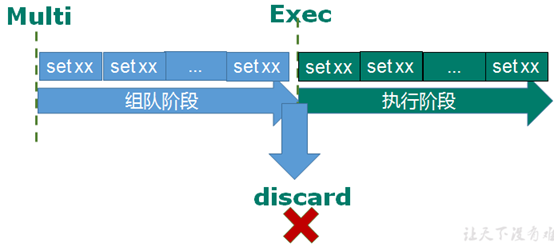
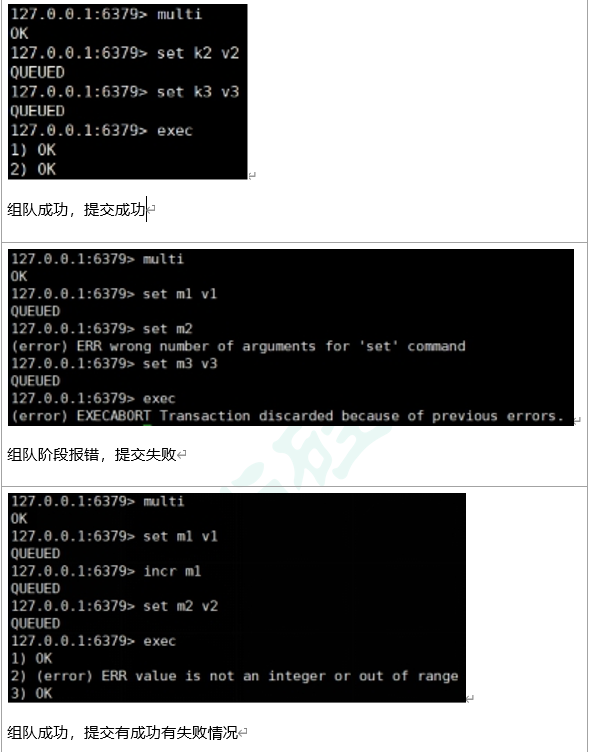
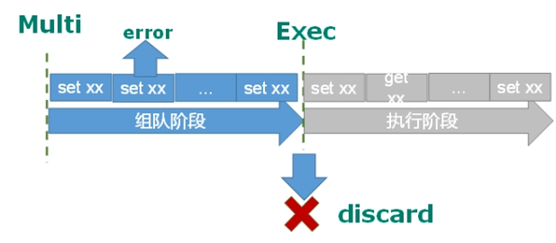
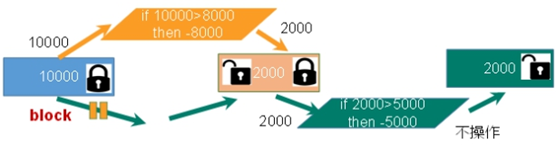
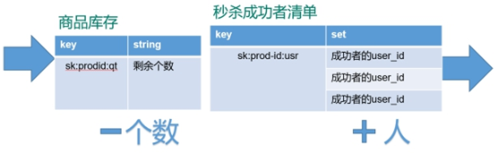
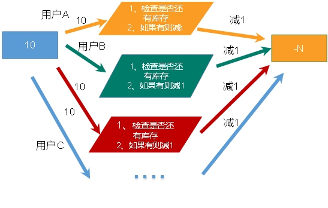
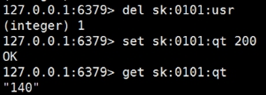
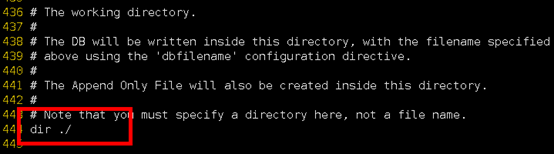
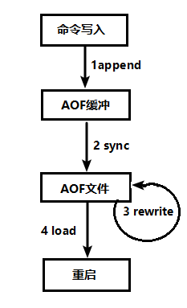

# 1、NoSQL数据库简介

## 1.1、技术发展

- 
- 

	- 将操作的数据放缓存数据库

## 1.2、NoSQL数据库概述

- NoSQL 泛指非关系型的数据库，不依赖业务逻辑方式存储，而以简单的key-value模式存储。因此大大的增加了数据库的扩展能力
- 应用情况

	- 适用于
	对数据高并发的读写
	海量数据的读写
	对数据高可扩展性的

不适用于
	需要事务支持
	基于sql的结构化查询存储，处理复杂的关系,需要即席查询。

- 应用现况

	- 	Memcache

		- 	很早出现的NoSql数据库
	数据都在内存中，一般不持久化
	支持简单的key-value模式，支持类型单一
	一般是作为缓存数据库辅助持久化的数据库

	- Redis

		- 	几乎覆盖了Memcached的绝大部分功能
	数据都在内存中，支持持久化，主要用作备份恢复
	除了支持简单的key-value模式，还支持多种数据结构的存储，比如 list、set、hash、zset等。
	一般是作为缓存数据库辅助持久化的数据库

	- 	MongoDB

		- 	高性能、开源、模式自由(schema  free)的文档型数据库
	数据都在内存中， 如果内存不足，把不常用的数据保存到硬盘
	虽然是key-value模式，但是对value（尤其是json）提供了丰富的查询功能
	支持二进制数据及大型对象
	可以根据数据的特点替代RDBMS ，成为独立的数据库。或者配合RDBMS，存储特定的数据。

## 1.3、行式存储数据库

- 行式数据库

	- 

- 列式数据库

	- 

## 1.4、图关系型数据库

- Neo4j

	- 子主题 1

## 计算机存储单位

- 计算机存储单位 计算机存储单位一般用B，KB，MB，GB，TB，EB，ZB，YB，BB来表示，它们之间的关系是：
位 bit (比特)(Binary Digits)：存放一位二进制数，即 0 或 1，最小的存储单位。
字节 byte：8个二进制位为一个字节(B)，最常用的单位。
1KB (Kilobyte 千字节)=1024B，
1MB (Megabyte 兆字节 简称“兆”)=1024KB，
1GB (Gigabyte 吉字节 又称“千兆”)=1024MB，
1TB (Trillionbyte 万亿字节 太字节)=1024GB，其中1024=2^10 ( 2 的10次方)，
1PB（Petabyte 千万亿字节 拍字节）=1024TB，
1EB（Exabyte 百亿亿字节 艾字节）=1024PB，
1ZB (Zettabyte 十万亿亿字节 泽字节)= 1024 EB,
1YB (Jottabyte 一亿亿亿字节 尧字节)= 1024 ZB,
1BB (Brontobyte 一千亿亿亿字节)= 1024 YB.
注：“兆”为百万级数量单位。

# 2、Redis6概述和安装

## 2.1、Redis6概述

- 	Redis是一个开源的key-value存储系统。
	和Memcached类似，它支持存储的value类型相对更多，包括string(字符串)、list(链表)、set(集合)、zset(sorted set --有序集合)和hash（哈希类型）。
	这些数据类型都支持push/pop、add/remove及取交集并集和差集及更丰富的操作，而且这些操作都是原子性的。
	在此基础上，Redis支持各种不同方式的排序。
	与memcached一样，为了保证效率，数据都是缓存在内存中。
	区别的是Redis会周期性的把更新的数据写入磁盘或者把修改操作写入追加的记录文件。
	并且在此基础上实现了master-slave(主从)同步。
- 应用场景

	- 配合关系型数据库做高速缓存

		- 	高频次，热门访问的数据，降低数据库IO
	分布式架构，做session共享

	- 多样的数据结构存储持久化数据

		- 

## 2.2、Redis6在Liunx系统安装

- 安装

	- 解压安装包法

		- 环境准备

			- 安装c语言环境

				- yum install centos-release-scl scl-utils-build
yum install -y devtoolset-8-toolchain
scl enable devtoolset-8 bash

			- 测试gcc

				- gcc --version

		- 安装操作

			- 下载redis-6.2.1.tar.gz放/opt目录
解压命令：tar -zxvf redis-6.2.1.tar.gz
解压完成后进入目录：cd redis-6.2.1
在redis-6.2.1目录下再次执行make命令（只是编译好）跳过make test 继续执行: make install

				- 如果没有准备好C语言编译环境，make 会报错—Jemalloc/jemalloc.h：没有那个文件
解决方案：运行make distclean
在redis-6.2.1目录下再次执行make命令（只是编译好）

- 启动

	- 安装目录：/usr/local/bin
	- 前台启动

		- 安装路径下 redis-server：Redis服务器启动命令

	- 后台启动

		- 备份，修改

			- 拷贝一份redis.conf到其他目录
cp  /opt/redis-6.2.1/redis.conf  /etc
			- 修改redis.conf(128行)文件将里面的daemonize no 改成 yes，让服务在后台启动

		- 启动

			- redis-server  /etc/redis.conf
			- 安装路径下用客户端访问：redis-cli
多个端口可以：redis-cli -p 6379
测试验证： ping

	- 操作

		- redis-benchmark:性能测试工具，可以在自己本子运行，看看自己本子性能如何
redis-check-aof：修复有问题的AOF文件，rdb和aof后面讲
redis-check-dump：修复有问题的dump.rdb文件
redis-sentinel：Redis集群使用
redis-server：Redis服务器启动命令
redis-cli：客户端，操作入口

- 关闭

	- kill -9 redis进程号
	- redis-cli shutdown
	- 多实例关闭，指定端口关闭：redis-cli -p 6379 shutdown

## redis分析

- 用客户端访问：redis-cli
默认16个数据库，类似数组下标从0开始，初始默认使用0号库
使用命令 select   <dbid>来切换数据库。如: select 8 
统一密码管理，所有库同样密码。
dbsize查看当前数据库的key的数量
flushdb清空当前库
flushall通杀全部库
- 串行   vs   多线程+锁（memcached） vs   单线程+多路IO复用(Redis)

# 3、常用五大数据类型

## 3.1、键（key）操作

- keys *查看当前库所有key    (匹配：keys *1)
exists  key判断某个key是否存在
type key  查看你的key是什么类型
del key       删除指定的key数据
unlink key   根据value选择非阻塞删除
unlink key 仅将keys从keyspace元数据中删除，真正的删除会在后续异步操作。
expire key 10   10秒钟：为给定的key设置过期时间
ttl key 查看还有多少秒过期，-1表示永不过期，-2表示已过期

select命令切换数据库
dbsize查看当前数据库的key的数量
flushdb清空当前库
flushall通杀全部库

## 3.2、Redis字符串(String)

- 简介

	- String是Redis最基本的类型，一个key对应一个value。
String类型是二进制安全的。意味着Redis的string可以包含任何数据。比如jpg图片或者序列化的对象。
String类型是Redis最基本的数据类型，一个Redis中字符串value最多可以是512M

- 命令

	- set   <key><value>添加键值对(添加或替换）
get   <key>查询对应键值
append  <key><value>将给定的<value> 追加到原值的末尾
strlen  <key>获得值的长度
setnx  <key><value>只有在 key 不存在时    设置 key 的值

incr  <key>
将 key 中储存的数字值增1
只能对数字值操作，如果为空，新增值为1
decr  <key>
将 key 中储存的数字值减1
只能对数字值操作，如果为空，新增值为-1

incrby / decrby  <key><步长>将 key 中储存的数字值增减。自定义步长。

		- 原子操作是指不会被线程调度机制打断的操作
这种操作一旦开始，就一直运行到结束，中间不会有任何 context switch （切换到另一个线程）。
（1）在单线程中， 能够在单条指令中完成的操作都可以认为是"原子操作"，因为中断只能发生于指令之间。
（2）在多线程中，不能被其它进程（线程）打断的操作就叫原子操作。
Redis单命令的原子性主要得益于Redis的单线程。
		- java中的两个线程 i++不是原子操作

	- mset  <key1><value1><key2><value2>  ..... 
同时设置一个或多个 key-value对  
mget  <key1><key2><key3> .....
同时获取一个或多个 value  
msetnx <key1><value1><key2><value2>  ..... 
同时设置一个或多个 key-value 对，当且仅当所有给定 key 都不存在。
	- getrange  <key><起始位置><结束位置>
获得值的范围，类似java中的substring，前包，后包
setrange  <key><起始位置><value>
用 <value>  覆写<key>所储存的字符串值，从<起始位置>开始(索引从0开始)。

setex  <key><过期时间><value>
设置键值的同时，设置过期时间，单位秒。
ttl <key>查看状态
getset <key><value>
以新换旧，设置了新值同时获得旧值。

- 数据结构

	- String的数据结构为简单动态字符串(Simple Dynamic String,缩写SDS)。是可以修改的字符串，内部结构实现上类似于Java的ArrayList，采用预分配冗余空间的方式来减少内存的频繁分配.

		- 如图中所示，内部为当前字符串实际分配的空间capacity一般要高于实际字符串长度len。当字符串长度小于1M时，扩容都是加倍现有的空间，如果超过1M，扩容时一次只会多扩1M的空间。需要注意的是字符串最大长度为512M。

## 3.3、Redis列表(List)

- 简介

	- 单键多值
Redis 列表是简单的字符串列表，按照插入顺序排序。你可以添加一个元素到列表的头部（左边）或者尾部（右边）。
它的底层实际是个双向链表，对两端的操作性能很高，通过索引下标的操作中间的节点性能会较差。

- 命令

	- lpush/rpush  <key><value1><value2><value3> .... 从左边/右边插入一个或多个值。左插表示新插入的数值放在最左边，右插也是这种
lpop/rpop  <key>从左边/右边吐出一个值。值在键在，值光键亡。

rpoplpush  <key1><key2>从<key1>列表右边吐出一个值，插到<key2>列表左边。

lrange <key><start><stop>
按照索引下标获得元素(从左到右)
lrange mylist 0 -1   0左边第一个，-1右边第一个，（0
，-1表示获取所有）
lindex <key><index>按照索引下标获得元素(从左到右)
llen <key>获得列表长度 

linsert <key>  before <value><newvalue>
在<value>的前面插入<newvalue>插入值，更新值
lrem <key><n><value>从左边删除n个值为value的键(从左到右)
lset<key><index><value>将列表key下标为index的值替换成value

- 数据结构

	- List的数据结构为快速链表quickList。
首先在列表元素较少的情况下会使用一块连续的内存存储，这个结构是ziplist，也即是压缩列表。
它将所有的元素紧挨着一起存储，分配的是一块连续的内存。
当数据量比较多的时候才会改成quicklist。
因为普通的链表需要的附加指针空间太大，会比较浪费空间。比如这个列表里存的只是int类型的数据，结构上还需要两个额外的指针prev和next。
Redis将链表和ziplist结合起来组成了quicklist。也就是将多个ziplist使用双向指针串起来使用。这样既满足了快速的插入删除性能，又不会出现太大的空间冗余。

## 3.4、Redis集合(Set)

- 简介

	- Redis set对外提供的功能与list类似是一个列表的功能，特殊之处在于set是可以自动排重的，当你需要存储一个列表数据，又不希望出现重复数据时，set是一个很好的选择，并且set提供了判断某个成员是否在一个set集合内的重要接口，这个也是list所不能提供的。
Redis的Set是string类型的无序集合。它底层其实是一个value为null的hash表，所以添加，删除，查找的复杂度都是O(1)。
一个算法，随着数据的增加，执行时间的长短，如果是O(1)，数据增加，查找数据的时间不变

		- hash表

- 命令

	- sadd <key><value1><value2> ..... 
将一个或多个 member 元素加入到集合 key 中，已经存在的 member 元素将被忽略
smembers <key>取出该集合的所有值。
sismember <key><value>判断集合<key>是否为含有该<value>值，有1，没有0
scard<key>返回该集合的元素个数。
srem <key><value1><value2> .... 删除集合中的某个元素。
spop <key>随机从该集合中吐出一个值。
srandmember <key><n>随机从该集合中取出n个值。不会从集合中删除 。
smove <source><destination>value把集合中一个值从一个集合移动到另一个集合
sinter <key1><key2>返回两个集合的交集元素。
sunion <key1><key2>返回两个集合的并集元素。
sdiff <key1><key2>返回两个集合的差集元素(key1中的，不包含key2中的)

- 数据结构

	- Set数据结构是dict字典，字典是用哈希表实现的。
Java中HashSet的内部实现使用的是HashMap，只不过所有的value都指向同一个对象。Redis的set结构也是一样，它的内部也使用hash结构，所有的value都指向同一个内部值。

## 3.5、Redis哈希(Hash)

- 简介

	- Redis hash 是一个键值对集合。
Redis hash是一个string类型的field和value的映射表，hash特别适合用于存储对象。
类似Java里面的Map<String,Object>
用户ID为查找的key，存储的value用户对象包含姓名，年龄，生日等信息，如果用普通的key/value结构来存储
主要有以下2种存储方式：

- 命令

	- hset <key>:<keyvalue>   <field> <value>给<key>集合中的  <field>键赋值<value>
hget <key1>:<keyvalue>    <field>从<key1>集合<field>取出 value 
hmset <key1>:<keyvalue> <field1><value1><field2><value2>... 批量设置hash的值
hexists<key1>:<keyvalue> <field>查看哈希表 key 中，给定域 field 是否存在。 
hkeys <key>:<keyvalue>列出该hash集合的所有field
hvals <key>:<keyvalue>列出该hash集合的所有value
hincrby <key>:<keyvalue> <field><increment>为哈希表 key 中的域 field 的值加上增量 1   -1
hsetnx <key>:<keyvalue> <field><value>将哈希表 key 中的域 field 的值设置为 value ，当且仅当域 field 不存在 .

- 数据结构

	- Hash类型对应的数据结构是两种：ziplist（压缩列表），hashtable（哈希表）。当field-value长度较短且个数较少时，使用ziplist，否则使用hashtable。

## 3.6、Redis有序集合Zset(sorted set)

- 简介

	- Redis有序集合zset与普通集合set非常相似，是一个没有重复元素的字符串集合。
不同之处是有序集合的每个成员都关联了一个评分（score）,这个评分（score）被用来按照从最低分到最高分的方式排序集合中的成员。集合的成员是唯一的，但是评分可以是重复了 。
因为元素是有序的, 所以你也可以很快的根据评分（score）或者次序（position）来获取一个范围的元素。
访问有序集合的中间元素也是非常快的,因此你能够使用有序集合作为一个没有重复成员的智能列表。

- 命令

	- zadd  <key><score1><value1><score2><value2>…
将一个或多个 member 元素及其 score 值加入到有序集 key 当中。

zrange <key><start><stop>  [WITHSCORES]   
返回有序集 key 中，下标在<start><stop>之间的元素
带WITHSCORES，可以让分数一起和值返回到结果集。

zrangebyscore key minmax [withscores] [limit offset count]
返回有序集 key 中，所有 score 值介于 min 和 max 之间(包括等于 min 或 max )的成员。有序集成员按 score 值递增(从小到大)次序排列。
 
zrevrangebyscore key maxmin [withscores] [limit offset count]               
同上，改为从大到小排列。 
zincrby <key><increment><member>      为元素的score加上增量
zrem  <key><member>删除该集合下，指定值的元素，返回删除个数 
zcount <key><min><max>统计该集合，分数区间内的元素个数 
zrank <key><member>返回该值在集合中的排名，从0开始。

- 数据结构

	- SortedSet(zset)是Redis提供的一个非常特别的数据结构，一方面它等价于Java的数据结构Map<String, Double>，可以给每一个元素value赋予一个权重score，另一方面它又类似于TreeSet，内部的元素会按照权重score进行排序，可以得到每个元素的名次，还可以通过score的范围来获取元素的列表。
zset底层使用了两个数据结构
（1）hash，hash的作用就是关联元素value和权重score，保障元素value的唯一性，可以通过元素value找到相应的score值。
（2）跳跃表，跳跃表的目的在于给元素value排序，根据score的范围获取元素列表。

- 跳表

	- 有序集合在生活中比较常见，例如根据成绩对学生排名，根据得分对玩家排名等。对于有序集合的底层实现，可以用数组、平衡树、链表等。数组不便元素的插入、删除；平衡树或红黑树虽然效率高但结构复杂；链表查询需要遍历所有效率低。Redis采用的是跳跃表。跳跃表效率堪比红黑树，实现远比红黑树简单。

		- 	对比有序链表和跳跃表，从链表中查询出51
（1）	有序链表要查找值为51的元素，需要从第一个元素开始依次查找、比较才能找到。共需要6次比较。
		- （2）	跳跃表
从第2层开始，1节点比51节点小，向后比较。
21节点比51节点小，继续向后比较，后面就是NULL了，所以从21节点向下到第1层
在第1层，41节点比51节点小，继续向后，61节点比51节点大，所以从41向下
在第0层，51节点为要查找的节点，节点被找到，共查找4次。

# 4、Redis6配置文件详解

## 单位
开头定义了一些基本的度量单位，只支持bytes，不支持bit
大小写不敏感

-  1k => 1000 bytes
 1kb => 1024 bytes
 1m => 1000000 bytes
 1mb => 1024*1024 bytes
 1g => 1000000000 bytes
 1gb => 1024*1024*1024 bytes
#
 units are case insensitive so 1GB 1Gb 1gB are all the same.

## 网络配置

- bind
默认情况bind=127.0.0.1只能接受本机的访问请求
不写的情况下，无限制接受任何ip地址的访问 （注释掉）
生产环境肯定要写你应用服务器的地址；服务器是需要远程访问的，所以需要将其注释掉
保存配置，停止服务，重启启动查看进程，不再是本机访问了。
- protected-mode
本机访问保护模式设置，不需密码访问时需要关闭
- port
端口号，默认 6379
- tcp-backlog
设置tcp的backlog，backlog其实是一个连接队列，backlog队列总和=未完成三次握手队列 + 已经完成三次握手队列。
在高并发环境下你需要一个高backlog值来避免慢客户端连接问题

  注意Linux内核会将这个值减小到/proc/sys/net/core/somaxconn的值（128），所以需要确认增大/proc/sys/net/core/somaxconn和/proc/sys/net/ipv4/tcp_max_syn_backlog（128）两个值来达到想要的效果
  
  

	- 注意Linux内核会将这个值减小到/proc/sys/net/core/somaxconn的值（128），所以需要确认增大/proc/sys/net/core/somaxconn和/proc/sys/net/ipv4/tcp_max_syn_backlog（128）两个值来达到想要的效果

- timeout   <value>
一个空闲的客户端维持多少秒会关闭，0表示关闭该功能。即永不关闭。
- tcp-keepalive
对访问客户端的一种心跳检测，每个n秒检测一次。
单位为秒，如果设置为0，则不会进行Keepalive检测，建议设置成60 ,初始为300

## 通用

- daemonize
是否为后台进程，设置为yes
守护进程，后台启动
- pidfile
存放pid文件的位置，每个实例会产生一个不同的pid文件
- loglevel
指定日志记录级别，Redis总共支持四个级别：debug、verbose、notice、warning，默认为notice
四个级别根据使用阶段来选择，生产环境选择notice 或者warning
- logfile
存放日志的文件夹名
- datebases  16
设定库的数量 默认16，默认数据库为0，可以使用SELECT <dbid>命令在连接上指定数据库id

## 安全

- 设置密码
永久配置
 requirepass foobared  注释打开，进行后面进行密码设置

临时设置
在命令中设置密码，只是临时的。重启redis服务器，密码就还原了。

## 限制

- maxclients
	设置redis同时可以与多少个客户端进行
	默认情况下为10000个客户端。
	如果达到了此限制，redis则会拒绝新的连接请求，并且向这些连接请求方发出“max number of clients reached”以作回应。
- maxmemory
	建议必须设置，否则，将内存占满，造成服务器宕机
	设置redis可以使用的内存量。一旦到达内存使用上限，redis将会试图移除内部数据，移除规则可以通过maxmemory-policy来指定。
	如果redis无法根据移除规则来移除内存中的数据，或者设置了“不允许移除”，那么redis则会针对那些需要申请内存的指令返回错误信息，比如SET、LPUSH等。
	但是对于无内存申请的指令，仍然会正常响应，比如GET等。如果你的redis是主redis（说明你的redis有从redis），那么在设置内存使用上限时，需要在系统中留出一些内存空间给同步队列缓存，只有在你设置的是“不移除”的情况下，才不用考虑这个因素。
- maxmemory-policy
	volatile-lru：使用LRU算法移除key，只对设置了过期时间的键；
	allkeys-lru：在所有集合key中，使用LRU算法移除key
	volatile-random：在过期集合中移除随机的key，只对设置了过期时间的键
	allkeys-random：在所有集合key中，移除随机的key
	volatile-ttl：移除那些TTL值最小的key，即那些最近要过期的key
	noeviction：不进行移除。针对写操作，只是返回错误信息
- maxmemory-samples
	设置样本数量，LRU算法和最小TTL算法都并非是精确的算法，而是估算值，所以你可以设置样本的大小，redis默认会检查这么多个key并选择其中LRU的那个。
	一般设置3到7的数字，数值越小样本越不准确，但性能消耗越小。
- maxmemory-samples
	设置样本数量，LRU算法和最小TTL算法都并非是精确的算法，而是估算值，所以你可以设置样本的大小，redis默认会检查这么多个key并选择其中LRU的那个。
	一般设置3到7的数字，数值越小样本越不准确，但性能消耗越小。

## 相关操作
/ 进行关键字查找
: wq   进行保存操作

# 5、Redis6的发布和订阅

## Redis的发布和订阅

- Redis 发布订阅 (pub/sub) 是一种消息通信模式：发送者 (pub) 发送消息，订阅者 (sub) 接收消息。

Redis 客户端可以订阅任意数量的频道
- 客户端订阅频道

	- 频道发布消息

## 发布订阅命令行实现

- 命令
- 打开客户端订阅
SUBSCRIBE channel1

	- 向客户端发布消息
publish channel1 hello
返回的1是订阅者数量

		- 检查发送消息情况

# 6、Redis6新数据类型

## Bitmaps

- 简介

	- 现代计算机用二进制（位） 作为信息的基础单位， 1个字节等于8位， 例如“abc”字符串是由3个字节组成， 但实际在计算机存储时将其用二进制表示， “abc”分别对应的ASCII码分别是97、 98、 99， 对应的二进制分别是01100001、 01100010和01100011，如下图
	- 合理地使用操作位能够有效地提高内存使用率和开发效率。
	Redis提供了Bitmaps这个“数据类型”可以实现对位的操作：
（1）	Bitmaps本身不是一种数据类型， 实际上它就是字符串（key-value） ， 但是它可以对字符串的位进行操作。
（2）	Bitmaps单独提供了一套命令， 所以在Redis中使用Bitmaps和使用字符串的方法不太相同。 可以把Bitmaps想象成一个以位为单位的数组， 数组的每个单元只能存储0和1， 数组的下标在Bitmaps中叫做偏移量。

- 命令

	- setbit

		- 格式

			- setbit<key><offset><value>设置Bitmaps中某个偏移量的值（0或1）
*offset:偏移量从0开始

		- 实例

			- 每个独立用户是否访问过网站存放在Bitmaps中， 将访问的用户记做1， 没有访问的用户记做0， 用偏移量作为用户的id。
设置键的第offset个位的值（从0算起） ， 假设现在有20个用户，userid=1， 6， 11， 15， 19的用户对网站进行了访问， 那么当前Bitmaps初始化结果如图
			- unique:users:20201106代表2020-11-06这天的独立访问用户的Bitmaps

				- 很多应用的用户id以一个指定数字（例如10000） 开头， 直接将用户id和Bitmaps的偏移量对应势必会造成一定的浪费， 通常的做法是每次做setbit操作时将用户id减去这个指定数字。
在第一次初始化Bitmaps时， 假如偏移量非常大， 那么整个初始化过程执行会比较慢， 可能会造成Redis的阻塞。

	- getbit

		- 格式

			- getbit<key><offset>获取Bitmaps中某个偏移量的值
获取键的第offset位的值（从0开始算）

		- 实例

			- 获取id=8的用户是否在2020-11-06这天访问过， 返回0说明没有访问过
注：因为100根本不存在，所以也是返回0

	- bitcount

		- 统计字符串被设置为1的bit数。一般情况下，给定的整个字符串都会被进行计数，通过指定额外的 start 或 end 参数，可以让计数只在特定的位上进行。start 和 end 参数的设置，都可以使用负数值：比如 -1 表示最后一个位，而 -2 表示倒数第二个位，start、end 是指bit组的字节的下标数，二者皆包含。
		- 格式

			- bitcount<key>[start end] 统计字符串从start字节到end字节比特值为1的数量

		- 实例

			- 计算2022-11-06这天的独立访问用户数量
			- start和end代表起始和结束字节数， 下面操作计算用户id在第1个字节到第3个字节之间的独立访问用户数， 对应的用户id是11， 15， 19。

				- 举例： K1 【01000001 01000000  00000000 00100001】，对应【0，1，2，3】
bitcount K1 1 2  ： 统计下标1、2字节组中bit=1的个数，即01000000  00000000
--》bitcount K1 1 2 　　--》1

bitcount K1 1 3  ： 统计下标1、2字节组中bit=1的个数，即01000000  00000000 00100001
--》bitcount K1 1 3　　--》3

bitcount K1 0 -2  ： 统计下标0到下标倒数第2，字节组中bit=1的个数，即01000001  01000000   00000000
--》bitcount K1 0 -2　　--》3

			- 注意：redis的setbit设置或清除的是bit位置，而bitcount计算的是byte位置。

	- bitop

		- 格式

			- bitop  and(or/not/xor) <destkey> [key…]
bitop是一个复合操作， 它可以做多个Bitmaps的and（交集） 、 or（并集） 、 not（非） 、 xor（异或） 操作并将结果保存在destkey中。

		- 实例

			- 2020-11-04 日访问网站的userid=1,2,5,9。
setbit unique:users:20201104 1 1
setbit unique:users:20201104 2 1
setbit unique:users:20201104 5 1
setbit unique:users:20201104 9 1

2020-11-03 日访问网站的userid=0,1,4,9。
setbit unique:users:20201103 0 1
setbit unique:users:20201103 1 1
setbit unique:users:20201103 4 1
setbit unique:users:20201103 9 1
计算出两天都访问过网站的用户数量
bitop and unique:users:and:20201104_03
 unique:users:20201103unique:users:20201104

				- 

					- 计算出任意一天都访问过网站的用户数量（例如月活跃就是类似这种） ， 可以使用or求并集

- Bitmaps与set对比

	- 假设网站有1亿用户， 每天独立访问的用户有5千万， 如果每天用集合类型和Bitmaps分别存储活跃用户可以得到表

		- 很明显， 这种情况下使用Bitmaps能节省很多的内存空间， 尤其是随着时间推移节省的内存还是非常可观的

			- 但Bitmaps并不是万金油， 假如该网站每天的独立访问用户很少， 例如只有10万（大量的僵尸用户） ， 那么两者的对比如下表所示， 很显然， 这时候使用Bitmaps就不太合适了， 因为基本上大部分位都是0。

## HyperLogLog

- 简介

	- 在工作当中，我们经常会遇到与统计相关的功能需求，比如统计网站PV（PageView页面访问量）,可以使用Redis的incr、incrby轻松实现。
但像UV（UniqueVisitor，独立访客）、独立IP数、搜索记录数等需要去重和计数的问题如何解决？这种求集合中不重复元素个数的问题称为基数问题。
解决基数问题有很多种方案：
（1）数据存储在MySQL表中，使用distinct count计算不重复个数
（2）使用Redis提供的hash、set、bitmaps等数据结构来处理
以上的方案结果精确，但随着数据不断增加，导致占用空间越来越大，对于非常大的数据集是不切实际的。
能否能够降低一定的精度来平衡存储空间？Redis推出了HyperLogLog
Redis HyperLogLog 是用来做基数统计的算法，HyperLogLog 的优点是，在输入元素的数量或者体积非常非常大时，计算基数所需的空间总是固定的、并且是很小的。
在 Redis 里面，每个 HyperLogLog 键只需要花费 12 KB 内存，就可以计算接近 2^64 个不同元素的基数。这和计算基数时，元素越多耗费内存就越多的集合形成鲜明对比。
但是，因为 HyperLogLog 只会根据输入元素来计算基数，而不会储存输入元素本身，所以 HyperLogLog 不能像集合那样，返回输入的各个元素。

什么是基数?
比如数据集 {1, 3, 5, 7, 5, 7, 8}， 那么这个数据集的基数集为 {1, 3, 5 ,7, 8}, 基数(不重复元素)为5。 基数估计就是在误差可接受的范围内，快速计算基数。

- 命令

	- pfadd

		- 格式

			- pfadd <key>< element> [element ...]   添加指定元素到 HyperLogLog 中

		- 实例

			- 将所有元素添加到指定HyperLogLog数据结构中。如果执行命令后HLL估计的近似基数发生变化，则返回1，否则返回0。

	- pdfcount

		- 格式

			- pfcount<key> [key ...] 计算HLL的近似基数，可以计算多个HLL，比如用HLL存储每天的UV，计算一周的UV可以使用7天的UV合并计算即可

		- 实例

			- 

	- pfmerge

		- 格式

			- pfmerge<destkey><sourcekey> [sourcekey ...]  将一个或多个HLL合并后的结果存储在另一个HLL中，比如每月活跃用户可以使用每天的活跃用户来合并计算可得

		- 实例

			- 

## Geospatial

- 简介

	- Redis 3.2 中增加了对GEO类型的支持。GEO，Geographic，地理信息的缩写。该类型，就是元素的2维坐标，在地图上就是经纬度。redis基于该类型，提供了经纬度设置，查询，范围查询，距离查询，经纬度Hash等常见操作。

- 命令

	- geoadd

		- 格式

			- geoadd<key>< longitude><latitude><member> [longitude latitude member...]   添加地理位置（经度，纬度，名称）

		- 实例

			- geoadd china:city 121.47 31.23 shanghai
geoadd china:city 106.50 29.53 chongqing 114.05 22.52 shenzhen 116.38 39.90 beijing
两极无法直接添加，一般会下载城市数据，直接通过 Java 程序一次性导入。
有效的经度从 -180 度到 180 度。有效的纬度从 -85.05112878 度到 85.05112878 度。
当坐标位置超出指定范围时，该命令将会返回一个错误。
已经添加的数据，是无法再次往里面添加的

	- geopos

		- 格式

			- geopos  <key><member> [member...]  获得指定地区的坐标值

		- 实例

			- 

	- geolist

		- 格式

			- geodist<key><member1><member2>  [m|km|ft|mi ]  获取两个位置之间的直线距离

		- 实例

			- 获取两个位置之间的直线距离

				- 单位：
m 表示单位为米[默认值]。
km 表示单位为千米。
mi 表示单位为英里。
ft 表示单位为英尺。
如果用户没有显式地指定单位参数， 那么 GEODIST 默认使用米作为单位

	- georadius

		- 格式

			- georadius<key>< longitude><latitude>radius  m|km|ft|mi   以给定的经纬度为中心，找出某一半径内的元素经度 
纬度 距离 单位

		- 实例

			- 

# 7、Jedis操作Redis6

## jedis测试准备

- maven的pom依赖
<dependency>
<groupId>redis.clients</groupId>
<artifactId>jedis</artifactId>
<version>3.2.0</version>
</dependency>
- redis的注意事项
禁用Linux的防火墙：Linux(CentOS7)里执行命令
systemctl stop/disable firewalld.service   
redis.conf中注释掉bind 127.0.0.1 ,然后 protected-mode no

## Jedis常用操作

- 测试程序
package com.atguigu.jedis;
import redis.clients.jedis.Jedis;
public class Demo01 {
public static void main(String[] args) {
Jedis jedis = new Jedis("192.168.137.3",6379);
String pong = jedis.ping();
System.out.println("连接成功："+pong);
jedis.close();
}
}
- 测试相关数据类型

	- key

		- jedis.set("k1", "v1");
jedis.set("k2", "v2");
jedis.set("k3", "v3");
Set<String> keys = jedis.keys("*");
System.out.println(keys.size());
for (String key : keys) {
System.out.println(key);
}
System.out.println(jedis.exists("k1"));
System.out.println(jedis.ttl("k1"));                
System.out.println(jedis.get("k1"));

	- String

		- jedis.mset("str1","v1","str2","v2","str3","v3");
System.out.println(jedis.mget("str1","str2","str3"));

	- List

		- List<String> list = jedis.lrange("mylist",0,-1);
for (String element : list) {
System.out.println(element);
}

	- set

		- jedis.sadd("orders", "order01");
jedis.sadd("orders", "order02");
jedis.sadd("orders", "order03");
jedis.sadd("orders", "order04");
Set<String> smembers = jedis.smembers("orders");
for (String order : smembers) {
System.out.println(order);
}
jedis.srem("orders", "order02");

	- hash

		- jedis.hset("hash1","userName","lisi");
System.out.println(jedis.hget("hash1","userName"));
Map<String,String> map = new HashMap<String,String>();
map.put("telphone","13810169999");
map.put("address","atguigu");
map.put("email","abc@163.com");
jedis.hmset("hash2",map);
List<String> result = jedis.hmget("hash2", "telphone","email");
for (String element : result) {
System.out.println(element);
}

	- zset

		- jedis.zadd("zset01", 100d, "z3");
jedis.zadd("zset01", 90d, "l4");
jedis.zadd("zset01", 80d, "w5");
jedis.zadd("zset01", 70d, "z6");
 
Set<String> zrange = jedis.zrange("zset01", 0, -1);
for (String e : zrange) {
System.out.println(e);
}

## Jedis实例-模拟验证码发送

- 要求

	- 1、输入手机号，点击发送后随机生成6位数字码，2分钟有效
2、输入验证码，点击验证，返回成功或失败
3、每个手机号每天只能输入3次

- 实现

	- 子主题 1

# 8、Redis6与Spring Boot整合

## 在pom.xml文件中引入redis相关依赖
<!-- redis -->
<dependency>
<groupId>org.springframework.boot</groupId>
<artifactId>spring-boot-starter-data-redis</artifactId>
</dependency>

<!-- spring2.X集成redis所需common-pool2-->
<dependency>
<groupId>org.apache.commons</groupId>
<artifactId>commons-pool2</artifactId>
<version>2.6.0</version>
</dependency>

## application.properties配置redis配置

#Redis服务器地址
spring.redis.host=192.168.140.136
#Redis服务器连接端口
spring.redis.port=6379
#Redis数据库索引（默认为0）
spring.redis.database= 0
#连接超时时间（毫秒）
spring.redis.timeout=1800000
#连接池最大连接数（使用负值表示没有限制）
spring.redis.lettuce.pool.max-active=20
#最大阻塞等待时间(负数表示没限制)
spring.redis.lettuce.pool.max-wait=-1
#连接池中的最大空闲连接
spring.redis.lettuce.pool.max-idle=5
#连接池中的最小空闲连接
spring.redis.lettuce.pool.min-idle=0

## 添加redis配置类

@EnableCaching
@Configuration
public class RedisConfig extends CachingConfigurerSupport {

    @Bean
    public RedisTemplate<String, Object> redisTemplate(RedisConnectionFactory factory) {
        RedisTemplate<String, Object> template = new RedisTemplate<>();
        RedisSerializer<String> redisSerializer = new StringRedisSerializer();
        Jackson2JsonRedisSerializer jackson2JsonRedisSerializer = new Jackson2JsonRedisSerializer(Object.class);
        ObjectMapper om = new ObjectMapper();
        om.setVisibility(PropertyAccessor.ALL, JsonAutoDetect.Visibility.ANY);
        om.enableDefaultTyping(ObjectMapper.DefaultTyping.NON_FINAL);
        jackson2JsonRedisSerializer.setObjectMapper(om);
        template.setConnectionFactory(factory);
        //key序列化方式
        template.setKeySerializer(redisSerializer);
        //value序列化
        template.setValueSerializer(jackson2JsonRedisSerializer);
		//value hashmap序列化
        template.setHashValueSerializer(jackson2JsonRedisSerializer);
        return template;
    }

    @Bean
    public CacheManager cacheManager(RedisConnectionFactory factory) {
        RedisSerializer<String> redisSerializer = new StringRedisSerializer();
        Jackson2JsonRedisSerializer jackson2JsonRedisSerializer = new Jackson2JsonRedisSerializer(Object.class);
		//解决查询缓存转换异常的问题
        ObjectMapper om = new ObjectMapper();
        om.setVisibility(PropertyAccessor.ALL, JsonAutoDetect.Visibility.ANY);
        om.enableDefaultTyping(ObjectMapper.DefaultTyping.NON_FINAL);
        jackson2JsonRedisSerializer.setObjectMapper(om);
		// 配置序列化（解决乱码的问题）,过期时间600秒
        RedisCacheConfiguration config = RedisCacheConfiguration.defaultCacheConfig()
                .entryTtl(Duration.ofSeconds(600))
                .serializeKeysWith(RedisSerializationContext.SerializationPair.fromSerializer(redisSerializer))
                .serializeValuesWith(RedisSerializationContext.SerializationPair.fromSerializer(jackson2JsonRedisSerializer))
                .disableCachingNullValues();
        RedisCacheManager cacheManager = RedisCacheManager.builder(factory)
                .cacheDefaults(config)
                .build();
        return cacheManager;
    }
}

## RedisTestController中添加测试方法

@RestController
@RequestMapping("/redisTest")
public class RedisTestController {
    @Autowired
    private RedisTemplate redisTemplate;

    @GetMapping
    public String testRedis() {
        //设置值到redis
        redisTemplate.opsForValue().set("name","lucy");
        //从redis获取值
        String name = (String)redisTemplate.opsForValue().get("name");
        return name;
    }
}

# 9、Redis6的事务操作

## Redis的事务定义
Redis事务是一个单独的隔离操作：事务中的所有命令都会序列化、按顺序地执行。事务在执行的过程中，不会被其他客户端发送来的命令请求所打断。
Redis事务的主要作用就是串联多个命令防止别的命令插队。

## 事务操作Multi、Exec、discard
从输入Multi命令开始，输入的命令都会依次进入命令队列中，但不会执行，直到输入Exec后，Redis会将之前的命令队列中的命令依次执行。
组队的过程中可以通过discard来放弃组队。  

- 

## 事务的错误处理

- 如果执行阶段某个命令报出了错误，则只有报错的命令不会被执行，而其他的命令都会执行，不会回滚。
- 如果执行阶段某个命令报出了错误，则只有报错的命令不会被执行，而其他的命令都会执行，不会回滚。

## 事务冲突的问题（乐观锁和悲观锁）

- 例子展示
有很多人有你的账户,同时去参加双十一抢购
一个请求想给金额减8000
一个请求想给金额减5000
一个请求想给金额减1000
- 悲观锁(Pessimistic Lock), 顾名思义，就是很悲观，每次去拿数据的时候都认为别人会修改，所以每次在拿数据的时候都会上锁，这样别人想拿这个数据就会block直到它拿到锁。传统的关系型数据库里边就用到了很多这种锁机制，比如行锁，表锁等，读锁，写锁等，都是在做操作之前先上锁。
- 乐观锁(Optimistic Lock), 顾名思义，就是很乐观，每次去拿数据的时候都认为别人不会修改，所以不会上锁，但是在更新的时候会判断一下在此期间别人有没有去更新这个数据，可以使用版本号等机制。乐观锁适用于多读的应用类型，这样可以提高吞吐量。Redis就是利用这种check-and-set机制实现事务的。
- 在执行multi之前，先执行watch key1 [key2],可以监视一个(或多个) key ，如果在事务执行之前这个(或这些) key 被其他命令所改动，那么事务将被打断。
- 取消 WATCH 命令对所有 key 的监视。
如果在执行 WATCH 命令之后，EXEC 命令或DISCARD 命令先被执行了的话，那么就不需要再执行UNWATCH 了。

## Redis事务三特性

- 	单独的隔离操作 
事务中的所有命令都会序列化、按顺序地执行。事务在执行的过程中，不会被其他客户端发送来的命令请求所打断。
 
	没有隔离级别的概念 
队列中的命令没有提交之前都不会实际被执行，因为事务提交前任何指令都不会被实际执行

	不保证原子性 
事务中如果有一条命令执行失败，其后的命令仍然会被执行，没有回滚

## Redis事务案例-商品秒杀案例

- 解决计数器和人员记录的事务操作
- 秒杀并发模拟

使用工具ab模拟测试
CentOS6 默认安装
CentOS7需要手动安装

	- 联网下： yum install httpd-tools
	- 无网络下：
（1） 进入cd  /run/media/root/CentOS 7 x86_64/Packages（路径跟centos6不同）
（2） 顺序安装
apr-1.4.8-3.el7.x86_64.rpm
apr-util-1.5.2-6.el7.x86_64.rpm
httpd-tools-2.4.6-67.el7.centos.x86_64.rpm  
	- 测试与结果

		- vi postfile 模拟表单提交参数,以&符号结尾;存放当前目录。
内容：prodid=0101&

ab -n 1000 -c 100 -k -p ~/postfile -T application/x-www-form-urlencoded http://192.168.31.186:8080/Seckill/doseckill
		- 超卖

- 超卖问题

	- 

- 利用乐观锁淘汰用户，解决超卖问题。

	- 
	- //增加乐观锁
jedis.watch(qtkey);
 
		//3.判断库存
		String qtkeystr = jedis.get(qtkey);
		if(qtkeystr==null || "".equals(qtkeystr.trim())) {
		System.out.println("未初始化库存");
		jedis.close();
		return false ;
		}
		
		int qt = Integer.parseInt(qtkeystr);
		if(qt<=0) {
		System.err.println("已经秒光");
		jedis.close();
		return false;
		}
		
		//增加事务
		Transaction multi = jedis.multi();
		
		//4.减少库存
		//jedis.decr(qtkey);
		multi.decr(qtkey);
		
		//5.加人
		//jedis.sadd(usrkey, uid);
		multi.sadd(usrkey, uid);
		
		//执行事务
		List<Object> list = multi.exec();
		
		//判断事务提交是否失败
		if(list==null || list.size()==0) {
		System.out.println("秒杀失败");
		jedis.close();
		return false;
		}
		System.err.println("秒杀成功");
		jedis.close();

		- 

	//增加乐观锁
	jedis.watch(qtkey);
	
	//3.判断库存
	String qtkeystr = jedis.get(qtkey);
	if(qtkeystr==null || "".equals(qtkeystr.trim())) {
	System.out.println("未初始化库存");
	jedis.close();
	return false ;
	}
	
	int qt = Integer.parseInt(qtkeystr);
	if(qt<=0) {
	System.err.println("已经秒光");
	jedis.close();
	return false;
	}
	
	//增加事务
	Transaction multi = jedis.multi();
	
	//4.减少库存
	//jedis.decr(qtkey);
	multi.decr(qtkey);
	
	//5.加人
	//jedis.sadd(usrkey, uid);
	multi.sadd(usrkey, uid);
	
	//执行事务
	List<Object> list = multi.exec();
	
	//判断事务提交是否失败
	if(list==null || list.size()==0) {
	System.out.println("秒杀失败");
	jedis.close();
	return false;
	}
	System.err.println("秒杀成功");
	jedis.close();

-

- 继续增加并发测试

	- 连接有限制

	ab -n 2000 -c 200 -k -p postfile -T 'application/x-www-form-urlencoded' http://192.168.140.1:8080/seckill/doseckill

    - 
		- 增加-r参数，-r   Don't exit on socket receive errors.

ab -n 2000 -c 100 -r -p postfile -T 'application/x-www-form-urlencoded' http://192.168.140.1:8080/seckill/doseckill

	- 已经秒光，可是还有库存

ab -n 2000 -c 100 -p postfile -T 'application/x-www-form-urlencoded' http://192.168.137.1:8080/seckill/doseckill
已经秒光，可是还有库存。原因，就是乐观锁导致很多请求都失败。先点的没秒到，后点的可能秒到了。

- 

	- 连接超时，通过连接池解决
	- 连接池

节省每次连接redis服务带来的消耗，把连接好的实例反复利用。
通过参数管理连接的行为
代码见项目中

		- 	链接池参数
	MaxTotal：控制一个pool可分配多少个jedis实例，通过pool.getResource()来获取；如果赋值为-1，则表示不限制；如果pool已经分配了MaxTotal个jedis实例，则此时pool的状态为exhausted。
	maxIdle：控制一个pool最多有多少个状态为idle(空闲)的jedis实例；
	MaxWaitMillis：表示当borrow一个jedis实例时，最大的等待毫秒数，如果超过等待时间，则直接抛JedisConnectionException；
	testOnBorrow：获得一个jedis实例的时候是否检查连接可用性（ping()）；如果为true，则得到的jedis实例均是可用的；

- 解决库存遗留问题

	- LUA脚本
Lua 是一个小巧的脚本语言，Lua脚本可以很容易的被C/C++ 代码调用，也可以反过来调用C/C++的函数，Lua并没有提供强大的库，一个完整的Lua解释器不过200k，所以Lua不适合作为开发独立应用程序的语言，而是作为嵌入式脚本语言。

	- LUA脚本在Redis中的优势

将复杂的或者多步的redis操作，写为一个脚本，一次提交给redis执行，减少反复连接redis的次数。提升性能。
LUA脚本是类似redis事务，有一定的原子性，不会被其他命令插队，可以完成一些redis事务性的操作。
但是注意redis的lua脚本功能，只有在Redis 2.6以上的版本才可以使用。
利用lua脚本淘汰用户，解决超卖问题。
redis 2.6版本以后，通过lua脚本解决争抢问题，实际上是redis 利用其单线程的特性，用任务队列的方式解决多任务并发问题。

- 

- 代码分析

# 10、Redis6持久化之RDB

## 含义

- 
在指定的时间间隔内将内存中的数据集快照写入磁盘， 也就是行话讲的Snapshot快照，它恢复时是将快照文件直接读到内存里

## 执行

- 
Redis会单独创建（fork）一个子进程来进行持久化，会先将数据写入到 一个临时文件中，待持久化过程都结束了，再用这个临时文件替换上次持久化好的文件。 整个过程中，主进程是不进行任何IO操作的，这就确保了极高的性能 如果需要进行大规模数据的恢复，且对于数据恢复的完整性不是非常敏感，那RDB方式要比AOF方式更加的高效。RDB的缺点是最后一次持久化后的数据可能丢失。

## Fork

- 
	Fork的作用是复制一个与当前进程一样的进程。新进程的所有数据（变量、环境变量、程序计数器等） 数值都和原进程一致，但是是一个全新的进程，并作为原进程的子进程
	在Linux程序中，fork()会产生一个和父进程完全相同的子进程，但子进程在此后多会exec系统调用，出于效率考虑，Linux中引入了“写时复制技术”
	一般情况父进程和子进程会共用同一段物理内存，只有进程空间的各段的内容要发生变化时，才会将父进程的内容复制一份给子进程。

## RDB持久化流程

- 

## dump.rdb文件

- 
在redis.conf中配置文件名称，默认为dump.rdb

## 配置位置

- 
rdb文件的保存路径，也可以修改。默认为Redis启动时命令行所在的目录下
dir "/myredis/"

## 触发RDB快照；保持策略

- 配置文件中默认的快照配置
- 命令save VS bgsave
save ：save时只管保存，其它不管，全部阻塞。手动保存。不建议。
bgsave：Redis会在后台异步进行快照操作， 快照同时还可以响应客户端请求。
可以通过lastsave 命令获取最后一次成功执行快照的时间
- flushall命令
执行flushall命令，也会产生dump.rdb文件，但里面是空的，无意义
- SNAPSHOTTING快照
- 	Save
格式：save 秒钟 写操作次数
RDB是整个内存的压缩过的Snapshot，RDB的数据结构，可以配置复合的快照触发条件，
默认是1分钟内改了1万次，或5分钟内改了10次，或15分钟内改了1次。
禁用
不设置save指令，或者给save传入空字符串
- stop-writes-on-bgsave-error
当Redis无法写入磁盘的话，直接关掉Redis的写操作。推荐yes.
- rdbcompression 压缩文件
对于存储到磁盘中的快照，可以设置是否进行压缩存储。如果是的话，redis会采用LZF算法进行压缩。
如果你不想消耗CPU来进行压缩的话，可以设置为关闭此功能。推荐yes.
- rdbchecksum 检查完整性
在存储快照后，还可以让redis使用CRC64算法来进行数据校验，
但是这样做会增加大约10%的性能消耗，如果希望获取到最大的性能提升，可以关闭此功能.   推荐yes.
- rdb的备份
先通过config get dir  查询rdb文件的目录 
将*.rdb的文件拷贝到别的地方
rdb的恢复
	关闭Redis
	先把备份的文件拷贝到工作目录下 cp dump2.rdb dump.rdb
	启动Redis, 备份数据会直接加载

## 	优势
	适合大规模的数据恢复
	对数据完整性和一致性要求不高更适合使用
	节省磁盘空间
	恢复速度快

## 劣势
	Fork的时候，内存中的数据被克隆了一份，大致2倍的膨胀性需要考虑
	虽然Redis在fork时使用了写时拷贝技术,但是如果数据庞大时还是比较消耗性能。
	在备份周期在一定间隔时间做一次备份，所以如果Redis意外down掉的话，就会丢失最后一次快照后的所有修改。

## 停止
动态停止RDB：redis-cli config set save ""#save后给空值，表示禁用保存策略

## 总结

# 11、Redis6持久化之AOF

## 含义
以日志的形式来记录每个写操作（增量保存），将Redis执行过的所有写指令记录下来(读操作不记录)， 只许追加文件但不可以改写文件，redis启动之初会读取该文件重新构建数据，换言之，redis 重启的话就根据日志文件的内容将写指令从前到后执行一次以完成数据的恢复工作

## AOF默认不开启

## AOF持久化流程

- AOF持久化流程
（1）客户端的请求写命令会被append追加到AOF缓冲区内；
（2）AOF缓冲区根据AOF持久化策略[always,everysec,no]将操作sync同步到磁盘的AOF文件中；
（3）AOF文件大小超过重写策略或手动重写时，会对AOF文件rewrite重写，压缩AOF文件容量；
（4）Redis服务重启时，会重新load加载AOF文件中的写操作达到数据恢复的目的；

## AOF默认不开启

- 可以在redis.conf中配置文件名称，默认为 appendonly.aof
AOF文件的保存路径，同RDB的路径一致。

## AOF和RDB同时开启，系统默认取AOF的数据（数据不会存在丢失）

## AOF启动/修复/恢复

- 	AOF的备份机制和性能虽然和RDB不同, 但是备份和恢复的操作同RDB一样，都是拷贝备份文件，需要恢复时再拷贝到Redis工作目录下，启动系统即加载。
	正常恢复
	修改默认的appendonly no，改为yes
	将有数据的aof文件复制一份保存到对应目录(查看目录：config get dir)
	恢复：重启redis然后重新加载

	异常恢复
	修改默认的appendonly no，改为yes
	如遇到AOF文件损坏，通过/usr/local/bin/redis-check-aof--fix appendonly.aof进行恢复
	备份被写坏的AOF文件
	恢复：重启redis，然后重新加载

## AOF同步频率设置

- appendfsync always
始终同步，每次Redis的写入都会立刻记入日志；性能较差但数据完整性比较好
appendfsync everysec
每秒同步，每秒记入日志一次，如果宕机，本秒的数据可能丢失。
appendfsync no
redis不主动进行同步，把同步时机交给操作系统。

## Rewrite压缩

- 含义

	- 子主题 1

- 重写原理

	- 子主题 1

- 重写流程

	- （1）bgrewriteaof触发重写，判断是否当前有bgsave或bgrewriteaof在运行，如果有，则等待该命令结束后再继续执行。
（2）主进程fork出子进程执行重写操作，保证主进程不会阻塞。
（3）子进程遍历redis内存中数据到临时文件，客户端的写请求同时写入aof_buf缓冲区和aof_rewrite_buf重写缓冲区保证原AOF文件完整以及新AOF文件生成期间的新的数据修改动作不会丢失。
（4）1).子进程写完新的AOF文件后，向主进程发信号，父进程更新统计信息。2).主进程把aof_rewrite_buf中的数据写入到新的AOF文件。
（5）使用新的AOF文件覆盖旧的AOF文件，完成AOF重写。
- 

- 优势

	- 	备份机制更稳健，丢失数据概率更低。
	可读的日志文本，通过操作AOF稳健，可以处理误操作。

- 劣势

	- 	比起RDB占用更多的磁盘空间。
	恢复备份速度要慢。
	每次读写都同步的话，有一定的性能压力。
	存在个别Bug，造成恢复不能

- 总结

	- 

## 总结

- 对比

	- 官方推荐两个都启用。
如果对数据不敏感，可以选单独用RDB。
不建议单独用 AOF，因为可能会出现Bug。
如果只是做纯内存缓存，可以都不用。

- 建议

	- 	RDB持久化方式能够在指定的时间间隔能对你的数据进行快照存储
	AOF持久化方式记录每次对服务器写的操作,当服务器重启的时候会重新执行这些命令来恢复原始的数据,AOF命令以redis协议追加保存每次写的操作到文件末尾. 
	Redis还能对AOF文件进行后台重写,使得AOF文件的体积不至于过大
	只做缓存：如果你只希望你的数据在服务器运行的时候存在,你也可以不使用任何持久化方式.
	同时开启两种持久化方式
	在这种情况下,当redis重启的时候会优先载入AOF文件来恢复原始的数据, 因为在通常情况下AOF文件保存的数据集要比RDB文件保存的数据集要完整.
	RDB的数据不实时，同时使用两者时服务器重启也只会找AOF文件。那要不要只使用AOF呢？ 
	建议不要，因为RDB更适合用于备份数据库(AOF在不断变化不好备份)， 快速重启，而且不会有AOF可能潜在的bug，留着作为一个万一的手段。
	- 性能建议

		- 因为RDB文件只用作后备用途，建议只在Slave上持久化RDB文件，而且只要15分钟备份一次就够了，只保留save 900 1这条规则。
 
如果使用AOF，好处是在最恶劣情况下也只会丢失不超过两秒数据，启动脚本较简单只load自己的AOF文件就可以了。
代价,一是带来了持续的IO，二是AOF rewrite的最后将rewrite过程中产生的新数据写到新文件造成的阻塞几乎是不可避免的。
只要硬盘许可，应该尽量减少AOF rewrite的频率，AOF重写的基础大小默认值64M太小了，可以设到5G以上。
默认超过原大小100%大小时重写可以改到适当的数值

# 12、Redis6的主从复制

## Redis_主从复制

- 含义

	- 主机数据更新后根据配置和策略， 自动同步到备机的master/slaver机制，Master以写为主，Slave以读为主

- 用处

	- 	读写分离，性能扩展
	容灾快速恢复

- 做法

	- 主从复制

		- 拷贝多个redis.conf文件include(写绝对路径)
开启daemonize yes
Pid文件名字pidfile
指定端口port
Log文件名字
dump.rdb名字dbfilename
Appendonly 关掉或者换名字

	- 新建conf文件

		- 新建redis6379.conf

			- include /myredis/redis.conf
pidfile /var/run/redis_6379.pid
port 6379
dbfilename dump6379.rdb

		- 新建redis6380.conf
		- 新建redis6381.conf

slave-priority 10
设置从机的优先级，值越小，优先级越高，用于选举主机时使用。默认100

	- 启动三台redis服务器

	- 查看系统进程

	- 查看三台主机运行情况
info replication
打印主从复制的相关信息

	- 配从(库)不配主(库) 
slaveof  <ip><port>
成为某个实例的从服务器

		- 1、在6380和6381上执行: slaveof 127.0.0.1 6379
		- 2、在主机上写，在从机上可以读取数据
在从机上写数据报错
		- 3、主机挂掉，重启就行，一切如初
		- 4、从机重启需重设：slaveof 127.0.0.1 6379
可以将配置增加到文件中。永久生效。

- 常用技术

	- 一主二仆

		- 切入点问题？slave1、slave2是从头开始复制还是从切入点开始复制?比如从k4进来，那之前的k1,k2,k3是否也可以复制？
从机是否可以写？set可否？ 
主机shutdown后情况如何？从机是上位还是原地待命？
主机又回来了后，主机新增记录，从机还能否顺利复制？ 
其中一台从机down后情况如何？依照原有它能跟上大部队吗？

	- 薪火相传

		- 上一个Slave可以是下一个slave的Master，Slave同样可以接收其他 slaves的连接和同步请求，那么该slave作为了链条中下一个的master, 可以有效减轻master的写压力,去中心化降低风险。
用 slaveof  <ip><port>
中途变更转向:会清除之前的数据，重新建立拷贝最新的
风险是一旦某个slave宕机，后面的slave都没法备份
主机挂了，从机还是从机，无法写数据了

- 

	- 反客为主

		- 当一个master宕机后，后面的slave可以立刻升为master，其后面的slave不用做任何修改。
用 slaveof  no one  将从机变为主机。

	- 复制原理

		- 	Slave启动成功连接到master后会发送一个sync命令
	Master接到命令启动后台的存盘进程，同时收集所有接收到的用于修改数据集命令， 在后台进程执行完毕之后，master将传送整个数据文件到slave,以完成一次完全同步
	全量复制：而slave服务在接收到数据库文件数据后，将其存盘并加载到内存中。
	增量复制：Master继续将新的所有收集到的修改命令依次传给slave,完成同步
	但是只要是重新连接master,一次完全同步（全量复制)将被自动执行

	- 哨兵模式

		- 含义

			- 反客为主的自动版，能够后台监控主机是否故障，如果故障了根据投票数自动将从库转换为主库

		- 使用

			- 调整为一主二仆模式，6379带着6380、6381

			- 自定义的/myredis目录下新建sentinel.conf文件，名字绝不能错
			- 配置哨兵,填写内容
sentinel monitor mymaster 127.0.0.1 6379 1
其中mymaster为监控对象起的服务器名称， 1 为至少有多少个哨兵同意迁移的数量。
			- 启动哨兵
/usr/local/bin
redis做压测可以用自带的redis-benchmark工具
执行redis-sentinel  /myredis/sentinel.conf 
			- 当主机挂掉，从机选举中产生新的主机
(大概10秒左右可以看到哨兵窗口日志，切换了新的主机)
哪个从机会被选举为主机呢？根据优先级别：slave-priority 
原主机重启后会变为从机。
			- 复制延时
由于所有的写操作都是先在Master上操作，然后同步更新到Slave上，所以从Master同步到Slave机器有一定的延迟，当系统很繁忙的时候，延迟问题会更加严重，Slave机器数量的增加也会使这个问题更加严重。

		- 故障恢复
优先级在redis.conf中默认：slave-priority 100，值越小优先级越高
偏移量是指获得原主机数据最全的
每个redis实例启动后都会随机生成一个40位的runid
		- 主从复制

			- private static JedisSentinelPool jedisSentinelPool=null;

public static  Jedis getJedisFromSentinel(){
if(jedisSentinelPool==null){
            Set<String> sentinelSet=new HashSet<>();
            sentinelSet.add("192.168.11.103:26379");

            JedisPoolConfig jedisPoolConfig =new JedisPoolConfig();
            jedisPoolConfig.setMaxTotal(10); //最大可用连接数
jedisPoolConfig.setMaxIdle(5); //最大闲置连接数
jedisPoolConfig.setMinIdle(5); //最小闲置连接数
jedisPoolConfig.setBlockWhenExhausted(true); //连接耗尽是否等待
jedisPoolConfig.setMaxWaitMillis(2000); //等待时间
jedisPoolConfig.setTestOnBorrow(true); //取连接的时候进行一下测试 ping pong

jedisSentinelPool=new JedisSentinelPool("mymaster",sentinelSet,jedisPoolConfig);
return jedisSentinelPool.getResource();
        }else{
return jedisSentinelPool.getResource();
        }
}

# 13、Redis6集群

## 问题

- 容量不够，redis如何进行扩容？
并发写操作， redis如何分摊？
另外，主从模式，薪火相传模式，主机宕机，导致ip地址发生变化，应用程序中配置需要修改对应的主机地址、端口等信息。
之前通过代理主机来解决，但是redis3.0中提供了解决方案。就是无中心化集群配置。

## 集群含义

- Redis 集群实现了对Redis的水平扩容，即启动N个redis节点，将整个数据库分布存储在这N个节点中，每个节点存储总数据的1/N。
Redis 集群通过分区（partition）来提供一定程度的可用性（availability）： 即使集群中有一部分节点失效或者无法进行通讯， 集群也可以继续处理命令请求。

## 删除持久化数据
将rdb,aof文件都删除掉

## 实例

- 配置基本信息

	- 开启daemonize yes
Pid文件名字
指定端口
Log文件名字
Dump.rdb名字
Appendonly 关掉或者换名字

- redis cluster配置修改

	- cluster-enabled yes    打开集群模式
cluster-config-file nodes-6379.conf  设定节点配置文件名
cluster-node-timeout 15000   设定节点失联时间，超过该时间（毫秒），集群自动进行主从切换。
	- include /home/bigdata/redis.conf
port 6379
pidfile "/var/run/redis_6379.pid"
dbfilename "dump6379.rdb"
dir "/home/bigdata/redis_cluster"
logfile "/home/bigdata/redis_cluster/redis_err_6379.log"
cluster-enabled yes
cluster-config-file nodes-6379.conf
cluster-node-timeout 15000

- 修改好redis6379.conf文件，拷贝多个redis.conf文件

	- 

- 使用查找替换修改另外5个文件
例如：:%s/6379/6380  
- 启动6个redis服务

	- 

## 将六个节点合成一个集群

- 组合之前，请确保所有redis实例启动后，nodes-xxxx.conf文件都生成正常。
- 	合体：
cd  /opt/redis-6.2.1/src

redis-cli --cluster create --cluster-replicas 1 192.168.11.101:6379 192.168.11.101:6380 192.168.11.101:6381 192.168.11.101:6389 192.168.11.101:6390 192.168.11.101:6391

	- 此处不要用127.0.0.1， 请用真实IP地址
--replicas 1 采用最简单的方式配置集群，一台主机，一台从机，正好三组。
	- 

- 	普通方式登录
可能直接进入读主机，存储数据时，会出现MOVED重定向操作。所以，应该以集群方式登录。

## -c 采用集群策略连接，设置数据会自动切换到相应的写主机

- 子主题 1

## 通过 cluster nodes 命令查看集群信息

## redis cluster 分配这六个节点

## slots含义

## 集群中录入值

## 查询集群中的值

## 故障恢复

## 集群的Jedis开发

## Redis 集群好处

## Redis 集群不足

# 14、Redis6应用问题解决

## 14.1、缓存穿透

## 14.2、缓存击穿

## 14.3、缓存雪崩

## 14.4、分布式锁

# 15、Redis6新功能

## 15.1、ACL

## 15.2、IO多线程

## 15.3、工具支持 Cluster

## 15.4、Redis新功能持续关注

