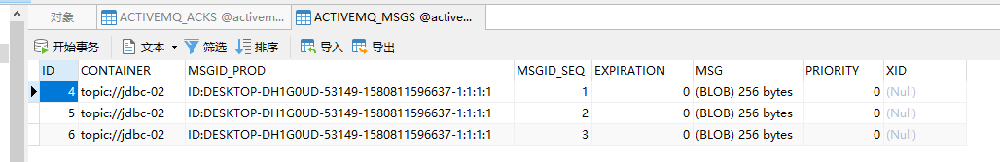
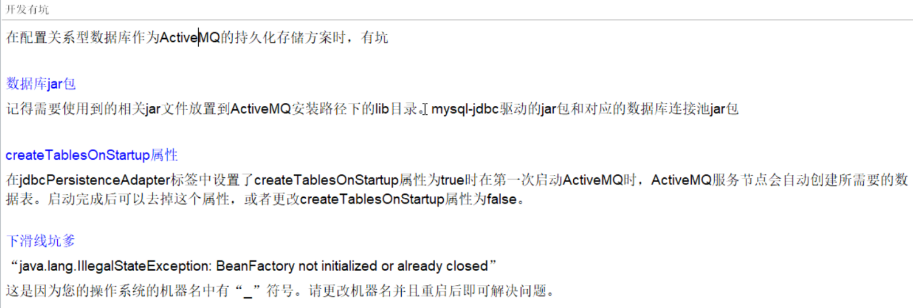

\----------------课件对应的视频：01_前言说明----------始--------------------

# 课程基本信息

1.  课程地址：https://www.bilibili.com/video/av55976700
2.  课程机构：尚硅谷
3.  课程名称：javaEE培训班中的activeMQ
4.  老师名称：周阳
5.  课程日期：2019-06
6.  课程的周期：3到4天。
7.  课程的思维导图：

链接：https://pan.baidu.com/s/1sScGwyrp3k2PuTprCN2EeA

提取码：k6oa

1.  课程的笔记：http://note.youdao.com/noteshare?id=39fb9a2ff543d021d619885806a15f05&sub=47A2CDABEBFE47A3A05C8B9BB9F19CBC
2.  课程的源码：https://github.com/elstic/ActiveMQ
3.  课程的大纲：

# 入门概述

## MQ的产品种类和对比

MQ就是消息中间件。MQ是一种理念，ActiveMQ是MQ的落地产品。不管是哪款消息中间件，都有如下一些技术维度：

1.  kafka

编程语言：scala。

大数据领域的主流MQ。

1.  rabbitmq

编程语言：erlang

基于erlang语言，不好修改底层，不要查找问题的原因，不建议选用。

1.  rocketmq

编程语言：java

适用于大型项目。适用于集群。

1.  activemq

编程语言：java

适用于中小型项目。

## MQ的产生背景

系统之间直接调用存在的问题？

微服务架构后，链式调用是我们在写程序时候的一般流程,为了完成一个整体功能会将其拆分成多个函数(或子模块)，比如模块A调用模块B,模块B调用模块C,模块C调用模块D。但在大型分布式应用中，系统间的RPC交互繁杂，一个功能背后要调用上百个接口并非不可能，从单机架构过渡到分布式微服务架构的通例。这些架构会有哪些问题？

1.  **系统之间接口耦合比较严重**

每新增一个下游功能，都要对上游的相关接口进行改造；

举个例子：如果系统A要发送数据给系统B和系统C，发送给每个系统的数据可能有差异，因此系统A对要发送给每个系统的数据进行了组装，然后逐一发送；

当代码上线后又新增了一个需求：把数据也发送给D，新上了一个D系统也要接受A系统的数据，此时就需要修改A系统，让他感知到D系统的存在，同时把数据处理好再给D。在这个过程你会看到，每接入一个下游系统，都要对系统A进行代码改造，开发联调的效率很低。其整体架构如下图：

1.  **面对大流量并发时，容易被冲垮**

每个接口模块的吞吐能力是有限的，这个上限能力如果是堤坝，当大流量（洪水）来临时，容易被冲垮。

举个例子秒杀业务：上游系统发起下单购买操作，就是下单一个操作，很快就完成。然而，下游系统要完成秒杀业务后面的所有逻辑（读取订单，库存检查，库存冻结，余额检查，余额冻结，订单生产，余额扣减，库存减少，生成流水，余额解冻，库存解冻）。

1.  **等待同步存在性能问题**

RPC接口上基本都是同步调用，整体的服务性能遵循“木桶理论”，即整体系统的耗时取决于链路中最慢的那个接口。比如A调用B/C/D都是50ms，但此时B又调用了B1，花费2000ms，那么直接就拖累了整个服务性能。

根据上述的几个问题，在设计系统时可以明确要达到的目标：

1，要做到系统解耦，当新的模块接进来时，可以做到代码改动最小；能够解耦

2，设置流量缓冲池，可以让后端系统按照自身吞吐能力进行消费，不被冲垮；能削峰

3，强弱依赖梳理能将非关键调用链路的操作异步化并提升整体系统的吞吐能力；能够异步

## MQ的主要作用

1.  异步。调用者无需等待。
2.  解耦。解决了系统之间耦合调用的问题。
3.  消峰。抵御洪峰流量，保护了主业务。

## MQ的定义

面向消息的中间件（message-oriented middleware）MOM能够很好的解决以上问题。是指利用高效可靠的消息传递机制与平台无关的数据交流，并基于数据通信来进行分布式系统的集成。通过提供消息传递和消息排队模型在分布式环境下提供应用解耦，弹性伸缩，冗余存储、流量削峰，异步通信，数据同步等功能。

大致的过程是这样的：发送者把消息发送给消息服务器，消息服务器将消息存放在若干队列/主题topic中，在合适的时候，消息服务器回将消息转发给接受者。在这个过程中，发送和接收是异步的，也就是发送无需等待，而且发送者和接受者的生命周期也没有必然的关系；尤其在发布pub/订阅sub模式下，也可以完成一对多的通信，即让一个消息有多个接受者。

## MQ的特点

1.  **采用异步处理模式**

消息发送者可以发送一个消息而无须等待响应。消息发送者将消息发送到一条虚拟的通道（主题或者队列）上；

消息接收者则订阅或者监听该爱通道。一条消息可能最终转发给一个或者多个消息接收者，这些消息接收者都无需对消息发送者做出同步回应。整个过程都是异步的。

案例：

也就是说，一个系统跟另一个系统之间进行通信的时候，假如系统A希望发送一个消息给系统B，让他去处理。但是系统A不关注系统B到底怎么处理或者有没有处理好，所以系统A把消息发送给MQ，然后就不管这条消息的“死活了”，接着系统B从MQ里面消费出来处理即可。至于怎么处理，是否处理完毕，什么时候处理，都是系统B的事儿，与系统A无关。

1.  **应用系统之间解耦合**

发送者和接受者不必了解对方，只需要确认消息。

发送者和接受者不必同时在线。

1.  **整体架构**

1.  **MQ的缺点**

两个系统之间不能同步调用，不能实时回复，不能响应某个调用的回复。

\---------------课件对应的视频：07_ActiveMQ官方介绍和下载-----始------------

# ActiveMQ安装和控制台

## ActiveMQ安装

1.  **官方下载**

官网地址： <http://activemq.apache.org/>

点击下面，开始下载。

1.  **安装步骤**

我按照这网址安装的：http://blog.csdn.net/gebitan505/article/details/55096222。我个人感觉这个博客要比老师介绍的更详细。

安装步骤：

1.  创建目录

[root@iz2zecamxg0abujhfi0y7iz \~]\# cd /usr/local/

[root@iz2zecamxg0abujhfi0y7iz local]\# mkdir activemq

[root@iz2zecamxg0abujhfi0y7iz local]\# cd activemq

1.  上传安装包

[root@iz2zecamxg0abujhfi0y7iz local]\# rz

1.  解压

[root@iz2zecamxg0abujhfi0y7iz activemq]\# tar -xzvf apache-activemq-5.14.3-bin.tar.gz

1.  在/etc/init.d/目录增加增加activemq文件

[root@iz2zecamxg0abujhfi0y7iz activemq]\# cd /etc/init.d/

[root@iz2zecamxg0abujhfi0y7iz init.d]\# vi activemq

注意：将下面内容全部复制。 要先安装jdk，在下面配置jdk的安装目录。

| \#!/bin/sh \# \# /etc/init.d/activemq \# chkconfig: 345 63 37 \# description: activemq servlet container. \# processname: activemq 5.14.3  \# Source function library. \#. /etc/init.d/functions \# source networking configuration. \#. /etc/sysconfig/network  export JAVA_HOME=/usr/local/jdk1.8.0_131 export CATALINA_HOME=/usr/local/activemq/apache-activemq-5.14.3  case \$1 in  start)  sh \$CATALINA_HOME/bin/activemq start  ;;  stop)  sh \$CATALINA_HOME/bin/activemq stop  ;;  restart)  sh \$CATALINA_HOME/bin/activemq stop  sleep 1  sh \$CATALINA_HOME/bin/activemq start  ;;  esac exit 0 |
|-------------------------------------------------------------------------------------------------------------------------------------------------------------------------------------------------------------------------------------------------------------------------------------------------------------------------------------------------------------------------------------------------------------------------------------------------------------------------------------------------------------------------------------------------------------------------------------------------------------|

[root@iz2zecamxg0abujhfi0y7iz init.d]\# chmod 777 activemq

1.  设置开机启动

[root@iz2zecamxg0abujhfi0y7iz init.d]\# chkconfig activemq on

1.  启动ActiveMQ

[root@iz2zecamxg0abujhfi0y7iz init.d]\# service activemq start

1.  访问activemq管理页面地址：http://IP地址:8161/

    账户admin 密码admin

2.  查看activemq状态

service activemq status

关闭activemq服务

service activemq stop

1.  **因为主机名不符合规范导致无法启动activemq**

https://blog.csdn.net/qq_39056805/article/details/80749337

1.  **启动时指定日志输出文件（重要）**

activemq日志默认的位置是在：%activemq安装目录%/data/activemq.log

这是我们启动时指定日志输出文件：

[root@VM_0_14_centos raohao]\# service activemq start \> /usr/local/raohao/activemq.log

这是老师启动时指定日志输出文件：

1.  **查看程序启动是否成功的3种方式（通用）**

方式1：查看进程

方式2：查看端口是否被占用

方式3：查看端口是否被占用

## ActiveMQ控制台

1.  访问activemq管理页面地址：http://IP地址:8161/

    账户admin 密码admin

2.  进入

1.  其他的，我们在后面实战中再去详细讲解。

\---------------课件对应的视频：10_java编码MQ标准API详解----------始--------

# 入门案例、MQ标准、API详解

## pom.xml导入依赖

| \<**dependencies**\>  *\<!-- activemq 所需要的jar 包--\> * \<**dependency**\>  \<**groupId**\>org.apache.activemq\</**groupId**\>  \<**artifactId**\>activemq-all\</**artifactId**\>  \<**version**\>5.15.9\</**version**\>  \</**dependency**\>  *\<!-- activemq 和 spring 整合的基础包 --\> * \<**dependency**\>  \<**groupId**\>org.apache.xbean\</**groupId**\>  \<**artifactId**\>xbean-spring\</**artifactId**\>  \<**version**\>3.16\</**version**\>  \</**dependency**\> \</**dependencies**\> |
|--------------------------------------------------------------------------------------------------------------------------------------------------------------------------------------------------------------------------------------------------------------------------------------------------------------------------------------------------------------------------------------------------------------------------------------------------------------------------------------------------------|

## JMS编码总体规范

## Destination简介

Destination是目的地。下面拿jvm和mq，做个对比。目的地，我们可以理解为是数据存储的地方。

Destination分为两种：队列和主题。下图介绍：

## 队列消息生产者的入门案例

| **package** com.at.activemq.queue;  **import** org.apache.activemq.ActiveMQConnectionFactory; **import** javax.jms.\*;  **public class** JmsProduce {  *// linux 上部署的activemq 的 IP 地址 + activemq 的端口号 * **public static final** String **ACTIVEMQ_URL** = **"tcp://118.24.20.3:61626"**;  *// 目的地的名称 * **public static final** String **QUEUE_NAME** = **"jdbc01"**;    **public static void** main(String[] args) **throws** Exception{  *// 1 按照给定的url创建连接工厂，这个构造器采用默认的用户名密码。该类的其他构造方法可以指定用户名和密码。 * ActiveMQConnectionFactory activeMQConnectionFactory = **new** ActiveMQConnectionFactory(**ACTIVEMQ_URL**);  *// 2 通过连接工厂，获得连接 connection 并启动访问。 * Connection connection = activeMQConnectionFactory.createConnection();  connection.start();  *// 3 创建会话session 。第一参数是是否开启事务， 第二参数是消息签收的方式 * Session session = connection.createSession(**false**,Session.**AUTO_ACKNOWLEDGE**);  *// 4 创建目的地（两种 ：队列/主题）。Destination是Queue和Topic的父类 * Queue queue = session.createQueue(**QUEUE_NAME**);  *// 5 创建消息的生产者 * MessageProducer messageProducer = session.createProducer(queue);  *// 6 通过messageProducer 生产 3 条 消息发送到消息队列中 * **for** (**int** i = 1; i \< 4 ; i++) {  *// 7 创建消息 * TextMessage textMessage = session.createTextMessage(**"msg--"** + i);  *// 8 通过messageProducer发送给mq * messageProducer.send(textMessage);  }  *// 9 关闭资源 * messageProducer.close();  session.close();  connection.close();  System.**out**.println(**" \*\*\*\* 消息发送到MQ完成 \*\*\*\*"**);  } } |
|----------------------------------------------------------------------------------------------------------------------------------------------------------------------------------------------------------------------------------------------------------------------------------------------------------------------------------------------------------------------------------------------------------------------------------------------------------------------------------------------------------------------------------------------------------------------------------------------------------------------------------------------------------------------------------------------------------------------------------------------------------------------------------------------------------------------------------------------------------------------------------------------------------------------------------------------------------------------------------------------------------------------------------------------------------------------------------------------------------------------------------------------------------------------------------------------------------------------------------------------------------------------------------------------------------------------------------------------------------------------------------------------------------------------------------------------------------------------------------------------------------------------------------------------------------------------------------------------------------------------------------------------------------------|

## ActiveMQ控制台之队列

运行上面代码，控制台显示如下：

Number Of Pending Messages：

等待消费的消息，这个是未出队列的数量，公式=总接收数-总出队列数。

Number Of Consumers：

消费者数量，消费者端的消费者数量。

Messages Enqueued：

进队消息数，进队列的总消息量，包括出队列的。这个数只增不减。

Messages Dequeued：

出队消息数，可以理解为是消费者消费掉的数量。

总结：

当有一个消息进入这个队列时，等待消费的消息是1，进入队列的消息是1。

当消息消费后，等待消费的消息是0，进入队列的消息是1，出队列的消息是1。

当再来一条消息时，等待消费的消息是1，进入队列的消息就是2。

## 队列消息消费者的入门案例

| **package** com.at.activemq.queue;  **import** org.apache.activemq.ActiveMQConnectionFactory; **import** javax.jms.\*;  *// 消息的消费者 ***public class** JmsConsumer {   **public static final** String **ACTIVEMQ_URL** = **"tcp://118.24.20.3:61626"**;  **public static final** String **QUEUE_NAME** = **"jdbc01"**;   **public static void** main(String[] args) **throws** Exception{  ActiveMQConnectionFactory activeMQConnectionFactory = **new** ActiveMQConnectionFactory(**ACTIVEMQ_URL**);  javax.jms.Connection connection = activeMQConnectionFactory.createConnection();  connection.start();  Session session = connection.createSession(**false**, Session.**AUTO_ACKNOWLEDGE**);  Queue queue = session.createQueue(**QUEUE_NAME**);  *// 5 创建消息的消费者 *  MessageConsumer messageConsumer = session.createConsumer(queue);  **while**(**true**){  *// reveive() 一直等待接收消息，在能够接收到消息之前将一直阻塞。 是同步阻塞方式 。和socket的accept方法类似的。* *// reveive(Long time) : 等待n毫秒之后还没有收到消息，就是结束阻塞。  // 因为消息发送者是 TextMessage，所以消息接受者也要是TextMessage *  TextMessage message = (TextMessage)messageConsumer.receive(); * * **if** (**null** != message){  System.**out**.println(**"\*\*\*\*消费者的消息："**+message.getText());  }**else** {  **break**;  }  }  messageConsumer.close();  session.close();  connection.close();  } } |
|----------------------------------------------------------------------------------------------------------------------------------------------------------------------------------------------------------------------------------------------------------------------------------------------------------------------------------------------------------------------------------------------------------------------------------------------------------------------------------------------------------------------------------------------------------------------------------------------------------------------------------------------------------------------------------------------------------------------------------------------------------------------------------------------------------------------------------------------------------------------------------------------------------------------------------------------------------------------------------------------------------------------------------------------------------------------------------------------------------------------------------------------------------------------------------------------------------------------------------------------------------------------------------------------------------------------------------------------------------------------------------------------------------------------|

控制台显示：

## 异步监听式消费者（MessageListener）

| **package** com.at.activemq.queue;  **import** org.apache.activemq.ActiveMQConnectionFactory; **import** javax.jms.\*;  *// 消息的消费者 也就是回答消息的系统 ***public class** JmsConsumer {   **public static final** String **ACTIVEMQ_URL** = **"tcp://118.24.20.3:61626"**;   **public static final** String **QUEUE_NAME** = **"jdbc01"**;   **public static void** main(String[] args) **throws** Exception{  ActiveMQConnectionFactory activeMQConnectionFactory = **new** ActiveMQConnectionFactory(**ACTIVEMQ_URL**);  javax.jms.Connection connection = activeMQConnectionFactory.createConnection();  connection.start();  Session session = connection.createSession(**false**, Session.**AUTO_ACKNOWLEDGE**);  Queue queue = session.createQueue(**QUEUE_NAME**);* * MessageConsumer messageConsumer = session.createConsumer(queue);   */\* 通过监听的方式来消费消息，是异步非阻塞的方式消费消息。  通过messageConsumer 的setMessageListener 注册一个监听器，当有消息发送来时，系统自动调用MessageListener 的 onMessage 方法处理消息  \*/ * messageConsumer.setMessageListener(**new** MessageListener() {  **public void** onMessage(Message message) { *// instanceof 判断是否A对象是否是B类的子类*  **if** (**null** != message && message **instanceof** TextMessage){  TextMessage textMessage = (TextMessage)message;  **try** {  System.**out**.println(**"\*\*\*\*消费者的消息："**+textMessage.getText());  }**catch** (JMSException e) {  e.printStackTrace();  }  }  }  });  *// 让主线程不要结束。因为一旦主线程结束了，其他的线程（如此处的监听消息的线程）也都会被迫结束。  // 实际开发中，我们的程序会一直运行，这句代码都会省略。 *  System.**in**.read();  messageConsumer.close();  session.close();  connection.close();  } } |
|-----------------------------------------------------------------------------------------------------------------------------------------------------------------------------------------------------------------------------------------------------------------------------------------------------------------------------------------------------------------------------------------------------------------------------------------------------------------------------------------------------------------------------------------------------------------------------------------------------------------------------------------------------------------------------------------------------------------------------------------------------------------------------------------------------------------------------------------------------------------------------------------------------------------------------------------------------------------------------------------------------------------------------------------------------------------------------------------------------------------------------------------------------------------------------------------------------------------------------------------------------------------------------------------------------------------------------------------------------------------------------------------------------------------------------------------------------------------------------------------------------------------------------------------------------------------------------------------------------------------------------------------------------------------------------------------------------------------------------------------------------------------|

## 队列消息（Queue）总结

1.  **两种消费方式**

同步阻塞方式(receive)

订阅者或接收者抵用MessageConsumer的receive()方法来接收消息，receive方法在能接收到消息之前（或超时之前）将一直阻塞。

异步非阻塞方式（监听器onMessage()）

订阅者或接收者通过MessageConsumer的setMessageListener(MessageListener listener)注册一个消息监听器，当消息到达之后，系统会自动调用监听器MessageListener的onMessage(Message message)方法。

1.  **队列的特点：**

1.  **消息消费情况**

    

情况1：只启动消费者1。

结果：消费者1会消费所有的数据。

情况2：先启动消费者1，再启动消费者2。

结果：消费者1消费所有的数据。消费者2不会消费到消息。

情况3：生产者发布6条消息，在此之前已经启动了消费者1和消费者2。

结果：消费者1和消费者2平摊了消息。各自消费3条消息。

疑问：怎么去将消费者1和消费者2不平均分摊呢？而是按照各自的消费能力去消费。我觉得，现在activemq就是这样的机制。

## Topic介绍、入门案例、控制台

1.  **topic介绍**

在发布订阅消息传递域中，目的地被称为主题（topic）

发布/订阅消息传递域的特点如下：

（1）生产者将消息发布到topic中，每个消息可以有多个消费者，属于1：N的关系；

（2）生产者和消费者之间有时间上的相关性。订阅某一个主题的消费者只能消费自它订阅之后发布的消息。

（3）生产者生产时，topic不保存消息它是无状态的不落地，假如无人订阅就去生产，那就是一条废消息，所以，一般先启动消费者再启动生产者。

默认情况下如上所述，但是JMS规范允许客户创建持久订阅，这在一定程度上放松了时间上的相关性要求。持久订阅允许消费者消费它在未处于激活状态时发送的消息。一句话，好比我们的微信公众号订阅

1.  **生产者案例**

| 只有灰色背景代码和之前代码不同                                                                                                                                                                                                                                                                                                                                                                                                                                                                                                                                                                                                                                                                                                                                                                                                                                                                                                                                                                                                                                                                                                                                                                 |
|------------------------------------------------------------------------------------------------------------------------------------------------------------------------------------------------------------------------------------------------------------------------------------------------------------------------------------------------------------------------------------------------------------------------------------------------------------------------------------------------------------------------------------------------------------------------------------------------------------------------------------------------------------------------------------------------------------------------------------------------------------------------------------------------------------------------------------------------------------------------------------------------------------------------------------------------------------------------------------------------------------------------------------------------------------------------------------------------------------------------------------------------------------------------------------------------|
| **package** com.at.activemq.topic;  **import** org.apache.activemq.ActiveMQConnectionFactory; **import** javax.jms.\*;  **public class** JmsProduce_topic {   **public static final** String **ACTIVEMQ_URL** = **"tcp://192.168.17.3:61616"**;  **public static final** String **TOPIC_NAME** = **"topic01"**;   **public static void** main(String[] args) **throws** Exception{   ActiveMQConnectionFactory activeMQConnectionFactory = **new** ActiveMQConnectionFactory(**ACTIVEMQ_URL**);   Connection connection = activeMQConnectionFactory.createConnection();  connection.start();   Session session = connection.createSession(**false**, Session.**AUTO_ACKNOWLEDGE**);     Topic topic = session.createTopic(**TOPIC_NAME**); * * MessageProducer messageProducer = session.createProducer(topic);  **for** (**int** i = 1; i \< 4 ; i++) {    TextMessage textMessage = session.createTextMessage(**"topic_name--"** + i);* * messageProducer.send(textMessage);  MapMessage mapMessage = session.createMapMessage();* * }* * messageProducer.close();  session.close();  connection.close();  System.**out**.println(**" \*\*\*\* TOPIC_NAME消息发送到MQ完成 \*\*\*\*"**);  } } |

1.  **消费者入门案例**

| 只有灰色背景代码和之前代码不同                                                                                                                                                                                                                                                                                                                                                                                                                                                                                                                                                                                                                                                                                                                                                                                                                                                                                                                                                                                                                                                                                                                                                                                                                                                                                                                      |
|-----------------------------------------------------------------------------------------------------------------------------------------------------------------------------------------------------------------------------------------------------------------------------------------------------------------------------------------------------------------------------------------------------------------------------------------------------------------------------------------------------------------------------------------------------------------------------------------------------------------------------------------------------------------------------------------------------------------------------------------------------------------------------------------------------------------------------------------------------------------------------------------------------------------------------------------------------------------------------------------------------------------------------------------------------------------------------------------------------------------------------------------------------------------------------------------------------------------------------------------------------------------------------------------------------------------------------------------------------|
| **package** com.at.activemq.topic;  **import** org.apache.activemq.ActiveMQConnectionFactory; **import** javax.jms.\*;  **public class** JmsConsummer_topic {  **public static final** String **ACTIVEMQ_URL** = **"tcp://192.168.17.3:61616"**;  **public static final** String **TOPIC_NAME** = **"topic01"**;   **public static void** main(String[] args) **throws** Exception{* * ActiveMQConnectionFactory activeMQConnectionFactory = **new** ActiveMQConnectionFactory(**ACTIVEMQ_URL**);* * Connection connection = activeMQConnectionFactory.createConnection();* * connection.start();* * Session session = connection.createSession(**false**, Session.**AUTO_ACKNOWLEDGE**);   *// 4 创建目的地 （两种 ： 队列/主题 这里用主题） * Topic topic = session.createTopic(**TOPIC_NAME**); * * MessageConsumer messageConsumer = session.createConsumer(topic); *// MessageListener接口只有一个方法，可以使用lambda表达式*  messageConsumer.setMessageListener( (message) -\> {  **if** (**null** != message && message **instanceof** TextMessage){  TextMessage textMessage = (TextMessage)message;  **try** {  System.**out**.println(**"\*\*\*\*消费者text的消息："**+textMessage.getText());  }**catch** (JMSException e) {  }  }  }); * * System.**in**.read();  messageConsumer.close();  session.close();  connection.close();  } } |

存在多个消费者，每个消费者都能收到，自从自己启动后所有生产的消息。

1.  **ActiveMQ控制台**

topic有多个消费者时，消费消息的数量 ≈ 在线消费者数量\*生产消息的数量。

下图展示了：我们先启动了3个消费者，再启动一个生产者，并生产了3条消息。

## tpoic和queue对比

\-------------------课件对应的视频：19_jms是什么----------始-------------

# JMS规范

## JMS是什么

什么是Java消息服务？

Java消息服务指的是两个应用程序之间进行异步通信的API，它为标准协议和消息服务提供了一组通用接口，包括创建、发送、读取消息等，用于支持Java应用程序开发。在JavaEE中，当两个应用程序使用JMS进行通信时，它们之间不是直接相连的，而是通过一个共同的消息收发服务组件关联起来以达到解耦/异步削峰的效果。

## 消息头

JMS的消息头有哪些属性：

JMSDestination：消息目的地

JMSDeliveryMode：消息持久化模式

JMSExpiration：消息过期时间

JMSPriority：消息的优先级

JMSMessageID：消息的唯一标识符。后面我们会介绍如何解决幂等性。

说明： 消息的生产者可以set这些属性，消息的消费者可以get这些属性。

这些属性在send方法里面也可以设置。

| 下面代码除了灰色背景外，其他都和前面一样。                                                                                                                                                                                                                                                                                                                                                                                                                                                                                                                                                                                                                                                                                                                                                                                                                                                                                                                                                                                                                                                                                                                                                                                                                                                                                                                                                                                                                                                                                                                                                                                                                                                                                                                                                                                                                                                                                                                                                                                                                                                                                                                                                            |
|-------------------------------------------------------------------------------------------------------------------------------------------------------------------------------------------------------------------------------------------------------------------------------------------------------------------------------------------------------------------------------------------------------------------------------------------------------------------------------------------------------------------------------------------------------------------------------------------------------------------------------------------------------------------------------------------------------------------------------------------------------------------------------------------------------------------------------------------------------------------------------------------------------------------------------------------------------------------------------------------------------------------------------------------------------------------------------------------------------------------------------------------------------------------------------------------------------------------------------------------------------------------------------------------------------------------------------------------------------------------------------------------------------------------------------------------------------------------------------------------------------------------------------------------------------------------------------------------------------------------------------------------------------------------------------------------------------------------------------------------------------------------------------------------------------------------------------------------------------------------------------------------------------------------------------------------------------------------------------------------------------------------------------------------------------------------------------------------------------------------------------------------------------------------------------------------------------|
| **package** com.at.activemq.topic;  **import** org.apache.activemq.ActiveMQConnectionFactory; **import** javax.jms.\*;  **public class** JmsProduce_topic {   **public static final** String **ACTIVEMQ_URL** = **"tcp://118.24.20.3:61626"**;  **public static final** String **TOPIC_NAME** = **"topic01"**;   **public static void** main(String[] args) **throws** Exception{  ActiveMQConnectionFactory activeMQConnectionFactory = **new** ActiveMQConnectionFactory(**ACTIVEMQ_URL**);* * Connection connection = activeMQConnectionFactory.createConnection();* * connection.start();* * Session session = connection.createSession(**false**, Session.**AUTO_ACKNOWLEDGE**);* * Topic topic = session.createTopic(**TOPIC_NAME**);* * MessageProducer messageProducer = session.createProducer(topic);   **for** (**int** i = 1; i \< 4 ; i++) {* * TextMessage textMessage = session.createTextMessage(**"topic_name--"** + i);  *// 这里可以指定每个消息的目的地 *  textMessage.setJMSDestination(topic);  */\*  持久模式和非持久模式。  一条持久性的消息：应该被传送“一次仅仅一次”，这就意味着如果JMS提供者出现故障，该消息并不会丢失，它会在服务器恢复之后再次传递。  一条非持久的消息：最多会传递一次，这意味着服务器出现故障，该消息将会永远丢失。  \*/ *  textMessage.setJMSDeliveryMode(0);  */\*  可以设置消息在一定时间后过期，默认是永不过期。  消息过期时间，等于Destination的send方法中的timeToLive值加上发送时刻的GMT时间值。  如果timeToLive值等于0，则JMSExpiration被设为0，表示该消息永不过期。  如果发送后，在消息过期时间之后还没有被发送到目的地，则该消息被清除。  \*/ *  textMessage.setJMSExpiration(1000);  */\* 消息优先级，从0-9十个级别，0-4是普通消息5-9是加急消息。  JMS不要求MQ严格按照这十个优先级发送消息但必须保证加急消息要先于普通消息到达。默认是4级。  \*/ * textMessage.setJMSPriority(10);  *// 唯一标识每个消息的标识。MQ会给我们默认生成一个，我们也可以自己指定。 * textMessage.setJMSMessageID(**"ABCD"**);  *// 上面有些属性在send方法里也能设置 * messageProducer.send(textMessage);* * }* * messageProducer.close();  session.close();  connection.close();  System.**out**.println(**" \*\*\*\* TOPIC_NAME消息发送到MQ完成 \*\*\*\*"**);  } } |

## 消息体

5种消息体格式：

| 下面我们演示TextMessage和MapMessage的用法。灰色背景代码是和之前不同的地方。                                                                                                                                                                                                                                                                                                                                                                                                                                                                                                                                                                                                                                                                                                                                                                                                                                                                                                                                                                                                                                                                                                                                                                                                                                                                                                                                                                                                                                                                                                                                                               |
|-------------------------------------------------------------------------------------------------------------------------------------------------------------------------------------------------------------------------------------------------------------------------------------------------------------------------------------------------------------------------------------------------------------------------------------------------------------------------------------------------------------------------------------------------------------------------------------------------------------------------------------------------------------------------------------------------------------------------------------------------------------------------------------------------------------------------------------------------------------------------------------------------------------------------------------------------------------------------------------------------------------------------------------------------------------------------------------------------------------------------------------------------------------------------------------------------------------------------------------------------------------------------------------------------------------------------------------------------------------------------------------------------------------------------------------------------------------------------------------------------------------------------------------------------------------------------------------------------------------------------------------------|
| 消息生产者                                                                                                                                                                                                                                                                                                                                                                                                                                                                                                                                                                                                                                                                                                                                                                                                                                                                                                                                                                                                                                                                                                                                                                                                                                                                                                                                                                                                                                                                                                                                                                                                                                |
| **package** com.at.activemq.topic;  **import** org.apache.activemq.ActiveMQConnectionFactory; **import** javax.jms.\*;  **public class** JmsProduce_topic {   **public static final** String **ACTIVEMQ_URL** = **"tcp://118.24.20.3:61626"**;  **public static final** String **TOPIC_NAME** = **"topic01"**;   **public static void** main(String[] args) **throws** Exception{  ActiveMQConnectionFactory activeMQConnectionFactory = **new** ActiveMQConnectionFactory(**ACTIVEMQ_URL**);   javax.jms.Connection connection = activeMQConnectionFactory.createConnection();   connection.start();* * Session session = connection.createSession(**false**, Session.**AUTO_ACKNOWLEDGE**);* * Topic topic = session.createTopic(**TOPIC_NAME**);* * MessageProducer messageProducer = session.createProducer(topic);   **for** (**int** i = 1; i \< 4 ; i++) { *// 发送TextMessage消息体 * TextMessage textMessage = session.createTextMessage(**"topic_name--"** + i);* * messageProducer.send(textMessage);  *// 发送MapMessage 消息体。set方法: 添加，get方式：获取*  MapMessage mapMessage = session.createMapMessage();  mapMessage.setString(**"name"**, **"张三"**+i);  mapMessage.setInt(**"age"**, 18+i);  messageProducer.send(mapMessage);  }* * messageProducer.close();  session.close();  connection.close();  System.**out**.println(**" \*\*\*\* TOPIC_NAME消息发送到MQ完成 \*\*\*\*"**);  } }                                                                                                                                                                                                                         |
| 消息消费者                                                                                                                                                                                                                                                                                                                                                                                                                                                                                                                                                                                                                                                                                                                                                                                                                                                                                                                                                                                                                                                                                                                                                                                                                                                                                                                                                                                                                                                                                                                                                                                                                                |
| **package** com.at.activemq.topic;  **import** org.apache.activemq.ActiveMQConnectionFactory; **import** javax.jms.\*;  **public class** JmsConsummer_topic {  **public static final** String **ACTIVEMQ_URL** = **"tcp://118.24.20.3:61626"**;  **public static final** String **TOPIC_NAME** = **"topic01"**;   **public static void** main(String[] args) **throws** Exception{* * ActiveMQConnectionFactory activeMQConnectionFactory = **new** ActiveMQConnectionFactory(**ACTIVEMQ_URL**);* * javax.jms.Connection connection = activeMQConnectionFactory.createConnection();* * connection.start();* * Session session = connection.createSession(**false**, Session.**AUTO_ACKNOWLEDGE**);* * Topic topic = session.createTopic(**TOPIC_NAME**);* * MessageConsumer messageConsumer = session.createConsumer(topic);   messageConsumer.setMessageListener( (message) -\> {  *// 判断消息是哪种类型之后，再强转。*  **if** (**null** != message && message **instanceof** TextMessage){  TextMessage textMessage = (TextMessage)message;  **try** {  System.**out**.println(**"\*\*\*\*消费者text的消息："**+textMessage.getText());  }**catch** (JMSException e) {  }  }  **if** (**null** != message && message **instanceof** MapMessage){  MapMessage mapMessage = (MapMessage)message;  **try** {  System.**out**.println(**"\*\*\*\*消费者的map消息："**+mapMessage.getString(**"name"**));  System.**out**.println(**"\*\*\*\*消费者的map消息："**+mapMessage.getInt(**"age"**));  }**catch** (JMSException e) {  }  }   });* * System.**in**.read();  messageConsumer.close();  session.close();  connection.close();  } } |

## 消息属性

如果需要除消息头字段之外的值，那么可以使用消息属性。他是识别/去重/重点标注等操作，非常有用的方法。

他们是以属性名和属性值对的形式制定的。可以将属性是为消息头得扩展，属性指定一些消息头没有包括的附加信息，比如可以在属性里指定消息选择器。消息的属性就像可以分配给一条消息的附加消息头一样。它们允许开发者添加有关消息的不透明附加信息。它们还用于暴露消息选择器在消息过滤时使用的数据。

下图是设置消息属性的API：

| 我们代码演示。灰色背景是和之前代码不同的地方                                                                                                                                                                                                                                                                                                                                                                                                                                                                                                                                                                                                                                                                                                                                                                                                                                                                                                                                                                                                                                                                                                                                                                                                                                                                                                                                                                                                                                    |
|---------------------------------------------------------------------------------------------------------------------------------------------------------------------------------------------------------------------------------------------------------------------------------------------------------------------------------------------------------------------------------------------------------------------------------------------------------------------------------------------------------------------------------------------------------------------------------------------------------------------------------------------------------------------------------------------------------------------------------------------------------------------------------------------------------------------------------------------------------------------------------------------------------------------------------------------------------------------------------------------------------------------------------------------------------------------------------------------------------------------------------------------------------------------------------------------------------------------------------------------------------------------------------------------------------------------------------------------------------------------------------------------------------------------------------------------------------------------------------|
| 消息生产者                                                                                                                                                                                                                                                                                                                                                                                                                                                                                                                                                                                                                                                                                                                                                                                                                                                                                                                                                                                                                                                                                                                                                                                                                                                                                                                                                                                                                                                                      |
| **package** com.at.activemq.topic;  **import** org.apache.activemq.ActiveMQConnectionFactory; **import** javax.jms.\*;  **public class** JmsProduce_topic {   **public static final** String **ACTIVEMQ_URL** = **"tcp://118.24.20.3:61626"**;  **public static final** String **TOPIC_NAME** = **"topic01"**;   **public static void** main(String[] args) **throws** Exception{  ActiveMQConnectionFactory activeMQConnectionFactory = **new** ActiveMQConnectionFactory(**ACTIVEMQ_URL**);  Connection connection = activeMQConnectionFactory.createConnection();  connection.start();  Session session = connection.createSession(**false**, Session.**AUTO_ACKNOWLEDGE**);  Topic topic = session.createTopic(**TOPIC_NAME**);  MessageProducer messageProducer = session.createProducer(topic);   **for** (**int** i = 1; i \< 4 ; i++) {  TextMessage textMessage = session.createTextMessage(**"topic_name--"** + i);  *// 调用Message的set\*Property()方法，就能设置消息属性。根据value的数据类型的不同，有相应的API。 * textMessage.setStringProperty(**"From"**,**"ZhangSan@qq.com"**);  textMessage.setByteProperty(**"Spec"**, (**byte**) 1);  textMessage.setBooleanProperty(**"Invalide"**,**true**);  messageProducer.send(textMessage);  }  messageProducer.close();  session.close();  connection.close();  System.**out**.println(**" \*\*\*\* TOPIC_NAME消息发送到MQ完成 \*\*\*\*"**);  } }                                                                 |
| 消息消费者                                                                                                                                                                                                                                                                                                                                                                                                                                                                                                                                                                                                                                                                                                                                                                                                                                                                                                                                                                                                                                                                                                                                                                                                                                                                                                                                                                                                                                                                      |
| **package** com.at.activemq.topic;  **import** org.apache.activemq.ActiveMQConnectionFactory; **import** javax.jms.\*;  **public class** JmsConsummer_topic {  **public static final** String **ACTIVEMQ_URL** = **"tcp://118.24.20.3:61626"**;  **public static final** String **TOPIC_NAME** = **"topic01"**;   **public static void** main(String[] args) **throws** Exception{  ActiveMQConnectionFactory activeMQConnectionFactory = **new** ActiveMQConnectionFactory(**ACTIVEMQ_URL**);  javax.jms.Connection connection = activeMQConnectionFactory.createConnection();  connection.start();  Session session = connection.createSession(**false**, Session.**AUTO_ACKNOWLEDGE**);  Topic topic = session.createTopic(**TOPIC_NAME**);  MessageConsumer messageConsumer = session.createConsumer(topic);   messageConsumer.setMessageListener( (message) -\> {  **if** (**null** != message && message **instanceof** TextMessage){  TextMessage textMessage = (TextMessage)message;  **try** {  System.**out**.println(**"消息体："**+textMessage.getText());  System.**out**.println(**"消息属性："**+textMessage.getStringProperty(**"From"**));  System.**out**.println(**"消息属性："**+textMessage.getByteProperty(**"Spec"**));  System.**out**.println(**"消息属性："**+textMessage.getBooleanProperty(**"Invalide"**));  }**catch** (JMSException e) {  }  }  });  System.**in**.read();  messageConsumer.close();  session.close();  connection.close();  } } |

\-------------------课件对应的视频：25_消息可靠性之非持久化----------始-------------

## 消息的持久化

什么是持久化消息？

保证消息只被传送一次和成功使用一次。在持久性消息传送至目标时，消息服务将其放入持久性数据存储。如果消息服务由于某种原因导致失败，它可以恢复此消息并将此消息传送至相应的消费者。虽然这样增加了消息传送的开销，但却增加了可靠性。

我的理解：在消息生产者将消息成功发送给MQ消息中间件之后。无论是出现任何问题，如：MQ服务器宕机、消费者掉线等。都保证（topic要之前注册过，queue不用）消息消费者，能够成功消费消息。如果消息生产者发送消息就失败了，那么消费者也不会消费到该消息。

### queue消息非持久和持久

queue非持久，当服务器宕机，消息不存在（消息丢失了）。即便是非持久，消费者在不在线的话，消息也不会丢失，等待消费者在线，还是能够收到消息的。

queue持久化，当服务器宕机，消息依然存在。queue消息默认是持久化的。

持久化消息，保证这些消息只被传送一次和成功使用一次。对于这些消息，可靠性是优先考虑的因素。

可靠性的另一个重要方面是确保持久性消息传送至目标后，消息服务在向消费者传送它们之前不会丢失这些消息。

| 非持久化的消费者，和之前的代码一样。下面演示非持久化的生产者。下面除灰色背景代码外，其他都和之前一样。 运行结果证明：当生产者成功发布消息之后，MQ服务端宕机重启，消息生产者就收不到该消息了                                                                                                                                                                                                                                                                                                                                                                                                                                                                                                                                                                                                                                                                                                                                                                                                                                                                                                                                                                                                                           |
|-----------------------------------------------------------------------------------------------------------------------------------------------------------------------------------------------------------------------------------------------------------------------------------------------------------------------------------------------------------------------------------------------------------------------------------------------------------------------------------------------------------------------------------------------------------------------------------------------------------------------------------------------------------------------------------------------------------------------------------------------------------------------------------------------------------------------------------------------------------------------------------------------------------------------------------------------------------------------------------------------------------------------------------------------------------------------------------------------------------------------------------------------------------------------------------------------------------------------|
| **package** com.at.activemq.queue;  **import** org.apache.activemq.ActiveMQConnectionFactory; **import** javax.jms.\*;  **public class** JmsProduce {* * **public static final** String **ACTIVEMQ_URL** = **"tcp://118.24.20.3:61626"**;* * **public static final** String **QUEUE_NAME** = **"jdbc01"**;   **public static void** main(String[] args) **throws** Exception{* * ActiveMQConnectionFactory activeMQConnectionFactory = **new** ActiveMQConnectionFactory(**ACTIVEMQ_URL**);* * Connection connection = activeMQConnectionFactory.createConnection();  connection.start();* * Session session = connection.createSession(**false**,Session.**AUTO_ACKNOWLEDGE**);* * Queue queue = session.createQueue(**QUEUE_NAME**);* * MessageProducer messageProducer = session.createProducer(queue);  *// 非持久化*  messageProducer.setDeliveryMode(DeliveryMode.**NON_PERSISTENT**);* * **for** (**int** i = 1; i \< 4 ; i++) {* * TextMessage textMessage = session.createTextMessage(**"---MessageListener---"** + i);* * messageProducer.send(textMessage);  }* * messageProducer.close();  session.close();  connection.close();  System.**out**.println(**" \*\*\*\* 消息发送到MQ完成 \*\*\*\*"**);  } } |
| 持久化的消费者，和之前的代码一样。下面演示持久化的生产者。下面除灰色背景代码外，其他都和之前一样。 运行结果证明：当生产者成功发布消息之后，MQ服务端宕机重启，消息生产者仍然能够收到该消息                                                                                                                                                                                                                                                                                                                                                                                                                                                                                                                                                                                                                                                                                                                                                                                                                                                                                                                                                                                                                             |
| **package** com.at.activemq.queue;  **import** org.apache.activemq.ActiveMQConnectionFactory; **import** javax.jms.\*;  **public class** JmsProduce {* * **public static final** String **ACTIVEMQ_URL** = **"tcp://118.24.20.3:61626"**;* * **public static final** String **QUEUE_NAME** = **"jdbc01"**;   **public static void** main(String[] args) **throws** Exception{* * ActiveMQConnectionFactory activeMQConnectionFactory = **new** ActiveMQConnectionFactory(**ACTIVEMQ_URL**);* * Connection connection = activeMQConnectionFactory.createConnection();  connection.start();* * Session session = connection.createSession(**false**,Session.**AUTO_ACKNOWLEDGE**);* * Queue queue = session.createQueue(**QUEUE_NAME**);* * MessageProducer messageProducer = session.createProducer(queue);  messageProducer.setDeliveryMode(DeliveryMode.**PERSISTENT**);* * **for** (**int** i = 1; i \< 4 ; i++) {* * TextMessage textMessage = session.createTextMessage(**"---MessageListener---"** + i);* * messageProducer.send(textMessage);  }* * messageProducer.close();  session.close();  connection.close();  System.**out**.println(**" \*\*\*\* 消息发送到MQ完成 \*\*\*\*"**);  } }                    |

### topic消息持久化

topic默认就是非持久化的，因为生产者生产消息时，消费者也要在线，这样消费者才能消费到消息。

topic消息持久化，只要消费者向MQ服务器注册过，所有生产者发布成功的消息，该消费者都能收到，不管是MQ服务器宕机还是消费者不在线。

注意：

1.  一定要先运行一次消费者，等于向MQ注册，类似我订阅了这个主题。
2.  然后再运行生产者发送消息。
3.  之后无论消费者是否在线，都会收到消息。如果不在线的话，下次连接的时候，会把没有收过的消息都接收过来。

| 持久化topic生产者代码。下面除灰色背景代码外，其他都和之前一样。                                                                                                                                                                                                                                                                                                                                                                                                                                                                                                                                                                                                                                                                                                                                                                                                                                                                                                                                                                                                                                                                                                                                                                                                                                                                                                          |
|--------------------------------------------------------------------------------------------------------------------------------------------------------------------------------------------------------------------------------------------------------------------------------------------------------------------------------------------------------------------------------------------------------------------------------------------------------------------------------------------------------------------------------------------------------------------------------------------------------------------------------------------------------------------------------------------------------------------------------------------------------------------------------------------------------------------------------------------------------------------------------------------------------------------------------------------------------------------------------------------------------------------------------------------------------------------------------------------------------------------------------------------------------------------------------------------------------------------------------------------------------------------------------------------------------------------------------------------------------------------------|
| **package** com.at.activemq.topic;  **import** org.apache.activemq.ActiveMQConnectionFactory; **import** javax.jms.\*;  *// 持久化topic 的消息生产者 ***public class** JmsProduce_persistence {   **public static final** String **ACTIVEMQ_URL** = **"tcp://192.168.17.3:61616"**;  **public static final** String **TOPIC_NAME** = **"topic01"**;   **public static void** main(String[] args) **throws** Exception{* * ActiveMQConnectionFactory activeMQConnectionFactory = **new** ActiveMQConnectionFactory(**ACTIVEMQ_URL**);* * javax.jms.Connection connection = activeMQConnectionFactory.createConnection();* * Session session = connection.createSession(**false**, Session.**AUTO_ACKNOWLEDGE**);  Topic topic = session.createTopic(**TOPIC_NAME**);* * MessageProducer messageProducer = session.createProducer(topic); *  // 设置持久化topic  * messageProducer.setDeliveryMode(DeliveryMode.**PERSISTENT**);  *// 设置持久化topic之后再，启动连接 * connection.start();  **for** (**int** i = 1; i \< 4 ; i++) {* * TextMessage textMessage = session.createTextMessage(**"topic_name--"** + i);* * messageProducer.send(textMessage);  MapMessage mapMessage = session.createMapMessage();* * }* * messageProducer.close();  session.close();  connection.close();  System.**out**.println(**" \*\*\*\* TOPIC_NAME消息发送到MQ完成 \*\*\*\*"**);  } } |
| 持久化topic消费者代码。下面除灰色背景代码外，其他都和之前一样。                                                                                                                                                                                                                                                                                                                                                                                                                                                                                                                                                                                                                                                                                                                                                                                                                                                                                                                                                                                                                                                                                                                                                                                                                                                                                                          |
| **package** com.at.activemq.topic;  **import** org.apache.activemq.ActiveMQConnectionFactory; **import** javax.jms.\*;  *// 持久化topic 的消息消费者 ***public class** JmsConsummer_persistence {  **public static final** String **ACTIVEMQ_URL** = **"tcp://192.168.17.3:61616"**;  **public static final** String **TOPIC_NAME** = **"topic01"**;   **public static void** main(String[] args) **throws** Exception{* * ActiveMQConnectionFactory activeMQConnectionFactory = **new** ActiveMQConnectionFactory(**ACTIVEMQ_URL**);* * Connection connection = activeMQConnectionFactory.createConnection(); *// 设置客户端ID。向MQ服务器注册自己的名称*  connection.setClientID(**"marrry"**);* * Session session = connection.createSession(**false**, Session.**AUTO_ACKNOWLEDGE**);* * Topic topic = session.createTopic(**TOPIC_NAME**); *// 创建一个topic订阅者对象。一参是topic，二参是订阅者名称*  TopicSubscriber topicSubscriber = session.createDurableSubscriber(topic,**"remark..."**);  *// 之后再开启连接 * connection.start();  Message message = topicSubscriber.receive();* *  **while** (**null** != message){  TextMessage textMessage = (TextMessage)message;  System.**out**.println(**" 收到的持久化 topic ："**+textMessage.getText());  message = topicSubscriber.receive();  }  session.close();  connection.close();  } }                   |

控制台介绍：

topic页面还是和之前的一样。另外在subscribers页面也会显示。如下：

\-----------------课件对应的视频：28_消息的生产者事务介绍----------始-----------

## 消息的事务性

1.  生产者开启事务后，执行commit方法，这批消息才真正的被提交。不执行commit方法，这批消息不会提交。执行rollback方法，之前的消息会回滚掉。生产者的事务机制，要高于签收机制，当生产者开启事务，签收机制不再重要。
1.  消费者开启事务后，执行commit方法，这批消息才算真正的被消费。不执行commit方法，这些消息不会标记已消费，下次还会被消费。执行rollback方法，是不能回滚之前执行过的业务逻辑，但是能够回滚之前的消息，回滚后的消息，下次还会被消费。消费者利用commit和rollback方法，甚至能够违反一个消费者只能消费一次消息的原理。
1.  问：消费者和生产者需要同时操作事务才行吗？

答：消费者和生产者的事务，完全没有关联，各自是各自的事务。

| 生产者代码                                                                                                                                                                                                                                                                                                                                                                                                                                                                                                                                                                                                                                                                                                                                                                                                                                                                                                                                                                                                                                                                                                                                                                                                                                                                                                                                                                                                                                                                                                                                                                                                                                                                                                                                                                                                                                                    |
|---------------------------------------------------------------------------------------------------------------------------------------------------------------------------------------------------------------------------------------------------------------------------------------------------------------------------------------------------------------------------------------------------------------------------------------------------------------------------------------------------------------------------------------------------------------------------------------------------------------------------------------------------------------------------------------------------------------------------------------------------------------------------------------------------------------------------------------------------------------------------------------------------------------------------------------------------------------------------------------------------------------------------------------------------------------------------------------------------------------------------------------------------------------------------------------------------------------------------------------------------------------------------------------------------------------------------------------------------------------------------------------------------------------------------------------------------------------------------------------------------------------------------------------------------------------------------------------------------------------------------------------------------------------------------------------------------------------------------------------------------------------------------------------------------------------------------------------------------------------|
| **package** com.activemq.demo;  **import** org.apache.activemq.ActiveMQConnectionFactory; **import** javax.jms.\*;  **public class** Jms_TX_Producer {  **private static final** String **ACTIVEMQ_URL** = **"tcp://192.168.10.130:61616"**;  **private static final** String **ACTIVEMQ_QUEUE_NAME** = **"Queue-TX"**;   **public static void** main(String[] args) **throws** JMSException {* * ActiveMQConnectionFactory activeMQConnectionFactory = **new** ActiveMQConnectionFactory(**ACTIVEMQ_URL**);* * Connection connection = activeMQConnectionFactory.createConnection();  connection.start();  *//1.创建会话session，两个参数transacted=事务,acknowledgeMode=确认模式(签收)  //设置为开启事务 * Session session = connection.createSession(**true**, Session.AUTO_ACKNOWLEDGE);* * Queue queue = session.createQueue(**ACTIVEMQ_QUEUE_NAME**);* * MessageProducer producer = session.createProducer(queue);* * **try** {  **for** (**int** i = 0; i \< 3; i++) {  TextMessage textMessage = session.createTextMessage(**"tx msg--"** + i);  producer.send(textMessage); **if**(i == 2){  **throw new** RuntimeException(**"GG....."**);  }  }  *// 2. 开启事务后，使用commit提交事务，这样这批消息才能真正的被提交。 * session.commit();  System.**out**.println(**"消息发送完成"**);  } **catch** (Exception e) {  System.**out**.println(**"出现异常,消息回滚"**);  *// 3. 工作中一般，当代码出错，我们在catch代码块中回滚。这样这批发送的消息就能回滚。*  session.rollback();  } **finally** {  *//4. 关闭资源 * producer.close();  session.close();  connection.close();  }  } }                                                                                                                                                                                                                                                             |
| 消费者                                                                                                                                                                                                                                                                                                                                                                                                                                                                                                                                                                                                                                                                                                                                                                                                                                                                                                                                                                                                                                                                                                                                                                                                                                                                                                                                                                                                                                                                                                                                                                                                                                                                                                                                                                                                                                                        |
| **package** com.activemq.demo;  **import** org.apache.activemq.ActiveMQConnectionFactory; **import** javax.jms.\*; **import** java.io.IOException;  **public class** Jms_TX_Consumer {  **private static final** String **ACTIVEMQ_URL** = **"tcp://118.24.20.3:61626"**;  **private static final** String **ACTIVEMQ_QUEUE_NAME** = **"Queue-TX"**;   **public static void** main(String[] args) **throws** JMSException, IOException {  ActiveMQConnectionFactory activeMQConnectionFactory = **new** ActiveMQConnectionFactory(**ACTIVEMQ_URL**);  Connection connection = activeMQConnectionFactory.createConnection();  connection.start();  *// 创建会话session，两个参数transacted=事务,acknowledgeMode=确认模式(签收)  // 消费者开启了事务就必须手动提交，不然会重复消费消息 * **final** Session session = connection.createSession(**true**, Session.**AUTO_ACKNOWLEDGE**);  Queue queue = session.createQueue(**ACTIVEMQ_QUEUE_NAME**);  MessageConsumer messageConsumer = session.createConsumer(queue);  messageConsumer.setMessageListener(**new** MessageListener() {  **int a** = 0;  @Override  **public void** onMessage(Message message) {  **if** (message **instanceof** TextMessage) {  **try** {  TextMessage textMessage = (TextMessage) message;  System.**out**.println(**"\*\*\*消费者接收到的消息: "** + textMessage.getText());  **if**(**a** == 0){  System.**out**.println(**"commit"**);  session.commit();  }  **if** (**a** == 2) {  System.**out**.println(**"rollback"**);  session.rollback();  }  **a**++;  } **catch** (Exception e) {  System.**out**.println(**"出现异常，消费失败，放弃消费"**);  **try** {  session.rollback();  } **catch** (JMSException ex) {  ex.printStackTrace();  }  }  }  }  });  *//关闭资源 * System.**in**.read();  messageConsumer.close();  session.close();  connection.close();  } } |
| 消费者的控制台输出信息。可以看出commit和rollback方法的作用。                                                                                                                                                                                                                                                                                                                                                                                                                                                                                                                                                                                                                                                                                                                                                                                                                                                                                                                                                                                                                                                                                                                                                                                                                                                                                                                                                                                                                                                                                                                                                                                                                                                                                                                                                                                                  |
| \*\*\*消费者接收到的消息: tx msg--0 commit \*\*\*消费者接收到的消息: tx msg--1 \*\*\*消费者接收到的消息: tx msg--2 rollback \*\*\*消费者接收到的消息: tx msg--1 \*\*\*消费者接收到的消息: tx msg--2                                                                                                                                                                                                                                                                                                                                                                                                                                                                                                                                                                                                                                                                                                                                                                                                                                                                                                                                                                                                                                                                                                                                                                                                                                                                                                                                                                                                                                                                                                                                                                                                                                                           |

## 消息的签收机制

1.  **签收的几种方式**
2.  自动签收（Session.AUTO_ACKNOWLEDGE）：该方式是默认的。该种方式，无需我们程序做任何操作，框架会帮我们自动签收收到的消息。
3.  手动签收（Session.CLIENT_ACKNOWLEDGE）：手动签收。该种方式，需要我们手动调用Message.acknowledge()，来签收消息。如果不签收消息，该消息会被我们反复消费，只到被签收。
4.  允许重复消息（Session.DUPS_OK_ACKNOWLEDGE）：多线程或多个消费者同时消费到一个消息，因为线程不安全，可能会重复消费。该种方式很少使用到。
5.  事务下的签收（Session.SESSION_TRANSACTED）：开始事务的情况下，可以使用该方式。该种方式很少使用到。
1.  **事务和签收的关系**
2.  在事务性会话中，当一个事务被成功提交则消息被自动签收。如果事务回滚，则消息会被再次传送。事务优先于签收，开始事务后，签收机制不再起任何作用。
3.  非事务性会话中，消息何时被确认取决于创建会话时的应答模式。
4.  生产者事务开启，只有commit后才能将全部消息变为已消费。
5.  事务偏向生产者，签收偏向消费者。也就是说，生产者使用事务更好点，消费者使用签收机制更好点。
6.  **代码演示**

| 下面我们演示，非事务下的消费者如何使用手动签收的方式                                                                                                                                                                                                                                                                                                                                                                                                                                                                                                                                                                                                                                                                                                                                                                                                                                                                                                                                                                                                                                                                                                                                                                                                                                                                                                                                                                                                                                                                                                                                                                   |
|------------------------------------------------------------------------------------------------------------------------------------------------------------------------------------------------------------------------------------------------------------------------------------------------------------------------------------------------------------------------------------------------------------------------------------------------------------------------------------------------------------------------------------------------------------------------------------------------------------------------------------------------------------------------------------------------------------------------------------------------------------------------------------------------------------------------------------------------------------------------------------------------------------------------------------------------------------------------------------------------------------------------------------------------------------------------------------------------------------------------------------------------------------------------------------------------------------------------------------------------------------------------------------------------------------------------------------------------------------------------------------------------------------------------------------------------------------------------------------------------------------------------------------------------------------------------------------------------------------------------|
| 非事务下的生产者。跟之前的代码一样                                                                                                                                                                                                                                                                                                                                                                                                                                                                                                                                                                                                                                                                                                                                                                                                                                                                                                                                                                                                                                                                                                                                                                                                                                                                                                                                                                                                                                                                                                                                                                                     |
| **package** com.activemq.demo;  **import** org.apache.activemq.ActiveMQConnectionFactory; **import** javax.jms.\*;  **public class** Jms_TX_Producer {   **private static final** String **ACTIVEMQ_URL** = **"tcp://118.24.20.3:61626"**;  **private static final** String **ACTIVEMQ_QUEUE_NAME** = **"Queue-ACK"**;   **public static void** main(String[] args) **throws** JMSException {  ActiveMQConnectionFactory activeMQConnectionFactory = **new** ActiveMQConnectionFactory(**ACTIVEMQ_URL**);  Connection connection = activeMQConnectionFactory.createConnection();  connection.start();  Session session = connection.createSession(**false**, Session.**AUTO_ACKNOWLEDGE**);  Queue queue = session.createQueue(**ACTIVEMQ_QUEUE_NAME**);  MessageProducer producer = session.createProducer(queue);  **try** {  **for** (**int** i = 0; i \< 3; i++) {  TextMessage textMessage = session.createTextMessage(**"tx msg--"** + i);  producer.send(textMessage);  }  System.**out**.println(**"消息发送完成"**);  } **catch** (Exception e) {  e.printStackTrace();  } **finally** {* * producer.close();  session.close();  connection.close();  }  } }                                                                                                                                                                                                                                                                                                                                                                                                                                                  |
| 非事务下的消费者如何手动签收。除灰色背景外，其他代码和之前一样。                                                                                                                                                                                                                                                                                                                                                                                                                                                                                                                                                                                                                                                                                                                                                                                                                                                                                                                                                                                                                                                                                                                                                                                                                                                                                                                                                                                                                                                                                                                                                       |
| **package** com.activemq.demo;  **import** org.apache.activemq.ActiveMQConnectionFactory; **import** javax.jms.\*; **import** java.io.IOException;  **public class** Jms_TX_Consumer {  **private static final** String **ACTIVEMQ_URL** = **"tcp://118.24.20.3:61626"**;  **private static final** String **ACTIVEMQ_QUEUE_NAME** = **"Queue-ACK"**;   **public static void** main(String[] args) **throws** JMSException, IOException {  ActiveMQConnectionFactory activeMQConnectionFactory = **new** ActiveMQConnectionFactory(**ACTIVEMQ_URL**);  Connection connection = activeMQConnectionFactory.createConnection();  connection.start();  Session session = connection.createSession(**false**, Session.**CLIENT_ACKNOWLEDGE**);  Queue queue = session.createQueue(**ACTIVEMQ_QUEUE_NAME**);  MessageConsumer messageConsumer = session.createConsumer(queue);  messageConsumer.setMessageListener(**new** MessageListener() {  @Override  **public void** onMessage(Message message) {  **if** (message **instanceof** TextMessage) {  **try** {  TextMessage textMessage = (TextMessage) message;  System.**out**.println(**"\*\*\*消费者接收到的消息: "** + textMessage.getText());  */\* 设置为Session.CLIENT_ACKNOWLEDGE后，要调用该方法，标志着该消息已被签收（消费）。  如果不调用该方法，该消息的标志还是未消费，下次启动消费者或其他消费者还会收到改消息。  \*/ * textMessage.acknowledge();  } **catch** (Exception e) {  System.**out**.println(**"出现异常，消费失败，放弃消费"**);  }  }  }  });* * System.**in**.read();  messageConsumer.close();  session.close();  connection.close();  } } |

## JMS的点对点总结

点对点模型是基于队列的，生产者发消息到队列，消费者从队列接收消息，队列的存在使得消息的异步传输成为可能。和我们平时给朋友发送短信类似。

如果在Session关闭时有部分消息己被收到但还没有被签收(acknowledged),那当消费者下次连接到相同的队列时，这些消息还会被再次接收

队列可以长久地保存消息直到消费者收到消息。消费者不需要因为担心消息会丢失而时刻和队列保持激活的连接状态，充分体现了异步传输模式的优势

## JMS的发布订阅总结

1.  JMS的发布订阅总结

JMS Pub/Sub 模型定义了如何向一个内容节点发布和订阅消息，这些节点被称作topic。

主题可以被认为是消息的传输中介，发布者（publisher）发布消息到主题，订阅者（subscribe）从主题订阅消息。

主题使得消息订阅者和消息发布者保持互相独立不需要解除即可保证消息的传送

1.  非持久订阅

非持久订阅只有当客户端处于激活状态，也就是和MQ保持连接状态才能收发到某个主题的消息。

如果消费者处于离线状态，生产者发送的主题消息将会丢失作废，消费者永远不会收到。

一句话：先订阅注册才能接受到发布，只给订阅者发布消息。

1.  持久订阅

客户端首先向MQ注册一个自己的身份ID识别号，当这个客户端处于离线时，生产者会为这个ID保存所有发送到主题的消息，当客户再次连接到MQ的时候，会根据消费者的ID得到所有当自己处于离线时发送到主题的消息

当持久订阅状态下，不能恢复或重新派送一个未签收的消息。

持久订阅才能恢复或重新派送一个未签收的消息。

1.  非持久和持久化订阅如何选择

当所有的消息必须被接收，则用持久化订阅。当消息丢失能够被容忍，则用非持久订阅。

\---------课件对应的视频：33_按照不同的conf配置文件来启动activemq.avi----始-------

# ActiveMQ的broker

1.  **broker是什么**

相当于一个ActiveMQ服务器实例。说白了，Broker其实就是实现了用代码的形式启动ActiveMQ将MQ嵌入到Java代码中，以便随时用随时启动，在用的时候再去启动这样能节省了资源，也保证了可用性。这种方式，我们实际开发中很少采用，因为他缺少太多了东西，如：日志，数据存储等等。

1.  **启动broker时指定配置文件**

启动broker时指定配置文件，可以帮助我们在一台服务器上启动多个broker。实际工作中一般一台服务器只启动一个broker。

1.  **嵌入式的broker启动**

用ActiveMQ Broker作为独立的消息服务器来构建Java应用。

ActiveMQ也支持在vm中通信基于嵌入的broker，能够无缝的集成其他java应用。

| 下面演示如何启动嵌入式的broker                                                                                                                                                                                                                                                                                                                                                                                                        |
|---------------------------------------------------------------------------------------------------------------------------------------------------------------------------------------------------------------------------------------------------------------------------------------------------------------------------------------------------------------------------------------------------------------------------------------|
| pom.xml添加一个依赖                                                                                                                                                                                                                                                                                                                                                                                                                   |
| \<**dependency**\>  \<**groupId**\>com.fasterxml.jackson.core\</**groupId**\>  \<**artifactId**\>jackson-databind\</**artifactId**\>  \<**version**\>2.10.1\</**version**\> \</**dependency**\>                                                                                                                                                                                                                                       |
| 嵌入式broke的启动类                                                                                                                                                                                                                                                                                                                                                                                                                   |
| **package** com.activemq.demo;  **import** org.apache.activemq.broker.BrokerService;  **public class** EmbedBroker {   **public static void** main(String[] args) **throws** Exception {  *//ActiveMQ也支持在vm中通信基于嵌入的broker * BrokerService brokerService = **new** BrokerService();  brokerService.setPopulateJMSXUserID(**true**);  brokerService.addConnector(**"tcp://127.0.0.1:61616"**);  brokerService.start();  } } |

\---------课件对应的视频：35_Spring整合ActiveMQ之队列生产者.avi--------始----------

# Spring整合ActiveMQ

我个人的理解：我们之前介绍的内容也很重要，他更灵活，他支持各种自定义功能，可以满足我们工作中复杂的需求。很多activemq的功能，我们要看官方文档或者博客，这些功能大多是在上面代码的基础上修改完善的。如果非要把这些功能强行整合到spring，就有些缘木求鱼了。我认为另一种方式整合spring更好，就是将上面的类注入到Spring中，其他不变。这样既能保持原生的代码，又能集成到spring。

下面我们将的Spring和SpringBoot整合ActiveMQ也重要，他给我们提供了一个模板，简化了代码，减少我们工作中遇到坑，能够满足开发中90%以上的功能。

## pom.xml添加依赖

| pom.xml文件。灰色背景为必须的                                                                                                                                                                                                                                                                                                                                                                                                                                                                                                                                                                                                                                                                                                                                                                                                                                                                                                                                                                                                                                                                                                                                                                                                                                                                                                                                                                                                                                                                                                                                                                                                                                                                                                                                                                                                                                                                                                                                                                                                                                                                                                                                                                                    |
|------------------------------------------------------------------------------------------------------------------------------------------------------------------------------------------------------------------------------------------------------------------------------------------------------------------------------------------------------------------------------------------------------------------------------------------------------------------------------------------------------------------------------------------------------------------------------------------------------------------------------------------------------------------------------------------------------------------------------------------------------------------------------------------------------------------------------------------------------------------------------------------------------------------------------------------------------------------------------------------------------------------------------------------------------------------------------------------------------------------------------------------------------------------------------------------------------------------------------------------------------------------------------------------------------------------------------------------------------------------------------------------------------------------------------------------------------------------------------------------------------------------------------------------------------------------------------------------------------------------------------------------------------------------------------------------------------------------------------------------------------------------------------------------------------------------------------------------------------------------------------------------------------------------------------------------------------------------------------------------------------------------------------------------------------------------------------------------------------------------------------------------------------------------------------------------------------------------|
| \<**dependencies**\>  *\<!-- activemq核心依赖包 --\> *  \<**dependency**\>  \<**groupId**\>org.apache.activemq\</**groupId**\>  \<**artifactId**\>activemq-all\</**artifactId**\>  \<**version**\>5.10.0\</**version**\>  \</**dependency**\>  *\<!-- 嵌入式activemq的broker所需要的依赖包 --\> * \<**dependency**\>  \<**groupId**\>com.fasterxml.jackson.core\</**groupId**\>  \<**artifactId**\>jackson-databind\</**artifactId**\>  \<**version**\>2.10.1\</**version**\>  \</**dependency**\>  *\<!-- activemq连接池 --\> * \<**dependency**\>  \<**groupId**\>org.apache.activemq\</**groupId**\>  \<**artifactId**\>activemq-pool\</**artifactId**\>  \<**version**\>5.15.10\</**version**\>  \</**dependency**\>  *\<!-- spring支持jms的包 --\> *  \<**dependency**\>  \<**groupId**\>org.springframework\</**groupId**\>  \<**artifactId**\>spring-jms\</**artifactId**\>  \<**version**\>5.2.1.RELEASE\</**version**\>  \</**dependency**\>  *\<!--spring相关依赖包--\> * \<**dependency**\>  \<**groupId**\>org.apache.xbean\</**groupId**\>  \<**artifactId**\>xbean-spring\</**artifactId**\>  \<**version**\>4.15\</**version**\>  \</**dependency**\>  \<**dependency**\>  \<**groupId**\>org.springframework\</**groupId**\>  \<**artifactId**\>spring-aop\</**artifactId**\>  \<**version**\>5.2.1.RELEASE\</**version**\>  \</**dependency**\>  *\<!-- Spring核心依赖 --\> * \<**dependency**\>  \<**groupId**\>org.springframework\</**groupId**\>  \<**artifactId**\>spring-core\</**artifactId**\>  \<**version**\>4.3.23.RELEASE\</**version**\>  \</**dependency**\>  \<**dependency**\>  \<**groupId**\>org.springframework\</**groupId**\>  \<**artifactId**\>spring-context\</**artifactId**\>  \<**version**\>4.3.23.RELEASE\</**version**\>  \</**dependency**\>  \<**dependency**\>  \<**groupId**\>org.springframework\</**groupId**\>  \<**artifactId**\>spring-aop\</**artifactId**\>  \<**version**\>4.3.23.RELEASE\</**version**\>  \</**dependency**\>* * \<**dependency**\>  \<**groupId**\>org.springframework\</**groupId**\>  \<**artifactId**\>spring-orm\</**artifactId**\>  \<**version**\>4.3.23.RELEASE\</**version**\>  \</**dependency**\>* *\</**dependencies**\> |

## Spring的ActiveMQ配置文件

| src/main/resources/spring-activemq.xml                                                                                                                                                                                                                                                                                                                                                                                                                                                                                                                                                                                                                                                                                                                                                                                                                                                                                                                                                                                                                                                                                                                                                                                                                                                                                                                                                                                                                                                                                                                                                                                                                                                                                                                                                                                                                                                                                                                                                                                                                                                                                                                           |
|------------------------------------------------------------------------------------------------------------------------------------------------------------------------------------------------------------------------------------------------------------------------------------------------------------------------------------------------------------------------------------------------------------------------------------------------------------------------------------------------------------------------------------------------------------------------------------------------------------------------------------------------------------------------------------------------------------------------------------------------------------------------------------------------------------------------------------------------------------------------------------------------------------------------------------------------------------------------------------------------------------------------------------------------------------------------------------------------------------------------------------------------------------------------------------------------------------------------------------------------------------------------------------------------------------------------------------------------------------------------------------------------------------------------------------------------------------------------------------------------------------------------------------------------------------------------------------------------------------------------------------------------------------------------------------------------------------------------------------------------------------------------------------------------------------------------------------------------------------------------------------------------------------------------------------------------------------------------------------------------------------------------------------------------------------------------------------------------------------------------------------------------------------------|
| *\<?***xml version="1.0" encoding="UTF-8"***?\> *\<**beans xmlns="http://www.springframework.org/schema/beans"  xmlns:xsi="http://www.w3.org/2001/XMLSchema-instance"  xmlns:context="http://www.springframework.org/schema/context"  xsi:schemaLocation="http://www.springframework.org/schema/beans http://www.springframework.org/schema/beans/spring-beans.xsd http://www.springframework.org/schema/context https://www.springframework.org/schema/context/spring-context.xsd"**\>   *\<!-- 开启包的自动扫描 --\> * \<**context:component-scan base-package="com.activemq.demo"**/\>  *\<!-- 配置生产者 --\> * \<**bean id="connectionFactory" class="org.apache.activemq.pool.PooledConnectionFactory" destroy-method="stop"**\>  \<**property name="connectionFactory"**\>  *\<!-- 正真可以生产Connection的ConnectionFactory,由对应的JMS服务商提供 --\> * \<**bean class="org.apache.activemq.spring.ActiveMQConnectionFactory"**\>  \<**property name="brokerURL" value="tcp://192.168.10.130:61616"**/\>  \</**bean**\>  \</**property**\>  \<**property name="maxConnections" value="100"**/\>  \</**bean**\>   *\<!-- 这个是队列目的地,点对点的Queue --\> * \<**bean id="destinationQueue" class="org.apache.activemq.command.ActiveMQQueue"**\>  *\<!-- 通过构造注入Queue名 --\> * \<**constructor-arg index="0" value="spring-active-queue"**/\>  \</**bean**\>   *\<!-- 这个是队列目的地, 发布订阅的主题Topic--\> * \<**bean id="destinationTopic" class="org.apache.activemq.command.ActiveMQTopic"**\>  \<**constructor-arg index="0" value="spring-active-topic"**/\>  \</**bean**\>   *\<!-- Spring提供的JMS工具类,他可以进行消息发送,接收等 --\> * \<**bean id="jmsTemplate" class="org.springframework.jms.core.JmsTemplate"**\>  *\<!-- 传入连接工厂 --\> * \<**property name="connectionFactory" ref="connectionFactory"**/\>  *\<!-- 传入目的地 --\> * \<**property name="defaultDestination" ref="destinationQueue"**/\>  *\<!-- 消息自动转换器 --\> * \<**property name="messageConverter"**\>  \<**bean class="org.springframework.jms.support.converter.SimpleMessageConverter"**/\>  \</**property**\>  \</**bean**\> \</**beans**\> |

## 队列生产者

|                                                                                                                                                                                                                                                                                                                                                                                                                                                                                                                                                                                                                                                                                                                                                                                                                                                                                                                                                                                                                                                                                                                                                                                             |
|---------------------------------------------------------------------------------------------------------------------------------------------------------------------------------------------------------------------------------------------------------------------------------------------------------------------------------------------------------------------------------------------------------------------------------------------------------------------------------------------------------------------------------------------------------------------------------------------------------------------------------------------------------------------------------------------------------------------------------------------------------------------------------------------------------------------------------------------------------------------------------------------------------------------------------------------------------------------------------------------------------------------------------------------------------------------------------------------------------------------------------------------------------------------------------------------|
| **package** com.activemq.demo.spring;  **import** org.apache.xbean.spring.context.ClassPathXmlApplicationContext; **import** org.springframework.beans.factory.annotation.Autowired; **import** org.springframework.context.ApplicationContext; **import** org.springframework.jms.core.JmsTemplate; **import** org.springframework.jms.core.MessageCreator; **import** org.springframework.stereotype.Service;  **import** javax.jms.JMSException; **import** javax.jms.Message; **import** javax.jms.Session;  @Service **public class** SpringProduce {   @Autowired  **private** JmsTemplate **jmsTemplate**;   **public static void** main(String[] args) {  ApplicationContext applicationContext = **new** ClassPathXmlApplicationContext(**"spring-activemq.xml"**);  SpringProduce springMQ_producer = applicationContext.getBean(SpringProduce.**class**);  springMQ_producer.**jmsTemplate**.send(  **new** MessageCreator() {  **public** Message createMessage(Session session) **throws** JMSException {  **return** session.createTextMessage(**"\*\*\*Spring和ActiveMQ的整合case111....."**);  }  }  );  System.**out**.println(**"\*\*\*\*\*\*\*\*send task over"**);  } } |

## 队列消费者

## 主题生产者和消费者

## 配置消费者的监听类

# SpringBoot整合ActiveMQ

我个人不太赞成使用这种方式SpringBoot整合ActiveMQ，因为这样做会失去原生代码的部分功能和灵活性。但是工作中，这种做能够满足我们常见的需求，也方便和简化我们的代码，也为了适应工作中大家的习惯。

课程的源码：<https://github.com/elstic/ActiveMQ>

## queue生产者

项目源码地址：https://github.com/elstic/ActiveMQ/tree/master/boot_mq_produce

1.  **新建项目**

略

1.  **pom.xml**

| 灰色背景是必须导的包，其他包如果项目没有可以导入。                                                                                                                                                                                                                                                                                                                                                                                                                                                                                                                                                                                                                                                                                                                                                                                                                                                                                                                                                                                                                                                                                                                                                                                                                                                                                                                                                                                                                                                                                                                                                                                                                                                                                                                                                                                                                                                                                                                                                                                                                                                         |
|------------------------------------------------------------------------------------------------------------------------------------------------------------------------------------------------------------------------------------------------------------------------------------------------------------------------------------------------------------------------------------------------------------------------------------------------------------------------------------------------------------------------------------------------------------------------------------------------------------------------------------------------------------------------------------------------------------------------------------------------------------------------------------------------------------------------------------------------------------------------------------------------------------------------------------------------------------------------------------------------------------------------------------------------------------------------------------------------------------------------------------------------------------------------------------------------------------------------------------------------------------------------------------------------------------------------------------------------------------------------------------------------------------------------------------------------------------------------------------------------------------------------------------------------------------------------------------------------------------------------------------------------------------------------------------------------------------------------------------------------------------------------------------------------------------------------------------------------------------------------------------------------------------------------------------------------------------------------------------------------------------------------------------------------------------------------------------------------------------|
| *\<?***xml version="1.0" encoding="UTF-8"***?\> *\<**project xmlns="http://maven.apache.org/POM/4.0.0" xmlns:xsi="http://www.w3.org/2001/XMLSchema-instance"  xsi:schemaLocation="http://maven.apache.org/POM/4.0.0 http://maven.apache.org/xsd/maven-4.0.0.xsd"**\>  \<**modelVersion**\>4.0.0\</**modelVersion**\>  \<**parent**\>  \<**groupId**\>org.springframework.boot\</**groupId**\>  \<**artifactId**\>spring-boot-starter-parent\</**artifactId**\>  \<**version**\>2.1.5.RELEASE\</**version**\>  \<**relativePath**/\> *\<!-- lookup parent from repository --\> * \</**parent**\>  \<**groupId**\>com.at.boot.activemq\</**groupId**\>  \<**artifactId**\>boot_mq_produce\</**artifactId**\>  \<**version**\>1.0-SNAPSHOT\</**version**\>    \<**properties**\>  \<**project.build.sourceEncoding**\>UTF-8\</**project.build.sourceEncoding**\>  \<**maven.compiler.source**\>1.8\</**maven.compiler.source**\>  \<**maven.compiler.target**\>1.8\</**maven.compiler.target**\>  \</**properties**\>   \<**dependencies**\>  \<**dependency**\>  \<**groupId**\>org.springframework.boot\</**groupId**\>  \<**artifactId**\>spring-boot-starter-test\</**artifactId**\>  \<**scope**\>test\</**scope**\>  \</**dependency**\>  \<**dependency**\>  \<**groupId**\>org.springframework.boot\</**groupId**\>  \<**artifactId**\>spring-boot-starter-web\</**artifactId**\>  \</**dependency**\>   \<**dependency**\>  \<**groupId**\>org.springframework.boot\</**groupId**\>  \<**artifactId**\>spring-boot-starter\</**artifactId**\>  \</**dependency**\>  *\<!--spring boot整合activemq的jar包--\> * \<**dependency**\>  \<**groupId**\>org.springframework.boot\</**groupId**\>  \<**artifactId**\>spring-boot-starter-activemq\</**artifactId**\>  \<**version**\>2.1.5.RELEASE\</**version**\>  \</**dependency**\>  \</**dependencies**\>   \<**build**\>  \<**plugins**\>  \<**plugin**\>  \<**groupId**\>org.springframework.boot\</**groupId**\>  \<**artifactId**\>spring-boot-maven-plugin\</**artifactId**\>  \</**plugin**\>  \</**plugins**\>  \</**build**\> \</**project**\> |

1.  **application.yml**

| 灰色背景是activem的配置                                                                                                                                                                                                                                                                                                                                                                                      |
|--------------------------------------------------------------------------------------------------------------------------------------------------------------------------------------------------------------------------------------------------------------------------------------------------------------------------------------------------------------------------------------------------------------|
| *\# web占用的端口 ***server**:  **port**: 7777  **spring**:  **activemq**:  *\# activemq的broker的url * **broker-url**: tcp://192.168.17.3:61616  *\# 连接activemq的broker所需的账号和密码 * **user**: admin  **password**: admin  **jms**:  *\# 目的地是queue还是topic， false（默认） = queue true = topic * **pub-sub-domain**: false  *\# 自定义队列名称。这只是个常量 ***myqueue**: boot-activemq-queue |

1.  **配置目的地的bean**

| 配置目的地的bean和开启springboot的jms功能                                                                                                                                                                                                                                                                                                                                                                                                                                                                                                                                                                                                                                       |
|---------------------------------------------------------------------------------------------------------------------------------------------------------------------------------------------------------------------------------------------------------------------------------------------------------------------------------------------------------------------------------------------------------------------------------------------------------------------------------------------------------------------------------------------------------------------------------------------------------------------------------------------------------------------------------|
| **package** com.at.boot.activemq.config;  **import** org.apache.activemq.command.ActiveMQQueue; **import** org.springframework.beans.factory.annotation.Value; **import** org.springframework.context.annotation.Bean; **import** org.springframework.jms.annotation.EnableJms; **import** org.springframework.stereotype.Component;  *// 让spring管理的注解，相当于spring中在xml 中写了个bean *@Component *// 开启jms适配 *@EnableJms **public class** ConfigBean {   *// 注入配置文件中的 myqueue * @Value(**"\${myqueue}"**)  **private** String myQueue ;   @Bean *// bean id="" class="…" * **public** ActiveMQQueue queue(){  **return new** ActiveMQQueue(myQueue);  } } |

1.  **队列生产者代码**

| 队列生产者代码。发送消息                                                                                                                                                                                                                                                                                                                                                                                                                                                                                                                                                                                                                                                                                                                                                                                                                                                                                                        |
|---------------------------------------------------------------------------------------------------------------------------------------------------------------------------------------------------------------------------------------------------------------------------------------------------------------------------------------------------------------------------------------------------------------------------------------------------------------------------------------------------------------------------------------------------------------------------------------------------------------------------------------------------------------------------------------------------------------------------------------------------------------------------------------------------------------------------------------------------------------------------------------------------------------------------------|
| **package** com.at.boot.activemq.produce;  **import** org.springframework.beans.factory.annotation.Autowired; **import** org.springframework.jms.core.JmsMessagingTemplate; **import** org.springframework.scheduling.annotation.Scheduled; **import** org.springframework.stereotype.Component; **import** javax.jms.Queue; **import** java.util.UUID;  @Component **public class** Queue_Produce {   *// JMS模板 * @Autowired  **private** JmsMessagingTemplate jmsMessagingTemplate ;   *// 这个是我们配置的队列目的地 * @Autowired  **private** Queue queue ;   *// 发送消息 * **public void** produceMessage(){  *// 一参是目的地，二参是消息的内容 * jmsMessagingTemplate.convertAndSend(queue,**"\*\*\*\*"**+ UUID.randomUUID().toString().substring(0,6));  }   *// 定时任务。每3秒执行一次。非必须代码，仅为演示。 * @Scheduled(fixedDelay = 3000)  **public void** produceMessageScheduled(){  produceMessage();  } } |

1.  **主启动类（非必须，仅为演示）**

| **package** com.at.boot.activemq;  **import** org.springframework.boot.SpringApplication; **import** org.springframework.boot.autoconfigure.SpringBootApplication; **import** org.springframework.scheduling.annotation.EnableScheduling;  @SpringBootApplication *// 是否开启定时任务调度功能 *@EnableScheduling **public class** MainApp_Produce {  **public static void** main(String[] args) {  SpringApplication.run(MainApp_Produce.**class**,args);  } } |
|-----------------------------------------------------------------------------------------------------------------------------------------------------------------------------------------------------------------------------------------------------------------------------------------------------------------------------------------------------------------------------------------------------------------------------------------------------------------|

1.  **单元测试（非必须，仅为演示）**

| **package** com.at.boot.activemq;  **import** com.at.boot.activemq.produce.Queue_Produce; **import** org.junit.Test; **import** org.junit.runner.RunWith; **import** org.springframework.boot.test.context.SpringBootTest; **import** org.springframework.test.context.junit4.SpringJUnit4ClassRunner; **import** org.springframework.test.context.web.WebAppConfiguration; **import** javax.annotation.Resource;  *// 加载主类 *@SpringBootTest(classes = MainApp_Produce.**class**) *// 加载spring的junit *@RunWith(SpringJUnit4ClassRunner.**class**) *// 加载web *@WebAppConfiguration **public class** TestActiveMQ {   @Resource *// 这个是java 的注解，而Autowried 是 spring 的 * **private** Queue_Produce queue_produce ;  *// 这个是java 的注解，而Autowried 是 spring 的*  @Test  **public void** testSend() **throws** Exception{  queue_produce.produceMessage();  } } |
|-------------------------------------------------------------------------------------------------------------------------------------------------------------------------------------------------------------------------------------------------------------------------------------------------------------------------------------------------------------------------------------------------------------------------------------------------------------------------------------------------------------------------------------------------------------------------------------------------------------------------------------------------------------------------------------------------------------------------------------------------------------------------------------------------------------------------------------------------------------------------------------|

## queue消费者

项目源码地址：<https://github.com/elstic/ActiveMQ/tree/master/boot_mq_consummer>

pom.xml和application.yml文件和前面一样。唯一不同就是下面代码

| 注册一个消息监听器。项目开启后监听某个主题的消息。                                                                                                                                                                                                                                                                                                                                                                                                                                                               |
|------------------------------------------------------------------------------------------------------------------------------------------------------------------------------------------------------------------------------------------------------------------------------------------------------------------------------------------------------------------------------------------------------------------------------------------------------------------------------------------------------------------|
| **package** com.at.boot.activemq.consummer;  **import** org.springframework.jms.annotation.JmsListener; **import** org.springframework.stereotype.Component; **import** javax.jms.TextMessage;  @Component **public class** Queue_consummer {   *// 注册一个监听器。destination指定监听的主题。 * @JmsListener(destination = **"\${myqueue}"**)  **public void** receive(TextMessage textMessage) **throws** Exception{  System.**out**.println(**" \*\*\* 消费者收到消息 \*\*\*"**+textMessage.getText());  } } |

## topic生产者

项目源码地址：<https://github.com/elstic/ActiveMQ/tree/master/boot_mq_topic_produce>

1.  **pom.xml**

和上面一样。

1.  **application.yml**

| 除灰色背景外，其他都和前面一样                                                                                                                                                                                                                                                                           |
|----------------------------------------------------------------------------------------------------------------------------------------------------------------------------------------------------------------------------------------------------------------------------------------------------------|
| **server**:  **port**: 6666 **spring**:  **activemq**:  **broker-url**: tcp://192.168.17.3:61616  **user**: admin  **password**: admin  **jms**:  *\# 目的地是queue还是topic， false（默认） = queue true = topic *  **pub-sub-domain**: **true  ** *\# 自定义主题名称 ***mytopic**: boot-activemq-topic |

1.  **配置目的地的bean和开启JMS功能**

| **package** com.at.boot.activemq.topic.config;  **import** org.apache.activemq.command.ActiveMQTopic; **import** org.springframework.beans.factory.annotation.Value; **import** org.springframework.context.annotation.Bean; **import** org.springframework.jms.annotation.EnableJms; **import** org.springframework.stereotype.Component; **import** javax.jms.Topic;  @Component @EnableJms **public class** ConfigBean {   @Value(**"\${mytopic}"**)  **private** String **topicName** ;   @Bean  **public** Topic topic() {  **return new** ActiveMQTopic(**topicName**);  } } |
|------------------------------------------------------------------------------------------------------------------------------------------------------------------------------------------------------------------------------------------------------------------------------------------------------------------------------------------------------------------------------------------------------------------------------------------------------------------------------------------------------------------------------------------------------------------------------------|

1.  **生产者代码**

| **package** com.at.boot.activemq.topic.produce;  **import** org.springframework.beans.factory.annotation.Autowired; **import** org.springframework.jms.core.JmsMessagingTemplate; **import** org.springframework.scheduling.annotation.Scheduled; **import** org.springframework.stereotype.Component; **import** javax.jms.Topic; **import** java.util.UUID;  @Component **public class** Topic_Produce {   @Autowired  **private** JmsMessagingTemplate **jmsMessagingTemplate** ;   @Autowired  **private** Topic **topic** ;   @Scheduled(fixedDelay = 3000)  **public void** produceTopic(){  **jmsMessagingTemplate**.convertAndSend(**topic**,**"主题消息"**+ UUID.*randomUUID*().toString().substring(0,6));  } } |
|---------------------------------------------------------------------------------------------------------------------------------------------------------------------------------------------------------------------------------------------------------------------------------------------------------------------------------------------------------------------------------------------------------------------------------------------------------------------------------------------------------------------------------------------------------------------------------------------------------------------------------------------------------------------------------------------------------------------------|

## topic消费者

项目源码地址：https://github.com/elstic/ActiveMQ/tree/master/boot_mq_topic_produce

1.  **pom.xml**

和上面一样。

1.  **application.yml**

和上面一样。

1.  **消费者代码**

| **package** com.at.boot.activemq.consummer;  **import** org.springframework.jms.annotation.JmsListener; **import** org.springframework.stereotype.Component; **import** javax.jms.TextMessage;  @Component **public class** Topic_Consummer {   @JmsListener(destination = **"\${mytopic}"**)  **public void** receive(TextMessage textMessage) **throws** Exception{  System.**out**.println(**"消费者受到订阅的主题："**+textMessage.getText());  } } |
|---------------------------------------------------------------------------------------------------------------------------------------------------------------------------------------------------------------------------------------------------------------------------------------------------------------------------------------------------------------------------------------------------------------------------------------------------------|

\-----------课件对应的视频：44_ActiveMQ的传输协议简介.avi------------始------------

# ActiveMQ的传输协议

## 简介

ActiveMQ支持的client-broker通讯协议有：TVP、NIO、UDP、SSL、Http(s)、VM。其中配置Transport Connector的文件在ActiveMQ安装目录的conf/activemq.xml中的\<transportConnectors\>标签之内。

activemq传输协议的官方文档：http://activemq.apache.org/configuring-version-5-transports.html

| 这些协议参见文件：%activeMQ安装目录%/conf/activemq.xml，下面是文件的重要的内容                                                                                                                                                                                                                                                                                                                                                                                                                                                                                                                                                                                                                     |
|----------------------------------------------------------------------------------------------------------------------------------------------------------------------------------------------------------------------------------------------------------------------------------------------------------------------------------------------------------------------------------------------------------------------------------------------------------------------------------------------------------------------------------------------------------------------------------------------------------------------------------------------------------------------------------------------------|
| \<transportConnectors\> \<transportConnector name="openwire" uri="tcp://0.0.0.0:61616?maximumConnections=1000&amp;wireFormat.maxFrameSize=104857600"/\> \<transportConnector name="amqp" uri="amqp://0.0.0.0:5672?maximumConnections=1000&amp;wireFormat.maxFrameSize=104857600"/\> \<transportConnector name="stomp" uri="stomp://0.0.0.0:61613?maximumConnections=1000&amp;wireFormat.maxFrameSize=104857600"/\>  \<transportConnector name="mqtt" uri="mqtt://0.0.0.0:1884?maximumConnections=1000&amp;wireFormat.maxFrameSize=104857600"/\>  \<transportConnector name="ws" uri="ws://0.0.0.0:61614?maximumConnections=1000&amp;wireFormat.maxFrameSize=104857600"/\> \</transportConnectors\> |

在上文给出的配置信息中，URI描述信息的头部都是采用协议名称：例如

描述amqp协议的监听端口时，采用的URI描述格式为“amqp://······”；

描述Stomp协议的监听端口时，采用URI描述格式为“stomp://······”；

唯独在进行openwire协议描述时，URI头却采用的“tcp://······”。这是因为ActiveMQ中默认的消息协议就是openwire

## 支持的传输协议

个人说明：除了tcp和nio协议，其他的了解就行。各种协议有各自擅长该协议的中间件，工作中一般不会使用activemq去实现这些协议。如： mqtt是物联网专用协议，采用的中间件一般是mosquito。ws是websocket的协议，是和前端对接常用的，一般在java代码中内嵌一个基站（中间件）。stomp好像是邮箱使用的协议的，各大邮箱公司都有基站（中间件）。

注意：协议不同，我们的代码都会不同。

### TCP协议

1.  Transmission Control Protocol(TCP)是默认的。TCP的Client监听端口61616
2.  在网络传输数据前，必须要先序列化数据，消息是通过一个叫wire protocol的来序列化成字节流。
3.  TCP连接的URI形式如：tcp://HostName:port?key=value&key=value，后面的参数是可选的。
4.  TCP传输的的优点：

    TCP协议传输可靠性高，稳定性强

    高效率：字节流方式传递，效率很高

    有效性、可用性：应用广泛，支持任何平台

5.  关于Transport协议的可选配置参数可以参考官网http://activemq.apache.org/tcp-transport-reference

### NIO协议

1.  New I/O API Protocol(NIO)
2.  NIO协议和TCP协议类似，但NIO更侧重于底层的访问操作。它允许开发人员对同一资源可有更多的client调用和服务器端有更多的负载。
3.  适合使用NIO协议的场景：

可能有大量的Client去连接到Broker上，一般情况下，大量的Client去连接Broker是被操作系统的线程所限制的。因此，NIO的实现比TCP需要更少的线程去运行，所以建议使用NIO协议。

可能对于Broker有一个很迟钝的网络传输，NIO比TCP提供更好的性能。

1.  NIO连接的URI形式：nio://hostname:port?key=value&key=value
2.  关于Transport协议的可选配置参数可以参考官网http://activemq.apache.org/configuring-version-5-transports.html

### AMQP协议

### STOMP协议

### MQTT协议

## NIO协议案例

ActiveMQ这些协议传输的底层默认都是使用BIO网络的IO模型。只有当我们指定使用nio才使用NIO的IO模型。

1.  **修改配置文件activemq.xml**

1.  修改配置文件activemq.xml在 \<transportConnectors\>节点下添加如下内容：

\<transportConnector name="nio" uri="nio://0.0.0.0:61618?trace=true" /\>

1.  修改完成后重启activemq:

service activemq restart

1.  查看管理后台，可以看到页面多了nio

1.  **代码**

| 生产者。除灰色背景外，其他代码都和之前一样                                                                                                                                                                                                                                                                                                                                                                                                                                                                                                                                                                                                                                                                                                                                                                                                                                                                                                                                                                                                                                                                                                                                                                                                                                                                                                                                                 |
|--------------------------------------------------------------------------------------------------------------------------------------------------------------------------------------------------------------------------------------------------------------------------------------------------------------------------------------------------------------------------------------------------------------------------------------------------------------------------------------------------------------------------------------------------------------------------------------------------------------------------------------------------------------------------------------------------------------------------------------------------------------------------------------------------------------------------------------------------------------------------------------------------------------------------------------------------------------------------------------------------------------------------------------------------------------------------------------------------------------------------------------------------------------------------------------------------------------------------------------------------------------------------------------------------------------------------------------------------------------------------------------------|
| **package** com.activemq.demo;  **import** org.apache.activemq.ActiveMQConnectionFactory; **import** javax.jms.\*;  **public class** Jms_TX_Producer {   **private static final** String **ACTIVEMQ_URL** = **"nio://118.24.20.3:61618"**;   **private static final** String **ACTIVEMQ_QUEUE_NAME** = **"nio-test"**;   **public static void** main(String[] args) **throws** JMSException {  ActiveMQConnectionFactory activeMQConnectionFactory = **new** ActiveMQConnectionFactory(**ACTIVEMQ_URL**);  Connection connection = activeMQConnectionFactory.createConnection();  connection.start();  Session session = connection.createSession(**false**, Session.**AUTO_ACKNOWLEDGE**);  Queue queue = session.createQueue(**ACTIVEMQ_QUEUE_NAME**);  MessageProducer producer = session.createProducer(queue);  **try** {  **for** (**int** i = 0; i \< 3; i++) {  TextMessage textMessage = session.createTextMessage(**"tx msg--"** + i);  producer.send(textMessage);  }  System.**out**.println(**"消息发送完成"**);  } **catch** (Exception e) {  e.printStackTrace();  } **finally** {  *//8.关闭资源 * producer.close();  session.close();  connection.close();  }  } }                                                                                                                                                                                                        |
| 消费者。除灰色背景外，其他代码都和之前一样                                                                                                                                                                                                                                                                                                                                                                                                                                                                                                                                                                                                                                                                                                                                                                                                                                                                                                                                                                                                                                                                                                                                                                                                                                                                                                                                                 |
| **package** com.activemq.demo;  **import** org.apache.activemq.ActiveMQConnectionFactory; **import** javax.jms.\*; **import** java.io.IOException;  **public class** Jms_TX_Consumer {  **private static final** String **ACTIVEMQ_URL** = **"nio://118.24.20.3:61618"**;  **private static final** String **ACTIVEMQ_QUEUE_NAME** = **"nio-test"**;   **public static void** main(String[] args) **throws** JMSException, IOException {  ActiveMQConnectionFactory activeMQConnectionFactory = **new** ActiveMQConnectionFactory(**ACTIVEMQ_URL**);  Connection connection = activeMQConnectionFactory.createConnection();  connection.start();  Session session = connection.createSession(**false**, Session.**AUTO_ACKNOWLEDGE**);  Queue queue = session.createQueue(**ACTIVEMQ_QUEUE_NAME**);  MessageConsumer messageConsumer = session.createConsumer(queue);  messageConsumer.setMessageListener(**new** MessageListener() {   **public void** onMessage(Message message) {  **if** (message **instanceof** TextMessage) {  **try** {  TextMessage textMessage = (TextMessage) message;  System.**out**.println(**"\*\*\*消费者接收到的消息: "** + textMessage.getText());  } **catch** (Exception e) {  System.**out**.println(**"出现异常，消费失败，放弃消费"**);  }  }  }  });* * System.**in**.read();  messageConsumer.close();  session.close();  connection.close();  } } |

## NIO协议案例增强

1.  **目的**

上面是Openwire协议传输底层使用NIO网络IO模型。 如何让其他协议传输底层也使用NIO网络IO模型呢？

1.  **修改配置文件activemq.xml**

| \<transportConnectors\> \<transportConnector name="openwire" uri="tcp://0.0.0.0:61626?maximumConnections=1000&amp;wireFormat.maxFrameSize=104857600"/\> \<transportConnector name="amqp" uri="amqp://0.0.0.0:5682?maximumConnections=1000&amp;wireFormat.maxFrameSize=104857600"/\> \<transportConnector name="stomp" uri="stomp://0.0.0.0:61623?maximumConnections=1000&amp;wireFormat.maxFrameSize=104857600"/\> \<transportConnector name="mqtt" uri="mqtt://0.0.0.0:1893?maximumConnections=1000&amp;wireFormat.maxFrameSize=104857600"/\> \<transportConnector name="ws" uri="ws://0.0.0.0:61624?maximumConnections=1000&amp;wireFormat.maxFrameSize=104857600"/\> \<transportConnector name="nio" uri="nio://0.0.0.0:61618?trace=true" /\>  \<transportConnector name="auto+nio" uri="auto+nio://0.0.0.0:61608?maximumConnections=1000&amp;wireFormat.maxFrameSize=104857600&amp;org.apache.activemq.transport.nio.SelectorManager.corePoolSize=20&amp;org.apache.activemq.transport.nio.Se1ectorManager.maximumPoo1Size=50"/\> \</transportConnectors\> |
|----------------------------------------------------------------------------------------------------------------------------------------------------------------------------------------------------------------------------------------------------------------------------------------------------------------------------------------------------------------------------------------------------------------------------------------------------------------------------------------------------------------------------------------------------------------------------------------------------------------------------------------------------------------------------------------------------------------------------------------------------------------------------------------------------------------------------------------------------------------------------------------------------------------------------------------------------------------------------------------------------------------------------------------------------------------|

auto : 针对所有的协议，他会识别我们是什么协议。

nio ：使用NIO网络IO模型

修改配置文件后重启activemq。

1.  **代码**

| 使用nio模型的tcp协议生产者。除灰色背景外，其他代码和之前一样                                                                                                                                                                                                                                      |
|---------------------------------------------------------------------------------------------------------------------------------------------------------------------------------------------------------------------------------------------------------------------------------------------------|
| **public class** Jms_TX_Producer {  **private static final** String **ACTIVEMQ_URL** = **"tcp://118.24.20.3:61608"**;  **private static final** String **ACTIVEMQ_QUEUE_NAME** = **"auto-nio"**;   **public static void** main(String[] args) **throws** JMSException {  ......  } }              |
| 使用nio模型的tcp协议消费者。除灰色背景外，其他代码和之前一样                                                                                                                                                                                                                                      |
| **public class** Jms_TX_Consumer {  **private static final** String **ACTIVEMQ_URL** = **"tcp://118.24.20.3:61608"**;  **private static final** String **ACTIVEMQ_QUEUE_NAME** = **"auto-nio"**;   **public static void** main(String[] args) **throws** JMSException, IOException {  ......  } } |
| 使用nio模型的nio协议生产者。除灰色背景外，其他代码和之前一样                                                                                                                                                                                                                                      |
| **public class** Jms_TX_Producer {  **private static final** String **ACTIVEMQ_URL** = **"nio://118.24.20.3:61608"**;  **private static final** String **ACTIVEMQ_QUEUE_NAME** = **"auto-nio"**;   **public static void** main(String[] args) **throws** JMSException {  ......  } }              |
| 使用nio模型的nio协议消费者。除灰色背景外，其他代码和之前一样                                                                                                                                                                                                                                      |
| **public class** Jms_TX_Consumer {  **private static final** String **ACTIVEMQ_URL** = **"nio://118.24.20.3:61608"**;  **private static final** String **ACTIVEMQ_QUEUE_NAME** = **"auto-nio"**;   **public static void** main(String[] args) **throws** JMSException, IOException {  ......  } } |

\----------------课件对应的视频：48_ActiveMQ消息持久化理论简介.avi------始---------

# ActiveMQ的消息存储和持久化

## 介绍

1.  **此处持久化和之前的持久化的区别**

MQ高可用：事务、可持久、签收，是属于MQ自身特性，自带的。这里的持久化是外力，是外部插件。之前讲的持久化是MQ的外在表现，现在讲的的持久是是底层实现。

1.  **是什么：**

官网文档：http://activemq.apache.org/persistence

持久化是什么？一句话就是：ActiveMQ宕机了，消息不会丢失的机制。

说明：为了避免意外宕机以后丢失信息，需要做到重启后可以恢复消息队列，消息系统一半都会采用持久化机制。ActiveMQ的消息持久化机制有JDBC，AMQ，KahaDB和LevelDB，无论使用哪种持久化方式，消息的存储逻辑都是一致的。就是在发送者将消息发送出去后，消息中心首先将消息存储到本地数据文件、内存数据库或者远程数据库等。再试图将消息发给接收者，成功则将消息从存储中删除，失败则继续尝试尝试发送。消息中心启动以后，要先检查指定的存储位置是否有未成功发送的消息，如果有，则会先把存储位置中的消息发出去。

## 有哪些

1.  **AMQ Message Store**

基于文件的存储机制，是以前的默认机制，现在不再使用。

AMQ是一种文件存储形式，它具有写入速度快和容易恢复的特点。消息存储再一个个文件中文件的默认大小为32M，当一个文件中的消息已经全部被消费，那么这个文件将被标识为可删除，在下一个清除阶段，这个文件被删除。AMQ适用于ActiveMQ5.3之前的版本

1.  **kahaDB**

现在默认的。下面我们再详细介绍。

1.  **JDBC消息存储**

下面我们再详细介绍。

1.  **LevelDB消息存储**

过于新兴的技术，现在有些不确定。

1.  **JDBC Message Store with ActiveMQ Journal**

下面我们再详细介绍。

## kahaDB消息存储

1.  **介绍**

基于日志文件，从ActiveMQ5.4（含）开始默认的持久化插件。

官网文档：<http://activemq.aache.org/kahadb>

官网上还有一些其他配置参数。

| 配置文件activemq.xml中，如下                                                                       |
|----------------------------------------------------------------------------------------------------|
|  \<persistenceAdapter\>  \<kahaDB directory="\${activemq.data}/kahadb"/\>  \</persistenceAdapter\> |

日志文件的存储目录在：%activemq安装目录%/data/kahadb

1.  **说明**

1.  **KahaDB的存储原理**

## JDBC消息存储

### 设置步骤

1.  **原理图**

1.  **添加mysql数据库的驱动包到lib文件夹**

1.  **jdbcPersistenceAdapter配置**

修改配置文件activemq.xml。将之前的替换为jdbc的配置。如下：

| \<!--  \<persistenceAdapter\>  \<kahaDB directory="\${activemq.data}/kahadb"/\>  \</persistenceAdapter\> --\> \<persistenceAdapter\>   \<jdbcPersistenceAdapter dataSource="\#mysql-ds" createTableOnStartup="true"/\>  \</persistenceAdapter\> |
|-------------------------------------------------------------------------------------------------------------------------------------------------------------------------------------------------------------------------------------------------|

1.  **数据库连接池配置**

需要我们准备一个mysql数据库，并创建一个名为activemq的数据库。

在\</broker\>标签和\<import\>标签之间插入数据库连接池配置

具体操作如下：

|  \</broker\>   \<bean id="mysql-ds" class="org.apache.commons.dbcp2.BasicDataSource" destroy-method="close"\>  \<property name="driverClassName" value="com.mysql.jdbc.Driver"/\>  \<property name="url" value="jdbc:mysql://mysql数据库URL/activemq?relaxAutoCommit=true"/\>  \<property name="username" value="mysql数据库用户名"/\>  \<property name="password" value="mysql数据库密码"/\>  \<property name="poolPreparedStatements" value="true"/\>  \</bean\>   \<import resource="jetty.xml"/\> |
|-------------------------------------------------------------------------------------------------------------------------------------------------------------------------------------------------------------------------------------------------------------------------------------------------------------------------------------------------------------------------------------------------------------------------------------------------------------------------------------------------------|

之后需要建一个数据库，名为activemq。新建的数据库要采用latin1 或者ASCII编码。https://blog.csdn.net/JeremyJiaming/article/details/88734762

默认是的dbcp数据库连接池，如果要换成其他数据库连接池，需要将该连接池jar包，也放到lib目录下。

1.  **建库SQL和创表说明**

重启activemq。会自动生成如下3张表。如果没有自动生成，需要我们手动执行SQL。我个人建议要自动生成，我在操作过程中查看日志文件，发现了不少问题，最终解决了这些问题后，是能够自动生成的。如果不能自动生成说明你的操作有问题。如果实在不行，下面是手动建表的SQL:

| 建表SQL                                                                                                                                                                                                                                                                                                                                                                                                                                                                                                                                                                                                                                                                                                                                                                                                                                                                                                                                                                                                                                                                                                                                                                                                                                                                                                                                                                                                                                                                                                                                                                                                                                 |
|-----------------------------------------------------------------------------------------------------------------------------------------------------------------------------------------------------------------------------------------------------------------------------------------------------------------------------------------------------------------------------------------------------------------------------------------------------------------------------------------------------------------------------------------------------------------------------------------------------------------------------------------------------------------------------------------------------------------------------------------------------------------------------------------------------------------------------------------------------------------------------------------------------------------------------------------------------------------------------------------------------------------------------------------------------------------------------------------------------------------------------------------------------------------------------------------------------------------------------------------------------------------------------------------------------------------------------------------------------------------------------------------------------------------------------------------------------------------------------------------------------------------------------------------------------------------------------------------------------------------------------------------|
| -- auto-generated definition create table ACTIVEMQ_ACKS (  CONTAINER varchar(250) not null comment '消息的Destination',  SUB_DEST varchar(250) null comment '如果使用的是Static集群，这个字段会有集群其他系统的信息',  CLIENT_ID varchar(250) not null comment '每个订阅者都必须有一个唯一的客户端ID用以区分',  SUB_NAME varchar(250) not null comment '订阅者名称',  SELECTOR varchar(250) null comment '选择器，可以选择只消费满足条件的消息，条件可以用自定义属性实现，可支持多属性AND和OR操作',  LAST_ACKED_ID bigint null comment '记录消费过消息的ID',  PRIORITY bigint default 5 not null comment '优先级，默认5',  XID varchar(250) null,  primary key (CONTAINER, CLIENT_ID, SUB_NAME, PRIORITY) )  comment '用于存储订阅关系。如果是持久化Topic，订阅者和服务器的订阅关系在这个表保存';  create index ACTIVEMQ_ACKS_XIDX  on ACTIVEMQ_ACKS (XID);    -- auto-generated definition create table ACTIVEMQ_LOCK (  ID bigint not null  primary key,  TIME bigint null,  BROKER_NAME varchar(250) null );    -- auto-generated definition create table ACTIVEMQ_MSGS (  ID bigint not null  primary key,  CONTAINER varchar(250) not null,  MSGID_PROD varchar(250) null,  MSGID_SEQ bigint null,  EXPIRATION bigint null,  MSG blob null,  PRIORITY bigint null,  XID varchar(250) null );  create index ACTIVEMQ_MSGS_CIDX  on ACTIVEMQ_MSGS (CONTAINER);  create index ACTIVEMQ_MSGS_EIDX  on ACTIVEMQ_MSGS (EXPIRATION);  create index ACTIVEMQ_MSGS_MIDX  on ACTIVEMQ_MSGS (MSGID_PROD, MSGID_SEQ);  create index ACTIVEMQ_MSGS_PIDX  on ACTIVEMQ_MSGS (PRIORITY);  create index ACTIVEMQ_MSGS_XIDX  on ACTIVEMQ_MSGS (XID); |

**ACTIVEMQ_MSGS数据表：**

**ACTIVEMQ_ACKS数据表：**

**ACTIVEMQ_LOCK数据表：**

### queue验证和数据表变化

queue模式，非持久化不会将消息持久化到数据库。

queue模式，持久化会将消息持久化数据库。

我们使用queue模式持久化，发布3条消息后，发现ACTIVEMQ_MSGS数据表多了3条数据。

启动消费者，消费了所有的消息后，发现数据表的数据消失了。

queue模式非持久化，不会持久化消息到数据表。

### topic验证和说明

| 我们先启动一下持久化topic的消费者。看到ACTIVEMQ_ACKS数据表多了一条消息。                                                                                                                                                                                                                                                                                                                                                                                                                                                                                                                                                                                                                                                                                                                                                                                                                                                                                                                                                                                                                                                                                                                                          |
|-------------------------------------------------------------------------------------------------------------------------------------------------------------------------------------------------------------------------------------------------------------------------------------------------------------------------------------------------------------------------------------------------------------------------------------------------------------------------------------------------------------------------------------------------------------------------------------------------------------------------------------------------------------------------------------------------------------------------------------------------------------------------------------------------------------------------------------------------------------------------------------------------------------------------------------------------------------------------------------------------------------------------------------------------------------------------------------------------------------------------------------------------------------------------------------------------------------------|
| **package** com.activemq.demo;  **import** org.apache.activemq.ActiveMQConnectionFactory; **import** javax.jms.\*;  *// 持久化topic 的消息消费者 ***public class** JmsConsummer_persistence {  **private static final** String **ACTIVEMQ_URL** = **"tcp://118.24.20.3:61626"**;  **public static final** String **TOPIC_NAME** = **"jdbc-02"**;   **public static void** main(String[] args) **throws** Exception{  ActiveMQConnectionFactory activeMQConnectionFactory = **new** ActiveMQConnectionFactory(**ACTIVEMQ_URL**);  Connection connection = activeMQConnectionFactory.createConnection();* * connection.setClientID(**"marrry"**);  Session session = connection.createSession(**false**, Session.**AUTO_ACKNOWLEDGE**);  Topic topic = session.createTopic(**TOPIC_NAME**);* * TopicSubscriber topicSubscriber = session.createDurableSubscriber(topic,**"remark..."**);* * connection.start();  Message message = topicSubscriber.receive();  **while** (**null** != message){  TextMessage textMessage = (TextMessage)message;  System.**out**.println(**" 收到的持久化 topic ："**+textMessage.getText());  message = topicSubscriber.receive();  }  session.close();  connection.close();  } }  |
| ACTIVEMQ_ACKS数据表，多了一个消费者的身份信息。一条记录代表：一个持久化topic消费者                                                                                                                                                                                                                                                                                                                                                                                                                                                                                                                                                                                                                                                                                                                                                                                                                                                                                                                                                                                                                                                                                                                                |
|                                                                                                                                                                                                                                                                                                                                                                                                                                                                                                                                                                                                                                                                                                                                                                                                                                                                                                                                                                                                                                                                                                                                                                    |
| 我们启动持久化生产者发布3个数据，ACTIVEMQ_MSGS数据表新增3条数据，消费者消费所有的数据后，ACTIVEMQ_MSGS数据表的数据并没有消失。持久化topic的消息不管是否被消费，是否有消费者，产生的数据永远都存在，且只存储一条。这个是要注意的，持久化的topic大量数据后可能导致性能下降。这里就像公总号一样，消费者消费完后，消息还会保留。                                                                                                                                                                                                                                                                                                                                                                                                                                                                                                                                                                                                                                                                                                                                                                                                                                                                                      |
|                                                                                                                                                                                                                                                                                                                                                                                                                                                                                                                                                                                                                                                                                                                                                                                                                                                                                                                                                                                                                                                                                                                                                                    |

### 总结

## JDBC Message Store with ActiveMQ Journal

1.  **说明**

这种方式克服了JDBC Store的不足，JDBC每次消息过来，都需要去写库读库。ActiveMQ Journal，使用高速缓存写入技术，大大提高了性能。当消费者的速度能够及时跟上生产者消息的生产速度时，journal文件能够大大减少需要写入到DB中的消息。

举个例子：生产者生产了1000条消息，这1000条消息会保存到journal文件，如果消费者的消费速度很快的情况下，在journal文件还没有同步到DB之前，消费者已经消费了90%的以上消息，那么这个时候只需要同步剩余的10%的消息到DB。如果消费者的速度很慢，这个时候journal文件可以使消息以批量方式写到DB。

为了高性能，这种方式使用日志文件存储+数据库存储。先将消息持久到日志文件，等待一段时间再将未消费的消息持久到数据库。该方式要比JDBC性能要高。

1.  **配置**

下面是基于上面JDBC配置，再做一点修改：

## 总结

1.  jdbc效率低，kahaDB效率高，jdbc+Journal效率较高。
2.  持久化消息主要指的是：MQ所在服务器宕机了消息不会丢试的机制。
3.  持久化机制演变的过程：

从最初的AMQ Message Store方案到ActiveMQ V4版本退出的High Performance Journal（高性能事务支持）附件，并且同步推出了关于关系型数据库的存储方案。ActiveMQ5.3版本又推出了对KahaDB的支持（5.4版本后被作为默认的持久化方案），后来ActiveMQ 5.8版本开始支持LevelDB，到现在5.9提供了标准的Zookeeper+LevelDB集群化方案。

1.  ActiveMQ消息持久化机制有：

| AMQ                       | 基于日志文件                                                                              |
|---------------------------|-------------------------------------------------------------------------------------------|
| KahaDB                    | 基于日志文件，从ActiveMQ5.4开始默认使用                                                   |
| JDBC                      | 基于第三方数据库                                                                          |
| Replicated LevelDB Store  | 从5.9开始提供了LevelDB和Zookeeper的数据复制方法，用于Master-slave方式的首选数据复制方案。 |

\---------课件对应的视频：58_Zookeeper和Replicated LevelDB集群原理.avi-----始------

# ActiveMQ多节点集群

我们平时开发项目，只有少数项目的才会用到集群。即便用到集群，一般也轮不到我们去搭建。往往是由运维工程师或架构师去做这项工作。即便要我们搭建，现在记得笔记也不一定看懂。最好搭建过程中去照着视频或者博客一步步去做。

上面都是我的借口了，其实是因为这里需要zookeeper的知识点，我没有认真学习过zookeeper。等到学习过zookeeper我再来学习这个知识点。

\-------------课件对应的视频：63_高级特性之异步投递.avi-----始--------------

# 高级特性

## 异步投递

1.  **异步投递是什么**

自我理解：此处的异步是指生产者和broker之间发送消息的异步。不是指生产者和消费者之间异步。

官网介绍：http://activemq.apache.org/async-sends

说明：对于一个Slow Consumer,使用同步发送消息可能出成Producer堵塞等情况，慢消费者适合使用异步发送。(这句话我认为有误)

总结：

1.  异步发送可以让生产者发的更快。
2.  如果异步投递不需要保证消息是否发送成功，发送者的效率会有所提高。如果异步投递还需要保证消息是否成功发送，并采用了回调的方式，发送者的效率提高不多，这种就有些鸡肋。
1.  **代码实现**

官网上3中代码实现：

| 代码演示。除灰色背景外，其他代码都和之前一样。                                                                                                                                                                                                                                                                                                                                                                                                                                                                                                                                                                                                                                                                                                                                                                                                                                                                                                                                                                                                                                                                                                                                                                                                                                                                                                                                                                     |
|--------------------------------------------------------------------------------------------------------------------------------------------------------------------------------------------------------------------------------------------------------------------------------------------------------------------------------------------------------------------------------------------------------------------------------------------------------------------------------------------------------------------------------------------------------------------------------------------------------------------------------------------------------------------------------------------------------------------------------------------------------------------------------------------------------------------------------------------------------------------------------------------------------------------------------------------------------------------------------------------------------------------------------------------------------------------------------------------------------------------------------------------------------------------------------------------------------------------------------------------------------------------------------------------------------------------------------------------------------------------------------------------------------------------|
| **package** com.activemq.demo;  **import** org.apache.activemq.ActiveMQConnection; **import** org.apache.activemq.ActiveMQConnectionFactory; **import** javax.jms.\*;  **public class** Jms_TX_Producer {   *// 方式1。3种方式任选一种 * **private static final** String **ACTIVEMQ_URL** = **"tcp://118.24.20.3:61626?jms.useAsyncSend=true"**;  **private static final** String **ACTIVEMQ_QUEUE_NAME** = **"Async"**;   **public static void** main(String[] args) **throws** JMSException {  ActiveMQConnectionFactory activeMQConnectionFactory = **new** ActiveMQConnectionFactory(**ACTIVEMQ_URL**);  *// 方式2 *  activeMQConnectionFactory.setUseAsyncSend(**true**);  Connection connection = activeMQConnectionFactory.createConnection();  *// 方式3 *  ((ActiveMQConnection)connection).setUseAsyncSend(**true**);  connection.start();  Session session = connection.createSession(**false**, Session.**AUTO_ACKNOWLEDGE**);  Queue queue = session.createQueue(**ACTIVEMQ_QUEUE_NAME**);  MessageProducer producer = session.createProducer(queue);  **try** {  **for** (**int** i = 0; i \< 3; i++) {  TextMessage textMessage = session.createTextMessage(**"tx msg--"** + i);  producer.send(textMessage);  }  System.**out**.println(**"消息发送完成"**);  } **catch** (Exception e) {  e.printStackTrace();  } **finally** {  producer.close();  session.close();  connection.close();  }  } } |

1.  **异步发送如何确认发送成功**

| 下面演示异步发送的回调                                                                                                                                                                                                                                                                                                                                                                                                                                                                                                                                                                                                                                                                                                                                                                                                                                                                                                                                                                                                                                                                                                                                                                                                                                                                                                                                                                                                                                                                                                                                                                                                                                                                                                                                                                                                                                             |
|--------------------------------------------------------------------------------------------------------------------------------------------------------------------------------------------------------------------------------------------------------------------------------------------------------------------------------------------------------------------------------------------------------------------------------------------------------------------------------------------------------------------------------------------------------------------------------------------------------------------------------------------------------------------------------------------------------------------------------------------------------------------------------------------------------------------------------------------------------------------------------------------------------------------------------------------------------------------------------------------------------------------------------------------------------------------------------------------------------------------------------------------------------------------------------------------------------------------------------------------------------------------------------------------------------------------------------------------------------------------------------------------------------------------------------------------------------------------------------------------------------------------------------------------------------------------------------------------------------------------------------------------------------------------------------------------------------------------------------------------------------------------------------------------------------------------------------------------------------------------|
| **package** com.activemq.demo;  **import** org.apache.activemq.ActiveMQConnection; **import** org.apache.activemq.ActiveMQConnectionFactory; **import** org.apache.activemq.ActiveMQMessageProducer; **import** org.apache.activemq.AsyncCallback;  **import** javax.jms.\*; **import** java.util.UUID;  **public class** Jms_TX_Producer {   **private static final** String **ACTIVEMQ_URL** = **"tcp://118.24.20.3:61626"**;   **private static final** String **ACTIVEMQ_QUEUE_NAME** = **"Async"**;   **public static void** main(String[] args) **throws** JMSException {  ActiveMQConnectionFactory activeMQConnectionFactory = **new** ActiveMQConnectionFactory(**ACTIVEMQ_URL**);  activeMQConnectionFactory.setUseAsyncSend(**true**);  Connection connection = activeMQConnectionFactory.createConnection();  connection.start();  Session session = connection.createSession(**false**, Session.**AUTO_ACKNOWLEDGE**);  Queue queue = session.createQueue(**ACTIVEMQ_QUEUE_NAME**);  ActiveMQMessageProducer activeMQMessageProducer = (ActiveMQMessageProducer)session.createProducer(queue);  **try** {  **for** (**int** i = 0; i \< 3; i++) {  TextMessage textMessage = session.createTextMessage(**"tx msg--"** + i);  textMessage.setJMSMessageID(UUID.*randomUUID*().toString()+**"orderAtguigu"**);  **final** String msgId = textMessage.getJMSMessageID();  activeMQMessageProducer.send(textMessage, **new** AsyncCallback() {  **public void** onSuccess() {  System.**out**.println(**"成功发送消息Id:"**+msgId);  }   **public void** onException(JMSException e) {  System.**out**.println(**"失败发送消息Id:"**+msgId);  }  });  }  System.**out**.println(**"消息发送完成"**);  } **catch** (Exception e) {  e.printStackTrace();  } **finally** {  activeMQMessageProducer.close();  session.close();  connection.close();  }  } } |

控制台观察发送消息的信息：

## 延迟投递和定时投递

1.  **介绍**

官网文档：<http://activemq.apache.org/delay-and-schedule-message-delivery.html>

1.  **修改配置文件并重启**

| 在activemq.xml添加如下灰色背景代码：                                                                                                                                             |
|----------------------------------------------------------------------------------------------------------------------------------------------------------------------------------|
|  \</bean\>   \<broker xmlns="http://activemq.apache.org/schema/core" brokerName="localhost" dataDirectory="\${activemq.data}" schedulerSupport="true" \>   \<destinationPolicy\> |

之后重启activemq

1.  **代码实现**

java代码里面封装的辅助消息类型：ScheduleMessage

| 生产者代码。除灰色背景外，其他和之前一样。                                                                                                                                                                                                                                                                                                                                                                                                                                                                                                                                                                                                                                                                                                                                                                                                                                                                                                                                                                                                                                                                                                                                                                                                                                                                                                                                                                                                                                                                                                                                                                                                                         |
|--------------------------------------------------------------------------------------------------------------------------------------------------------------------------------------------------------------------------------------------------------------------------------------------------------------------------------------------------------------------------------------------------------------------------------------------------------------------------------------------------------------------------------------------------------------------------------------------------------------------------------------------------------------------------------------------------------------------------------------------------------------------------------------------------------------------------------------------------------------------------------------------------------------------------------------------------------------------------------------------------------------------------------------------------------------------------------------------------------------------------------------------------------------------------------------------------------------------------------------------------------------------------------------------------------------------------------------------------------------------------------------------------------------------------------------------------------------------------------------------------------------------------------------------------------------------------------------------------------------------------------------------------------------------|
| **package** com.activemq.demo;  **import** org.apache.activemq.\*; **import** javax.jms.\*; **import** java.util.UUID;  **public class** Jms_TX_Producer {   **private static final** String **ACTIVEMQ_URL** = **"tcp://118.24.20.3:61626"**;   **private static final** String **ACTIVEMQ_QUEUE_NAME** = **"Schedule01"**;   **public static void** main(String[] args) **throws** JMSException {  ActiveMQConnectionFactory activeMQConnectionFactory = **new** ActiveMQConnectionFactory(**ACTIVEMQ_URL**);  Connection connection = activeMQConnectionFactory.createConnection();  connection.start();  Session session = connection.createSession(**false**, Session.**AUTO_ACKNOWLEDGE**);  Queue queue = session.createQueue(**ACTIVEMQ_QUEUE_NAME**);  MessageProducer messageProducer = session.createProducer(queue);  **long** delay = 10\*1000;  **long** period = 5\*1000;  **int** repeat = 3 ;  **try** {  **for** (**int** i = 0; i \< 3; i++) {  TextMessage textMessage = session.createTextMessage(**"tx msg--"** + i);  *// 延迟的时间 * textMessage.setLongProperty(ScheduledMessage.**AMQ_SCHEDULED_DELAY**, delay);  *// 重复投递的时间间隔 * textMessage.setLongProperty(ScheduledMessage.**AMQ_SCHEDULED_PERIOD**, period);  *// 重复投递的次数 * textMessage.setIntProperty(ScheduledMessage.**AMQ_SCHEDULED_REPEAT**, repeat);  *// 此处的意思：该条消息，等待10秒，之后每5秒发送一次，重复发送3次。 * messageProducer.send(textMessage);  }  System.**out**.println(**"消息发送完成"**);  } **catch** (Exception e) {  e.printStackTrace();  } **finally** {  messageProducer.close();  session.close();  connection.close();  }  } } |
| 消费者代码。和之前代码都一样                                                                                                                                                                                                                                                                                                                                                                                                                                                                                                                                                                                                                                                                                                                                                                                                                                                                                                                                                                                                                                                                                                                                                                                                                                                                                                                                                                                                                                                                                                                                                                                                                                       |
| **package** com.activemq.demo;  **import** org.apache.activemq.ActiveMQConnectionFactory; **import** javax.jms.\*; **import** java.io.IOException;  **public class** Jms_TX_Consumer {   **private static final** String **ACTIVEMQ_URL** = **"tcp://118.24.20.3:61626"**;   **private static final** String **ACTIVEMQ_QUEUE_NAME** = **"Schedule01"**;   **public static void** main(String[] args) **throws** JMSException, IOException {  ActiveMQConnectionFactory activeMQConnectionFactory = **new** ActiveMQConnectionFactory(**ACTIVEMQ_URL**);  Connection connection = activeMQConnectionFactory.createConnection();  connection.start();  Session session = connection.createSession(**false**, Session.**AUTO_ACKNOWLEDGE**);  Queue queue = session.createQueue(**ACTIVEMQ_QUEUE_NAME**);  MessageConsumer messageConsumer = session.createConsumer(queue);  messageConsumer.setMessageListener(**new** MessageListener() {   **public void** onMessage(Message message) {  **if** (message **instanceof** TextMessage) {  **try** {  TextMessage textMessage = (TextMessage) message;  System.**out**.println(**"\*\*\*消费者接收到的消息: "** + textMessage.getText());  textMessage.acknowledge();  } **catch** (Exception e) {  System.**out**.println(**"出现异常，消费失败，放弃消费"**);  }  }  }  });* * System.**in**.read();  messageConsumer.close();  session.close();  connection.close();  } }                                                                                                                                                                                                                                         |

## 消息消费的重试机制

1.  **是什么**

官网文档：http://activemq.apache.org/redelivery-policy

是什么： 消费者收到消息，之后出现异常了，没有告诉broker确认收到该消息，broker会尝试再将该消息发送给消费者。尝试n次，如果消费者还是没有确认收到该消息，那么该消息将被放到死信队列重，之后broker不会再将该消息发送给消费者。

1.  **具体哪些情况会引发消息重发**
2.  Client用了transactions且再session中调用了rollback
3.  Client用了transactions且再调用commit之前关闭或者没有commit
4.  Client再CLIENT_ACKNOWLEDGE的传递模式下，session中调用了recover
1.  **请说说消息重发时间间隔和重发次数**

间隔：1

次数：6

每秒发6次

1.  **有毒消息Poison ACK**

一个消息被redelivedred超过默认的最大重发次数（默认6次）时，消费的回个MQ发一个“poison ack”表示这个消息有毒，告诉broker不要再发了。这个时候broker会把这个消息放到DLQ（私信队列）。

1.  **属性说明**

1.  **代码验证**

| 生产者。发送3条数据。代码省略.....                                                                                                                                                                                                                                                                                                                                                                                                                                                                                                                                                                                                                                                                                                                                                                                                                                                                                                                                                                                                                                                                                                                                                                                                                                                                                                                                                         |
|--------------------------------------------------------------------------------------------------------------------------------------------------------------------------------------------------------------------------------------------------------------------------------------------------------------------------------------------------------------------------------------------------------------------------------------------------------------------------------------------------------------------------------------------------------------------------------------------------------------------------------------------------------------------------------------------------------------------------------------------------------------------------------------------------------------------------------------------------------------------------------------------------------------------------------------------------------------------------------------------------------------------------------------------------------------------------------------------------------------------------------------------------------------------------------------------------------------------------------------------------------------------------------------------------------------------------------------------------------------------------------------------|
| 消费者。开启事务，却没有commit。重启消费者，前6次都能收到消息，到第7次，不会再收到消息。代码：                                                                                                                                                                                                                                                                                                                                                                                                                                                                                                                                                                                                                                                                                                                                                                                                                                                                                                                                                                                                                                                                                                                                                                                                                                                                                             |
| **package** com.activemq.demo;  **import** org.apache.activemq.ActiveMQConnectionFactory; **import** javax.jms.\*; **import** java.io.IOException;  **public class** Jms_TX_Consumer {  **private static final** String **ACTIVEMQ_URL** = **"tcp://118.24.20.3:61626"**;  **private static final** String **ACTIVEMQ_QUEUE_NAME** = **"dead01"**;   **public static void** main(String[] args) **throws** JMSException, IOException {  ActiveMQConnectionFactory activeMQConnectionFactory = **new** ActiveMQConnectionFactory(**ACTIVEMQ_URL**);  Connection connection = activeMQConnectionFactory.createConnection();  connection.start();  **final** Session session = connection.createSession(**true**, Session.**AUTO_ACKNOWLEDGE**);  Queue queue = session.createQueue(**ACTIVEMQ_QUEUE_NAME**);  MessageConsumer messageConsumer = session.createConsumer(queue);  messageConsumer.setMessageListener(**new** MessageListener() {  **public void** onMessage(Message message) {  **if** (message **instanceof** TextMessage) {  TextMessage textMessage = (TextMessage) message;  **try** {  System.**out**.println(**"\*\*\*消费者接收到的消息: "** + textMessage.getText());  *//session.commit(); * }**catch** (Exception e){  e.printStackTrace();  }  }  }  });  *//关闭资源 * System.**in**.read();  messageConsumer.close();  session.close();  connection.close();  } } |
| activemq管理后台。多了一个名为ActiveMQ.DLQ队列，里面多了3条消息。                                                                                                                                                                                                                                                                                                                                                                                                                                                                                                                                                                                                                                                                                                                                                                                                                                                                                                                                                                                                                                                                                                                                                                                                                                                                                                                          |
|                                                                                                                                                                                                                                                                                                                                                                                                                                                                                                                                                                                                                                                                                                                                                                                                                                                                                                                                                                                                                                                                                                                                                                                                                                                                                                                                             |

1.  **代码修改默认参数**

| 消费者。除灰色背景外，其他代码都和之前一样。修改重试次数为3。更多的设置请参考官网文档。                                                                                                                                                                                                                                                                                                                                                                                                                                                                                                                                                                                                                                                                                                                                                                                                                                                                                                                                                                                                                                                                                                                                                                                                                                                                                                                                                                                                                                                                                                                                                                 |
|---------------------------------------------------------------------------------------------------------------------------------------------------------------------------------------------------------------------------------------------------------------------------------------------------------------------------------------------------------------------------------------------------------------------------------------------------------------------------------------------------------------------------------------------------------------------------------------------------------------------------------------------------------------------------------------------------------------------------------------------------------------------------------------------------------------------------------------------------------------------------------------------------------------------------------------------------------------------------------------------------------------------------------------------------------------------------------------------------------------------------------------------------------------------------------------------------------------------------------------------------------------------------------------------------------------------------------------------------------------------------------------------------------------------------------------------------------------------------------------------------------------------------------------------------------------------------------------------------------------------------------------------------------|
| **package** com.activemq.demo;  **import** org.apache.activemq.ActiveMQConnectionFactory; **import** org.apache.activemq.RedeliveryPolicy; **import** javax.jms.\*; **import** java.io.IOException;  **public class** Jms_TX_Consumer {  **private static final** String **ACTIVEMQ_URL** = **"tcp://118.24.20.3:61626"**;  **private static final** String **ACTIVEMQ_QUEUE_NAME** = **"dead01"**;   **public static void** main(String[] args) **throws** JMSException, IOException {  ActiveMQConnectionFactory activeMQConnectionFactory = **new** ActiveMQConnectionFactory(**ACTIVEMQ_URL**);  *// 修改默认参数，设置消息消费重试3次 * RedeliveryPolicy redeliveryPolicy = **new** RedeliveryPolicy();  redeliveryPolicy.setMaximumRedeliveries(3);  activeMQConnectionFactory.setRedeliveryPolicy(redeliveryPolicy);  Connection connection = activeMQConnectionFactory.createConnection();  connection.start();  **final** Session session = connection.createSession(**true**, Session.**AUTO_ACKNOWLEDGE**);  Queue queue = session.createQueue(**ACTIVEMQ_QUEUE_NAME**);  MessageConsumer messageConsumer = session.createConsumer(queue);  messageConsumer.setMessageListener(**new** MessageListener() {  **public void** onMessage(Message message) {  **if** (message **instanceof** TextMessage) {  TextMessage textMessage = (TextMessage) message;  **try** {  System.**out**.println(**"\*\*\*消费者接收到的消息: "** + textMessage.getText());  *//session.commit(); * }**catch** (Exception e){  e.printStackTrace();  }  }  }  });* * System.**in**.read();  messageConsumer.close();  session.close();  connection.close();  } } |

1.  **整合spring**

## 死信队列

承接上个标题的内容。

1.  **是什么**

官网文档： <http://activemq.apache.org/redelivery-policy>

死信队列：异常消息规避处理的集合，主要处理失败的消息。

1.  **死信队列的配置（一般采用默认）**
2.  **sharedDeadLetterStrategy**

不管是queue还是topic，失败的消息都放到这个队列中。下面修改activemq.xml的配置，可以达到修改队列的名字。

1.  **individualDeadLetterStrategy**

可以为queue和topic单独指定两个死信队列。还可以为某个话题，单独指定一个死信队列。

1.  **自动删除过期消息**

过期消息是值生产者指定的过期时间，超过这个时间的消息。

1.  **存放非持久消息到死信队列中**

## 消息不被重复消费，幂等性

如何保证消息不被重复消费呢？幕等性问题你谈谈

幂等性如何解决，根据messageid去查这个消息是否被消费了。

\-----------------------视频课程到此完结-----------------------------

# 课外扩展

## 设置账号密码且通过账号密码登陆

## activemq的API文档

<http://activemq.apache.org/maven/apidocs/index.html>

## 容错连接的问题
