**JAVA NIO**

# 第 1 章Java NIO 概述

## IO 概述

### IO 的操作方式通常分为几种：同步阻塞BIO、同步非阻塞NIO、异步非阻塞AIO。

-   在JDK1.4 之前，我们建立网络连接的时候采用的是BIO 模式。
-   Java NIO（New IO 或 Non Blocking IO）是从Java 1.4 版本开始引入的一个新的IO API，可以替代标准的Java IO API。NIO 支持面向缓冲区的、基于通道的IO 操作。NIO 将以更加高效的方式进行文件的读写操作。BIO 与NIO 一个比较重要的不同是， 我们使用BIO 的时候往往会引入多线程，每个连接对应一个单独的线程；而NIO 则是使用单线程或者只使用少量的多线程，让连接共用一个线程。
-   AIO 也就是 NIO 2，在 Java 7 中引入了 NIO 的改进版 NIO 2,它是异步非阻塞的IO 模型。

## 阻塞 IO (BIO)

### 阻塞IO（BIO）是最传统的一种IO 模型，即在读写数据过程中会发生阻塞现象，直至有可供读取的数据或者数据能够写入。

-   在BIO 模式中，服务器会为每个客户端请求建立一个线程，由该线程单独负责处理一个客户请求，这种模式虽然简单方便，但由于服务器为每个客户端的连接都采用一个线程去处理，使得资源占用非常大。因此，当连接数量达到上限时，如果再有用户请求连接，直接会导致资源瓶颈，严重的可能会直接导致服务器崩溃。
-   大多数情况下为了避免上述问题，都采用了线程池模型。也就是创建一个固定大小的线程池，如果有客户端请求，就从线程池中取一个空闲线程来处理，当客户端处理完操作之后，就会释放对线程的占用。因此这样就避免为每一个客户端都要创建线程带来的资源浪费，使得线程可以重用。但线程池也有它的弊端，如果连接大多是长连接，可能会导致在一段时间内，线程池中的线程都被占用，那么当再有客户端请求连接时，由于没有空闲线程来处理，就会导致客户端连接失败。传统的 BIO 模式如下图所示：

### 

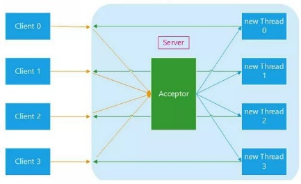

## 非阻塞 IO(NIO)

### 基于BIO 的各种弊端，在JDK1.4 开始出现了高性能IO 设计模式非阻塞IO（NIO）。

-   NIO 采用非阻塞模式，基于Reactor 模式的工作方式，I/O 调用不会被阻塞，它的实现过程是：会先对每个客户端注册感兴趣的事件，然后有一个线程专门去轮询每个客户端是否有事件发生，当有事件发生时，便顺序处理每个事件，当所有事件处理完之后，便再转去继续轮询。如下图所示：

    •

    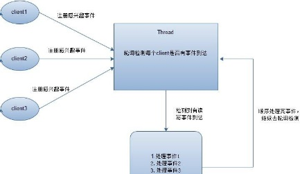

-   NIO 中实现非阻塞I/O 的核心对象就是Selector，Selector 就是注册各种I/O 事件地方，而且当我们感兴趣的事件发生时，就是这个对象告诉我们所发生的事件， 如下图所示：

    •

    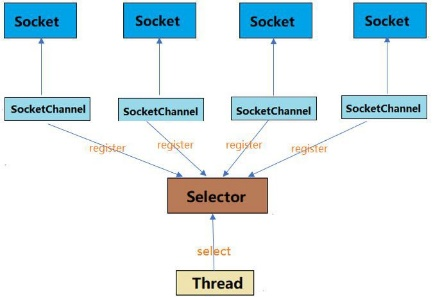

-   NIO 的最重要的地方是当一个连接创建后，不需要对应一个线程，这个连接会被注册到多路复用器上面，一个选择器线程可以同时处理成千上万个连接，系统不必创建大量的线程，也不必维护这些线程，从而大大减小了系统的开销。

    •

    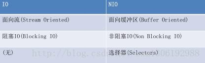

## 异步非阻塞 IO(AIO)

### AIO 也就是 NIO 2，在 Java 7 中引入了 NIO 的改进版 NIO 2,它是异步非阻塞的IO 模型。异步 IO 是基于事件和回调机制实现的，也就是说AIO 模式不需要selector 操作，而是是事件驱动形式，也就是当客户端发送数据之后，会主动通知服务器，接着服务器再进行读写操作。

### Java 的AIO API 其实就是Proactor 模式的应用，和Reactor 模式类似。Reactor 和Proactor 模式的主要区别就是真正的读取和写入操作是有谁来完成的， Reactor 中需要应用程序自己读取或者写入数据，而Proactor 模式中，应用程序不需要进行实际的读写过程，它只需要从缓存区读取或者写入即可，操作系统会读取缓存区或者写入缓存区到真正的IO 设备。

## NIO 概述

### Java NIO 由以下几个核心部分组成：

-   Channels
-   Buffers
-   Selectors

### 虽然Java NIO 中除此之外还有很多类和组件，但Channel，Buffer 和 Selector 构成了核心的API。其它组件，如Pipe 和FileLock，只不过是与三个核心组件共同使用的工具类。

## Channel

### 首先说一下Channel，可以翻译成“通道”。Channel 和IO 中的Stream(流)是差不多一个等级的。只不过Stream 是单向的，譬如：InputStream, OutputStream.而Channel 是双向的，既可以用来进行读操作，又可以用来进行写操作。

### NIO 中的Channel 的主要实现有：FileChannel、DatagramChannel、SocketChannel 和ServerSocketChannel，这里看名字就可以猜出个所以然来：分别可以对应文件IO、UDP 和TCP（Server 和Client）。

## Buffer

### NIO 中的关键Buffer 实现有：ByteBuffer, CharBuffer, DoubleBuffer, FloatBuffer, IntBuffer, LongBuffer, ShortBuffer，分别对应基本数据类型: byte, char, double, float, int, long, short。

## Selector

### Selector 运行单线程处理多个Channel，如果你的应用打开了多个通道，但每个连接的流量都很低，使用Selector 就会很方便。例如在一个聊天服务器中。要使用Selector, 得向Selector 注册Channel，然后调用它的select()方法。这个方法会一直阻塞到某个注册的通道有事件就绪。一旦这个方法返回，线程就可以处理这些事件， 事件的例子有如新的连接进来、数据接收等。

## Channel Buffer Selector 三者关系

### 一个Channel 就像一个流，只是Channel 是双向的，Channel 读数据到Buffer， Buffer 写数据到Channel。

-   

    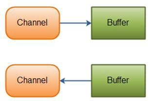

### 一个selector 允许一个线程处理多个channel。

-   

    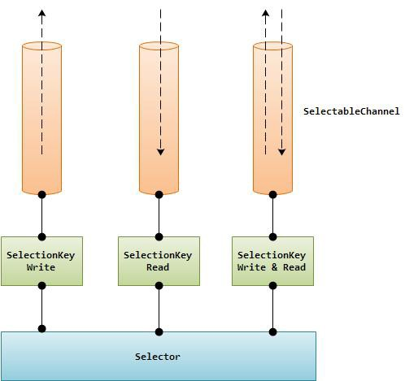

# 第 2 章 Java NIO（Channel）

## Channel 概述

### Java NIO 的通道类似流，但又有些不同：

-   既可以从通道中读取数据，又可以写数据到通道。但流的读写通常是单向的。
-   通道可以异步地读写。
-   通道中的数据总是要先读到一个Buffer，或者总是要从一个Buffer 中写入。

### 正如上面所说，从通道读取数据到缓冲区，从缓冲区写入数据到通道。如下图所示：

-   

    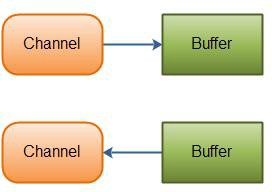

## Channel 实现

### 下面是Java NIO 中最重要的Channel 的实现：

-   FileChannel 从文件中读写数据。
-   DatagramChannel 能通过UDP 读写网络中的数据。
-   SocketChannel 能通过TCP 读写网络中的数据。
-   ServerSocketChannel 可以监听新进来的TCP 连接，像Web 服务器那样。对每一个新进来的连接都会创建一个SocketChannel。

### 正如你所看到的，这些通道涵盖了UDP 和 TCP 网络IO，以及文件IO

## FileChannel 介绍和示例

### FileChannel 类可以实现常用的read，write 以及scatter/gather 操作，同时它也提供了很多专用于文件的新方法。这些方法中的许多都是我们所熟悉的文件操作。

-   

    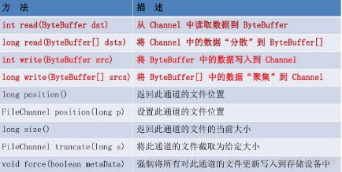

### 下面是一个使用 FileChannel 读取数据到Buffer 中的示例：

-   Buffer 通常的操作

    • 将数据写入缓冲区调用 buffer.flip() 反转读写模式从缓冲区读取数据调用 buffer.clear() 或 buffer.compact() 清除缓冲区内容

-   

    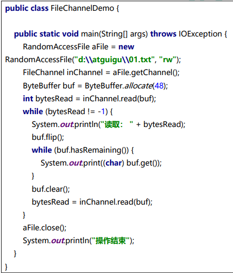

## FileChannel 操作详解

### 打开 FileChannel

-   在使用FileChannel 之前，必须先打开它。但是，我们无法直接打开一个FileChannel，需要通过使用一个InputStream、OutputStream 或RandomAccessFile 来获取一个FileChannel 实例。
-   下面是通过RandomAccessFile 打开FileChannel 的示例：

    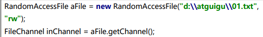

### 从 FileChannel 读取数据

-   调用多个read()方法之一从FileChannel 中读取数据。如：

    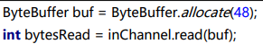

-   首先，分配一个Buffer。从FileChannel 中读取的数据将被读到Buffer 中。然后，调用FileChannel.read()方法。该方法将数据从FileChannel 读取到Buffer 中。read() 方法返回的int 值表示了有多少字节被读到了Buffer 中。如果返回-1，表示到了文件末尾。

### 向 FileChannel 写数据

-   使用FileChannel.write()方法向FileChannel 写数据，该方法的参数是一个Buffer。如：

    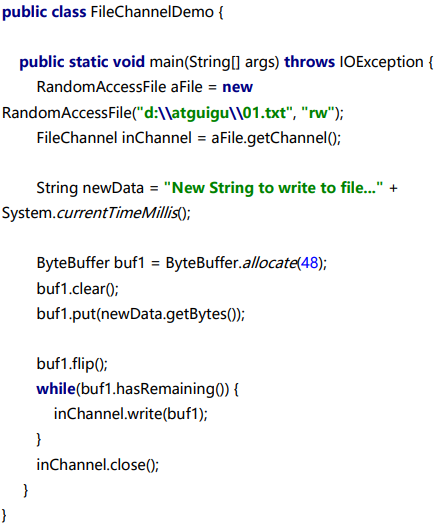

-   注意FileChannel.write()是在while 循环中调用的。因为无法保证write()方法一次能向FileChannel 写入多少字节，因此需要重复调用write()方法，直到Buffer 中已经没有尚未写入通道的字节。

### 关闭 FileChannel

-   用完FileChannel 后必须将其关闭。如：inChannel.close();

### FileChannel 的 position 方法

-   有时可能需要在FileChannel 的某个特定位置进行数据的读/写操作。可以通过调用position()方法获取FileChannel 的当前位置。也可以通过调用position(long pos)方法设置FileChannel 的当前位置。
-   这里有两个例子:long pos = channel.position(); channel.position(pos +123);
-   如果将位置设置在文件结束符之后，然后试图从文件通道中读取数据，读方法将返回- 1 （文件结束标志）。
-   如果将位置设置在文件结束符之后，然后向通道中写数据，文件将撑大到当前位置并写入数据。这可能导致“文件空洞”，磁盘上物理文件中写入的数据间有空隙。

### FileChannel 的 size 方法

-   FileChannel 实例的size()方法将返回该实例所关联文件的大小。如: long fileSize = channel.size();

### FileChannel 的 truncate 方法

-   可以使用FileChannel.truncate()方法截取一个文件。截取文件时，文件将中指定长度后面的部分将被删除。如：channel.truncate(1024);这个例子截取文件的前 1024 个字节。

### FileChannel 的 force 方法

-   FileChannel.force()方法将通道里尚未写入磁盘的数据强制写到磁盘上。出于性能方面的考虑，操作系统会将数据缓存在内存中，所以无法保证写入到FileChannel 里的数据一定会即时写到磁盘上。要保证这一点，需要调用force()方法。
-   force()方法有一个boolean 类型的参数，指明是否同时将文件元数据（权限信息等） 写到磁盘上。

### FileChannel 的 transferTo 和 transferFrom 方法

-   通道之间的数据传输：如果两个通道中有一个是FileChannel，那你可以直接将数据从一个channel 传输到另外一个channel。
-   transferFrom()方法

    • FileChannel 的transferFrom()方法可以将数据从源通道传输到FileChannel 中（译者注：这个方法在JDK 文档中的解释为将字节从给定的可读取字节通道传输到此通道的文件中）。下面是一个FileChannel 完成文件间的复制的例子：

    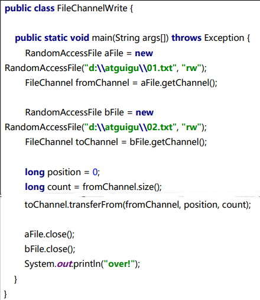

    • 方法的输入参数position 表示从position 处开始向目标文件写入数据，count 表示最多传输的字节数。如果源通道的剩余空间小于 count 个字节，则所传输的字节数要小于请求的字节数。此外要注意，在SoketChannel 的实现中，SocketChannel 只会传输此刻准备好的数据（可能不足count 字节）。因此，SocketChannel 可能不会将请求的所有数据(count 个字节)全部传输到FileChannel 中。

-   transferTo()方法

    • transferTo()方法将数据从FileChannel 传输到其他的channel 中。下面是一个transferTo()方法的例子：

    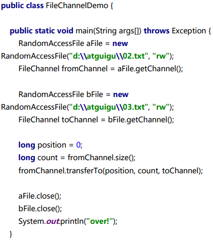

## Scatter/Gather

### Java NIO 开始支持scatter/gather，scatter/gather 用于描述从Channel 中读取或者写入到Channel 的操作。

### 分散（scatter）从Channel 中读取是指在读操作时将读取的数据写入多个buffer 中。因此，Channel 将从Channel 中读取的数据“分散（scatter）”到多个Buffer 中。

### 聚集（gather）写入Channel 是指在写操作时将多个buffer 的数据写入同一个Channel，因此，Channel 将多个Buffer 中的数据“聚集（gather）”后发送到Channel。

### scatter / gather 经常用于需要将传输的数据分开处理的场合，例如传输一个由消息头和消息体组成的消息，你可能会将消息体和消息头分散到不同的buffer 中，这样你可以方便的处理消息头和消息体。

### Scattering Reads

-   Scattering Reads 是指数据从一个channel 读取到多个buffer 中。如下图描述：

    

-   ByteBuffer header = ByteBuffer.allocate(128); ByteBuffer body = ByteBuffer.allocate(1024);ByteBuffer[] bufferArray = { header, body }; channel.read(bufferArray);

    • 注意buffer 首先被插入到数组，然后再将数组作为channel.read() 的输入参数。read()方法按照buffer 在数组中的顺序将从channel 中读取的数据写入到buffer，当一个buffer 被写满后，channel 紧接着向另一个buffer 中写。

    • Scattering Reads 在移动下一个buffer 前，必须填满当前的buffer，这也意味着它不适用于动态消息(译者注：消息大小不固定)。换句话说，如果存在消息头和消息体， 消息头必须完成填充（例如 128byte），Scattering Reads 才能正常工作。

### Gathering Writes

-   Gathering Writes 是指数据从多个buffer 写入到同一个channel。如下图描述：

    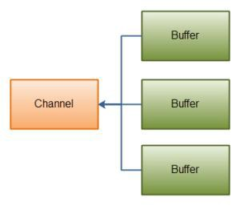

-   

    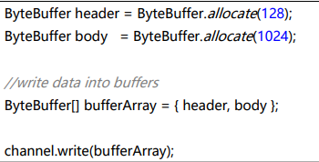

-   buffers 数组是write()方法的入参，write()方法会按照buffer 在数组中的顺序，将数据写入到channel，注意只有position 和limit 之间的数据才会被写入。因此，如果一个buffer 的容量为 128byte，但是仅仅包含 58byte 的数据，那么这 58byte 的数据将被写入到channel 中。因此与Scattering Reads 相反，Gathering Writes 能较好的处理动态消息。

# 第 3 章Java NIO（SocketChannel）

## 概述

### SocketChannel 就是NIO 对于非阻塞socket 操作的支持的组件，其在socket 上封装了一层，主要是支持了非阻塞的读写。同时改进了传统的单向流API,，Channel 同时支持读写。

### socket 通道类主要分为DatagramChannel、SocketChannel 和ServerSocketChannel，它们在被实例化时都会创建一个对等socket 对象。要把一个socket 通道置于非阻塞模式，我们要依靠所有socket 通道类的公有超级类： SelectableChannel。就绪选择（readiness selection）是一种可以用来查询通道的机制，该查询可以判断通道是否准备好执行一个目标操作，如读或写。非阻塞I/O 和可选择性是紧密相连的，那也正是管理阻塞模式的API 代码要在SelectableChannel 超级类中定义的原因。

### 设 置 或 重 新 设 置 一 个 通 道 的 阻 塞 模 式 是 很 简 单 的 ， 只 要 调 用 configureBlocking( )方法即可，传递参数值为true 则设为阻塞模式，参数值为false 值设为非阻塞模式。可以通过调用isBlocking( )方法来判断某个socket 通道当前处于哪种模式。

### AbstractSelectableChannel.java 中实现的configureBlocking()方法如下：

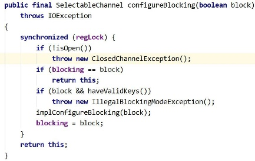

## ServerSocketChannel

### ServerSocketChannel 是一个基于通道的socket 监听器。它同我们所熟悉的java.net.ServerSocket 执行相同的任务，不过它增加了通道语义，因此能够在非阻塞模式下运行。

### 由于ServerSocketChannel 没有bind()方法，因此有必要取出对等的socket 并使用它来绑定到一个端口以开始监听连接。我们也是使用对等ServerSocket 的API 来根据需要设置其他的socket 选项。

### 同java.net.ServerSocket 一样，ServerSocketChannel 也有accept( )方法。ServerSocketChannel 的accept()方法会返回SocketChannel 类型对象， SocketChannel 可以在非阻塞模式下运行。

### 以下代码演示了如何使用一个非阻塞的accept( )方法：

-   

    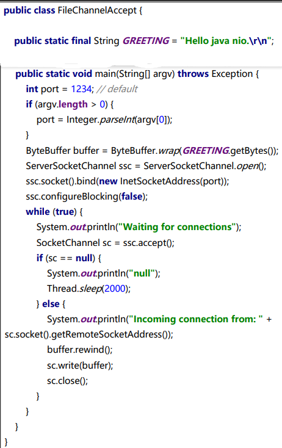

    •

    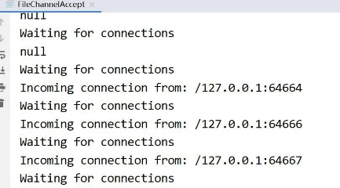

-   打开 ServerSocketChannel

    • 通过调用 ServerSocketChannel.open() 方法来打开ServerSocketChannel.ServerSocketChannel serverSocketChannel = ServerSocketChannel.open();

-   关闭 ServerSocketChannel

    • 通过调用ServerSocketChannel.close() 方法来关闭ServerSocketChannel. serverSocketChannel.close();

-   监听新的连接

    • 通过 ServerSocketChannel.accept() 方法监听新进的连接。当 accept()方法返回时候,它返回一个包含新进来的连接的 SocketChannel。因此, accept()方法会一直阻塞到有新连接到达。

    • 通常不会仅仅只监听一个连接,在while 循环中调用 accept()方法. 如下面的例子：

    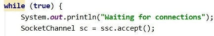

-   阻塞模式

    • 会在SocketChannel sc = ssc.accept();这里阻塞住进程。

    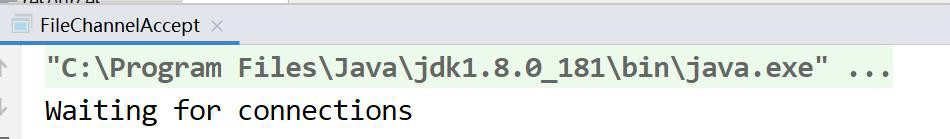

-   非阻塞模式

    • ServerSocketChannel 可以设置成非阻塞模式。在非阻塞模式下，accept() 方法会立刻返回，如果还没有新进来的连接,返回的将是null。 因此，需要检查返回的SocketChannel 是否是null.如：

    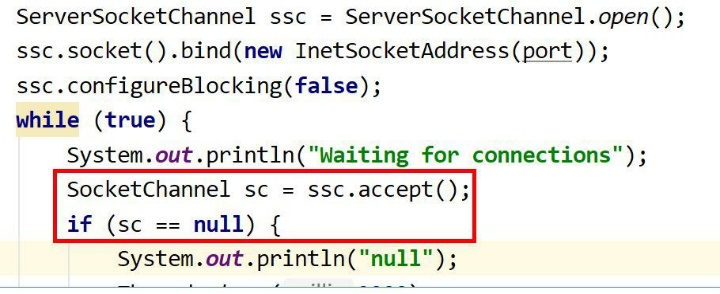

## SocketChannel

### SocketChannel 介绍

-   Java NIO 中的SocketChannel 是一个连接到TCP 网络套接字的通道。A selectable channel for stream-oriented connecting sockets.

### 以上是Java docs 中对于SocketChannel 的描述：SocketChannel 是一种面向流连接sockets 套接字的可选择通道。从这里可以看出：

-   SocketChannel 是用来连接 Socket 套接字
-   SocketChannel 主要用途用来处理网络 I/O 的通道
-   SocketChannel 是基于 TCP 连接传输
-   SocketChannel 实现了可选择通道，可以被多路复用的

## 、SocketChannel 特征：

### SocketChannel 支持两种 I/O 模式：阻塞式和非阻塞式

### SocketChannel 支持异步关闭。如果SocketChannel 在一个线程上 read 阻塞，另一个线程对该 SocketChannel 调用 shutdownInput，则读阻塞的线程将返回-1 表示没有读取任何数据；如果SocketChannel 在一个线程上 write 阻塞，另一个线程对该SocketChannel 调用 shutdownWrite，则写阻塞的线程将抛出AsynchronousCloseException

### SocketChannel 支持设定参数SO_SNDBUF 套接字发送缓冲区大小SO_RCVBUF 套接字接收缓冲区大小SO_KEEPALIVE保活连接O_REUSEADDR复用地址SO_LINGER有数据传输时延缓关闭Channel (只有在非阻塞模式下有用) TCP_NODELAY禁用Nagle 算法

### 对于已经存在的 socket 不能创建 SocketChannel

### SocketChannel 中提供的 open 接口创建的 Channel 并没有进行网络级联，需要使用connect 接口连接到指定地址

### 未进行连接的SocketChannle 执行 I/O 操作时，会抛出NotYetConnectedException

## 、SocketChannel 的使用

### 创建 SocketChannel

-   方式一：SocketChannel socketChannel = SocketChannel.open(new InetSocketAddress("www.baidu.com", 80));
-   方式二：SocketChannel socketChanne2 = SocketChannel.open(); socketChanne2.connect(new InetSocketAddress("www.baidu.com", 80));
-   直接使用有参 open api 或者使用无参 open api，但是在无参 open 只是创建了一个SocketChannel 对象，并没有进行实质的 tcp 连接。

### 连接校验

-   socketChannel.isOpen();// 测试 SocketChannel是否为 open状态 socketChannel.isConnected();//测试SocketChannel是否已经被连接socketChannel.isConnectionPending();//测试SocketChannel是否正在进行连接socketChannel.finishConnect();//校验正在进行套接字连接的SocketChannel是否已经完成连接

### 读写模式

-   前面提到 SocketChannel 支持阻塞和非阻塞两种模式：socketChannel.configureBlocking(false);通过以上方法设置 SocketChannel 的读写模式。false 表示非阻塞，true 表示阻塞。

### 读写

-   SocketChannel socketChannel = SocketChannel.open(new InetSocketAddress("www.baidu.com", 80)); ByteBuffer byteBuffer = ByteBuffer.allocate(16); socketChannel.read(byteBuffer); socketChannel.close();System.out.println("read over");
-   以上为阻塞式读，当执行到 read 出，线程将阻塞，控制台将无法打印 read over
-   SocketChannel socketChannel = SocketChannel.open(new InetSocketAddress("www.baidu.com", 80)); socketChannel.configureBlocking(false);ByteBuffer byteBuffer = ByteBuffer.allocate(16); socketChannel.read(byteBuffer); socketChannel.close();System.out.println("read over");
-   以上为非阻塞读，控制台将打印 read over,读写都是面向缓冲区，这个读写方式与前文中的FileChannel 相同。

### 设置和获取参数

-   socketChannel.setOption(StandardSocketOptions.SO_KEEPALIVE, Boolean.TRUE).setOption(StandardSocketOptions.TCP_NODELAY, Boolean.TRUE);
-   通过setOptions 方法可以设置socket 套接字的相关参数
-   socketChannel.getOption(StandardSocketOptions.SO_KEEPALIVE); socketChannel.getOption(StandardSocketOptions.SO_RCVBUF);
-   可以通过getOption 获取相关参数的值。如默认的接收缓冲区大小是 8192byte。SocketChannel 还支持多路复用，但是多路复用在后续内容中会介绍到。

## DatagramChannel

### 概述

-   正如SocketChannel 对应Socket，ServerSocketChannel 对应ServerSocket，每一个DatagramChannel 对象也有一个关联的DatagramSocket 对象。正如SocketChannel 模拟连接导向的流协议（如TCP/IP），DatagramChannel 则模拟包导向的无连接协议（如UDP/IP）。DatagramChannel 是无连接的，每个数据报
-   （datagram）都是一个自包含的实体，拥有它自己的目的地址及不依赖其他数据报的数据负载。与面向流的的socket 不同，DatagramChannel 可以发送单独的数据报给不同的目的地址。同样，DatagramChannel 对象也可以接收来自任意地址的数据包。每个到达的数据报都含有关于它来自何处的信息（源地址）

### 1、打开 DatagramChannel

-   DatagramChannel server = DatagramChannel.open(); server.socket().bind(new InetSocketAddress(10086)); 此例子是打开 10086 端口接收UDP 数据包

### 2、接收数据

-   ByteBuffer receiveBuffer = ByteBuffer.allocate(64); SocketAddress receiveAddr = server.receive(receiveBuffer); receiveBuffer.clear();
-   通过receive()接收UDP 包。SocketAddress 可以获得发包的ip、端口等信息，用toString 查看，格式如下：/127.0.0.1:57126

### 3、发送数据

-   通过send()发送UDP 包
-   DatagramChannel server = DatagramChannel.open();ByteBuffer sendBuffer = ByteBuffer.wrap("client send".getBytes()); server.send(sendBuffer, new InetSocketAddress("127.0.0.1",10086));

### 4、连接

-   UDP 不存在真正意义上的连接，这里的连接是向特定服务地址用read 和write 接收发送数据包。
-   client.connect(new InetSocketAddress("127.0.0.1",10086)); int readSize= client.read(sendBuffer); server.write(sendBuffer);
-   read()和write()只有在connect()后才能使用，不然会抛NotYetConnectedException 异常。用read()接收时，如果没有接收到包，会抛PortUnreachableException 异常。

### 5、DatagramChannel 示例

-   /\*\*\* 发包的 datagram\*\* @throws IOException\* @throws InterruptedException\*/@Testpublic void sendDatagram() throws IOException, InterruptedException {DatagramChannel sendChannel= DatagramChannel.open();InetSocketAddress sendAddress= new InetSocketAddress("127.0.0.1", 9999);while (true) {sendChannel.send(ByteBuffer.wrap("发包".getBytes("UTF-8")), sendAddress);System.out.println("发包端发包");Thread.sleep(1000);}}/\*\*\* 收包端\*\* @throws IOException\*/@Testpublic void receive() throws IOException {DatagramChannel receiveChannel= DatagramChannel.open();InetSocketAddress receiveAddress= new InetSocketAddress(9999);receiveChannel.bind(receiveAddress);ByteBuffer receiveBuffer= ByteBuffer.allocate(512);while (true) {receiveBuffer.clear();SocketAddress sendAddress= receiveChannel.receive(receiveBuffer);receiveBuffer.flip();System.out.print(sendAddress.toString() + " ");System.out.println(Charset.forName("UTF-8").decode(receiveBuffer));}}/\*\*\* 只接收和发送 9999 的数据包\*\* @throws IOException\*/@Testpublic void testConect1() throws IOException {DatagramChannel connChannel= DatagramChannel.open();connChannel.bind(new InetSocketAddress(9998));connChannel.connect(new InetSocketAddress("127.0.0.1",9999));connChannel.write(ByteBuffer.wrap("发包".getBytes("UTF-8")));ByteBuffer readBuffer= ByteBuffer.allocate(512);while (true) {try {readBuffer.clear();connChannel.read(readBuffer);readBuffer.flip();System.out.println(Charset.forName("UTF-8").decode(readBuffer));}catch(Exception e) {}}}

# 第 4 章 Java NIO（Buffer）

## Buffer 简介

### Java NIO 中的Buffer 用于和NIO 通道进行交互。数据是从通道读入缓冲区，从缓冲区写入到通道中的。

### 

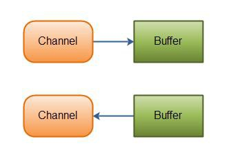

### 缓冲区本质上是一块可以写入数据，然后可以从中读取数据的内存。这块内存被包装成NIO Buffer 对象，并提供了一组方法，用来方便的访问该块内存。缓冲区实际上是一个容器对象，更直接的说，其实就是一个数组，在NIO 库中，所有数据都是用缓冲区处理的。在读取数据时，它是直接读到缓冲区中的； 在写入数据时，它也是写入到缓冲区中的；任何时候访问 NIO 中的数据，都是将它放到缓冲区中。而在面向流I/O 系统中，所有数据都是直接写入或者直接将数据读取到Stream 对象中。

### 在NIO 中，所有的缓冲区类型都继承于抽象类Buffer，最常用的就是ByteBuffer， 对于Java 中的基本类型，基本都有一个具体Buffer 类型与之相对应，它们之间的继承关系如下图所示：

### 

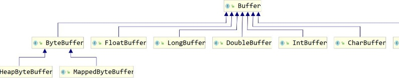

## Buffer 的基本用法

### 1、使用 Buffer 读写数据，一般遵循以下四个步骤：

-   写入数据到Buffer
-   调用flip()方法
-   从Buffer 中读取数据
-   调用clear()方法或者compact()方法
-   当向buffer 写入数据时，buffer 会记录下写了多少数据。一旦要读取数据，需要通过flip()方法将Buffer 从写模式切换到读模式。在读模式下，可以读取之前写入到buffer 的所有数据。一旦读完了所有的数据，就需要清空缓冲区，让它可以再次被写入。有两种方式能清空缓冲区：调用clear()或compact()方法。clear()方法会清空整个缓冲区。compact()方法只会清除已经读过的数据。任何未读的数据都被移到缓冲区的起 始处，新写入的数据将放到缓冲区未读数据的后面。

### 2、使用Buffer 的例子

-   @Testpublic void testConect2() throws IOException {RandomAccessFile aFile = new RandomAccessFile("d:\\\\atguigu/01.txt", "rw");FileChannel inChannel = aFile.getChannel();//create buffer with capacity of 48 bytesByteBuffer buf = ByteBuffer.allocate(48);int bytesRead = inChannel.read(buf); //read into buffer. while (bytesRead != -1) {buf.flip(); //make buffer ready for readwhile(buf.hasRemaining()){System.out.print((char) buf.get()); // read 1 byte at a time}buf.clear(); //make buffer ready for writingbytesRead = inChannel.read(buf);}aFile.close();}

### 3、使用 IntBuffer 的例

-   @Testpublic void testConect3() throws IOException {// 分配新的 int 缓冲区，参数为缓冲区容量// 新缓冲区的当前位置将为零，其界限(限制位置)将为其容量。// 它将具有一个底层实现数组，其数组偏移量将为零。IntBuffer buffer = IntBuffer.allocate(8);for (int i = 0; i \< buffer.capacity(); ++i) {int j = 2 \* (i + 1);// 将给定整数写入此缓冲区的当前位置，当前位置递增buffer.put(j);}// 重设此缓冲区，将限制设置为当前位置，然后将当前位置设置为 0buffer.flip();// 查看在当前位置和限制位置之间是否有元素while (buffer.hasRemaining()) {// 读取此缓冲区当前位置的整数，然后当前位置递增int j = buffer.get();System.out.print(j + " ");}}

## Buffer 的 capacity、position 和 limit

### 为了理解Buffer 的工作原理，需要熟悉它的三个属性：

-   Capacity
-   Position
-   limit

### position 和limit 的含义取决于Buffer 处在读模式还是写模式。不管Buffer 处在什么模式，capacity 的含义总是一样的。

### 这里有一个关于capacity，position 和limit 在读写模式中的说明

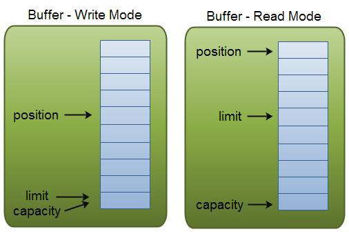

### capacity

-   作为一个内存块，Buffer 有一个固定的大小值，也叫“capacity”.你只能往里写capacity 个byte、long，char 等类型。一旦Buffer 满了，需要将其清空（通过读数据或者清除数据）才能继续写数据往里写数据。

### position

-   写数据到Buffer 中时，position 表示写入数据的当前位置，position 的初始值为0。当一个byte、long 等数据写到Buffer 后， position 会向下移动到下一个可插入数据的Buffer 单元。position 最大可为capacity – 1（因为position 的初始值为 0）.
-   读数据到Buffer 中时，position 表示读入数据的当前位置，如position=2 时表 示已开始读入了 3 个byte，或从第 3 个byte 开始读取。通过ByteBuffer.flip()切换到读模式时position 会被重置为 0，当Buffer 从position 读入数据后，position 会下移到下一个可读入的数据Buffer 单元。

### limit

-   写数据时，limit 表示可对Buffer 最多写入多少个数据。写模式下，limit 等于Buffer 的capacity。
-   读数据时，limit 表示Buffer 里有多少可读数据（not null 的数据），因此能读到之前写入的所有数据（limit 被设置成已写数据的数量，这个值在写模式下就是position）。

## Buffer 的类型

### Java NIO 有以下Buffer 类型

-   ByteBuffer
-   MappedByteBuffer
-   CharBuffer
-   DoubleBuffer
-   FloatBuffer
-   IntBuffer
-   LongBuffer
-   ShortBuffer

### 这些Buffer 类型代表了不同的数据类型。换句话说，就是可以通过char，short，int， long，float 或 double 类型来操作缓冲区中的字节。

## Buffer 分配和写数据

### 1、Buffer 分配

-   要想获得一个Buffer 对象首先要进行分配。 每一个Buffer 类都有一个allocate 方法。下面是一个分配 48 字节capacity 的ByteBuffer 的例子。ByteBuffer buf = ByteBuffer.allocate(48);这是分配一个可存储 1024 个字符的CharBuffer：CharBuffer buf = CharBuffer.allocate(1024);

### 2、向 Buffer 中写数据

-   从Channel 写到Buffer。

    • int bytesRead = inChannel.read(buf); //read into buffer.

-   通过Buffer 的put()方法写到Buffer 里。

    • buf.put(127);put 方法有很多版本，允许你以不同的方式把数据写入到Buffer 中。例如， 写到一个指定的位置，或者把一个字节数组写入到Buffer

### 3、flip()方法

-   flip 方法将Buffer 从写模式切换到读模式。调用flip()方法会将position 设回 0，并将limit 设置成之前position 的值。换句话说，position 现在用于标记读的位置， limit 表示之前写进了多少个byte、char 等 （现在能读取多少个byte、char 等）。

## 从 Buffer 中读取数据

### 从Buffer 中读取数据有两种方式：

-   从Buffer 读取数据到Channel。
-   使用get()方法从Buffer 中读取数据。

### 从Buffer 读取数据到Channel 的例子：

-   //read from buffer into channel.
-   int bytesWritten = inChannel.write(buf);

### 使用get()方法从Buffer 中读取数据的例子

-   byte aByte = buf.get();
-   get 方法有很多版本，允许你以不同的方式从Buffer 中读取数据。例如，从指定position 读取，或者从Buffer 中读取数据到字节数组。

## Buffer 几个方法

### 1、rewind()方法

-   Buffer.rewind()将position 设回 0，所以你可以重读Buffer 中的所有数据。limit 保持不变，仍然表示能从Buffer 中读取多少个元素（byte、char 等）。

### 2、clear()与 compact()方法

-   一旦读完Buffer 中的数据，需要让Buffer 准备好再次被写入。可以通过clear()或compact()方法来完成。
-   如果调用的是clear()方法，position 将被设回 0，limit 被设置成 capacity 的值。换句话说，Buffer 被清空了。Buffer 中的数据并未清除，只是这些标记告诉我们可以从哪里开始往Buffer 里写数据。
-   如果Buffer 中有一些未读的数据，调用clear()方法，数据将“被遗忘”，意味着不再有任何标记会告诉你哪些数据被读过，哪些还没有。
-   如果Buffer 中仍有未读的数据，且后续还需要这些数据，但是此时想要先先写些数据， 那么使用compact()方法。
-   compact()方法将所有未读的数据拷贝到Buffer 起始处。然后将position 设到最后一个未读元素正后面。limit 属性依然像clear()方法一样，设置成capacity。现在Buffer 准备好写数据了，但是不会覆盖未读的数据。

### 3、mark()与 reset()方法

-   通过调用Buffer.mark()方法，可以标记Buffer 中的一个特定position。之后可以通过调用Buffer.reset()方法恢复到这个position。例如：
-   buffer.mark();//call buffer.get() a couple of times, e.g. during parsing. buffer.reset(); //set position back to mark.

## 缓冲区操作

### 1、缓冲区分片

-   在NIO 中，除了可以分配或者包装一个缓冲区对象外，还可以根据现有的缓冲区对象来创建一个子缓冲区，即在现有缓冲区上切出一片来作为一个新的缓冲区，但现有的缓冲区与创建的子缓冲区在底层数组层面上是数据共享的，也就是说，子缓冲区相当于是现有缓冲区的一个视图窗口。调用slice()方法可以创建一个子缓冲区。
-   @Testpublic void testConect3() throws IOException {ByteBuffer buffer = ByteBuffer.allocate(10);// 缓冲区中的数据 0-9for (int i = 0; i \< buffer.capacity(); ++i) {buffer.put((byte) i);}// 创建子缓冲区buffer.position(3);buffer.limit(7);ByteBuffer slice = buffer.slice();// 改变子缓冲区的内容for (int i = 0; i \< slice.capacity(); ++i) {byte b = slice.get(i);b \*= 10;slice.put(i, b)}buffer.position(0);buffer.limit(buffer.capacity());while (buffer.remaining() \> 0) {System.out.println(buffer.get());}}

### 2、只读缓冲区

-   只读缓冲区非常简单，可以读取它们，但是不能向它们写入数据。可以通过调用缓冲区的asReadOnlyBuffer()方法，将任何常规缓冲区转 换为只读缓冲区，这个方法返回一个与原缓冲区完全相同的缓冲区，并与原缓冲区共享数据，只不过它是只读的。如果原缓冲区的内容发生了变化，只读缓冲区的内容也随之发生变化：
-   @Testpublic void testConect4() throws IOException {ByteBuffer buffer = ByteBuffer.allocate(10);// 缓冲区中的数据 0-9for (int i = 0; i \< buffer.capacity(); ++i) {buffer.put((byte) i);}// 创建只读缓冲区ByteBuffer readonly = buffer.asReadOnlyBuffer();// 改变原缓冲区的内容for (int i = 0; i \< buffer.capacity(); ++i) {byte b = buffer.get(i);b \*= 10;buffer.put(i, b);}readonly.position(0);readonly.limit(buffer.capacity());// 只读缓冲区的内容也随之改变while (readonly.remaining() \> 0) {System.out.println(readonly.get());}}
-   如果尝试修改只读缓冲区的内容，则会报ReadOnlyBufferException 异常。只读缓冲区对于保护数据很有用。在将缓冲区传递给某个 对象的方法时，无法知道这个方法是否会修改缓冲区中的数据。创建一个只读的缓冲区可以保证该缓冲区不会被修改。只可以把常规缓冲区转换为只读缓冲区，而不能将只读的缓冲区转换为可写的缓冲区。

### 3、直接缓冲区

-   直接缓冲区是为加快I/O 速度，使用一种特殊方式为其分配内存的缓冲区，JDK 文档中的描述为：给定一个直接字节缓冲区，Java 虚拟机将尽最大努力直接对它执行本机I/O 操作。也就是说，它会在每一次调用底层操作系统的本机I/O 操作之前(或之后)， 尝试避免将缓冲区的内容拷贝到一个中间缓冲区中 或者从一个中间缓冲区中拷贝数据。要分配直接缓冲区，需要调用allocateDirect()方法，而不是allocate()方法，使用方 式与普通缓冲区并无区别。
-   @Testpublic void testConect5() throws IOException {String infile = "d:\\\\atguigu\\\\01.txt";FileInputStream fin = new FileInputStream(infile);FileChannel fcin = fin.getChannel();String outfile = String.format("d:\\\\atguigu\\\\02.txt");FileOutputStream fout = new FileOutputStream(outfile);FileChannel fcout = fout.getChannel();// 使用 allocateDirect，而不是 allocateByteBuffer buffer = ByteBuffer.allocateDirect(1024);while (true) {buffer.clear();int r = fcin.read(buffer);if (r == -1) {break;}buffer.flip();fcout.write(buffer);}}

### 4、内存映射文件 I/O

-   内存映射文件I/O 是一种读和写文件数据的方法，它可以比常规的基于流或者基于通道的I/O 快的多。内存映射文件I/O 是通过使文件中的数据出现为 内存数组的内容来完成的，这其初听起来似乎不过就是将整个文件读到内存中，但是事实上并不是这样。一般来说，只有文件中实际读取或者写入的部分才会映射到内存中。
-   static private final int start = 0;static private final int size = 1024;static public void main(String args[]) throws Exception {RandomAccessFile raf = new RandomAccessFile("d:\\\\atguigu\\\\01.txt", "rw");FileChannel fc = raf.getChannel();MappedByteBuffer mbb = fc.map(FileChannel.MapMode.READ_WRITE, start, size);mbb.put(0, (byte) 97);mbb.put(1023, (byte) 122);raf.close();}

# 第 5 章 Java NIO（Selector）

## Selector 简介

### Selector 和 Channel 关系Selector 一般称 为选择器 ，也可以翻译为 多路复用器 。它是Java NIO 核心组件中的一个，用于检查一个或多个NIO Channel（通道）的状态是否处于可读、可写。如此可以实现单线程管理多个channels,也就是可以管理多个网络链接。使用Selector 的好处在于： 使用更少的线程来就可以来处理通道了， 相比使用多个线程，避免了线程上下文切换带来的开销。

### 

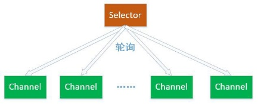

## 2、可选择通道(SelectableChannel)

### 不是所有的Channel 都可以被Selector 复用的。比方说，FileChannel 就不能被选择器复用。判断一个Channel 能被Selector 复用，有一个前提：判断他是否继承了一个抽象类SelectableChannel。如果继承了SelectableChannel，则可以被复用，否则不能。

### SelectableChannel 类提供了实现通道的可选择性所需要的公共方法。它是所有支持就绪检查的通道类的父类。所有socket 通道，都继承了SelectableChannel 类都是可选择的，包括从管道(Pipe)对象的中获得的通道。而FileChannel 类，没有继承SelectableChannel，因此是不是可选通道。

### 一个通道可以被注册到多个选择器上，但对每个选择器而言只能被注册一次。通道和选择器之间的关系，使用注册的方式完成。SelectableChannel 可以被注册到Selector 对象上，在注册的时候，需要指定通道的哪些操作，是Selector 感兴趣的。

### 

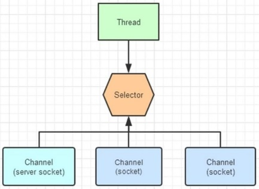

## 3、Channel 注册到 Selector

### 使用Channel.register（Selector sel，int ops）方法，将一个通道注册到一个选择器时。第一个参数，指定通道要注册的选择器。第二个参数指定选择器需要查询的通道操作。

### 可以供选择器查询的通道操作，从类型来分，包括以下四种：如果Selector 对通道的多操作类型感兴趣，可以用“位或”操作符来实现： 比如：int key = SelectionKey.OP_READ \| SelectionKey.OP_WRITE ;

-   可读 : SelectionKey.OP_READ
-   可写 : SelectionKey.OP_WRITE
-   连接 : SelectionKey.OP_CONNECT
-   接收 : SelectionKey.OP_ACCEPT

### 选择器查询的不是通道的操作，而是通道的某个操作的一种就绪状态。什么是操作的就绪状态？一旦通道具备完成某个操作的条件，表示该通道的某个操作已经就绪， 就可以被Selector 查询到，程序可以对通道进行对应的操作。比方说，某个SocketChannel 通道可以连接到一个服务器，则处于“连接就绪”(OP_CONNECT)。再比方说，一个ServerSocketChannel 服务器通道准备好接收新进入的连接，则处于“接收就绪”（OP_ACCEPT）状态。还比方说，一个有数据可读的通道，可以说是“读就绪”(OP_READ)。一个等待写数据的通道可以说是“写就绪”(OP_WRITE)。

## 4、选择键(SelectionKey)

### Channel 注册到后，并且一旦通道处于某种就绪的状态，就可以被选择器查询到。这个工作，使用选择器Selector 的select（）方法完成。select 方法的作用，对感兴趣的通道操作，进行就绪状态的查询。

### 选择键的概念，和事件的概念比较相似。一个选择键类似监听器模式里边的一个事件。由于Selector 不是事件触发的模式，而是主动去查询的模式，所以不叫事件Event，而是叫SelectionKey 选择键。

### Selector 可以不断的查询Channel 中发生的操作的就绪状态。并且挑选感兴趣的操作就绪状态。一旦通道有操作的就绪状态达成，并且是Selector 感兴趣的操作， 就会被Selector 选中，放入选择键集合中。

### 一个选择键，首先是包含了注册在Selector 的通道操作的类型，比方说SelectionKey.OP_READ。也包含了特定的通道与特定的选择器之间的注册关系。开发应用程序是，选择键是编程的关键。NIO 的编程，就是根据对应的选择键，进行不同的业务逻辑处理。

## Selector 的使用方法

### Selector 的创建

-   通过调用Selector.open()方法创建一个Selector 对象，如下：// 1、获取 Selector 选择器Selector selector = Selector.open(

### 注册 Channel 到 Selector

-   要实现Selector 管理Channel，需要将channel 注册到相应的Selector 上

    • / 1、获取 Selector 选择器Selector selector = Selector.open();// 2、获取通道ServerSocketChannel serverSocketChannel = ServerSocketChannel.open();// 3.设置为非阻塞serverSocketChannel.configureBlocking(false);// 4、绑定连接serverSocketChannel.bind(new InetSocketAddress(9999));// 5、将通道注册到选择器上,并制定监听事件为：“接收”事件serverSocketChannel.register(selector,SelectionKey.OP_ACCEPT);

-   与Selector 一起使用时，Channel 必须处于非阻塞模式下，否则将抛出异常IllegalBlockingModeException。这意味着，FileChannel 不能与Selector 一起使用，因为FileChannel 不能切换到非阻塞模式，而套接字相关的所有的通道都可以。
-   一个通道，并没有一定要支持所有的四种操作。比如服务器通道ServerSocketChannel 支持Accept 接受操作，而SocketChannel 客户端通道则不支持。可以通过通道上的validOps()方法，来获取特定通道下所有支持的操作集合。

### 轮询查询就绪操作

-   通过Selector 的select（）方法，可以查询出已经就绪的通道操作，这些就绪的状态集合，包存在一个元素是SelectionKey 对象的Set 集合中。
-   下面是Selector 几个重载的查询select()方法：

    • select():阻塞到至少有一个通道在你注册的事件上就绪了。

    • select(long timeout)：和select()一样，但最长阻塞事件为timeout 毫秒。

    • selectNow():非阻塞，只要有通道就绪就立刻返回。

-   select()方法返回的int 值，表示有多少通道已经就绪，更准确的说，是自前一次select方法以来到这一次select 方法之间的时间段上，有多少通道变成就绪状态。例如：首次调用select()方法，如果有一个通道变成就绪状态，返回了 1，若再次调用select()方法，如果另一个通道就绪了，它会再次返回 1。如果对第一个就绪的channel 没有做任何操作，现在就有两个就绪的通道，但在每次select()方法调用之间， 只有一个通道就绪了。
-   一旦调用select()方法，并且返回值不为 0 时，在Selector 中有一个selectedKeys()方法，用来访问已选择键集合，迭代集合的每一个选择键元素，根据就绪操作的类型， 完成对应的操作：

    • Set selectedKeys = selector.selectedKeys();Iterator keyIterator = selectedKeys..iterator();while(keyIterator.hasNext()) {SelectionKey key = keyIterator.next();if(key.isAcceptable()) {// a connection was accepted by a ServerSocketChannel. } else if (key.isConnectable()) {// a connection was established with a remote server. } else if (key.isReadable()) {// a channel is ready for reading} else if (key.isWritable()) {// a channel is ready for writing}keyIterator.remove();}

### 停止选择的方法

-   选择器执行选择的过程，系统底层会依次询问每个通道是否已经就绪，这个过程可能会造成调用线程进入阻塞状态,那么我们有以下三种方式可以唤醒在select（）方法中阻塞的线程。
-   wakeup()方法 ：通过调用Selector 对象的wakeup（）方法让处在阻塞状态的select()方法立刻返回该方法使得选择器上的第一个还没有返回的选择操作立即返回。如果当前没有进行中的选择操作，那么下一次对select()方法的一次调用将立即返回。
-   close()方法 ：通过close（）方法关闭Selector，该方法使得任何一个在选择操作中阻塞的线程都被唤醒（类似wakeup（）），同时使得注册到该Selector 的所有Channel 被注销，所有的键将被取消，但是Channel 本身并不会关闭。

## NIO 编程步骤

### 第一步：创建Selector 选择器

### 第二步：创建ServerSocketChannel 通道，并绑定监听端口第三步：设置Channel 通道是非阻塞模式

### 第四步：把Channel 注册到Socketor 选择器上，监听连接事件

### 第五步：调用Selector 的select 方法（循环调用），监测通道的就绪状况第六步：调用selectKeys 方法获取就绪channel 集合

### 第七步：遍历就绪channel 集合，判断就绪事件类型，实现具体的业务操作第八步：根据业务，决定是否需要再次注册监听事件，重复执行第三步操作

## 示例代码

### 1、服务端代码

-   @Testpublic void ServerDemo() {try {ServerSocketChannel ssc = ServerSocketChannelssc.socket().bind(new InetSocketAddress("127.0.0.1", 8000));ssc.configureBlocking(false);Selector selector = Selector.open();// 注册 channel，并且指定感兴趣的事件是 Acceptssc.register(selector, SelectionKey.OP_ACCEPT);ByteBuffer readBuff = ByteBuffer.allocate(1024);ByteBuffer writeBuff = ByteBuffer.allocate(128);writeBuff.put("received".getBytes());writeBuff.flip();while (true) {int nReady = selector.select();Set\<SelectionKey\> keys = selector.selectedKeys();Iterator\<SelectionKey\> it = keys.iterator();while (it.hasNext()) {SelectionKey key = it.next();it.remove();if (key.isAcceptable()) {// 创建新的连接，并且把连接注册到 selector 上，而且，// 声明这个 channel 只对读操作感兴趣。SocketChannel socketChannel = ssc.accept();socketChannel.configureBlocking(false);socketChannel.register(selector, SelectionKey.OP_READ);}else if (key.isReadable()) {SocketChannel socketChannel = (SocketChannel) key.channel();readBuff.clear();socketChannel.read(readBuff);readBuff.flip();System.out.println("received : " + new String(readBuff.array()));key.interestOps(SelectionKey.OP_WRITE)；}else if (key.isWritable()) {writeBuff.rewind();SocketChannel socketChannel = (SocketChannel) key.channel();socketChannel.write(writeBuff);key.interestOps(SelectionKey.OP_READ);}}}} catch (IOException e) {e.printStackTrace();}}

### 2、客户端代码

-   @Testpublic void ClientDemo() {try {SocketChannel socketChannel = SocketChannel.open();socketChannel.connect(new InetSocketAddress("127.0.0.1", 8000));ByteBuffer writeBuffer = ByteBuffer.allocate(32);ByteBuffer readBuffer = ByteBuffer.allocate(32);writeBuffer.put("hello".getBytes());writeBuffer.flip();while (true) {writeBuffer.rewind();socketChannel.write(writeBuffer);readBuffer.clear();socketChannel.read(readBuffer);}} catch (IOException e) {}}

# 第 7 章 Java NIO（其他）

## Path

### 1、Path 简介

-   Java Path 接口是Java NIO 更新的一部分，同Java NIO 一起已经包括在Java6 和Java7 中。Java Path 接口是在Java7 中添加到Java NIO 的。Path 接口位于java.nio.file 包中，所以Path 接口的完全限定名称为java.nio.file.Path。
-   Java Path 实例表示文件系统中的路径。一个路径可以指向一个文件或一个目录。路径可以是绝对路径，也可以是相对路径。绝对路径包含从文件系统的根目录到它指向的文件或目录的完整路径。相对路径包含相对于其他路径的文件或目录的路径。
-   在许多方面，java.nio.file.Path 接口类似于java.io.File 类，但是有一些差别。不过， 在许多情况下，可以使用Path 接口来替换File 类的使用。

### 2、创建 Path 实例

-   使用java.nio.file.Path 实例必须创建一个Path 实例。可以使用Paths 类(java.nio.file.Paths)中的静态方法Paths.get()来创建路径实例。
-   import java.nio.file.Path;import java.nio.file.Paths;public class PathDemo {public static void main(String[] args) {Path path = Paths.get("d:\\\\atguigu\\\\001.txt");}}上述代码，可以理解为，Paths.get()方法是 Path 实例的工厂方法

### 3、创建绝对路径

-   创建绝对路径，通过调用Paths.get()方法，给定绝对路径文件作为参数来完成。示例代码：

    • Path path = Paths.get("d:\\\\atguigu\\\\001.txt");上述代码中，绝对路径是d:\\atguigu\\001.txt。在Java 字符串中， \\是一个转义字符， 需要编写\\\\，告诉Java 编译器在字符串中写入一个\\字符。

-   如果在Linux、MacOS 等操作字体上，上面的绝对路径可能如下: Path path = Paths.get("/home/jakobjenkov/myfile.txt");绝对路径现在为/home/jakobjenkov/myfile.txt.
-   如果在Windows 机器上使用了从/开始的路径，那么路径将被解释为相对于当前驱动器。

### 4、创建相对路径

-   Java NIO Path 类也可以用于处理相对路径。您可以使用Paths.get(basePath, relativePath)方法创建一个相对路径。
-   //代码 1Path projects = Paths.get("d:\\\\atguigu", "projects");//代码 2Path file = Paths.get("d:\\\\atguigu", "projects\\\\002.txt")代码 1 创建了一个 Java Path 的实例，指向路径(目录):d:\\atguigu\\projects代码 2 创建了一个 Path 的实例，指向路径(文件):d:\\atguigu\\projects\\002.txt

### 5、Path.normalize()

-   Path 接口的normalize()方法可以使路径标准化。标准化意味着它将移除所有在路径字符串的中间的.和..代码，并解析路径字符串所引用的路径。
-   Path.normalize()示例:String originalPath ="d:\\\\atguigu\\\\projects\\\\..\\\\yygh-project";Path path1 = Paths.get(originalPath);System.out.println("path1 = " + path1);Path path2 = path1.normalize();System.out.println("path2 = " + path2
-   输出结果：标准化的路径不包含projects\\..部分

    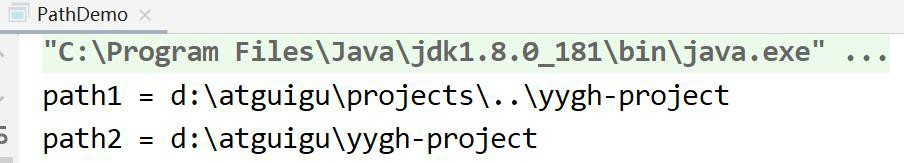

## Files

### Java NIO Files 类(java.nio.file.Files)提供了几种操作文件系统中的文件的方法。以下内容介绍Java NIO Files 最常用的一些方法。java.nio.file.Files 类与java.nio.file.Path 实例一起工作，因此在学习Files 类之前，需要先了解Path 类。

### 1、Files.createDirectory()

-   Files.createDirectory()方法，用于根据Path 实例创建一个新目录示例：Path path = Paths.get("d:\\\\sgg");try {Path newDir = Files.createDirectory(path);} catch(FileAlreadyExistsException e){// 目录已经存在} catch (IOException e) {// 其他发生的异常e.printStackTrace();}
-   第一行创建表示要创建的目录的Path 实例。在try-catch 块中，用路径作为参数调用Files.createDirectory()方法。如果创建目录成功，将返回一个Path 实例，该实例指向新创建的路径。
-   如果该目录已经存在，则是抛出一个java.nio.file.FileAlreadyExistsException。如果出现其他错误，可能会抛出IOException。例如，如果想要的新目录的父目录不存在， 则可能会抛出IOException。

### 2、Files.copy()

-   Files.copy()方法从一个路径拷贝一个文件到另外一个目录

    • Path sourcePath = Paths.get("d:\\\\atguigu\\\\01.txt");Path destinationPath = Paths.get("d:\\\\atguigu\\\\002.txt");try {Files.copy(sourcePath, destinationPath);} catch(FileAlreadyExistsException e) {// 目录已经存在} catch (IOException e) {// 其他发生的异常e.printStackTrace();}

    • 首先，该示例创建两个Path 实例。然后，这个例子调用Files.copy()，将两个Path 实例作为参数传递。这可以让源路径引用的文件被复制到目标路径引用的文件中。

    • 如果目标文件已经存在，则抛出一个java.nio.file.FileAlreadyExistsException 异常。如果有其他错误，则会抛出一个IOException。例如，如果将该文件复制到不存在的目录，则会抛出IOException。

-   覆盖已存在的文件

    • Files.copy()方法的第三个参数。如果目标文件已经存在，这个参数指示copy()方法覆盖现有的文件。

    • Files.copy(sourcePath, destinationPath, StandardCopyOption.REPLACE_EXISTING);

### 3、Files.move()

-   Files.move()用于将文件从一个路径移动到另一个路径。移动文件与重命名相同，但是移动文件既可以移动到不同的目录，也可以在相同的操作中更改它的名称。
-   Path sourcePath = Paths.get("d:\\\\atguigu\\\\01.txt");Path destinationPath = Paths.get("d:\\\\atguigu\\\\001.txt");try {Files.move(sourcePath, destinationPath, StandardCopyOption.REPLACE_EXISTING);} catch (IOException e) {//移动文件失败e.printStackTrace();}
-   Files.move()的第三个参数。这个参数告诉Files.move()方法来覆盖目标路径上的任何现有文件。

### 4、Files.delete()

-   Files.delete()方法可以删除一个文件或者目录。示例：
-   Path path = Paths.get("d:\\\\atguigu\\\\001.txt");try {Files.delete(path);} catch (IOException e) {// 删除文件失败e.printStackTrace();}
-   创建指向要删除的文件的Path。然后调用Files.delete()方法。如果Files.delete()不能删除文件(例如，文件或目录不存在)，会抛出一个IOException。

### 5、Files.walkFileTree()

-   Files.walkFileTree()方法包含递归遍历目录树功能，将Path 实例和FileVisitor 作为参数。Path 实例指向要遍历的目录，FileVisitor 在遍历期间被调用。
-   FileVisitor 是一个接口，必须自己实现FileVisitor 接口，并将实现的实例传递给walkFileTree()方法。在目录遍历过程中，您的FileVisitor 实现的每个方法都将被调用。如果不需要实现所有这些方法，那么可以扩展SimpleFileVisitor 类，它包含FileVisitor 接口中所有方法的默认实现。
-   FileVisitor 接口的方法中，每个都返回一个FileVisitResult 枚举实例。FileVisitResult 枚举包含以下四个选项:CONTINUE 继续TERMINATE 终止SKIP_SIBLING 跳过同级SKIP_SUBTREE 跳过子级
-   查找一个名为 001.txt 的文件示例：Path rootPath = Paths.get("d:\\\\atguigu");String fileToFind = File.separator + "001.txt";try {Files.walkFileTree(rootPath, new SimpleFileVisitor\<Path\>() {@Overridepublic FileVisitResult visitFile(Path file, BasicFileAttributes attrs) throwsIOException {String fileString = file.toAbsolutePath().toString();//System.out.println("pathString = " + fileString);if(fileString.endsWith(fileToFind)){System.out.println("file found at path: " + file.toAbsolutePath());return FileVisitResult.TERMINATE;}return FileVisitResult.CONTINUE;}});} catch(IOException e){e.printStackTrace();}
-   java.nio.file.Files 类包含许多其他的函数，有关这些方法的更多信息，请查看java.nio.file.Files 类的JavaDoc。

## AsynchronousFileChannel

### 在Java 7 中，Java NIO 中添加了AsynchronousFileChannel，也就是是异步地将数据写入文件。

### 1、创建 AsynchronousFileChannel

-   通过静态方法open()创建示例：
-   Path path = Paths.get("d:\\\\atguigu\\\\01.txt");try {AsynchronousFileChannel fileChannel =AsynchronousFileChannel.open(path, StandardOpenOption.READ);} catch (IOException e) {e.printStackTrace();}
-   open()方法的第一个参数指向与AsynchronousFileChannel 相关联文件的Path 实例。第二个参数是一个或多个打开选项，它告诉AsynchronousFileChannel 在文件上执行什么操作。在本例中，我们使用了StandardOpenOption.READ 选项，表示该文件将被打开阅读。

### 2、通过 Future 读取数据

-   可以通过两种方式从AsynchronousFileChannel 读取数据。第一种方式是调用返回Future 的read()方法

    • 创建了一个AsynchronousFileChannel，

    • 创建一个ByteBuffer，它被传递给read()方法作为参数，以及一个 0 的位置。

    • 在调用read()之后，循环，直到返回的isDone()方法返回true。

    • 读取操作完成后，数据读取到ByteBuffer 中，然后打印到System.out 中。

    • Path path = Paths.get("d:\\\\atguigu\\\\001.txt");AsynchronousFileChannel fileChannel = null;try {fileChannel = AsynchronousFileChannel.open(path, StandardOpenOption.READ);} catch (IOException e) {e.printStackTrace();}ByteBuffer buffer = ByteBuffer.allocate(1024);long position = 0;Future\<Integer\> operation = fileChannel.read(buffer, position);while(!operation.isDone());buffer.flip();byte[] data = new byte[buffer.limit()];buffer.get(data);System.out.println(new String(data));buffer.clear();

### 3、通过 CompletionHandler 读取数据

-   第二种方法是调用read()方法，该方法将一个CompletionHandler 作为参数示例：

    • Path path = Paths.get("d:\\\\atguigu\\\\001.txt");AsynchronousFileChannel fileChannel = null;try {fileChannel = AsynchronousFileChannel.open(path, StandardOpenOption.READ);} catch (IOException e) {e.printStackTrace();}ByteBuffer buffer = ByteBuffer.allocate(1024);long position = 0;fileChannel.read(buffer, position, buffer, new CompletionHandler\<Integer, ByteBuffer\>() {@Overridepublic void completed(Integer result, ByteBuffer attachment) {System.out.println("result = " + result);attachment.flip();byte[] data = new byte[attachment.limit()];attachment.get(data);System.out.println(new String(data));attachment.clear();}@Overridepublic void failed(Throwable exc, ByteBuffer attachment) {}});

    • 读取操作完成，将调用CompletionHandler 的completed()方法。

    • 对于completed()方法的参数传递一个整数，它告诉我们读取了多少字节，以及传递给read()方法的“附件”。“附件”是read()方法的第三个参数。在本代码中， 它是ByteBuffer，数据也被读取。

    • 如果读取操作失败，则将调用CompletionHandler 的failed()方法。

### 4、通过 Future 写数据

-   和读取一样，可以通过两种方式将数据写入一个AsynchronousFileChannel 示例：Path path = Paths.get("d:\\\\atguigu\\\\001.txt");AsynchronousFileChannel fileChannel = null;try {fileChannel = AsynchronousFileChannel.open(path, StandardOpenOption.WRITE);} catch (IOException e) {e.printStackTrace();}ByteBuffer buffer = ByteBuffer.allocate(1024);long position = 0;buffer.put("atguigu data".getBytes());buffer.flip();Future\<Integer\> operation = fileChannel.write(buffer, position);buffer.clear();while(!operation.isDone());System.out.println("Write over")
-   首先，AsynchronousFileChannel 以写模式打开。然后创建一个ByteBuffer，并将一些数据写入其中。然后，ByteBuffer 中的数据被写入到文件中。最后，示例检查返回的Future，以查看写操作完成时的情况。
-   注意，文件必须已经存在。如果该文件不存在，那么write()方法将抛出一个java.nio.file.NoSuchFileException。

### 5、通过 CompletionHandler 写数据

-   示例：Path path = Paths.get("d:\\\\atguigu\\\\001.txt");if(!Files.exists(path)){try {Files.createFile(path);} catch (IOException e) {e.printStackTrace();}}AsynchronousFileChannel fileChannel = null;try {fileChannel = AsynchronousFileChannel.open(path, StandardOpenOption.WRITE);} catch (IOException e) {e.printStackTrace();}ByteBuffer buffer = ByteBuffer.allocate(1024);long position = 0;buffer.put("atguigu data".getBytes());buffer.flip();fileChannel.write(buffer, position, buffer, new CompletionHandler\<Integer, ByteBuffer\>() @Overridepublic void completed(Integer result, ByteBuffer attachment) {System.out.println("bytes written: " + result);}@Overridepublic void failed(Throwable exc, ByteBuffer attachment) {System.out.println("Write failed");exc.printStackTrace();}});
-   当写操作完成时，将会调用CompletionHandler 的completed()方法。如果写失败， 则会调用failed()方法。

## 字符集（Charset）

### java 中使用Charset 来表示字符集编码对象

### Charset 常用静态方法public static Charset forName(String charsetName)//通过编码类型获得 Charset 对象public static SortedMap\<String,Charset\> availableCharsets()//获得系统支持的所有编码方式public static Charset defaultCharset()//获得虚拟机默认的编码方式public static boolean isSupported(String charsetName)//判断是否支持该编码类型

### Charset 常用普通方法public final String name()//获得 Charset 对象的编码类型(String)public abstract CharsetEncoder newEncoder()//获得编码器对象public abstract CharsetDecoder newDecoder()//获得解码器对象

### 代码示例：@Testpublic void charSetEncoderAndDecoder() throwsCharacterCodingException {Charset charset=Charset.forName("UTF-8");//1.获取编码器CharsetEncoder charsetEncoder=charset.newEncoder();//2.获取解码器CharsetDecoder charsetDecoder=charset.newDecoder();//3.获取需要解码编码的数据CharBuffer charBuffer=CharBuffer.allocate(1024);charBuffer.put("字符集编码解码");charBuffer.flip();//4.编码ByteBuffer byteBuffer=charsetEncoder.encode(charBuffer);System.out.println("编码后：");for (int i=0;i\<byteBuffer.limit();i++) {System.out.println(byteBuffer.get());}//5.解码byteBuffer.flip();CharBuffer charBuffer1=charsetDecoder.decode(byteBuffer);System.out.println("解码后：");System.out.println(charBuffer1.toString());System.out.println("指定其他格式解码:");Charset charset1=Charset.forName("GBK");byteBuffer.flip();CharBuffer charBuffer2 =charset1.decode(byteBuffer);System.out.println(charBuffer2.toString());//6.获取 Charset 所支持的字符编码Map\<String ,Charset\> map= Charset.availableCharsets();Set\<Map.Entry\<String,Charset\>\> set=map.entrySet();for (Map.Entry\<String,Charset\> entry: set) {System.out.println(entry.getKey()+"="+entry.getValue().toString());}}

# 第 8 章 Java NIO 综合案例

## 使用Java NIO 完成一个多人聊天室功能

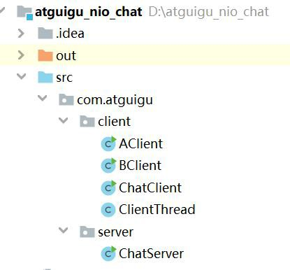

### 

-   

### //服务器端

### public class ChatServer {

### //服务器端启动的方法

### public void startServer() throws IOException {

### //1创建Selector选择器

### Selector selector = Selector.open();

### //2创建ServerSocketChannel通道

### ServerSocketChannel serverSocketChannel = ServerSocketChannel.open();

## 服务端代码

### //服务器端public class ChatServer {//服务器端启动的方法public void startServer() throws IOException{//1 创建 Selector 选择器Selector selector = Selector.open();//2 创建 ServerSocketChannel 通道ServerSocketChannel serverSocketChannel =ServerSocketChannel.open();//3 为 channel 通道绑定监听端口serverSocketChannel.bind(new InetSocketAddress(8000));//设置非阻塞模式serverSocketChannel.configureBlocking(false);//4 把 channel 通道注册到 selector 选择器上serverSocketChannel.register(selector, SelectionKey.OP_ACCEPT);System.out.println("服务器已经启动成功了");//5 循环，等待有新链接接入//while(true)for(;;) {//获取 channel 数量int readChannels = selector.select();if(readChannels == 0) {continue;}//获取可用的 channelSet\<SelectionKey\> selectionKeys = selector.selectedKeys();//遍历集合Iterator\<SelectionKey\> iterator = selectionKeys.iterator();while (iterator.hasNext()) {SelectionKey selectionKey = iterator.next();//移除 set 集合当前 selectionKeyiterator.remove();//6 根据就绪状态，调用对应方法实现具体业务操作//6.1 如果 accept 状态if(selectionKey.isAcceptable()) {acceptOperator(serverSocketChannel,selector);}//6.2 如果可读状态if(selectionKey.isReadable()) {readOperator(selector,selectionKey);}}}}//处理可读状态操作private void readOperator(Selector selector, SelectionKey selectionKey)throws IOException {//1 从 SelectionKey 获取到已经就绪的通道SocketChannel socketChannel =(SocketChannel)selectionKey.channel();//2 创建 bufferByteBuffer byteBuffer = ByteBuffer.allocate(1024);//3 循环读取客户端消息int readLength = socketChannel.read(byteBuffer);String message = "";if(readLength \>0) {//切换读模式byteBuffer.flip();//读取内容message += Charset.forName("UTF-8").decode(byteBuffer);}//4 将 channel 再次注册到选择器上，监听可读状态socketChannel.register(selector,SelectionKey.OP_READ);//5 把客户端发送消息，广播到其他客户端if(message.length()\>0) {//广播给其他客户端System.out.println(message);castOtherClient(message,selector,socketChannel);}}//广播到其他客户端private void castOtherClient(String message, Selector selector, SocketChannel socketChannel) throws IOException {//1 获取所有已经接入 channelSet\<SelectionKey\> selectionKeySet = selector.keys();//2 循环想所有 channel 广播消息for(SelectionKey selectionKey : selectionKeySet) {//获取每个 channelChannel tarChannel = selectionKey.channel();//不需要给自己发送if(tarChannel instanceof SocketChannel && tarChannel !=socketChannel) {((SocketChannel)tarChannel).write(Charset.forName("UTF- 8").encode(message));}}}//处理接入状态操作private void acceptOperator(ServerSocketChannel serverSocketChannel, Selector selector) throws IOException {//1 接入状态，创建 socketChannelSocketChannel socketChannel = serverSocketChannel.accept();//2 把 socketChannel 设置非阻塞模式socketChannel.configureBlocking(false);//3 把 channel 注册到 selector 选择器上，监听可读状态socketChannel.register(selector,SelectionKey.OP_READ);//4 客户端回复信息socketChannel.write(Charset.forName("UTF-8").encode("欢迎进入聊天室，请注意隐私安全"));}//启动主方法public static void main(String[] args) {try {new ChatServer().startServer();} catch (IOException e) {e.printStackTrace();}}}

## 客户端代码

### ChatClient 类

-   //客户端public class ChatClient {//启动客户端方法public void startClient(String name) throws IOException {//连接服务端SocketChannel socketChannel =SocketChannel.open(new InetSocketAddress("127.0.0.1",8000));//接收服务端响应数据Selector selector = Selector.open();socketChannel.configureBlocking(false);socketChannel.register(selector, SelectionKey.OP_READ);//创建线程new Thread(new ClientThread(selector)).start();//向服务器端发送消息Scanner scanner = new Scanner(System.in);while(scanner.hasNextLine()) {String msg = scanner.nextLine();if(msg.length()\>0) {socketChannel.write(Charset.forName("UTF-8").encode(name +" : " +msg));}}}}

### ClientThread 类

-   public class ClientThread implements Runnable {private Selector selector;public ClientThread(Selector selector) {this.selector = selector;}@Overridepublic void run() {try {for(;;) {//获取 channel 数量int readChannels = selector.select();if(readChannels == 0) {continue;}//获取可用的 channelSet\<SelectionKey\> selectionKeys = selector.selectedKeys();//遍历集合Iterator\<SelectionKey\> iterator = selectionKeys.iterator();while (iterator.hasNext()) {SelectionKey selectionKey = iterator.next();//移除 set 集合当前 selectionKeyiterator.remove();//如果可读状态if(selectionKey.isReadable()) {readOperator(selector,selectionKey);}}}}catch(Exception e) {}}//处理可读状态操作private void readOperator(Selector selector, SelectionKey selectionKey)throws IOException {//1 从 SelectionKey 获取到已经就绪的通道SocketChannel socketChannel =(SocketChannel)selectionKey.channel();//2 创建 bufferByteBuffer byteBuffer = ByteBuffer.allocate(1024);//3 循环读取客户端消息int readLength = socketChannel.read(byteBuffer);String message = "";if(readLength \>0) {//切换读模式byteBuffer.flip();//读取内容message += Charset.forName("UTF-8").decode(byteBuffer);}//4 将 channel 再次注册到选择器上，监听可读状态socketChannel.register(selector,SelectionKey.OP_READ);//5 把客户端发送消息，广播到其他客户端if(message.length()\>0) {//广播给其他客户端System.out.println(message);}}}

# 第 6 章 Java NIO（Pipe 和 FileLock）

## 2、客户端代码

### @Test

### public void ClientDemo() {

### try {

### SocketChannel socketChannel = SocketChannel.open(); socketChannel.connect(new InetSocketAddress("127.0.0.1", 8000));

### ByteBuffer writeBuffer = ByteBuffer.allocate(32); ByteBuffer readBuffer = ByteBuffer.allocate(32);

### writeBuffer.put("hello".getBytes()); writeBuffer.flip();

### while (true) { writeBuffer.rewind();

-   socketChannel.write(writeBuffer); readBuffer.clear(); socketChannel.read(readBuffer);

### }

### } catch (IOException e) {

### }

### }

### 第 6 章 Java NIO（Pipe 和 FileLock）

### 

-   

## Pipe

### Java NIO 管道是 2 个线程之间的单向数据连接。Pipe 有一个source 通道和一个sink 通道。数据会被写到sink 通道，从source 通道读取。

### 

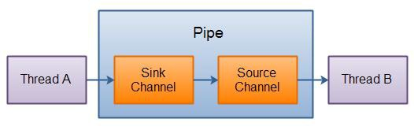

### 1、创建管道

-   通过Pipe.open()方法打开管道。Pipe pipe = Pipe.open();

### 2、写入管道

-   要向管道写数据，需要访问 sink 通道。：Pipe.SinkChannel sinkChannel = pipe.sink();
-   通过调用 SinkChannel 的write()方法，将数据写入 SinkChannel：String newData = "New String to write to file..." + System.currentTimeMillis();ByteBuffer buf = ByteBuffer.allocate(48);buf.clear();buf.put(newData.getBytes());buf.flip();while(buf.hasRemaining()) {sinkChannel.write(buf);}

### 3、从管道读取数据

-   从读取管道的数据，需要访问source 通道，像这样： Pipe.SourceChannel sourceChannel = pipe.source();
-   调用source 通道的read()方法来读取数据： ByteBuffer buf = ByteBuffer.allocate(48); int bytesRead = sourceChannel.read(buf);read()方法返回的int 值会告诉我们多少字节被读进了缓冲区。

### 4、示例

-   @Testpublic void testPipe() throws IOException{// 1、获取通道Pipe pipe = Pipe.open();// 2、获取 sink 管道，用来传送数据Pipe.SinkChannel sinkChannel = pipe.sink();// 3、申请一定大小的缓冲区ByteBuffer byteBuffer = ByteBuffer.allocate(1024);byteBuffer.put("atguigu".getBytes());byteBuffer.flip();// 4、sink 发送数据sinkChannel.write(byteBuffer);// 5、创建接收 pipe 数据的 source 管道Pipe.SourceChannel sourceChannel = pipe.source();// 6、接收数据，并保存到缓冲区中ByteBuffer byteBuffer2 = ByteBuffer.allocate(1024);int length = sourceChannel.read(byteBuffer2);System.out.println(new String(byteBuffer2.array(), 0, length));sourceChannel.close();sinkChannel.close();}

## FileLock

### 1、FileLock 简介

-   文件锁在OS 中很常见，如果多个程序同时访问、修改同一个文件，很容易因为文件数据不同步而出现问题。给文件加一个锁，同一时间，只能有一个程序修改此文件， 或者程序都只能读此文件，这就解决了同步问题。
-   文件锁是进程级别的，不是线程级别的。文件锁可以解决多个进程并发访问、修改同 一个文件的问题，但不能解决多线程并发访问、修改同一文件的问题。使用文件锁时， 同一进程内的多个线程，可以同时访问、修改此文件。
-   文件锁是当前程序所属的JVM 实例持有的，一旦获取到文件锁（对文件加锁），要调用release()，或者关闭对应的FileChannel 对象，或者当前JVM 退出，才会释放这个锁。
-   一旦某个进程（比如说JVM 实例）对某个文件加锁，则在释放这个锁之前，此进程不能再对此文件加锁，就是说JVM 实例在同一文件上的文件锁是不重叠的（进程级别不能重复在同一文件上获取锁）。

### 2、文件锁分类：

-   排它锁：又叫独占锁。对文件加排它锁后，该进程可以对此文件进行读写，该进程独占此文件，其他进程不能读写此文件，直到该进程释放文件锁。

    

-   共享锁：某个进程对文件加共享锁，其他进程也可以访问此文件，但这些进程都只能 读此文件，不能写。线程是安全的。只要还有一个进程持有共享锁，此文件就只能读， 不能写。

### 3、使用示例：

-   //创建 FileChannel 对象，文件锁只能通过 FileChannel 对象来使用FileChannel fileChannel=new FileOutputStream("./1.txt").getChannel();//对文件加锁FileLock lock=fileChannel.lock();//对此文件进行一些读写操作。//....... //释放锁lock.release();

### 4、获取文件锁方法

-   lock() //对整个文件加锁，默认为排它锁。
-   lock(long position, long size, booean shared) //自定义加锁方式。前 2 个参数指定要加锁的部分（可以只对此文件的部分内容加锁），第三个参数值指定是否是共享锁。
-   tryLock() //对整个文件加锁，默认为排它锁。
-   tryLock(long position, long size, booean shared) //自定义加锁方式。
-   如果指定为共享锁，则其它进程可读此文件，所有进程均不能写此文件，如果某进程试图对此文件进行写操作，会抛出异常。

### 5、lock 与 tryLock 的区别：

-   lock 是阻塞式的，如果未获取到文件锁，会一直阻塞当前线程，直到获取文件锁
-   tryLock 和lock 的作用相同，只不过tryLock 是非阻塞式的，tryLock 是尝试获取文件锁，获取成功就返回锁对象，否则返回null，不会阻塞当前线程。

### 6、FileLock 两个方法：

-   boolean isShared()//此文件锁是否是共享锁boolean isValid()//此文件锁是否还有效
-   在某些OS 上，对某个文件加锁后，不能对此文件使用通道映射。

### 7、完整例子

-   public class Demo1 {public static void main(String[] args) throws IOException {String input = "atguigu";System.out.println("输入 :" + input);ByteBuffer buf = ByteBuffer.wrap(input.getBytes());String fp = "D:\\\\atguigu\\\\01.txt";Path pt = Paths.get(fp);FileChannel channel = FileChannel.open(pt, StandardOpenOption.WRITE,StandardOpenOption.APPEND);channel.position(channel.size() - 1); // position of a cursor at the end offile// 获得锁方法一：lock()，阻塞方法，当文件锁不可用时，当前进程会被挂起//lock = channel.lock();// 无参 lock()为独占锁// lock = channel.lock(0L, Long.MAX_VALUE, true);//有参 lock()为共享锁，有写操作会报异常// 获得锁方法二：trylock()，非阻塞的方法，当文件锁不可用时，tryLock()会得到 null 值FileLock lock = channel.tryLock(0,Long.MAX_VALUE,false);System.out.println("共享锁 shared: " + lock.isShared());channel.write(buf);channel.close(); // Releases the LockSystem.out.println("写操作完成.");//读取数据readPrint(fp);}public static void readPrint(String path) throws IOException {FileReader filereader = new FileReader(path);BufferedReader bufferedreader = new BufferedReader(filereader);String tr = bufferedreader.readLine();System.out.println("读取内容: ");while (tr != null) {System.out.println(" " + tr);tr = bufferedreader.readLine();}filereader.close();bufferedreader.close();}}
