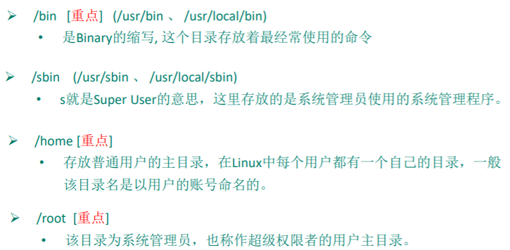
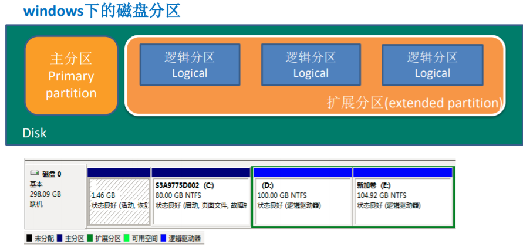
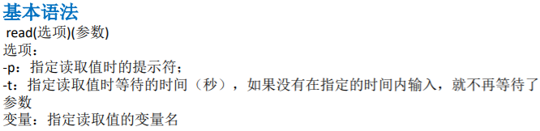

**Linux基础篇**

# 目录结构

## 

## 

## 

## 

## 

# 操作

## vi和vim模式

### 

## 开机、重启和用户登录注销

### shutdown –h now 立该进行关机shudown -h 1 "hello, 1 分钟后会关机了"shutdown –r now 现在重新启动计算机halt 关机， 作用和上面一样.reboot 现在重新启动计算机sync 把内存的数据同步到磁盘

### 基本介绍:1) 登录时尽量少用root帐号登录，因为它是系统管理员，最大的权限，避免操作失误。可以利用普通用户登录，登录后再用”su - 用户名’命令来切换成系统管理员身份.2) 在提示符下输入 logout 即可注销用户使用细节:1) logout 注销指令在图形运行级别无效，在 运行级别 3下有效.2) 运行级别这个概念，后面给大家介绍

## 用户管理

### 单用户

-    添加用户基本语法useradd 用户名细节说明1) 当创建用户成功后，会自动的创建和用户同名的家目录2) 也可以通过 useradd -d 指定目录 新的用户名，给新创建的用户指定家目录
-    指定/修改密码基本语法passwd 用户名
-    删除用户基本语法userdel 用户名 单删除用户userdel -f 用户名 强制删除用户userdel [-r] 用户名 用户信息全部删除
-    查询用户信息指令基本语法id 用户名细节说明1) 当用户不存在时，返回无此用户
-    切换用户基本语法su – 切换用户名细节说明1) 从权限高的用户切换到权限低的用户，不需要输入密码，反之需要。2) 当需要返回到原来用户时，使用exit指令
-    查看当前用户/登录用户基本语法whoami/ who am I

### 用户组（系统可以对有共性的多个用户进行统一的管理。)

-   新增组• 指令groupadd 组名
-   删除组• 指令(基本语法)groupdel 组名
-   增加用户时直接加上组• 指令(基本语法)useradd –g 用户组 用户名
-   修改用户的组• 指令(基本语法)usermod –g 用户组 用户名

### 用户和组的相关文件

-   

    

## 实用指令

### 指定运行级别

-   运行级别说明：0 ：关机1 ：单用户【找回丢失密码】2：多用户状态没有网络服务3：多用户状态有网络服务4：系统未使用保留给用户5：图形界面6：系统重启
-   找回密码

    • CentOS7忘记密码

    • Centos8忘记密码

### 帮助指令

-   man 获得帮助信息• 基本语法man [命令或配置文件]（功能描述：获得帮助信息）• 应用实例案例：查看ls命令的帮助信息help指令• 基本语法help 命令 （功能描述：获得shell内置命令的帮助信息）• 应用实例案例：查看cd命令的帮助信息

### 文件目录类

-   pwd 指令• 基本语法pwd (功能描述：显示当前工作目录的绝对路径)
-   ls指令• 基本语法ls [选项] [目录或是文件]• 常用选项-a ：显示当前目录所有的文件和目录，包括隐藏的。-l ：以列表的方式显示信息
-   cd 指令• 基本语法cd [参数] (功能描述：切换到指定目录)• 常用参数绝对路径和相对路径cd \~ 或者cd ：回到自己的家目录cd .. 回到当前目录的上一级目录
-   mkdir指令用于创建目录• 基本语法mkdir [选项] 要创建的目录名• 常用选项-p ：创建多级目录
-   rmdir指令删除空目录• 基本语法rmdir [选项] 要删除的空目录使用细节rmdir 删除的是空目录，如果目录下有内容时无法删除的。提示：如果需要删除非空目录，需要使用 rm -rf 要删除的目录
-   touch指令创建空文件• 基本语法touch 文件名称

    • vim 路径/文件名 可以创建空文件

-   cp 指令拷贝文件到指定目录• 基本语法cp [选项] source dest• 常用选项-r ：递归复制整个文件夹• 使用细节强制覆盖不提示的方法：\\cp
-   rm 指令移除文件或目录• 基本语法rm [选项] 要删除的文件或目录• 常用选项-r ：递归删除整个文件夹-f ： 强制删除不提示
-   mv 移动文件与目录或重命名• 基本语法mv oldNameFile newNameFile (功能描述：重命名)mv /temp/movefile /targetFolder (功能描述：移动文件)
-   查看文件

    • cat 查看文件内容• 基本语法cat [选项] 要查看的文件• 常用选项-n ：显示行号• 使用细节cat 只能浏览文件，而不能修改文件，为了浏览方便，一般会带上 管道命令 \| more

    • more指令是一个基于VI编辑器的文本过滤器，它以全屏幕的方式按页显示文本文件的内容。• 基本语法more 要查看的文件

    •

    

    • less指令用来分屏查看文件内容，根据显示需要加载内容，对于显示大型文件具有较高的效率• 基本语法less 要查看的文件

    •

    

-   echo指令echo输出内容到控制台。• 基本语法echo [选项] [输出内容
-   head指令head用于显示文件的开头部分内容，默认情况下head指令显示文件的前10行内容• 基本语法head 文件 (功能描述：查看文件头10行内容)head -n 5 文件 (功能描述：查看文件头5行内容，5可以是任意行数)
-   tail指令tail用于输出文件中尾部的内容，默认情况下tail指令显示文件的前10行内容。• 基本语法1) tail 文件 （功能描述：查看文件头10行内容）2) tail -n 5 文件 （功能描述：查看文件头5行内容，5可以是任意行数）3) tail -f 文件 （功能描述：实时追踪该文档的所有更新）
-   \> 指令 和 \>\> 指令\> 输出重定向 和 \>\> 追加• 基本语法1) ls -l \> 文件 （功能描述：列表的内容写入文件a.txt中（覆盖写））2) ls -al \>\> 文件 （功能描述：列表的内容追加到文件aa.txt的末尾）3) cat 文件1 \> 文件2 （功能描述：将文件1的内容覆盖到文件2）4) echo "内容"\>\> 文件
-   ln 指令软链接也成为符号链接，类似于windows里的快捷方式，主要存放了链接其他文件的路径• 基本语法ln -s [原文件或目录] [软链接名] （功能描述：给原文件创建一个软链接）• 细节说明当我们使用pwd指令查看目录时，仍然看到的是软链接所在目录。

    •

    

-   history指令查看已经执行过历史命令,也可以执行历史指令• 基本语法history （功能描述：查看已经执行过历史命令）

### 时间日期类

-   date指令

    • 显示当前日期• 基本语法1) date （功能描述：显示当前时间）2) date +%Y （功能描述：显示当前年份）3) date +%m （功能描述：显示当前月份）4) date +%d （功能描述：显示当前是哪一天）5) date "+%Y-%m-%d %H:%M:%S"（功能描述：显示年月日时分秒）

    • -设置日期• 基本语法date -s 字符串时间

-   cal指令 查看日历指令• 基本语法cal [选项] （功能描述：不加选项，显示本月日历）

### 搜索查找类

-   find指令find指令将从指定目录向下递归地遍历其各个子目录，将满足条件的文件或者目录显示在终端。• 基本语法find [搜索范围] [选项]

    •

    

-   locate指令locaate指令可以快速定位文件路径。locate指令利用事先建立的系统中所有文件名称及路径的locate数据库实现快速定位给定的文件。Locate指令无需遍历整个文件系统，查询速度较快。为了保证查询结果的准确度，管理员必须定期更新locate时刻。• 基本语法locate 搜索文件• 特别说明由于locate指令基于数据库进行查询，所以第一次运行前，必须使用updatedb指令创建locate数据库。
-   grep指令和 管道符号 \|grep 过滤查找 ， 管道符，“\|”，表示将前一个命令的处理结果输出传递给后面的命令处理。• 基本语法grep [选项] 查找内容 源文件

    

### 压缩和解压类

-   gzip 用于压缩文件， gunzip 用于解压的• 基本语法gzip 文件 （功能描述：压缩文件，只能将文件压缩为\*.gz文件）gunzip 文件.gz （功能描述：解压缩文件命令）
-   zip 用于压缩文件， unzip 用于解压的• 基本语法zip [选项] XXX.zip 将要压缩的内容（功能描述：压缩文件和目录的命令）unzip [选项] XXX.zip （功能描述：解压缩文件）• zip常用选项-r：递归压缩，即压缩目录• unzip的常用选项-d\<目录\> ：指定解压后文件的存放目录
-   tar 指令tar 指令 是打包指令，最后打包后的文件是 .tar.gz 的文件。• 基本语法tar [选项] XXX.tar.gz 打包的内容 (功能描述：打包目录，压缩后的文件格式.tar.gz)• 选项说明

    

## 组管理

### 文件/目录 所有者

-   查看文件的所有者1) 指令：ls –ahl
-   修改文件所有者• 指令：chown 用户名 文件名

### 组的创建

-   基本指令，添加组groupadd 组名

### 文件/目录 所在组

-   查看文件/目录所在组• 基本指令ls –ahl
-   修改文件所在的组• 基本指令chgrp 组名 文件名

###  其它组除文件的所有者和所在组的用户外，系统的其它用户都是文件的其它组

### 改变用户所在组

-   在添加用户时，可以指定将该用户添加到哪个组中，同样的用root的管理权限可以改变某个用户所在的组。改变用户所在组1) usermod –g 组名 用户名2) usermod –d 目录名 用户名 改变该用户登陆的初始目录。

## 权限管理

### 权限的基本介绍

-   

    

### rwx权限详解

-   

    

### 实例演示

-   

    

    •

    

### 修改文件目录权限

-   基本说明：通过chmod指令，可以修改文件或者目录的权限。

    •

    

    •

    

### 修改文件所有者-chown

-   基本介绍chown newowner file 改变文件的所有者chown newowner:newgroup file 改变用户的所有者和所有组-R 如果是目录 则使其下所有子文件或目录递归生效

### 修改文件所在组-chgrp

-   基本介绍chgrp newgroup file 改变文件的所有组

## 定时任务调度

### crond 任务调度

-   

    

-   

    

    •

    

    •

    

-   crond 相关指令:1) conrtab –r：终止任务调度。2) crontab –l：列出当前有那些任务调度3) service crond restart [重启任务调度]

## Linux磁盘分区、挂载

### 分区基础知识

-   分区方式

    •

    

-   windows下的磁盘分区

    •

    

-   Linux分区

    • 原理介绍

    • 1) Linux来说无论有几个分区，分给哪一目录使用，它归根结底就只有一个根目录，一个独立且唯一的文件结构 , Linux中每个分区都是用来组成整个文件系统的一部分。2) Linux采用了一种叫“载入”的处理方法，它的整个文件系统中包含了一整套的文件和目录，且将一个分区和一个目录联系起来。这时要载入的一个分区将使它的存储空间在一个目录下获得。

    • 硬盘说明

    •

    

    • 查看所有设备挂载情况命令 ：lsblk 或者 lsblk -f

    •

    

    • 挂载的经典案例

    •

    

    •

    

    •

    

    •

    

### 磁盘情况查询

-   查询系统整体磁盘使用情况• 基本语法df -h
-   

    

### 工作使用指令

-   

    

## 网络配置

### 

### 

-   

    

## 进程管理(重点)

### 基本介绍

-   1) 在LINUX中，每个执行的程序（代码）都称为一个进程。每一个进程都分配一个ID号。2) 每一个进程，都会对应一个父进程，而这个父进程可以复制多个子进程。例如www服务器。3) 每个进程都可能以两种方式存在的。前台与后台，所谓前台进程就是用户目前的屏幕上可以进行操作的。后台进程则是实际在操作，但由于屏幕上无法看到的进程，通常使用后台方式执行。4) 一般系统的服务都是以后台进程的方式存在，而且都会常驻在系统中。直到关机才才结束。

### 显示系统执行的进程

-   

    

-   

    

-   

    

### 终止进程kill和killall

-   

    

### 查看进程树pstree

-   基本语法：pstree [选项] ,可以更加直观的来看进程信息常用选项：-p :显示进程的PID-u :显示进程的所属用户

### 服务(service)管理

-   介绍:服务(service) 本质就是进程，但是是运行在后台的，通常都会监听某个端口，等待其它程序的请求，比如(mysql , sshd 防火墙等)，因此我们又称为守护进程，是Linux中非常重要的知识点.service管理指令：service 服务名 [start \| stop \| restart \| reload \| status]在CentOS7.0后 不再使用service ,而是 systemctl
-   查看服务名:方式1：使用setup -\> 系统服务 就可以看到。方式2: /etc/init.d/服务名称
-   

    

-   chkconfig指令

    • • 介绍通过chkconfig 命令可以给每个服务的各个运行级别设置自启动/关闭• 基本语法1) 查看服务 chkconfig --list\|grep xxx2) chkconfig 服务名 --list3) chkconfig --level 5 服务名 on/off• 使用细节1) chkconfig重新设置服务后自启动或关闭，需要重启机器reboot才能生效.

### 动态监控进程

-   

    

-   

    

### 监控网络状态

-   查看系统网络情况netstat• 基本语法netstat [选项]• 选项说明-an 按一定顺序排列输出-p 显示哪个进程在调用
-   检测主机连接命令ping：

## RPM 与 YUM

### RPM

-   

    

-   

    

-   

    

-   

    

-   

    

### yum

-   

    

# Shell编程

## Shell的变量

### Shell是一个命令行解释器，它为用户提供了一个向Linux内核发送请求以便运行程序的界面系统级程序，用户可以用Shell来启动、挂起、停止甚至是编写一些程序。

### 

### 

-   

    

## 环境变量

### 

## 位置参数变量

### 

## 预定义变量

### 

## 运算符

### 

## 条件判断

### 判断语句• 基本语法[ condition ]（注意condition前后要有空格）\#非空返回true，可使用\$?验证（0为true，\>1为false）

### 

## 流程控制

### 

### 

### 

### 

## read读取控制台输入

### 

## 函数

### 函数介绍shell编程和其它编程语言一样，有系统函数，也可以自定义函数。系统函数中，我们这里就介绍两个。

### 系统函数• basename基本语法功能：返回完整路径最后 / 的部分，常用于获取文件名basename [pathname] [suffix]basename [string] [suffix] （功能描述：basename命令会删掉所有的前缀包括最后一个（‘/’）字符，然后将字符串显示出来。选项：suffix为后缀，如果suffix被指定了，basename会将pathname或string中的suffix去掉。

-   系统函数• dirname基本语法功能：返回完整路径最后 / 的前面的部分，常用于返回路径部分dirname 文件绝对路径 （功能描述：从给定的包含绝对路径的文件名中去除文件名（非目录的部分），然后返回剩下的路径（目录的部分））

### 自定义函数• 基本语法[ function ] funname[()]{Action;[return int;]}调用直接写函数名：funname [值]
