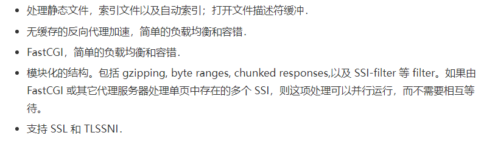
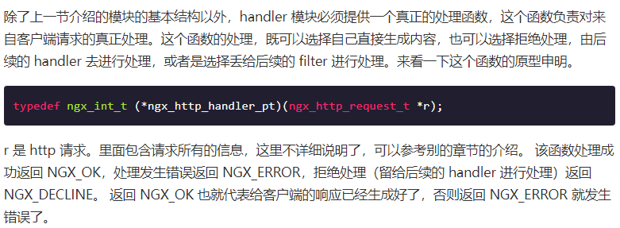
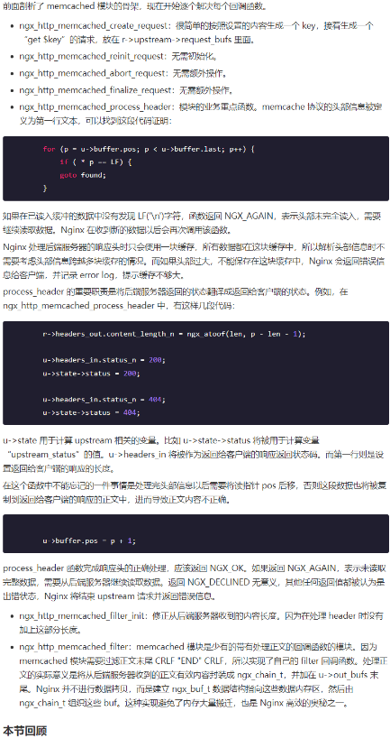

**NGINX分析**

# 基础知识点

## 特点

### 

## 架构

### 

-   

    

### 管理通信和worker进程

-   kill -HUP pid

    • 告诉 Nginx，从容地重启 Nginx，首先 master 进程在接到信号后，会先重新加载配置文件，然后再启动新的 worker 进程，并向所有老的 worker 进程发送信号，告诉他们可以光荣退休了。新的 worker 在启动后，就开始接收新的请求，而老的 worker 在收到来自 master 的信号后，就不再接收新的请求，并且在当前进程中的所有未处理完的请求处理完成后，再退出。

-   ./nginx -s reload，就是来重启 Nginx，./nginx -s stop

    • 新的 Nginx 进程在解析到 reload 参数后，就知道我们的目的是控制 Nginx 来重新加载配置文件了，它会向 master 进程发送信号，然后接下来的动作，就和我们直接向 master 进程发送信号一样了

### 进程模型

-   

    

-   

    

-   异步非阻塞的方式来处理
-   

    

### Nginx 的事件处理模型

-   

    

-   处理信号与定时器

    •

    

## 基础概念

### connection

-   

    

-   

    

### request

-   

    

-   

    

### keepalive

-   

    

### pipe

-   

    

### lingering_close

-   

    

### w3cschool.cn-Nginx 基础概念.pdf

## 基本数据结构

### ngx_str_t

### ngx_pool_t

### ngx_array_t

### ngx_hash_t

### ngx_hash_wildcard_t

### ngx_hash_combined_t

### ngx_hash_keys_arrays_t

### ngx_chain_t

### ngx_buf_t

### ngx_list_t

### ngx_queue_t

### w3cschool.cn-Nginx 基本数据结构.pdf

## 配置系统

### 

### 指令概述配置指令是一个字符串，可以用单引号或者双引号括起来，也可以不括。但是如果配置指令包含空格，一定要引起来。

### 指令参数

-   

    

### 指令上下文

-   

    

-   示例

    •

    

### 模块化体系结构

-   

    

-   模块概述

    •

    

-   模块的分类

    •

    

## 请求处理

### 

### 请求的处理流程

-   

    

-   

    

-   

    

# handler 模块

## 

## 模块的基本结构

### 模块配置结构

-   

    

### 模块配置指令

-   

    

-   ngx_command_t一个模块的配置指令是定义在一个静态数组中的

    •

    

    • type

    •

    

    •

    

    •

    

    • set

    •

    

    •

    

    • conf

    •

    

    • offset

    •

    

    • post

    •

    

    • 需要注意的是，就是在ngx_http_hello_commands这个数组定义的最后，都要加一个ngx_null_command作为结尾。

-   模块上下文结构

    •

    

    •

    

-   模块的定义

    •

    

## handler 模块的基本结构

### 

## handler 模块的挂载

### 按处理阶段挂载

-   

    

-   

    

### 按需挂载

-   

    

-   

    

### handler 的编写步骤

-   1、编写模块基本结构。包括模块的定义，模块上下文结构，模块的配置结构等。2、实现 handler 的挂载函数。根据模块的需求选择正确的挂载方式。3、编写 handler 处理函数。模块的功能主要通过这个函数来完成。

### Nginx 示例

-   

    

-   完整示例

    •

    

-   w3cschool.cn-Nginx 示例 hello handler 模块.pdf

### handler 模块的编译和使用

-   config 文件的编写

    •

    

-   编译

    •

    

-   使用

    •

    

### 更多 handler 模块示例分析

-   http access module

    •

    

-   http static module

    •

    

    •

    

-   http log module

    •

    

# 过滤模块

## 简介

### 执行时间和内容

-   

    

### 执行顺序

-   

    

-   

    

### 模块编译

-   

    

## 过滤模块的分析

### 相关结构体

-   

    

-   

    

### 响应头过滤函数

-   

    

### 响应体过滤函数

-   

    

### 主要功能介绍

-   

    

### 发出子请求

-   

    

### 优化措施

-   

    

### 过滤内容的缓存

-   

    

# upstream 模块

## 模块简介

### 

### 

## 模块接口

### 

## memcached 模块分析

### 

## handler 模块的接入方式

### 

## Upstream 模块

### 

## 回调函数

### 

# 负载均衡模块

## 

## 

## 配置

### 

## 指令

### 

## 钩子

### 

## 设置 uscf-\>flags

### 

## 设置 init_upstream 回调

### 

## 初始化配置

### 

## 初始化请求

### 

## peer.get 和 peer.free 回调函数

### 

## upstream 整体流程

### 

# core 模块

## 

# event 模块

## event 的类型和功能

### 

## accept 锁

### 

## 定时器

### 

# w3cschool.cn-Nginx 配置文件nginxconf中文详解.pdf
