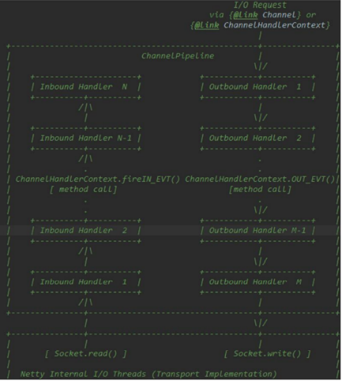
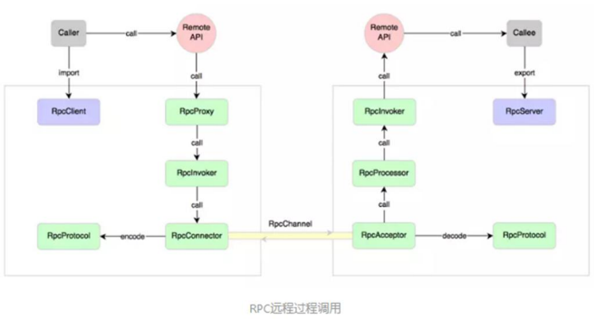
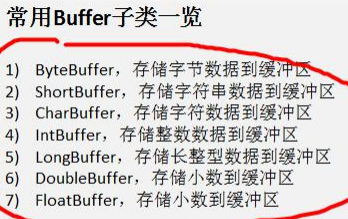

**Netty核心技术及源码剖析**

# 第 6 章 NETTY 核心模块组件

## Bootstrap、ServerBootstrap

### 1) Bootstrap 意思是引导，一个 Netty 应用通常由一个 Bootstrap 开始，主要作用是配置整个 Netty 程序，串联各个组件，Netty 中 Bootstrap 类是客户端程序的启动引导类，ServerBootstrap 是服务端启动引导类2) 常见的方法有public ServerBootstrap group(EventLoopGroup parentGroup, EventLoopGroup childGroup)，该方法用于服务器端，用来设置两个 EventLooppublic B group(EventLoopGroup group) ，该方法用于客户端，用来设置一个 EventLooppublic B channel(Class\<? extends C\> channelClass)，该方法用来设置一个服务器端的通道实现public \<T\> B option(ChannelOption\<T\> option, T value)，用来给 ServerChannel 添加配置public \<T\> ServerBootstrap childOption(ChannelOption\<T\> childOption, T value)，用来给接收到的通道添加配置public ServerBootstrap childHandler(ChannelHandler childHandler)，该方法用来设置业务处理类（自定义的handler）public ChannelFuture bind(int inetPort) ，该方法用于服务器端，用来设置占用的端口号public ChannelFuture connect(String inetHost, int inetPort) ，该方法用于客户端，用来连接服务器端

## Future、ChannelFuture

### Netty 中所有的 IO 操作都是异步的，不能立刻得知消息是否被正确处理。但是可以过一会等它执行完成或者直接注册一个监听，具体的实现就是通过 Future 和 ChannelFutures，他们可以注册一个监听，当操作执行成功或失败时监听会自动触发注册的监听事件常见的方法有Channel channel()，返回当前正在进行 IO 操作的通道ChannelFuture sync()，等待异步操作执行完毕

## Channel

### 1) Netty 网络通信的组件，能够用于执行网络 I/O 操作。2) 通过 Channel 可获得当前网络连接的通道的状态3) 通过 Channel 可获得 网络连接的配置参数 （例如接收缓冲区大小）4) Channel 提供异步的网络 I/O 操作(如建立连接，读写，绑定端口)，异步调用意味着任何 I/O 调用都将立即返回，并且不保证在调用结束时所请求的 I/O 操作已完成5) 调用立即返回一个 ChannelFuture 实例，通过注册监听器到 ChannelFuture 上，可以 I/O 操作成功、失败或取消时回调通知调用方6) 支持关联 I/O 操作与对应的处理程序7) 不同协议、不同的阻塞类型的连接都有不同的 Channel 类型与之对应，常用的 Channel 类型:NioSocketChannel，异步的客户端 TCP Socket 连接。NioServerSocketChannel，异步的服务器端 TCP Socket 连接。NioDatagramChannel，异步的 UDP 连接。NioSctpChannel，异步的客户端 Sctp 连接。NioSctpServerChannel，异步的 Sctp 服务器端连接，这些通道涵盖了 UDP 和 TCP 网络 IO 以及文件 IO

## Selector

### 1) Netty 基于 Selector 对象实现 I/O 多路复用，通过 Selector 一个线程可以监听多个连接的 Channel 事件。2) 当向一个 Selector 中注册 Channel 后，Selector 内部的机制就可以自动不断地查询(Select) 这些注册的Channel 是否有已就绪的 I/O 事件（例如可读，可写，网络连接完成等），这样程序就可以很简单地使用一个线程高效地管理多个 Channel

## ChannelHandler 及其实现类

### 1) ChannelHandler 是一个接口，处理 I/O 事件或拦截 I/O 操作，并将其转发到其 ChannelPipeline(业务处理链)中的下一个处理程序。2) ChannelHandler 本身并没有提供很多方法，因为这个接口有许多的方法需要实现，方便使用期间，可以继承它的子类

### ChannelHandler 及其实现类一览图

### 自定义一个 Handler 类去继承 ChannelInboundHandlerAdapter，然后通过重写相应方法实现业务逻辑

## Pipeline 和 ChannelPipeline

### 1) ChannelPipeline 是一个 Handler 的集合，它负责处理和拦截 inbound 或者 outbound 的事件和操作，相当于一个贯穿 Netty 的链。(也可以这样理解：ChannelPipeline 是 保存 ChannelHandler 的 List，用于处理或拦截Channel 的入站事件和出站操作)2) ChannelPipeline 实现了一种高级形式的拦截过滤器模式，使用户可以完全控制事件的处理方式，以及 Channel中各个的 ChannelHandler

### 在 Netty 中每个 Channel 都有且仅有一个 ChannelPipeline 与之对应，它们的组成关系如下

### 常用方法ChannelPipeline addFirst(ChannelHandler... handlers)，把一个业务处理类（handler）添加到链中的第一个位置ChannelPipeline addLast(ChannelHandler... handlers)，把一个业务处理类（handler）添加到链中的最后一个位置

## ChannelHandlerContext

### 1) 保存 Channel 相关的所有上下文信息，同时关联一个 ChannelHandler 对象2) 即 ChannelHandlerContext 中 包 含 一 个 具 体 的 事 件 处 理 器 ChannelHandler ， 同 时ChannelHandlerContext 中也绑定了对应的 pipeline 和 Channel 的信息，方便对 ChannelHandler 进行调用.

### 常用方法

## ChannelOption

### 1) Netty 在创建 Channel 实例后,一般都需要设置 ChannelOption 参数。2) ChannelOption 参数如下

## EventLoopGroup 和其实现类 NioEventLoopGroup

### 1) EventLoopGroup 是一组 EventLoop 的抽象，Netty 为了更好的利用多核 CPU 资源，一般会有多个 EventLoop同时工作，每个 EventLoop 维护着一个 Selector 实例。2) EventLoopGroup 提供 next 接口，可以从组里面按照一定规则获取其中一个 EventLoop 来处理任务。在 Netty服 务 器 端 编 程 中 ， 我 们 一 般 都 需 要 提 供 两 个 EventLoopGroup ， 例 如 ： BossEventLoopGroup 和WorkerEventLoopGroup。

### 3) 通常一个服务端口即一个 ServerSocketChannel 对应一个 Selector 和一个 EventLoop 线程。BossEventLoop 负责接收客户端的连接并将 SocketChannel 交给 WorkerEventLoopGroup 来进行 IO 处理，如

### 4) 常用方法public NioEventLoopGroup()，构造方法public Future\<?\> shutdownGracefully()，断开连接，关闭线程

## Unpooled 类

### 1) Netty 提供一个专门用来操作缓冲区(即 Netty 的数据容器)的工具类2) 常用方法如下所示

### NettyByteBuf01.java

### NettyByteBuf02.java

## 群聊系统实例

### GroupChatServerHandler.java

### GroupChatClient.java

### GroupChatServer.java

### GroupChatClientHandler.java

### User.java

## Netty 心跳检测机制案例

### MyServer.java

### MyServerHandler.java

### Test.java

## Netty 通过 WebSocket 编程实现服务器和客户端长连接

### hello.html

### MyServer.java

### MyTextWebSocketFrameHandler.java

# 第 7 章 GOOGLE PROTOBUF

## 编码和解码的基本介绍

### 1) 编写网络应用程序时，因为数据在网络中传输的都是二进制字节码数据，在发送数据时就需要编码，接收数据时就需要解码 [示意图]2) codec(编解码器) 的组成部分有两个：decoder(解码器)和 encoder(编码器)。encoder 负责把业务数据转换成字节码数据，decoder 负责把字节码数据转换成业务数据

## Netty 本身的编码解码的机制和问题分析

### 1) Netty 自身提供了一些 codec(编解码器)2) Netty 提供的编码器StringEncoder，对字符串数据进行编码ObjectEncoder，对 Java 对象进行编码... 3) Netty 提供的解码器StringDecoder, 对字符串数据进行解码ObjectDecoder，对 Java 对象进行解码... 4) Netty 本身自带的 ObjectDecoder 和 ObjectEncoder 可以用来实现 POJO 对象或各种业务对象的编码和解码，底层使用的仍是 Java 序列化技术 , 而 Java 序列化技术本身效率就不高，存在如下问题无法跨语言序列化后的体积太大，是二进制编码的 5 倍多。序列化性能太低5) =\> 引出 新的解决方案 [Google 的 Proto

## Protobuf

### 1) Protobuf 基本介绍和使用示意图2) Protobuf 是 Google 发布的开源项目，全称 Google Protocol Buffers，是一种轻便高效的结构化数据存储格式，可以用于结构化数据串行化，或者说序列化。它很适合做数据存储或 RPC[远程过程调用 remote procedurecall ] 数据交换格式 。目前很多公司 http+json tcp+protobuf3) 参考文档 : https://developers.google.com/protocol-buffers/docs/proto 语言指南4) Protobuf 是以 message 的方式来管理数据的. 5) 支持跨平台、跨语言，即[客户端和服务器端可以是不同的语言编写的] （支持目前绝大多数语言，例如 C++、C\#、Java、python 等）6) 高性能，高可靠性7) 使用 protobuf 编译器能自动生成代码，Protobuf 是将类的定义使用.proto 文件进行描述。说明，在 idea 中编写 .proto 文件时，会自动提示是否下载 .ptotot 编写插件. 可以让语法高亮。8) 然后通过 protoc.exe 编译器根据.proto 自动生成.java 文件9) protobuf 使用示意图

## Protobuf 快速入门实例

### codec.zip

### codec2.zip

# 第 8 章 NETTY 编解码器和 HANDLER 的调用机制

## 基本说明

### 1) netty 的组件设计：Netty 的主要组件有 Channel、EventLoop、ChannelFuture、ChannelHandler、ChannelPipe 等2) ChannelHandler 充当了处理入站和出站数据的应用程序逻辑的容器。例如，实现 ChannelInboundHandler 接口（或ChannelInboundHandlerAdapter），你就可以接收入站事件和数据，这些数据会被业务逻辑处理。当要给客户端发 送 响 应 时 ， 也 可 以 从 ChannelInboundHandler 冲 刷 数 据 。 业 务 逻 辑 通 常 写 在 一 个 或 者 多 个ChannelInboundHandler 中。ChannelOutboundHandler 原理一样，只不过它是用来处理出站数据的3) ChannelPipeline 提供了 ChannelHandler 链的容器。以客户端应用程序为例，如果事件的运动方向是从客户端到服务端的，那么我们称这些事件为出站的，即客户端发送给服务端的数据会通过 pipeline 中的一系列ChannelOutboundHandler，并被这些 Handler 处理，反之则称为入站的

## 编码解码器

### 1) 当 Netty 发送或者接受一个消息的时候，就将会发生一次数据转换。入站消息会被解码：从字节转换为另一种格式（比如 java 对象）；如果是出站消息，它会被编码成字节。2) Netty 提供一系列实用的编解码器，他们都实现了 ChannelInboundHadnler 或者 ChannelOutboundHandler 接口。在这些类中，channelRead 方法已经被重写了。以入站为例，对于每个从入站 Channel 读取的消息，这个方法会被调用。随后，它将调用由解码器所提供的 decode()方法进行解码，并将已经解码的字节转发给 ChannelPipeline中的下一个 ChannelInboundHandler

## 解码器-ByteToMessageDecoder

### 关系继承图

### 2) 由于不可能知道远程节点是否会一次性发送一个完整的信息，tcp 有可能出现粘包拆包的问题，这个类会对入站数据进行缓冲，直到它准备好被处理

### 一个关于 ByteToMessageDecoder 实例

## Netty 的 handler 链的调用机制

### 

### 不论解码器 handler 还是 编码器 handler 即接收的消息类型必须与待处理的消息类型一致，否则该 handler 不会被执行在解码器 进行数据解码时，需要判断 缓存区(ByteBuf)的数据是否足够 ，否则接收到的结果会期望结果可能不一致

## 解码器-ReplayingDecoder

### 1) public abstract class ReplayingDecoder\<S\> extends ByteToMessageDecoder2) ReplayingDecoder 扩展了 ByteToMessageDecoder 类，使用这个类，我们不必调用 readableBytes()方法。参数 S指定了用户状态管理的类型，其中 Void代表不需要状态管理3) ReplayingDecoder 使用方便，但它也有一些局限性：1. 并 不 是 所 有 的 ByteBuf 操 作 都 被 支 持 ， 如 果 调 用 了 一 个 不 被 支 持 的 方 法 ， 将 会 抛 出 一 个UnsupportedOperationException。2. ReplayingDecoder 在某些情况下可能稍慢于 ByteToMessageDecoder，例如网络缓慢并且消息格式复杂时，消息会被拆成了多个碎片，速度变慢

## 其它编解码器

### 其它解码器

-   1) LineBasedFrameDecoder：这个类在 Netty 内部也有使用，它使用行尾控制字符（\\n 或者\\r\\n）作为分隔符来解析数据。2) DelimiterBasedFrameDecoder：使用自定义的特殊字符作为消息的分隔符。3) HttpObjectDecoder：一个 HTTP 数据的解码器4) LengthFieldBasedFrameDecoder：通过指定长度来标识整包消息，这样就可以自动的处理黏包和半包消息。

### 其它编码器

-   

    

## Log4j 整合到 Netty

### 配置 Log4j , 在 resources/log4j.propertieslog4j.rootLogger=DEBUG, stdoutlog4j.appender.stdout=org.apache.log4j.ConsoleAppenderlog4j.appender.stdout.layout=org.apache.log4j.PatternLayoutlog4j.appender.stdout.layout.ConversionPattern=[%p] %C{1} - %m%n

# 第 9 章 TCP 粘包和拆包 及解决方案

## TCP 粘包和拆包基本介绍

### 1) TCP 是面向连接的，面向流的，提供高可靠性服务。收发两端（客户端和服务器端）都要有一一成对的 socket，因此，发送端为了将多个发给接收端的包，更有效的发给对方，使用了优化方法（Nagle 算法），将多次间隔较小且数据量小的数据，合并成一个大的数据块，然后进行封包。这样做虽然提高了效率，但是接收端就难于分辨出完整的数据包了，因为面向流的通信是无消息保护边界的2) 由于 TCP 无消息保护边界, 需要在接收端处理消息边界问题，也就是我们所说的粘包、拆包问题, 看一张图

### 示意图 TCP 粘包、拆包图解

## 粘包拆包实例

### tcp.zip

## 解决方案

### 1) 使用自定义协议 + 编解码器 来解决2) 关键就是要解决 服务器端每次读取数据长度的问题, 这个问题解决，就不会出现服务器多读或少读数据的问题，从而避免的 TCP 粘包、拆包

### protocoltcp.zip

# 第 10 章 NETTY 核心源码剖析

## 说明1) 源码需要剖析到 Netty 调用 doBind 方法， 追踪到NioServerSocketChannel 的 doBind2) 并且要 Debug 程序到 NioEventLoop 类 的 run 代码 ，无限循环，在服务器端运行。

## 源码剖析代码

### echo2.zip

## NETTY 启动过程源码剖析

### Netty 启动过程源码剖析.docx

## NETTY 接受请求过程源码剖析

### Netty 接受请求过程源码剖析.docx

## PIPELINE HANDLER HANDLERCONTEXT 创建源码剖析

### Pipeline Handler HandlerContext 创建源码剖析.docx

## CHANNELPIPELINE 调度 HANDLER 的源码剖析

### ChannelPipeline 调度 handler 的源码剖析.docx

## NETTY 心跳(HEARTBEAT)服务源码剖析

### Netty 心跳(heartbeat)服务源码剖析.docx

## NETTY 核心组件 EVENTLOOP 源码剖析

### Netty 核心组件 EventLoop 源码剖析.docx

## HANDLER 中加入线程池和 CONTEXT 中添加线程池的源码剖析

### handler 中加入线程池和 Context 中添加线程池的源码剖析.docx

# 第 11 章 用 NETTY 自己 实现 DUBBO RPC252

## RPC 基本介绍

### 1) RPC（Remote Procedure Call）— 远程过程调用，是一个计算机通信协议。该协议允许运行于一台计算机的程序调用另一台计算机的子程序，而程序员无需额外地为这个交互作用编程2) 两个或多个应用程序都分布在不同的服务器上，它们之间的调用都像是本地方法调用一样(如图)

## RPC 调用流

### 

## PRC 调用流

### 1) 服务消费方(client)以本地调用方式调用服务2) client stub 接收到调用后负责将方法、参数等封装成能够进行网络传输的消息体3) client stub 将消息进行编码并发送到服务端4) server stub 收到消息后进行解码5)server stub 根据解码结果调用本地的服务6)本地服务执行并将结果返回给 server stub7)server stub 将返回导入结果进行编码并发送至消费方8)client stub 接收到消息并进行解码9)服务消费方(client)得到结果小结：RPC 的目标就是将 2-8 这些步骤都封装起来，用户无需关心这些细节，可以像调用本地方法一样即可完成远程服务调用

## 自己实现 dubbo RPC(基于 Netty)

### 需求说明

-   1)dubbo 底层使用了 Netty 作为网络通讯框架，要求用 Netty 实现一个简单的 RPC 框架2)模仿 dubbo，消费者和提供者约定接口和协议，消费者远程调用提供者的服务，提供者返回一个字符串，消费者打印提供者返回的数据。底层网络通信使用 Netty 4.1.20

### 11.4.2设计说明

-   1)创建一个接口，定义抽象方法。用于消费者和提供者之间的约定。2)创建一个提供者，该类需要监听消费者的请求，并按照约定返回数据。3)创建一个消费者，该类需要透明的调用自己不存在的方法，内部需要使用 Netty 请求提供者返回数据4)开发的分析图

    

### 代码实现

-   dubborpc.zip

# 第 2 章 Java BIO 编程

## I/O 模型说明

### I/O 模型简单的理解：就是用什么样的通道进行数据的发送和接收，很大程度上决定了程序通信的性能Java BIO ： 同步并阻塞(传统阻塞型)，服务器实现模式为一个连接一个线程，即客户端有连接请求时服务器端就需要启动一个线程进行处理，如果这个连接不做任何事情会造成不必要的线程开销Java NIO ： 同步非阻塞，服务器实现模式为一个线程处理多个请求(连接)，即客户端发送的连接请求都会注册到多路复用器上，多路复用器轮询到连接有 I/O请求进行处理Java AIO(NIO.2) ： 异步非阻塞，AIO 引入异步通道的概念，采用了 Proactor 模式，简化了程序编写，有效的请求才启动线程，它的特点是先由操作系统完成后才通知服务端程序启动线程去处理，一般适用于连接数较多且连接时间较长的应用

## BIO 编程流程

### 1) 服务器端启动一个 ServerSocket2) 客户端启动 Socket 对服务器进行通信，默认情况下服务器端需要对每个客户 建立一个线程与之通讯3) 客户端发出请求后, 先咨询服务器是否有线程响应，如果没有则会等待，或者被拒绝4) 如果有响应，客户端线程会等待请求结束后，在继续执行

## BIO实例

### BIOServer.java

# 第 1章Netty 介绍和应用场景

## 1) Netty 是由 JBOSS 提供的一个 Java 开源框架，现为 Github 上的独立项目。2) Netty 是一个异步的、基于事件驱动的网络应用框架，用以快速开发高性能、高可靠性的网络 IO 程序3) Netty 主要针对在 TCP 协议下，面向 Clients 端的高并发应用，或者 Peer-to-Peer 场景下的大量数据持续传输的应用。4) Netty 本质是一个 NIO 框架，适用于服务器通讯相关的多种应用场景

# 第 5章 Netty高性能架构设计

## 线程模型基本介绍

### 1) 不同的线程模式，对程序的性能有很大影响，为了搞清 Netty 线程模式，我们来系统的讲解下 各个线程模式，最后看看 Netty 线程模型有什么优越性. 2) 目前存在的线程模型有：传统阻塞 I/O 服务模型Reactor 模式3) 根据 Reactor 的数量和处理资源池线程的数量不同，有 3 种典型的实现单 Reactor 单线程；单 Reactor 多线程；主从 Reactor 多线程4) Netty 线程模式(Netty 主要基于主从 Reactor 多线程模型做了一定的改进，其中主从 Reactor 多线程模型有多个 Reactor)

## 传统阻塞 I/O 服务模型

### 工作原理图

-   1) 黄色的框表示对象， 蓝色的框表示线程2) 白色的框表示方法(API)

    

### 模型特点

-   1) 采用阻塞 IO 模式获取输入的数据2) 每个连接都需要独立的线程完成数据的输入，业务处理, 数据返回

### 问题分析

-   1) 当并发数很大，就会创建大量的线程，占用很大系统资源2) 连接创建后，如果当前线程暂时没有数据可读，该线程会阻塞在 read 操作，造成线程资源

## Reactor 模式

### 解决传统阻塞 I/O 服务模型的缺点

-   1) 基于 I/O 复用模型：多个连接共用一个阻塞对象，应用程序只需要在一个阻塞对象等待，无需阻塞等待所有连接。当某个连接有新的数据可以处理时，操作系统通知应用程序，线程从阻塞状态返回，开始进行业务处理Reactor 对应的叫法: 1. 反应器模式 2. 分发者模式(Dispatcher) 3. 通知者模式(notifier）2) 基于线程池复用线程资源：不必再为每个连接创建线程，将连接完成后的业务处理任务分配给线程进行处理，一个线程可以处理多个连接的业务。

### 复用结合线程池

-   

    

-   1) Reactor 模式，通过一个或多个输入同时传递给服务处理器的模式(基于事件驱动)2) 服务器端程序处理传入的多个请求,并将它们同步分派到相应的处理线程， 因此 Reactor 模式也叫 Dispatcher模式3) Reactor 模式使用 IO 复用监听事件, 收到事件后，分发给某个线程(进程), 这点就是网络服务器高并发处理关键

### 核心组成

-   1) Reactor：Reactor 在一个单独的线程中运行，负责监听和分发事件，分发给适当的处理程序来对 IO 事件做出反应。 它就像公司的电话接线员，它接听来自客户的电话并将线路转移到适当的联系人；2) Handlers：处理程序执行 I/O 事件要完成的实际事件，类似于客户想要与之交谈的公司中的实际官员。Reactor通过调度适当的处理程序来响应 I/O 事件，处理程序执行非阻塞操作。

### 模式分类

-   单 Reactor 单线程

    •

    

    • 方案说明

    • 1) Select 是前面 I/O 复用模型介绍的标准网络编程 API，可以实现应用程序通过一个阻塞对象监听多路连接请求2) Reactor 对象通过 Select 监控客户端请求事件，收到事件后通过 Dispatch 进行分发3) 如果是建立连接请求事件，则由 Acceptor 通过 Accept 处理连接请求，然后创建一个 Handler 对象处理连接完成后的后续业务处理4) 如果不是建立连接事件，则 Reactor 会分发调用连接对应的 Handler 来响应5) Handler 会完成 Read→业务处理→Send 的完整业务流程

    • 方案优缺点分析

    • 1) 优点：模型简单，没有多线程、进程通信、竞争的问题，全部都在一个线程中完成2) 缺点：性能问题，只有一个线程，无法完全发挥多核 CPU 的性能。Handler 在处理某个连接上的业务时，整个进程无法处理其他连接事件，很容易导致性能瓶颈3) 缺点：可靠性问题，线程意外终止，或者进入死循环，会导致整个系统通信模块不可用，不能接收和处理外部消息，造成节点故障4) 使用场景：客户端的数量有限，业务处理非常快速，比如 Redis 在业务处理的时间复杂度 O(1) 的情况

-   单 Reactor 多线程

    •

    

    • 方案说明

    • 1) Reactor 对象通过 select 监控客户端请求事件, 收到事件后，通过 dispatch 进行分发2) 如果建立连接请求, 则右 Acceptor 通过accept 处理连接请求, 然后创建一个 Handler 对象处理完成连接后的各种事件3) 如果不是连接请求，则由 reactor 分发调用连接对应的 handler 来处理4) handler 只负责响应事件，不做具体的业务处理, 通过 read 读取数据后，会分发给后面的 worker 线程池的某个线程处理业务5) worker 线程池会分配独立线程完成真正的业务，并将结果返回给 handler6) handler 收到响应后，通过 send将结果返回给 client

    • 优缺点分析

    • 1) 优点：可以充分的利用多核 cpu 的处理能力2) 缺点：多线程数据共享和访问比较复杂， reactor 处理所有的事件的监听和响应，在单线程运行， 在高并发场景容易出现性能瓶颈

-   主从 Reactor 多线程

    •

    

    • 方案说明

    • 1) Reactor 主线程 MainReactor 对象通过 select 监听连接事件, 收到事件后，通过 Acceptor 处理连接事件2) 当 Acceptor 处理连接事件后，MainReactor 将连接分配给 SubReactor3) subreactor 将连接加入到连接队列进行监听,并创建 handler 进行各种事件处理4) 当有新事件发生时， subreactor 就会调用对应的 handler 处理5) handler 通过 read 读取数据，分发给后面的 worker 线程处理6) worker 线程池分配独立的 worker 线程进行业务处理，并返回结果7) handler 收到响应的结果后，再通过 send 将结果返回给 client8) Reactor 主线程可以对应多个 Reactor 子线程, 即 MainRecator 可以关联多个 SubR

    • 优缺点说明

    • 1) 优点：父线程与子线程的数据交互简单职责明确，父线程只需要接收新连接，子线程完成后续的业务处理。2) 优点：父线程与子线程的数据交互简单，Reactor 主线程只需要把新连接传给子线程，子线程无需返回数据。3) 缺点：编程复杂度较高4) 结合实例：这种模型在许多项目中广泛使用，包括 Nginx 主从 Reactor 多进程模型，Memcached 主从多线程，Netty 主从多线程模型的支持

### 模式优点

-   1) 响应快，不必为单个同步时间所阻塞，虽然 Reactor 本身依然是同步的2) 可以最大程度的避免复杂的多线程及同步问题，并且避免了多线程/进程的切换开销3) 扩展性好，可以方便的通过增加 Reactor 实例个数来充分利用 CPU 资源4) 复用性好，Reactor 模型本身与具体事件处理逻辑无关，具有很高的复用性

## Netty 模型

### 初级

-   

    

-   1) BossGroup 线程维护 Selector , 只关注 Accecpt2) 当接收到 Accept 事件，获取到对应的 SocketChannel, 封装成 NIOScoketChannel 并注册到 Worker 线程(事件循环), 并进行维护3) 当 Worker 线程监听到 selector 中通道发生自己感兴趣的事件后，就进行处理(就由 handler)， 注意 handler 已经加入到通道

### 中级

-   

    

### 高级

-   

    

-   1) Netty 抽象出两组线程池 BossGroup 专门负责接收客户端的连接, WorkerGroup 专门负责网络的读写2) BossGroup 和 WorkerGroup 类型都是 NioEventLoopGroup3) NioEventLoopGroup 相当于一个事件循环组, 这个组中含有多个事件循环 ，每一个事件循环是 NioEventLoop4) NioEventLoop 表示一个不断循环的执行处理任务的线程， 每个 NioEventLoop 都有一个 selector , 用于监听绑定在其上的 socket 的网络通讯5) NioEventLoopGroup 可以有多个线程, 即可以含有多个 NioEventLoop6) 每个 Boss NioEventLoop 循环执行的步骤有 3 步 轮询 accept 事件 处理 accept 事件 , 与 client 建立连接 , 生成 NioScocketChannel , 并将其注册到某个 worker NIOEventLoop 上的 selector 处理任务队列的任务 ， 即 runAllTasks7) 每个 Worker NIOEventLoop 循环执行的步骤 轮询 read, write 事件 处理 i/o 事件， 即 read , write 事件，在对应 NioScocketChannel 处理 处理任务队列的任务 ， 即 runAllTasks8) 每个Worker NIOEventLoop 处理业务时，会使用pipeline(管道), pipeline 中包含了 channel , 即通过pipeline可以获取到对应通道, 管道中维护了很多的 处理器

### TCP 服务实例

-   NettyServer.java
-   NettyServerHandler.java
-   NettyClient.java
-   NettyClientHandler.java

### 任务队列中的 Task 有 3 种典型使用场景

-   1) 用户程序自定义的普通任务2) 用户自定义定时任务3) 非当前 Reactor 线程调用 Channel 的各种方法

    • NettyServerHandler.java

### 方案再说明

-   1) Netty 抽象出两组线程池，BossGroup 专门负责接收客户端连接，WorkerGroup 专门负责网络读写操作。2) NioEventLoop 表示一个不断循环执行处理任务的线程，每个 NioEventLoop 都有一个 selector，用于监听绑定在其上的 socket 网络通道。3) NioEventLoop 内部采用串行化设计，从消息的读取-\>解码-\>处理-\>编码-\>发送，始终由 IO 线程 NioEventLoop负责 NioEventLoopGroup 下包含多个 NioEventLoop 每个 NioEventLoop 中包含有一个 Selector，一个 taskQueue 每个 NioEventLoop 的 Selector 上可以注册监听多个 NioChannel 每个 NioChannel 只会绑定在唯一的 NioEventLoop 上 每个 NioChannel 都绑定有一个自己的 ChannelPipeline

## 异步模型

### 基本介绍

-   1) 异步的概念和同步相对。当一个异步过程调用发出后，调用者不能立刻得到结果。实际处理这个调用的组件在完成后，通过状态、通知和回调来通知调用者。2) Netty 中的 I/O 操作是异步的，包括 Bind、Write、Connect 等操作会简单的返回一个 ChannelFuture。3) 调用者并不能立刻获得结果，而是通过 Future-Listener 机制，用户可以方便的主动获取或者通过通知机制获得IO 操作结果4) Netty 的异步模型是建立在 future 和 callback 的之上的。callback 就是回调。重点说 Future，它的核心思想是：假设一个方法 fun，计算过程可能非常耗时，等待 fun 返回显然不合适。那么可以在调用 fun 的时候，立马返回一个 Future，后续可以通过 Future 去监控方法 fun 的处理过程(即 ： Future-Listener机制）

### Future 说明

-   1) 表示异步的执行结果, 可以通过它提供的方法来检测执行是否完成，比如检索计算等等. 2) ChannelFuture 是一个接口 ： public interface ChannelFuture extends Future\<Void\>我们可以添加监听器，当监听的事件发生时，就会通知到监听器.

### 工作原理示意图

-   

    

-   1) 在使用 Netty 进行编程时，拦截操作和转换出入站数据只需要您提供 callback 或利用 future 即可。这使得链式操作简单、高效, 并有利于编写可重用的、通用的代码。2) Netty 框架的目标就是让你的业务逻辑从网络基础应用编码中分离出来、解脱出来

### Future-Listener 机制

-   1) 当 Future 对象刚刚创建时，处于非完成状态，调用者可以通过返回的 ChannelFuture 来获取操作执行的状态，注册监听函数来执行完成后的操作。2) 常见有如下操作 通过 isDone 方法来判断当前操作是否完成； 通过 isSuccess 方法来判断已完成的当前操作是否成功； 通过 getCause 方法来获取已完成的当前操作失败的原因； 通过 isCancelled 方法来判断已完成的当前操作是否被取消； 通过 addListener 方法来注册监听器，当操作已完成(isDone 方法返回完成)，将会通知指定的监听器；如果Future 对象已完成，则通知指定的监听器

### 实例展示

-   //绑定一个端口并且同步, 生成了一个 ChannelFuture 对象//启动服务器(并绑定端口)ChannelFuture cf = bootstrap.bind(6668).sync();//给 cf 注册监听器，监控我们关心的事件cf.addListener(new ChannelFutureListener() {@Overridepublic void operationComplete(ChannelFuture future) throws Exception {if (cf.isSuccess()) {System.out.println("监听端口 6668 成功");} else {System.out.println("监听端口 6668 失败");}}});

## HTTP 服务

### TestServer.java

### TestServerInitializer.java

### TestHttpServerHandler.java

# 第 3章 Java NIO 编程

## 介绍

### NIO 是 面向缓冲区 ，或者面向 块 编程的。数据读取到一个它稍后处理的缓冲区，需要时可在缓冲区中前后移动，这就增加了处理过程中的灵活性，使用它可以提供非阻塞式的高伸缩性网络Java NIO 的非阻塞模式，使一个线程从某通道发送请求或者读取数据，但是它仅能得到目前可用的数据，如果目前没有数据可用时，就什么都不会获取，而不是保持线程阻塞，所以直至数据变的可以读取之前，该线程可以继续做其他的事情。 非阻塞写也是如此，一个线程请求写入一些数据到某通道，但不需要等待它完全写入，这个线程同时可以去做别的事情。

## NIO 和 BIO 的比较

### 1) BIO 以流的方式处理数据,而 NIO 以块的方式处理数据,块 I/O 的效率比流 I/O 高很多2) BIO 是阻塞的，NIO 则是非阻塞的3) BIO 基于字节流和字符流进行操作，而 NIO 基于 Channel(通道)和 Buffer(缓冲区)进行操作，数据总是从通道读取到缓冲区中，或者从缓冲区写入到通道中。Selector(选择器)用于监听多个通道的事件（比如：连接请求，数据到达等），因此使用单个线程就可以监听多个客户端通道

## NIO 三大核心

### Selector 、 Channel 和 Buffer

-   

    

-   1) 每个 channel 都会对应一个 Buffer2) Selector 对应一个线程， 一个线程对应多个 channel(连接)3) 该图反应了有三个 channel 注册到 该 selector //程序4) 程序切换到哪个 channel 是有事件决定的, Event 就是一个重要的概念5) Selector 会根据不同的事件，在各个通道上切换6) Buffer 就是一个内存块 ， 底层是有一个数组7) 数据的读取写入是通过 Buffer, 这个和 BIO , BIO 中要么是输入流，或者是输出流, 不能双向，但是 NIO 的 Buffer 是可以读也可以写, 需要 flip 方法切换channel 是双向的, 可以返回底层操作系统的情况, 比如 Linux ， 底层的操作系统通道就是双向的.

### 缓冲区(Buffer)

-   基本介绍

    • 缓冲区（Buffer）：缓冲区本质上是一个可以读写数据的内存块，可以理解成是一个容器对象(含数组)，该对象提供了一组方法，可以更轻松地使用内存块，，缓冲区对象内置了一些机制，能够跟踪和记录缓冲区的状态变化情况。Channel 提供从文件、网络读取数据的渠道，但是读取或写入的数据都必须经由 Buffer

-   Buffer 类及其子类

    • 在 NIO 中，Buffer 是一个顶层父类，它是一个抽象类, 类的层级关系图:

    

    • Buffer 类定义了所有的缓冲区都具有的四个属性来提供关于其所包含的数据元素的信息:

    

    • Buffer 类相关方法一览

    

-   ByteBuffer

    • 对于 Java 中的基本数据类型(boolean 除外)，都有一个 Buffer 类型与之相对应，最常用的自然是 ByteBuffer 类（二进制数据），该类的主要方法如下：

    

### 通道(Channel)

-   基本介绍

    • 1) NIO 的通道类似于流，但有些区别如下： 通道可以同时进行读写，而流只能读或者只能写 通道可以实现异步读写数据 通道可以从缓冲读数据，也可以写数据到缓冲:

    • 2) BIO 中的 stream 是单向的，例如 FileInputStream 对象只能进行读取数据的操作，而 NIO 中的通道(Channel)是双向的，可以读操作，也可以写操作。3) Channel 在 NIO 中是一个接口public interface Channel extends Closeable{}4) 常 用 的 Channel 类 有 ： FileChannel 、 DatagramChannel 、 ServerSocketChannel 和 SocketChannel 。【ServerSocketChanne 类似 ServerSocket , SocketChannel 类似 Sock5) FileChannel 用于文件的数据读写，DatagramChannel 用于 UDP 的数据读写，ServerSocketChannel 和SocketChannel 用于 TCP 的数据读写

-   FileChannel 类

    • FileChannel 主要用来对本地文件进行 IO 操作，常见的方法 public int read(ByteBuffer dst) ，从通道读取数据并放到缓冲区中 public int write(ByteBuffer src) ，把缓冲区的数据写到通道中 public long transferFrom(ReadableByteChannel src, long position, long count)，从目标通道中复制数据到当前通道 public long transferTo(long position, long count, WritableByteChannel target)，把数据从当前通道复制给目标通道

-   本地写数据

    • NIOFileChannel01.java

-   本地文件读数据

    • NIOFileChannel02.java

-   使用一个 Buffer 完成文件读取、写

    • NIOFileChannel03.java

-   拷贝文件 transferFrom 方法

    • NIOFileChannel04.java

-   Buffer 和 Channel 的注意

    • ByteBuffer 支持类型化的 put 和 get, put 放入的是什么数据类型，get 就应该使用相应的数据类型来取出，否则可能有 BufferUnderflowException 异常

    • NIOByteBufferPutGet.java

    • 可以将一个普通 Buffer 转成只读 Buffer

    • ReadOnlyBuffer.java

    • NIO 还提供了 MappedByteBuffer， 可以让文件直接在内存（堆外的内存）中进行修改， 而如何同步到文件由 NIO 来完成.

    • MappedByteBufferTest.java

    • NIO 还支持 通过多个 Buffer (即 Buffer 数组) 完成读写操作，即 Scattering 和 Gathering

    • ScatteringAndGatheringTest.java

### Selector(选择器)

-   基本介绍

    • 1) Java 的 NIO，用非阻塞的 IO 方式。可以用一个线程，处理多个的客户端连接，就会使用到 Selector(选择器)2) Selector 能够检测多个注册的通道上是否有事件发生(注意:多个 Channel 以事件的方式可以注册到同一个Selector)，如果有事件发生，便获取事件然后针对每个事件进行相应的处理。这样就可以只用一个单线程去管理多个通道，也就是管理多个连接和请求。3) 只有在 连接/通道 真正有读写事件发生时，才会进行读写，就大大地减少了系统开销，并且不必为每个连接都创建一个线程，不用去维护多个线程4) 避免了多线程之间的上下文切换导致的开销

-   Selector 示意图和特点说明

    •

    

    • 1) Netty 的 IO 线程 NioEventLoop 聚合了 Selector(选择器，也叫多路复用器)，可以同时并发处理成百上千个客户端连接。2) 当线程从某客户端 Socket 通道进行读写数据时，若没有数据可用时，该线程可以进行其他任务。3) 线程通常将非阻塞 IO 的空闲时间用于在其他通道上执行 IO 操作，所以单独的线程可以管理多个输入和输出通道。4) 由于读写操作都是非阻塞的，这就可以充分提升 IO 线程的运行效率，避免由于频繁 I/O 阻塞导致的线程挂起。5) 一个 I/O 线程可以并发处理 N 个客户端连接和读写操作，这从根本上解决了传统同步阻塞 I/O 一连接一线程模型，架构的性能、弹性伸缩能力和可靠性都得到了极大的提升。

-   Selector 类相关方法

    

-   注意事项

    • 1) NIO 中的 ServerSocketChannel 功能类似 ServerSocket，SocketChannel 功能类似 Socket2) selector 相关方法说明selector.select()//阻塞selector.select(1000);//阻塞 1000 毫秒，在 1000 毫秒后返回selector.wakeup();//唤醒 selectorselector.selectNow();//不阻塞，立马返还

## NIO 非阻塞 网络编程原理分析图

### NIO 非阻塞 网络编程相关的(Selector、SelectionKey、ServerScoketChannel 和 SocketChannel)

### 1) 当客户端连接时，会通过 ServerSocketChannel 得到 SocketChannel2) Selector 进行监听 select 方法, 返回有事件发生的通道的个数.3) 将 socketChannel 注册到 Selector 上, register(Selector sel, int ops), 一个 selector 上可以注册多个 SocketChannel4) 注册后返回一个 SelectionKey, 会和该 Selector 关联(集合)5) 进一步得到各个 SelectionKey (有事件发生)6) 在通过 SelectionKey 反向获取 SocketChannel , 方法 channel()7) 可以通过 得到的 channel , 完成业务处理

## NIO 非阻塞 网络编程实例

### NIOServer.java

### NIOClient.java

## SelectionKey

### 1) SelectionKey，表示 Selector 和网络通道的注册关系, 共四种int OP_ACCEPT：有新的网络连接可以 accept，值为 16int OP_CONNECT：代表连接已经建立，值为 8int OP_READ：代表读操作，值为 1int OP_WRITE：代表写操作，值为 4源码中：public static final int OP_READ = 1 \<\< 0;public static final int OP_WRITE = 1 \<\< 2;public static final int OP_CONNECT = 1 \<\< 3;public static final int OP_ACCEPT = 1 \<\< 4

### 2) SelectionKey 相关方法

## ServerSocketChannel

### 1) ServerSocketChannel 在服务器端监听新的客户端 Socket 连接2) 相关方法如下：

## SocketChannel

### 1) SocketChannel，网络 IO 通道，具体负责进行读写操作。NIO 把缓冲区的数据写入通道，或者把通道里的数据读到缓冲区。2) 相关方法如下

## NIO 网络编程应用实例-群聊系统

### 服务器端

-   GroupChatServer.java

### 客户端

-   GroupChatClient.java

## NIO 与零拷贝

### 传统 IO 数据读写

-   

    

-   

    

### mmap 优化

-   1) mmap 通过内存映射，将文件映射到内核缓冲区，同时，用户空间可以共享内核空间的数据。这样，在进行网络传输时，就可以减少内核空间到用户空间的拷贝次数。2) mmap 示意

    

### sendFile 优化

-   1) Linux 2.1 版本 提供了 sendFile 函数，其基本原理如下：数据根本不经过用户态，直接从内核缓冲区进入到Socket Buffer，同时，由于和用户态完全无关，就减少了一次上下文切换2) 示意图和小结3) 提示：零拷贝从操作系统角度，是没有 cpu 拷贝

    

-   4) Linux 在 2.4 版本中，做了一些修改，避免了从内核缓冲区拷贝到 Socket buffer 的操作，直接拷贝到协议栈，从而再一次减少了数据拷贝。具体如下图和小结：5) 这里其实有 一次 cpu 拷贝kernel buffer -\> socket buffer但是，拷贝的信息很少，比如 lenght , offset , 消耗低，可以忽略

    

### 零拷贝的再次理解

-   1) 我们说零拷贝，是从操作系统的角度来说的。因为内核缓冲区之间，没有数据是重复的（只有 kernel buffer 有一份数据）。2) 零拷贝不仅仅带来更少的数据复制，还能带来其他的性能优势，例如更少的上下文切换，更少的 CPU 缓存伪共享以及无 CPU 校验和计算

### mmap 和 sendFile区别

-   1) mmap 适合小数据量读写，sendFile 适合大文件传输。2) mmap 需要 4 次上下文切换，3 次数据拷贝；sendFile 需要 3 次上下文切换，最少 2 次数据拷贝。3) sendFile 可以利用 DMA 方式，减少 CPU 拷贝，mmap 则不能（必须从内核拷贝到 Socket 缓冲区）

### NIO 零拷贝实例

-   NewIOClient.java
-   NewIOServer.java
-   OldIOServer.java
-   OldIOClient.java

## Java AIO 基本介绍

### 1) JDK 7 引入了 Asynchronous I/O，即 AIO。在进行 I/O 编程中，常用到两种模式：Reactor 和 Proactor。Java 的NIO 就是 Reactor，当有事件触发时，服务器端得到通知，进行相应的处理2) AIO 即 NIO2.0，叫做异步不阻塞的 IO。AIO 引入异步通道的概念，采用了 Proactor 模式，简化了程序编写，有效的请求才启动线程，它的特点是先由操作系统完成后才通知服务端程序启动线程去处理，一般适用于连接数较多且连接时间较长的应用

## BIO、NIO、AIO 对比表

### 

# 第 4 章 Netty 概述

## 原生 NIO 存在的问题

### 1) NIO 的类库和 API 繁杂，使用麻烦：需要熟练掌握 Selector、ServerSocketChannel、SocketChannel、ByteBuffer等。2) 需要具备其他的额外技能：要熟悉 Java 多线程编程，因为 NIO 编程涉及到 Reactor 模式，你必须对多线程和网络编程非常熟悉，才能编写出高质量的 NIO 程序。3) 开发工作量和难度都非常大：例如客户端面临断连重连、网络闪断、半包读写、失败缓存、网络拥塞和异常流的处理等等。4) JDK NIO 的 Bug：例如臭名昭著的 Epoll Bug，它会导致 Selector 空轮询，最终导致 CPU 100%。直到 JDK 1.7版本该问题仍旧存在，没有被根本解决。

## Netty 的优点

### 1) 设计优雅：适用于各种传输类型的统一 API 阻塞和非阻塞 Socket；基于灵活且可扩展的事件模型，可以清晰地分离关注点；高度可定制的线程模型 - 单线程，一个或多个线程池. 2) 使用方便：详细记录的 Javadoc，用户指南和示例；没有其他依赖项，JDK 5（Netty 3.x）或 6（Netty 4.x）就足够了。3) 高性能、吞吐量更高：延迟更低；减少资源消耗；最小化不必要的内存复制。4) 安全：完整的 SSL/TLS 和 StartTLS 支持。5) 社区活跃、不断更新：社区活跃，版本迭代周期短，发现的 Bug 可以被及时修复，同时，更多的新功能会被加入
