**Nginx使用**

# Nginx概述

## HTTP基础功能

### 

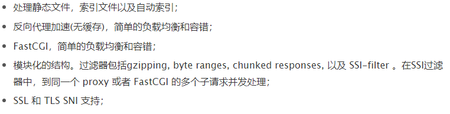

## IMAP/POP3 代理服务功能

### 

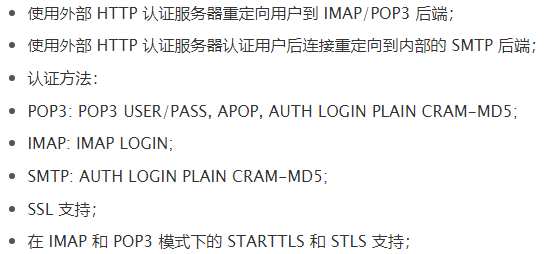

## 支持的操作系统

### 

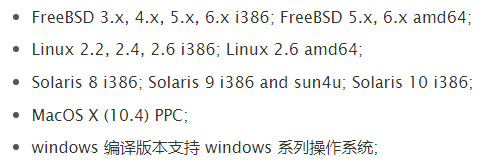

## 结构与扩展

### 

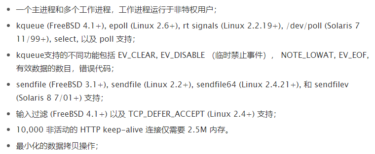

## 其他HTTP功能

### 

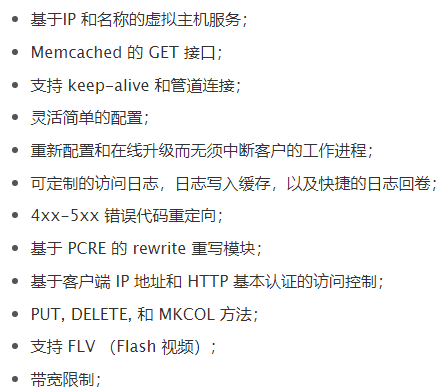

## 实验特性

### 

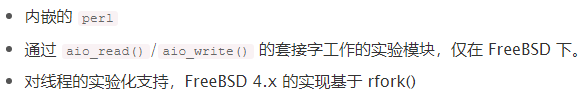

## 优越性

### 

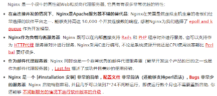

# nginx配置

## 安装Nginx

### 

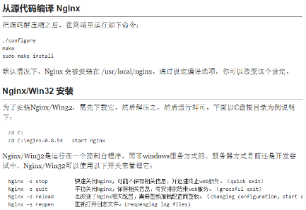

## 命令行参数和信号

### nginx命令行参数

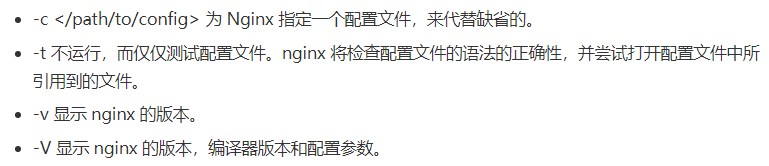

### nginx 控制信号

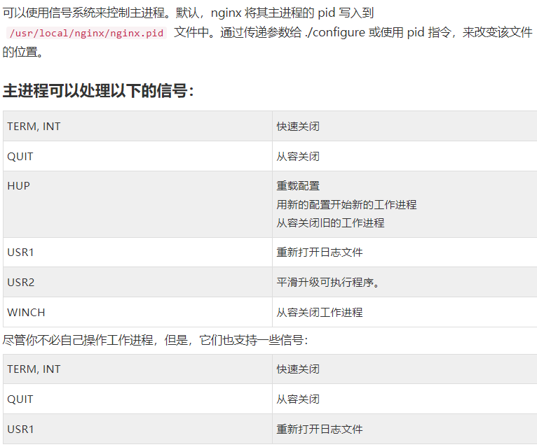

### nginx 启动、停止、重启命令

-   

    

-   

    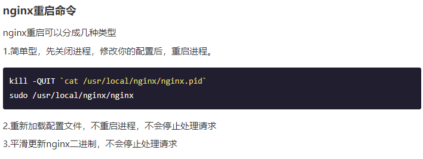

    •

    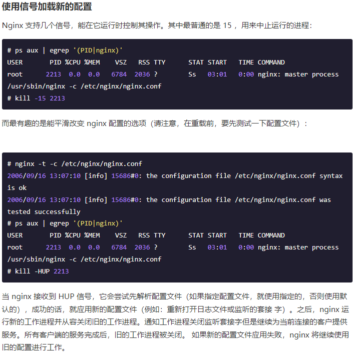

    •

    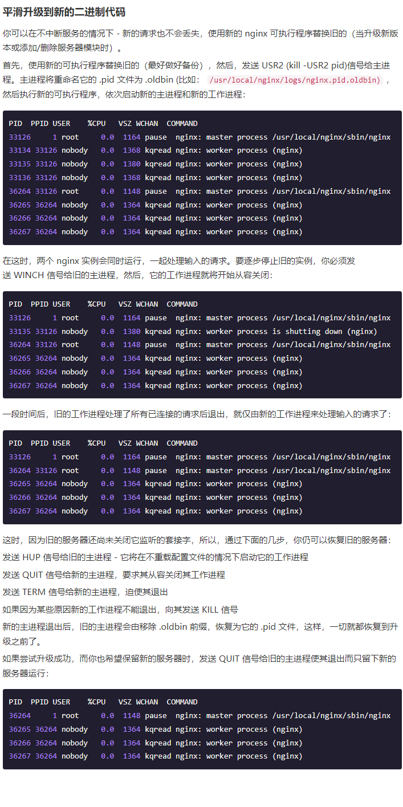

### 优化 Nginx

-   

    

-   

    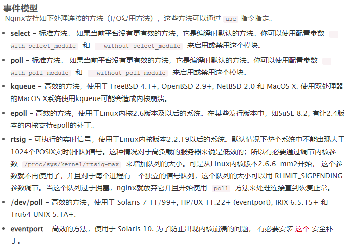

## rewrite配置

### Nginx正则匹配符说明

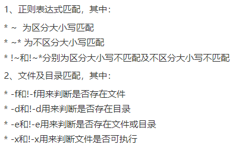

### 全局变量

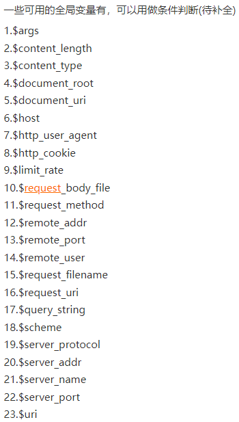

-   

    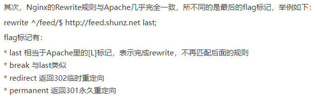

### rewrite配置实例

-   重定向规则

    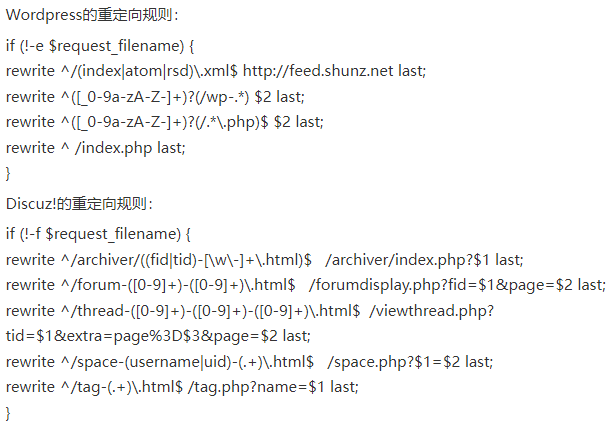

-   多目录转成参数

    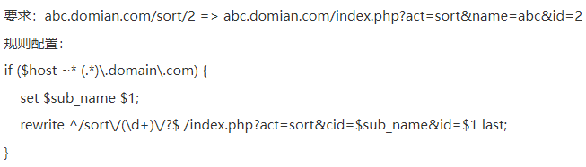

-   目录对换

    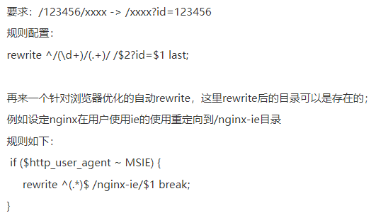

-   目录自动加“/” ，这个功能一般浏览器自动完成

    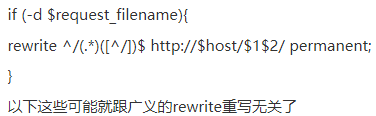

-   禁止htaccess

    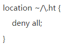

-   禁止多个目录

    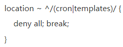

-   禁止以/data开头的文件，可以禁止/data/下多级目录下.log.txt等请求

    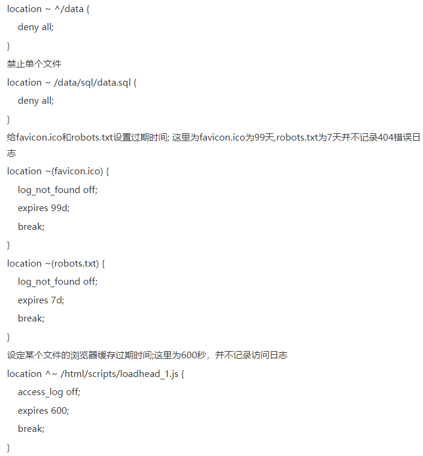

-   文件的保质期时间

    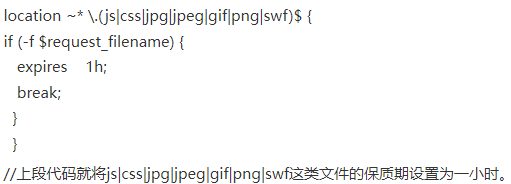

-   防盗链的设置

    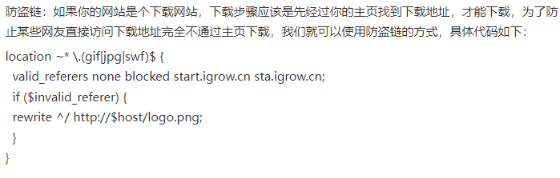

    • 文件反盗链并设置过期时间

    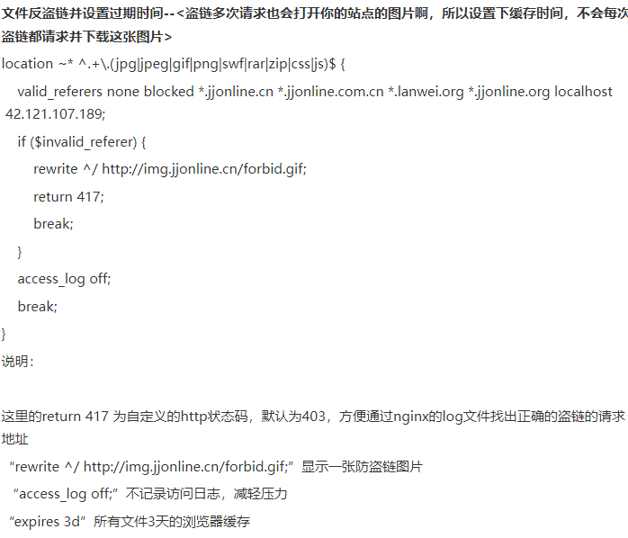

-   只充许固定ip访问网站，并加上密码；这个对有权限认证的应用比较在行

    

-   文件和目录不存在的时重定向

    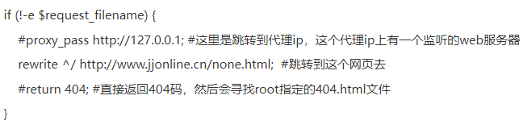

-   域名跳转

    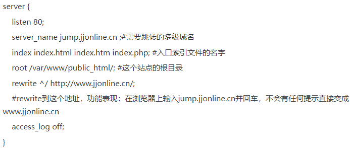

-   多域名转向

    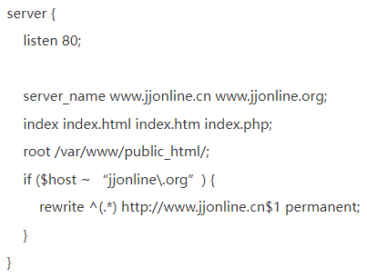

-   三级域名跳转

    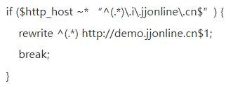

-   域名镜向

    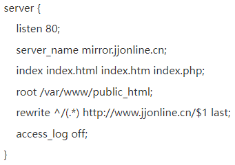

-   某个子目录作镜向,这里的示例是demo子目录

    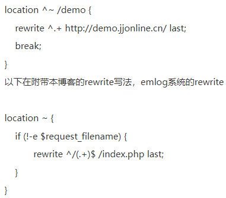

# 核心模块

## 主模块

### 

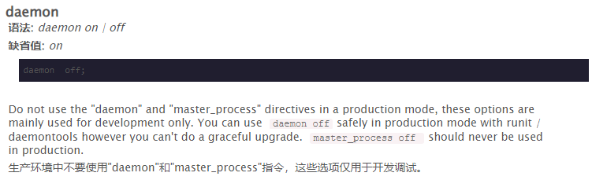

### 

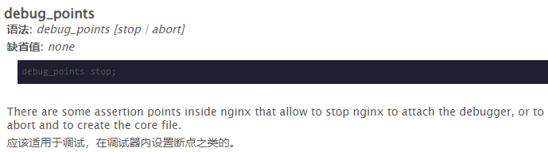

### 

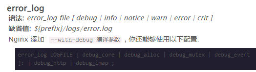

### 

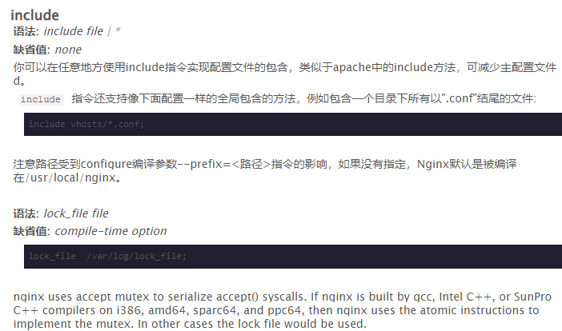

### 

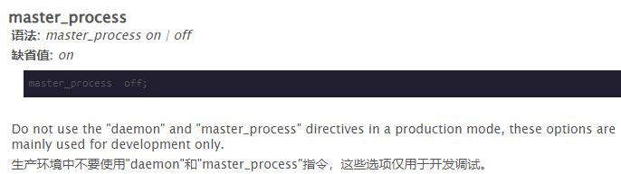

### 

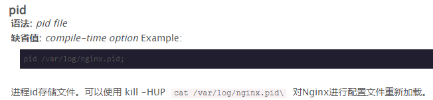

### 

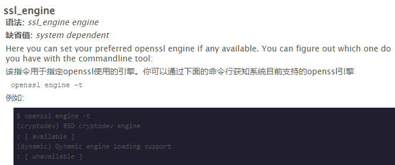

### 

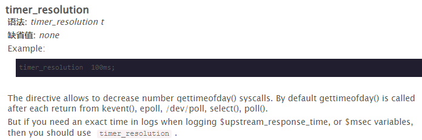

### 

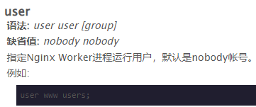

### 

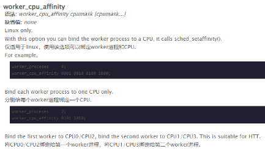

### 

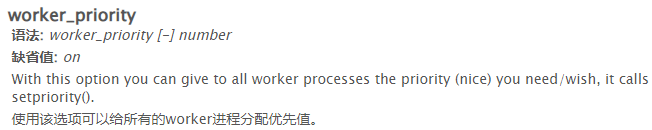

### 

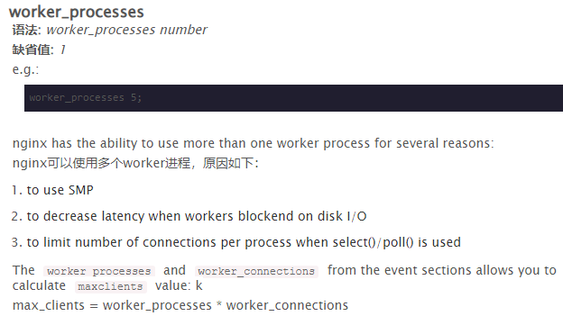

### 

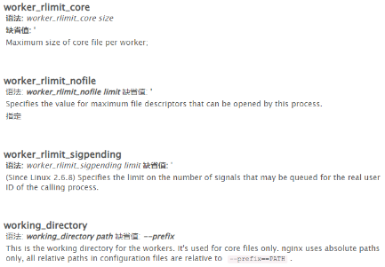

## 事件模块

## HTTP模块

# HTTP模块

## Access 模块

### 

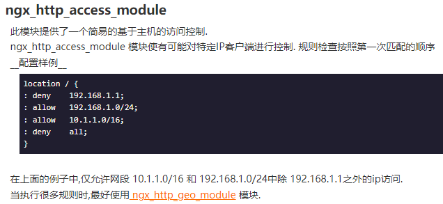

### 

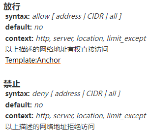

## Auth Basic 模块

### 

### 

## AutoIndex 模块

### 

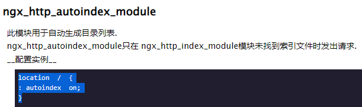

### 

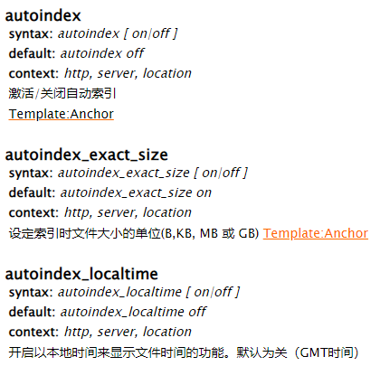

## DAV模块

### 

### 

## FastCGI 模块

### 

### 

### 

# 其他模块

## 限制并发

### 

## 限制IP访问频率

### 

## 限制IP带宽占用

### 

## 配置SSL

### 

## 静态资源缓存

### 

