**Shiro**

# 简介

## 

### Authentication：身份认证 / 登录，验证用户是不是拥有相应的身份；Authorization：授权，即权限验证，验证某个已认证的用户是否拥有某个权限；即判断用户是否能做事情，常见的如：验证某个用户是否拥有某个角色。或者细粒度的验证某个用户对某个资源是否具有某个权限；Session Management：会话管理，即用户登录后就是一次会话，在没有退出之前，它的所有信息都在会话中；会话可以是普通 JavaSE 环境的，也可以是如 Web 环境的；Cryptography：加密，保护数据的安全性，如密码加密存储到数据库，而不是明文存储；Web Support：Web 支持，可以非常容易的集成到 Web 环境；Caching：缓存，比如用户登录后，其用户信息、拥有的角色 / 权限不必每次去查，这样可以提高效率；Concurrency：shiro 支持多线程应用的并发验证，即如在一个线程中开启另一个线程，能把权限自动传播过去；Testing：提供测试支持；Run As：允许一个用户假装为另一个用户（如果他们允许）的身份进行访问；Remember Me：记住我，这个是非常常见的功能，即一次登录后，下次再来的话不用登录了

## 

### Subject：主体，可以看到主体可以是任何可以与应用交互的 “用户”；SecurityManager：相当于 SpringMVC 中的 DispatcherServlet 或者 Struts2 中的 FilterDispatcher；是 Shiro 的心脏；所有具体的交互都通过 SecurityManager 进行控制；它管理着所有 Subject、且负责进行认证和授权、及会话、缓存的管理。Authenticator：认证器，负责主体认证的，这是一个扩展点，如果用户觉得 Shiro 默认的不好，可以自定义实现；其需要认证策略（Authentication Strategy），即什么情况下算用户认证通过了；Authorizer：授权器，或者访问控制器，用来决定主体是否有权限进行相应的操作；即控制着用户能访问应用中的哪些功能；Realm：可以有 1 个或多个 Realm，可以认为是安全实体数据源，即用于获取安全实体的；可以是 JDBC 实现，也可以是 LDAP 实现，或者内存实现等等；由用户提供；注意：Shiro 不知道你的用户 / 权限存储在哪及以何种格式存储；所以我们一般在应用中都需要实现自己的 Realm；SessionManager：如果写过 Servlet 就应该知道 Session 的概念，Session 呢需要有人去管理它的生命周期，这个组件就是 SessionManager；而 Shiro 并不仅仅可以用在 Web 环境，也可以用在如普通的 JavaSE 环境、EJB 等环境；所以呢，Shiro 就抽象了一个自己的 Session 来管理主体与应用之间交互的数据；这样的话，比如我们在 Web 环境用，刚开始是一台 Web 服务器；接着又上了台 EJB 服务器；这时想把两台服务器的会话数据放到一个地方，这个时候就可以实现自己的分布式会话（如把数据放到 Memcached 服务器）；SessionDAO：DAO 大家都用过，数据访问对象，用于会话的 CRUD，比如我们想把 Session 保存到数据库，那么可以实现自己的 SessionDAO，通过如 JDBC 写到数据库；比如想把 Session 放到 Memcached 中，可以实现自己的 Memcached SessionDAO；另外 SessionDAO 中可以使用 Cache 进行缓存，以提高性能；CacheManager：缓存控制器，来管理如用户、角色、权限等的缓存的；因为这些数据基本上很少去改变，放到缓存中后可以提高访问的性能Cryptography：密码模块，Shiro 提供了一些常见的加密组件用于如密码加密 / 解密的。

# 身份验证

## 在 shiro 中，用户需要提供 principals （身份）和 credentials（证明）给 shiro，从而应用能验证用户身份：principals：身份，即主体的标识属性，可以是任何东西，如用户名、邮箱等，唯一即可。一个主体可以有多个 principals，但只有一个 Primary principals，一般是用户名 / 密码 / 手机号。credentials：证明 / 凭证，即只有主体知道的安全值，如密码 / 数字证书等。最常见的 principals 和 credentials 组合就是用户名 / 密码了。接下来先进行一个基本的身份认证。另外两个相关的概念是之前提到的 Subject 及 Realm，分别是主体及验证主体的数据源。

## 环境准备

### 添加 junit、common-logging 及 shiro-core 依赖即可

## 登录 / 退出

### 使用 shiro.ini 配置文件，通过 [users] 指定了两个主体：zhang/123、wang/123。

### 

## 身份认证流程

### 

### 

## Realm

### 

### 自定义 Realm 实现

-   

    

### JDBC Realm 使用

-   依赖：使用 mysql 数据库及 druid 连接池
-   建三张数据库表：users（用户名 / 密码）、user_roles（用户 / 角色）、roles_permissions（角色 / 权限）
-   ini 配置（shiro-jdbc-realm.ini）

    •

    

## Authenticator 及 AuthenticationStrategy

### 

### FirstSuccessfulStrategy：只要有一个 Realm 验证成功即可，只返回第一个 Realm 身份验证成功的认证信息，其他的忽略；AtLeastOneSuccessfulStrategy/：只要有一个 Realm 验证成功即可，返回所有 Realm 身份验证成功的认证信息；AllSuccessfulStrategy：所有 Realm 验证成功才算成功，且返回所有 Realm 身份验证成功的认证信息，如果有一个失败就失败了。ModularRealmAuthenticator 默认使用 AtLeastOneSuccessfulStrategy 策略。

### ini 配置文件 (shiro-authenticator-all-success.ini)

-   

    

# Shiro 授权

## 授权方式

### 

## 授权

### 基于角色的访问控制（隐式角色）

-   

    

-   Shiro 提供了 hasRole/hasRoles 用于判断用户是否拥有某个角色/某些权限；
-   Shiro 提供的 checkRole/checkRoles 和 hasRole/hasAllRoles 不同的地方是它在判断为假的情况下会抛出 UnauthorizedException 异常。

### 基于资源的访问控制（显示角色）

-   Shiro 提供了 isPermitted 和 isPermittedAll 用于判断用户是否拥有某个权限或所有权限
-   

    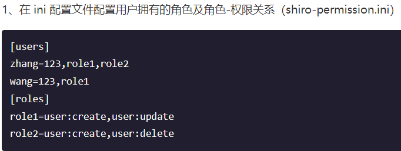

## Permission

### 字符串通配符权限

-   

    

-   

    

### 授权流程

-   

    

    •

    

## Authorizer、PermissionResolver及RolePermissionResolver

### SecurityManager 继承了 Authorizer 接口，且提供了 ModularRealmAuthorizer 用于多 Realm 时的授权匹配。PermissionResolver 用于解析权限字符串到 Permission 实例，而 RolePermissionResolver 用于根据角色解析相应的权限集合。

### ini 配置（shiro-authorizer.ini）

-   设置 securityManager 的 realms 一定要放到最后，因为在调用 SecurityManager.setRealms 时会将 realms 设置给 authorizer，并为各个 Realm 设置 permissionResolver 和 rolePermissionResolver。另外，不能使用 IniSecurityManagerFactory 创建的 IniRealm，因为其初始化顺序的问题可能造成后续的初始化 Permission 造成影响。

### 定义 BitAndWildPermissionResolver 及 BitPermission

-   BitPermission 用于实现位移方式的权限，如规则是：权限字符串格式：+ 资源字符串 + 权限位 + 实例 ID；以 + 开头中间通过 + 分割；权限：0 表示所有权限；1 新增（二进制：0001）、2 修改（二进制：0010）、4 删除（二进制：0100）、8 查看（二进制：1000）；如 +user+10 表示对资源 user 拥有修改 / 查看权限。
-   Permission 接口提供了 boolean implies(Permission p) 方法用于判断权限匹配的；
-   BitAndWildPermissionResolver 实现了 PermissionResolver 接口，并根据权限字符串是否以 “+” 开头来解析权限字符串为 BitPermission 或 WildcardPermission。

### 定义 MyRolePermissionResolver

-   

    

### 自定义 Realm

-   

    

-   AuthorizingRealm 而不是实现 Realm 接口；推荐使用 AuthorizingRealm，因为： AuthenticationInfo doGetAuthenticationInfo(AuthenticationToken token)：表示获取身份验证信息；AuthorizationInfo doGetAuthorizationInfo(PrincipalCollection principals)：表示根据用户身份获取授权信息。这种方式的好处是当只需要身份验证时只需要获取身份验证信息而不需要获取授权信息。

# Shiro InI 配置

## 根对象 SecurityManager

### Shiro 提供的 INI 配置也是非常类似的，即可以理解为是一个 IoC/DI 容器，但是区别在于它从一个根对象 securityManager 开始。

### java实现

### 等价的 INI 配置（shiro-config.ini）

### Shiro INI 配置中获取相应的 securityManager 实例

-   

    

## INI 配置

### ini 配置文件类似于 Java 中的 properties（key=value），不过提供了将 key/value 分类的特性，key 是每个部分不重复即可，而不是整个配置文件

### 

### main] 部分提供了对根对象 securityManager 及其依赖对象的配置。

-   创建对象securityManager=org.apache.shiro.mgt.DefaultSecurityManager其构造器必须是 public 空参构造器，通过反射创建相应的实例。
-   常量值 setter 注入

    

-   对象引用 setter 注入

    

-   嵌套属性 setter 注入

    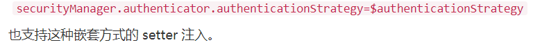

-   byte 数组 setter 注入

    

-   Array/Set/List setter 注入

    

-   Map setter 注入

    

-   实例化 / 注入顺序后边的覆盖前边的注入。

### [users] 部分配置用户名 / 密码及其角色，格式：“用户名 = 密码，角色 1，角色 2”，角色部分可省略。

### [roles] 部分配置角色及权限之间的关系，格式：“角色 = 权限 1，权限 2”；

### [urls] 部分配置 url 及相应的拦截器之间的关系，格式：“url = 拦截器 [参数]，拦截器 [参数]

# 编码加密

## 编码 / 解码base64 和 16 进制字符串编码 / 解码

## 散列算法散列算法一般用于生成数据的摘要信息，是一种不可逆的算法，一般适合存储密码之类的数据，常见的散列算法如 MD5、SHA 等。一般进行散列时最好提供一个 salt（盐）

### 

### Shiro 提供了 HashService，默认提供了 DefaultHashService 实现

-   

    

-   

    

## 加密 / 解密Shiro 还提供对称式加密 / 解密算法的支持，如 AES、Blowfish 等；当前还没有提供对非对称加密 / 解密算法支持

### AES 算法实现：

## PasswordService/CredentialsMatcher提供加密密码及验证密码服务

### 

### DefaultPasswordService 配合 PasswordMatcher 实现简单的密码加密与验证服务

-   定义 Realm

    

-   ini 配置（shiro-passwordservice.ini）

    

    •

    

### HashedCredentialsMatcher 实现密码验证服务

-   生成密码散列值

    

-   生成 Realm

    •

    

    • JdbcRealm实现

    •

    

-   ini 配置（shiro-hashedCredentialsMatcher.ini）

    •

    

    •

    

### 密码重试次数限制

-   如在 1 个小时内密码最多重试 5 次，如果尝试次数超过 5 次就锁定 1 小时，1 小时后可再次重试，如果还是重试失败，可以锁定如 1 天，以此类推，防止密码被暴力破解。我们通过继承 HashedCredentialsMatcher，且使用 Ehcache 记录重试次数和超时时间。
-   

    

# Realm

## 定义 Service 及 Dao

## UserRealm

## AuthenticationToken

## AuthenticationInfo

## PrincipalCollection

### 

## AuthorizationInfo

## SubjectSubject 是 Shiro 的核心对象，基本所有身份验证、授权都是通过 Subject 完成

### 身份信息获取

### 身份验证

### 角色授权验证

### 权限授权验证

### 会话

### 退出void logout();

### RunAs

### 多线程

### Subject 的构建

-   

    

-   自定义创建

    

### 使用

# Web 集成

## 简介Shiro 提供了与 Web 集成的支持，其通过一个 ShiroFilter 入口来拦截需要安全控制的 URL，然后进行相应的控制，ShiroFilter 类似于如 Strut2/SpringMVC 这种 web 框架的前端控制器，其是安全控制的入口点，其负责读取配置（如 ini 配置文件），然后判断 URL 是否需要登录 / 权限等工作。

## 准备环境

### 依赖

-   

    

-   

    

## ShiroFilter 入口

### 配置方式:web.xml

-   

    

### 与 Spring 集成

-   

    

## Web INI 配置

### 

### Ant 风格模式

-   

    

### 身份验证（登录）

-   登录 Servlet

    

### 基于 Basic 的拦截器身份验证

-   shiro-basicfilterlogin.ini 配置

    

-   web.xml把 shiroConfigLocations 改为 shiro-basicfilterlogin.ini 即可。

### 基于表单的拦截器身份验证

-   shiro-formfilterlogin.ini

    

-   web.xml把 shiroConfigLocations 改为 shiro-formfilterlogin.ini 即可。
-   登录 Servlet

    

### 授权（角色 / 权限验证）

-   shiro.ini

    

-   web.xml把 shiroConfigLocations 改为 shiro.ini 即可。
-   RoleServlet/PermissionServlet

    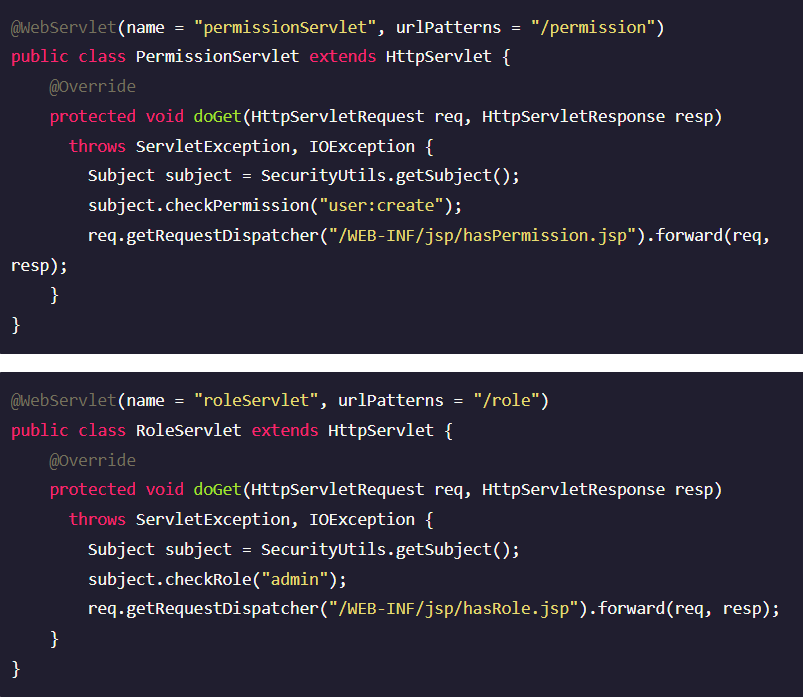

### 退出

-   shiro.ini

    

-   LogoutServlet

    

-   logout 拦截器用于退出

    

# 拦截器机制

## 拦截器介绍

### 

### NameableFilterNameableFilter 给 Filter 起个名字，如果没有设置默认就是 FilterName

### OncePerRequestFilterOncePerRequestFilter 用于防止多次执行 Filter 的；也就是说一次请求只会走一次拦截器链；另外提供 enabled 属性，表示是否开启该拦截器实例，默认 enabled=true 表示开启，如果不想让某个拦截器工作，可以设置为 false 即可。

### ShiroFilterShiroFilter 是整个 Shiro 的入口点，用于拦截需要安全控制的请求进行处理

### AdviceFilterAdviceFilter 提供了 AOP 风格的支持，类似于 SpringMVC 中的 Interceptor：

### PathMatchingFilterPathMatchingFilter 提供了基于 Ant 风格的请求路径匹配功能及拦截器参数解析的功能，如“roles[admin,user]”自动根据“，”分割解析到一个路径参数配置并绑定到相应的路径

### AccessControlFilterAccessControlFilter 提供了访问控制的基础功能；比如是否允许访问/当访问拒绝时如何处理等

-   

    

## 拦截器链

## 自定义拦截器

## 默认拦截器

# JSP 标签

## 导入标签库

## guest 标签

## user 标签

## authenticated 标签

## notAuthenticated 标签

## principal 标签

## hasRole 标签

## hasAnyRoles 标签

## lacksRole 标签

## hasPermission 标签

## lacksPermission 标签

## 导入自定义标签库

# 会话管理

## Shiro 提供了完整的企业级会话管理功能，不依赖于底层容器（如 web 容器 tomcat），不管 JavaSE 还是 JavaEE 环境都可以使用，提供了会话管理、会话事件监听、会话存储 / 持久化、容器无关的集群、失效 / 过期支持、对 Web 的透明支持、SSO 单点登录的支持等特性。即直接使用 Shiro 的会话管理可以直接替换如 Web 容器的会话管理

## 会话

### 

### session.getId();获取当前会话的唯一标识。session.getHost();获取当前 Subject 的主机地址，该地址是通过 HostAuthenticationToken.getHost() 提供的。

### session.getTimeout();session.setTimeout(毫秒);获取 / 设置当前 Session 的过期时间；如果不设置默认是会话管理器的全局过期时间。

### session.getStartTimestamp();session.getLastAccessTime();获取会话的启动时间及最后访问时间

### session.touch();如果是 JavaSE 应用需要自己定期调用 session.touch() 去更新最后访问时间；如果是 Web 应用，每次进入 ShiroFilter 都会自动调用 session.touch() 来更新最后访问时间。

### session.stop();更新会话最后访问时间及销毁会话；当 Subject.logout() 时会自动调用 stop 方法来销毁会话。如果在 web 中，调用 javax.servlet.http.HttpSession. invalidate() 也会自动调用 Shiro Session.stop 方法进行销毁 Shiro 的会话。

### 

## 会话管理器

### 

### 

### 

### 

## 会话监听器

### 

### 

## 会话存储 / 持久化

### 

### 

### 

### 

### 

## 会话验证

### 

### 

### 

## sessionFactory

### 

### 

# 缓存机制

## Shiro 提供了类似于 Spring 的 Cache 抽象，即 Shiro 本身不实现 Cache，但是对 Cache 进行了又抽象，方便更换不同的底层 Cache 实现。

### Shiro 提供的 Cache 接口：

### Shiro 提供的 CacheManager 接口：

### CacheManagerAware 用于注入 CacheManager：

## Realm 缓存

### Shiro 提供了 CachingRealm，其实现了 CacheManagerAware 接口，提供了缓存的一些基础实现；另外 AuthenticatingRealm 及 AuthorizingRealm 分别提供了对 AuthenticationInfo 和 AuthorizationInfo 信息的缓存。

### ini 配置

-   

    

### 测试用例

-   

    

## Session 缓存

### 

# Spring 集成

## 

## JavaSE 应用

### 

## Web 应用

### spring-shiro-web.xml

-   

    

-   

    

### web.xml

-   

    

## Shiro 权限注解

### shiro 提供了相应的注解用于权限控制，如果使用这些注解就需要使用 AOP 的功能来进行判断，如 Spring AOP；Shiro 提供了 Spring AOP 集成用于权限注解的解析和验证。为了测试，此处使用了 Spring MVC 来测试 Shiro 注解，当然 Shiro 注解不仅仅可以在 web 环境使用，在独立的 JavaSE 中也是可以用的，此处只是以 web 为例了。

### 

### 权限注解

-   

    

# RememberMe

## 

## RememberMe 配置

### spring-shiro-web.xml 配置

-   

    

### 测试

-   

    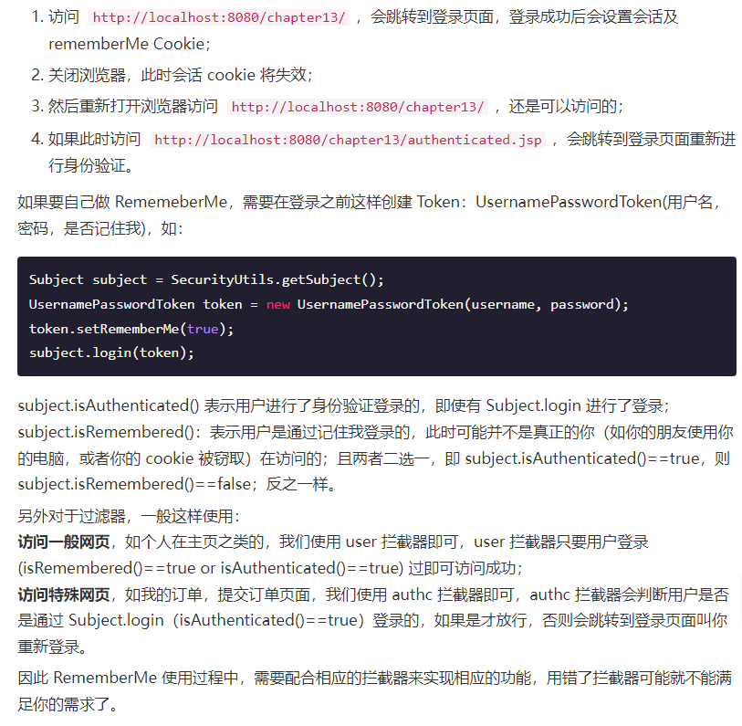

# SSL

## 生成数字证书

### 

## 设置 tomcat 下的 server.xml

### 

## 添加 SSL 到配置文件（spring-shiro-web.xml）

### 

## 测试

### 

# 单点登录

## 

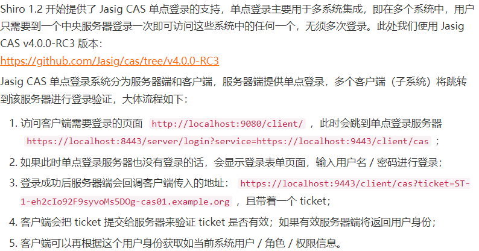

## 服务器端

### 

## 客户端

### 准备

-   

    

### spring-shiro-web.xml 配置

-   

    

### 测试

-   

    

# 综合实例

## 

## 简单数据字典

### 

### 

## Service

### 

## UserRealm 实现

### 

## Web 层控制器

### 

## Web 层标签库

### com.github.zhangkaitao.shiro.chapter16.web.taglib.Functions 提供了函数标签实现，有根据编号显示资源 / 角色 / 组织机构名称，其定义放在 src/main/webapp/tld/zhang-functions.tld。

### 

## Web 层异常处理器

### 

## Spring 配置

### spring-config.xml

-   定义了 context:component-scan 来扫描除 web 层的组件、dataSource（数据源）、事务管理器及事务切面等

### spring-config-cache.xml

-   定义了 spring 通用 cache，使用 ehcache 实现

### spring-config-shiro.xml

-   定义了 shiro 相关组件
-   

    

### spring-mvc.xml

-   定义了 spring mvc 相关组件。
-   

    

### spring-mvc-shiro.xml

-   定义了 spring mvc 相关组件。
-   

    

### web.xml 配置文件

-   定义 Spring ROOT 上下文加载器、ShiroFilter、及 SpringMVC 拦截器。

## JSP 页面

### 

# OAuth2

## OAuth 角色

### 

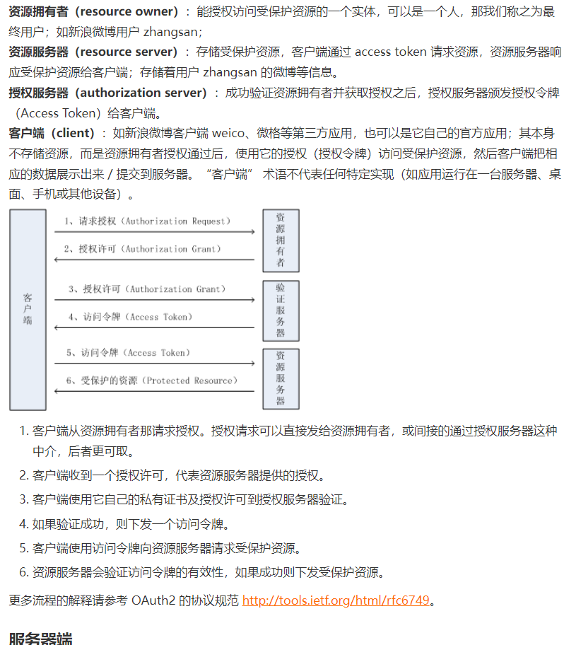

## 服务器端

### POM 依赖

-   

    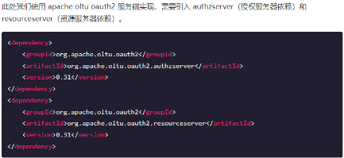

### 数据字典

-   

    

### Service

-   

    

### 后端数据维护控制器

-   具体请参考 com.github.zhangkaitao.shiro.chapter17.web.controller 包下的 IndexController、LoginController、UserController 和 ClientController，其用于维护后端的数据，如用户及客户端数据；即相当于后台管理。
-   授权控制器 AuthorizeController

    •

    

    •

    

-   访问令牌控制器 AccessTokenController

    •

    

    •

    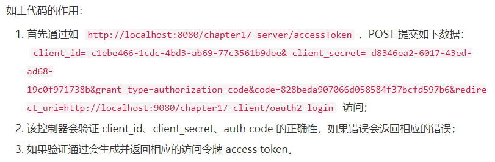

-   资源控制器 UserInfoController

    •

    

    •

    

### Spring 配置文件

-   

    

### 服务器维护

-   

    

## 客户端

### 客户端流程：如果需要登录首先跳到 oauth2 服务端进行登录授权，成功后服务端返回 auth code，然后客户端使用 auth code 去服务器端换取 access token，最好根据 access token 获取用户信息进行客户端的登录绑定。这个可以参照如很多网站的新浪微博登录功能，或其他的第三方帐号登录功能。

### POM 依赖

-   

    

### OAuth2Token

-   

    

### OAuth2AuthenticationFilter

-   

    

-   

    

### OAuth2Realm

-   

    

### Spring shiro 配置（spring-config-shiro.xml）

-   

    

## 测试

### 

# 并发登录控制

## 并发登录人数控制

### 

## spring-config-shiro.xml

### 

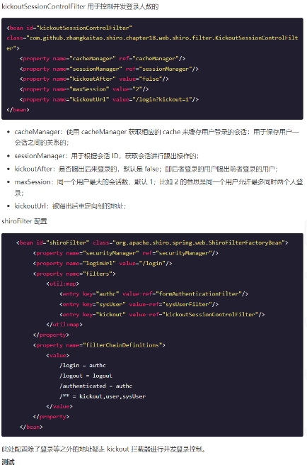

## 测试

### 

# 动态 URL

## 用过 Spring Security 的朋友应该比较熟悉对 URL 进行全局的权限控制，即访问 URL 时进行权限匹配；如果没有权限直接跳到相应的错误页面。Shiro 也支持类似的机制，不过需要稍微改造下来满足实际需求。不过在 Shiro 中，更多的是通过 AOP 进行分散的权限控制，即方法级别的；而通过 URL 进行权限控制是一种集中的权限控制。本章将介绍如何在 Shiro 中完成动态 URL 权限控制。

## 实体

### 

## Service

### 

## ShiroFilerChainManager

### 

### Shiro 拦截器的流程

-   

    

### FilterChainManager 接口：

-   

    

## CustomPathMatchingFilterChainResolver

### 

## CustomDefaultFilterChainManager

### 

## Spring 配置——spring-config-shiro.xml

### 

# 无状态 Web

## 无状态 Web 应用集成

### 

## 服务器端对于服务器端，不生成会话，而是每次请求时带上用户身份进行认证。

### 服务控制器

-   

    

### 加密工具类

-   

    

### Subject 工厂

-   

    

### StatelessAuthcFilter

-   

    

### StatelessToken

-   

    

### StatelessRealm

-   

    

### spring-config-shiro.xml

-   

    

## 客户端

### 启动服务器

-   

    

### 测试成功情况

-   

    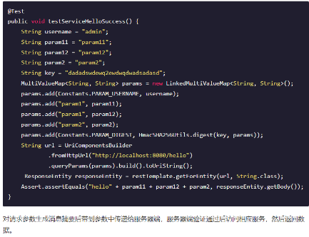

### 测试失败情况

-   

    

# 授予身份和切换身份

## 实体

### 

## Service

### 

## Web 控制器 RunAsController

### 身份列表

-   

    

### 授予身份

-   

    

### 回收身份

-   

    

### 切换身份功能

-   

    

### 切换到上一个身份

-   

    

# 集成验证码

## 添加 JCaptcha 依赖

### 

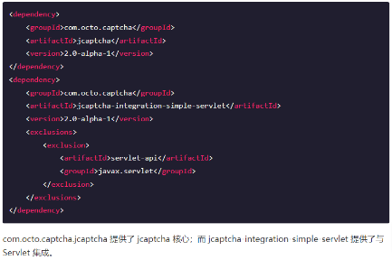

## GMailEngine

## MyManageableImageCaptchaService

### 

## JCaptcha 工具类

### 

## JCaptchaFilter

### 

## JCaptchaValidateFilter

### 

## MyFormAuthenticationFilter

### 

## spring-config-shiro.xml

### 

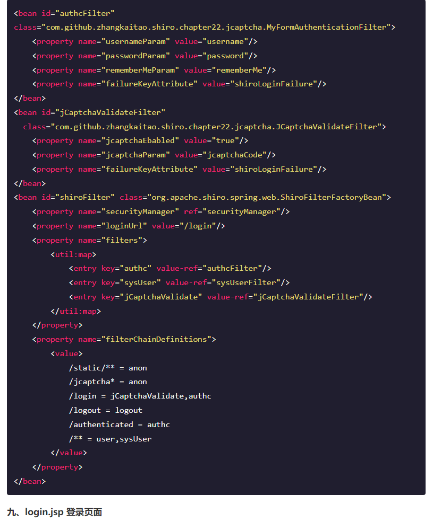

## login.jsp 登录页面

### 

# 多项目

## 部署架构

### 

## 项目架构

### 

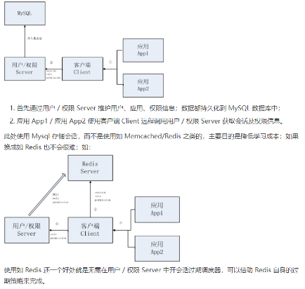

## 模块关系依赖

### 

## shiro-example-chapter23-pom 模块

### 

## shiro-example-chapter23-core 模块

### 

## shiro-example-chapter23-server 模块

### 

### Service

-   

    

### UserRealm

-   

    

### ServerFormAuthenticationFilter

-   

    

### session

-   

    

### RemoteService

-   

    

### spring-config-shiro.xml

-   

    

### 服务器端数据维护

-   

    

## shiro-example-chapter23-client 模块

### spring-client-remote-service.xml

-   

    

### ClientRealm

-   

    

### ClientSessionDAO

-   

    

### ClientAuthenticationFilter

-   

    

### ClientShiroFilterFactoryBean

-   

    

### spring-client.xml

-   

    

### client/shiro-client-default.properties

-   

    

## shiro-example-chapter23-app \* 模块

### 依赖

-   

    

### client/shiro-client.properties

-   

    

### web.xml

-   

    

### 控制器

-   

    

## 测试

### 安装配置启动 nginx

-   

    

### 安装依赖

-   

    

### 启动 Server 模块

-   

    

### 启动 App\* 模块

-   

    

### 服务器端维护

-   

    

### App 模块身份认证及授权\*\*

-   

    

## 本示例缺点

### 

# 在线会话管理

## 会话控制器

### 

### 

## ForceLogoutFilter

### 

## 登录控制器

### 

## spring-config-shiro.xml

### 

