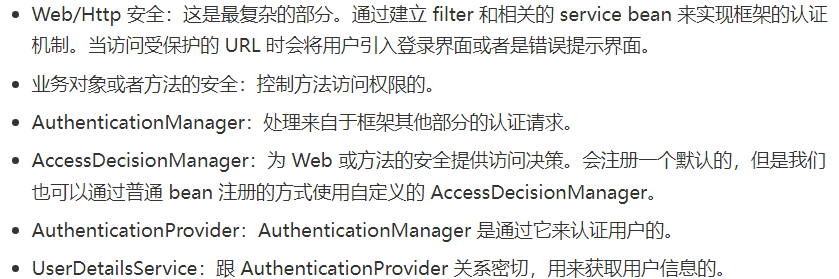
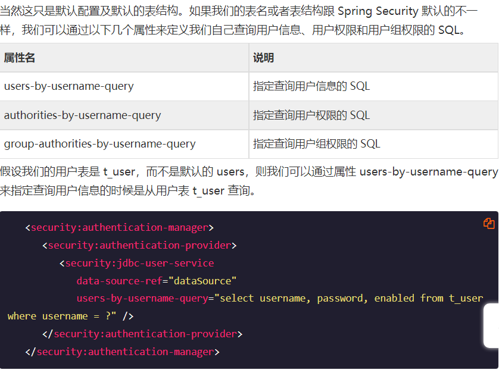
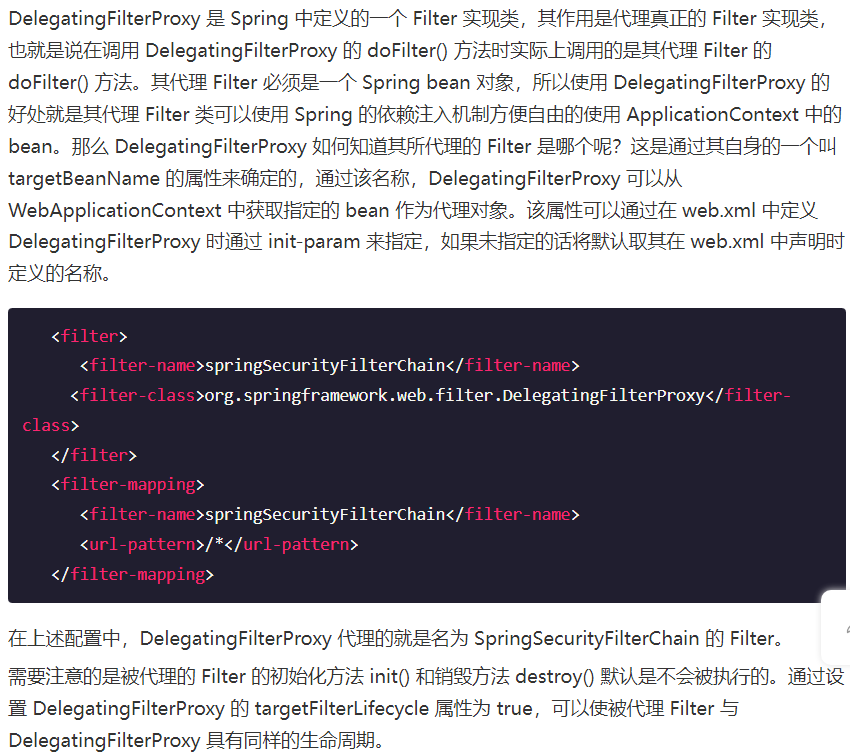

**Spring Security**

# 介绍

## 常用的功能

### 

## spring-security.xml

### 

-   

    

### Spring 加载这个配置文件

-   

    

### 

# 登录

## form-login 元素介绍http 元素下的 form-login 元素是用来定义表单登录信息的。当我们什么属性都不指定的时候 Spring Security 会为我们生成一个默认的登录页面。如果不想使用默认的登录页面，我们可以指定自己的登录页面。

## 使用自定义登录页面

### 

### 

## 指定登录后的页面

### default-target-url 指定

-   

    

### authentication-success-handler-ref 指定

-   

    

-   

    

## 指定登录失败后的页面

### authentication-failure-url 指定

-   

    

### authentication-failure-handler-ref 指定

-   

    

## http-basic

### 

### 需要注意的是当我们同时定义了 http-basic 和 form-login 元素时，form-login 将具有更高的优先级。即在需要认证的时候 Spring Security 将引导我们到登录页面，而不是弹出一个窗口。

# 核心类简介

## Authentication

### 

## SecurityContextHolder

### 

### 

## AuthenticationManager 和 AuthenticationProvider

### 

## UserDetailsService

### 

## JdbcDaoImpl

### 

### 

## InMemoryDaoImpl

### 

## GrantedAuthority

### 

# 认证简介

## 

## ExceptionTranslationFilter

## 在 request 之间共享 SecurityContext

# 异常信息本地化

## 

# AuthenticationProvider

## 自定义

### 

## 用户信息从数据库获取

### 使用 jdbc-user-service 获取

-   

    

-   

    

-   

    

### 直接使用 JdbcDaoImpl

-   

    

-   用户权限和用户组权限

    •

    

## PasswordEncoder

### 使用内置的 PasswordEncoder

-   

    

### salt-source 的示例

-   

    

# 缓存 UserDetails

## CachingUserDetailsService

## EhCacheBasedUserCacheEhCacheBasedUserCache 所引用的 Ehcache 是空的，所以，当我们需要对 UserDetails 进行缓存时，我们只需要定义一个 Ehcache 实例，然后把它注入给 EhCacheBasedUserCache 就可以了

## CachingUserDetailsService 配置实现

### 

# intercept-url配置

## 指定拦截的 url

## 指定访问权限通过 access 属性来指定 intercept-url 对应URL 访问所应当具有的权限

### 

## 

## 

# Filter

## Filter 顺序

## FilterChain 中 Filter

### 

### Spring Security 对那些内置的 Filter 都指定了一个别名，同时指定了它们的位置。我们在定义 custom-filter 的 position、before 和 after 时使用的值就是对应着这些别名所处的位置。

## DelegatingFilterProxy

### 

## FilterChainProxy

### 

## 定义好的核心 Filter

### 

### FilterSecurityInterceptor

-   

    

### ExceptionTranslationFilter

-   自定义

    •

    

-   

    

### SecurityContextPersistenceFilter

-   

    

-   

    

### UsernamePasswordAuthenticationFilter

-   

    

-   

    

# 退出登录 logout

## 

# 匿名认证

## 

## 配置

### 

### 手动定义Bean

-   

    

## AuthenticationTrustResolver

### 

# Remember-Me 功能

## 

## 基于简单加密 token 的方法

### 

### 

## 基于持久化 token 的方法

### 

### 

## Remember-Me 相关接口和实现类

### 

## TokenBasedRememberMeServices

### 

### 

## PersistentTokenBasedRememberMeServices

### 

### 

# session 管理

## Spring Security 通过 http 元素下的子元素 session-management 提供了对 Http Session 管理的支持。

## 检测 session 超时

### 

## concurrency-control

### 

### 

### 

## session 固定攻击保护

### 

# 权限鉴定基础

## 

## AOP Advice 思想

### 

## AbstractSecurityInterceptor

### 

## ConfigAttribute

### 

## RunAsManager

### 

## AfterInvocationManager

### 

