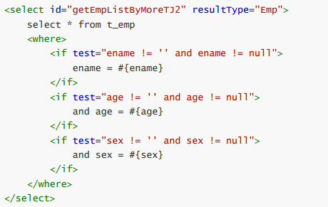
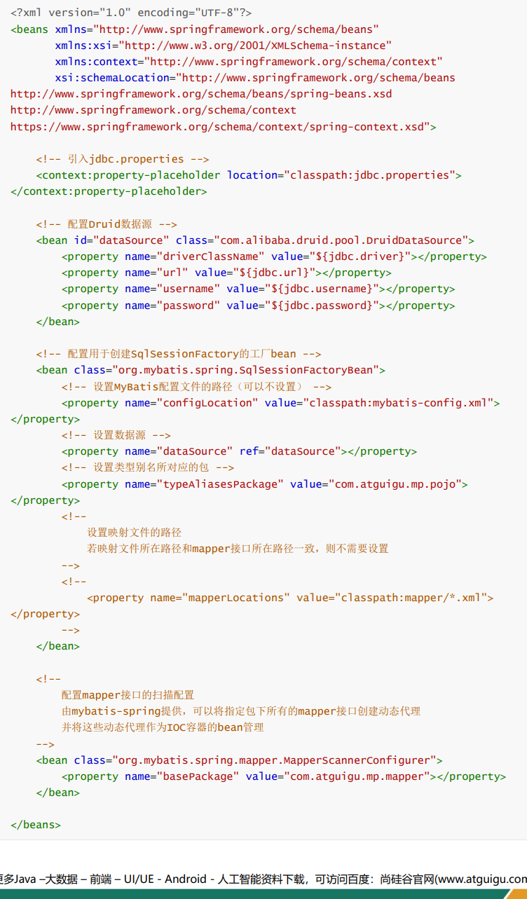
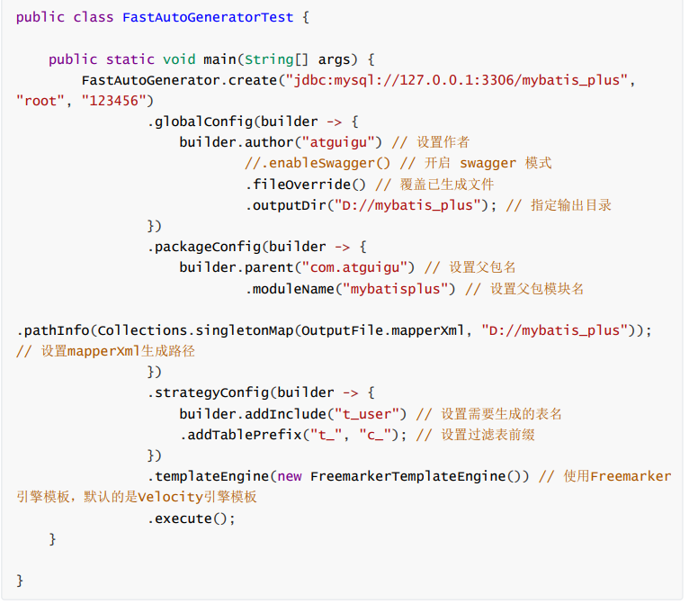

**mybaits系列**

# mybaits

## MyBatis特性

### 定制化sql、存储过程、高级映射

### 避免JDBC和手动设置参数

### 使用简单的XML或注解用于配置和原始映射

### 半自动的ORM框架

## 搭建MyBatis

### 引入依赖

-   

    

### 创建MyBatis的核心配置文件

-   mybatis-config.xml

    

### 创建mapper接口

### 创建MyBatis的映射文件

-   ORM（Object Relationship Mapping）对象关系映射。

    

-   

    

### 通过junit测试功能

-   

    

-   

    

### 加入log4j日志功能

-   加入依赖

    •

    

-   加入log4j的配置文件

    •

    

    • 日志的级别FATAL(致命)\>ERROR(错误)\>WARN(警告)\>INFO(信息)\>DEBUG(调试)从左到右打印的内容越来越详细

## 核心配置文件详解

### 核心配置文件中的标签必须按照固定的顺序：properties?,settings?,typeAliases?,typeHandlers?,objectFactory?,objectWrapperFactory?,reflectorFactory?,plugins?,environments?,databaseIdProvider?,mappers?

### 

-   

    

## MyBatis的增删改查

### insert, delete , update , select

### 

## MyBatis获取参数值的两种方式

### 

## MyBatis的各种查询功能

### 查询多条数据为map集合

## 特殊SQL的执行

### 模糊查询(like)

### 批量删除(in)

### 动态设置表名(传参）

### 添加功能获取自增的主键

-   

    

## 自定义映射resultMap

### resultMap处理字段和属性的映射关系

-   

    

### 多对一映射处理

-   级联方式处理映射关系

    •

    

-   使用association处理映射关系

    •

    

-   分步查询

    •

    

    •

    

### 一对多映射处理

-   collection

    •

    

-   分步查询

    •

    

## 动态SQL

### if：if标签可通过test属性的表达式进行判断，若表达式的结果为true，则标签中的内容会执行；反之标签中的内容不会执行\<if test="age != '' and age != null"\>and age = \#{age}\</if\>

### where

-   

    

-   

    

### trim

-   

    

-   

    

### choose、when、otherwise

-   

    

### foreach

-   

    

-   

    

### SQL片段

-   

    

## MyBatis的缓存

### MyBatis的一级缓存

-   

    

### 二级缓存

-   

    

-   二级缓存的相关配置

    •

    

### 缓存查询的顺序

-   1、先查询二级缓存，因为二级缓存中可能会有其他程序已经查出来的数据，可以拿来直接使用。2、如果二级缓存没有命中，再查询一级缓存3、如果一级缓存也没有命中，则查询数据库4、SqlSession关闭之后，一级缓存中的数据会写入二级缓存

### 整合第三方缓存EHCache

-   添加依赖

    •

    

-   各jar包功能

    •

    

-   创建EHCache的配置文件ehcache.xml

    •

    

-   设置二级缓存的类型

    • \<cache type="org.mybatis.caches.ehcache.EhcacheCache"/\>

-   加入logback日志

    • 存在SLF4J时，作为简易日志的log4j将失效，此时我们需要借助SLF4J的具体实现logback来打印日志。创建logback的配置文件logback.xml

    •

    

-   EHCache配置文件说明

    •

    

## 逆向工程

### 

### 创建逆向工程

-   添加依赖和插件

    •

    

-   MyBatis的核心配置文件
-   逆向工程的配置文件

    • 文件名必须是：generatorConfig.xml

    

-   执行MBG插件的generate目标

    •

    

### QBC查询

-   

    

## 分页插件

### 插件配置

-   添加依赖

    •

    

-   配置分页插件

    • 在MyBatis的核心配置文件中配置插件

    

### 使用

-   a\>在查询功能之前使用PageHelper.startPage(int pageNum, int pageSize)开启分页功能
-   b\>在查询获取list集合之后，使用PageInfo\<T\> pageInfo = new PageInfo\<\>(List\<T\> list, intnavigatePages)获取分页相关数据
-   c\>分页相关数据

    •

    

# mybaits_plus

## 简介

### mybaits的增强工具

### 特性

-   无侵入、损耗小（直接面向对象操作）、强大的CRUD、支持lambda、支持主键自动生成（内含分布式唯一 ID 生成器 - Sequence）、支持 ActiveRecord 模式（继承model类）、支持自定义全局通用操作、内置代码生成器、内置分页插件、内置性能分析插件、内置全局拦截插件

## 配置使用

### spring boot配置

-   引入依赖

    • \<dependency\>\<groupId\>com.baomidou\</groupId\>\<artifactId\>mybatis-plus-boot-starter\</artifactId\>\<version\>3.5.1\</version\>\</dependency\>\<dependency\>\<groupId\>org.projectlombok\</groupId\>\<artifactId\>lombok\</artifactId\>\<optional\>true\</optional\>\</dependency\>

-   配置application.yml

    • 不用额外配置

    • 添加日志

    • \# 配置MyBatis日志，控制台显示mybatis-plus:configuration:log-impl: org.apache.ibatis.logging.stdout.StdOutImpl

-   在Spring Boot启动类中添加@MapperScan注解，扫描mapper包

### spring配置

-   引入依赖

    • spring-context、spring-jdbc、spring-test、druid、junit、mysql-connector-java、slf4j-api、logback-classic、lombok、mybatis-plus

    •

    

-   创建MyBatis的核心配置文件

    • 在resources下创建mybatis-config.xml

    •

    

-   相关mapper及xml文件的设置
-   创建jdbc.properties
-   创建Spring的配置文件

    • 在resources下创建applicationContext.xml

    • 引入jdbc.properties

    • 配置Druid数据源

    • - 配置用于创建SqlSessionFactory的工厂bean

    • 设置MyBatis配置文件的路径（可以不设置）

    • 设置数据源

    • 设置类型别名所对应的包（实体类）

    • 设置映射文件的路径

    • 配置mapper接口的扫描配置

    •

    

-   添加日志功能

    • 在resources下创建logback.xml

    • 定义日志文件的存储地址 name="LOG_HOME"

    • 控制台日志， 控制台输出

    • myibatis log configure

    • 日志输出级别

    •

    

-   测试

    • 通过IOC容器

    • ApplicationContext ac = newClassPathXmlApplicationContext("applicationContext.xml");

    • Spring整合junit

    • //在Spring的环境中进行测试@RunWith(SpringJUnit4ClassRunner.class)//指定Spring的配置文件@ContextConfiguration("classpath:applicationContext.xml")

-   加入MyBatis-Plus

    • 修改applicationContext.xml

    •

    

    • \<beanclass="com.baomidou.mybatisplus.extension.spring.MybatisSqlSessionFactoryBean"\>

## 基本CRUD

### BaseMapper

### IService

## 常用注解

### @TableName（”表名“）

-   Springboot的全局配置

    •

    

-   Spring

    •

    

### @TableId（”主键名“）识别主键

-   常用的主键策略：

    •

    

-   配置全局主键

    • springboot

    •

    

    • spring

    •

    

-   雪花算法

    • 数据库垂直分表

    • 垂直分表适合将表中某些不常用且占了大量空间的列拆分出去

    • 水平分表

    • 水平分表适合表行数特别大的表，针对数目进行分表

    • 全局唯一的数据id的处理

    • 主键自增

    • 优点：可以随着数据的增加平滑地扩充新的表。例如，现在的用户是 100 万，如果增加到 1000 万，只需要增加新的表就可以了，原有的数据不需要动。

    • 缺点：分布不均匀。假如按照 1000 万来进行分表，有可能某个分段实际存储的数据量只有 1 条，而另外一个分段实际存储的数据量有 1000 万条。

    • 取模

    • 复杂点：初始表数量的确定。表数量太多维护比较麻烦，表数量太少又可能导致单表性能存在问题。优点：表分布比较均匀。缺点：扩充新的表很麻烦，所有数据都要重分布。

    • 雪花算法

    • 长度共64bit（一个long型）。

    •

    

    • 优点：整体上按照时间自增排序，并且整个分布式系统内不会产生ID碰撞，并且效率较高。

### @TableField

-   在实体类属性上使@TableField("username")设置属性所对应的字段名

### @TableLogic：逻辑删除

## 条件构造器和接口

### 

### 结合sql语句进行优先级排序

### 关系式

-   

    

### condition:参数条件判断

-   query.like(StringUtils.isNotBlank(name), Entity::getName, name) .eq(age!=null && age \>= 0, Entity::getAge, age)

## 插件

### 分页插件

-   配置

    • springboot

    •

    

    • spring

    •

    

### xml自定义分页

-   springboot

    • XXXmapper定义

    

    • XXXmapper.xml的sql

    

### 乐观锁

-   实现流程

    •

    

-   Mybatis-Plus实现乐观锁

    • springboot

    • 实体类声明@Version

    •

    

    • 添加乐观锁插件配置

    •

    

    • spring

    •

    

## 通用枚举

### 创建通用枚举类型

-   

    

### 配置扫描通用枚举

-   springboot

    •

    

-   spring

    •

    

## 代码生成器

### 引入依赖

-   

    

### 快速生成

-   

    

## 多数据源

### 引入依赖

-   

    

### 配置多数据源

-   

    

### 在XXXServiceImpl中使用 @DS("master") //指定所操作的数据源
