# 一.操作系统引论

## 1.操作系统的目标和功能

### 概念

- 计算机的硬件、软件以及软件的各部分之间是一种层次结构的关系。硬件在最底层，其上层是操作系统，通过操作系统提供的资源管理功能和方
便用户使用的各种服务功能，把裸机改造成功能更强大、使用更方便的机器(通常称为虚拟机或扩展机)。而各种实用程序和应用程序在操作系统之上，这些程序均以操作系统为支撑，并向用户提供完成工作所需的各种服务。
- 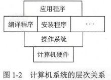
- 操作系统是裸机上的第一层软件，是对硬件功能的首次扩充。引入操作系统的目的是:提供一一个计算机用户与计算机硬件系统之间的接口，使计算机系统更易于使用;有效地控制和管理计算机系统中的各种硬件和软件资源，使之得到更有效的利用;合理地组织计算机系统的工作流程，以改善
系统性能。

### 目标

- 方便性
- 有效性

    -提高系统资源利用率
    -提高系统吞吐量

- 可扩充性
- 开放性

### 作用

- OS作为用户与计算机硬件系统之间的接口

    -命令方式
    -系统调用方式
    -图标–窗口方式

- OS实现了对计算机资源的抽象

## 2.操作系统的主要功能

### 1.处理机管理功能

- 进程控制
- 进程同步（并发进程）

    -进程互斥方式
    -进程同步方式(协同)

- 进程通信
- 调度

    -作业调度
    -进程调度

### 2.存储器管理功能

- 内存分配

    -静态分配
    -动态分配

- 内存保护

    -程序独立运行互不干扰

- 地址映射
- 内存扩充

    -使用虚拟存储技术增加内存

### 3.设备管理功能

- 设备分配，使设备与主机并行执行

    -缓冲管理
    -虚拟技术

- 设备传输控制，实现物理的I/O操作
- 设备独立性，与实际使用的物理设备无关

### 4.文件管理功能

- 文件存储空间的管理
- 目录管理，提供按名存取功能
- 文件的读写管理和保护

### 5.操作系统与用户之间的接口

- 命令接口

    -联机命令接口，适用于分时和实时操作系统

    - 联机命令接口又称交互式命令接口，适用于分时或实时操作系统，它由一组键盘操作命令组成，用户通过控制台或终端输入操作命令，向系统提出各种服务要求，用户每输入完一条命令，控制权就转入操作系统的命令解释程序，然后由命令解释程序对输入的命令解释并执行，完成执行的功能。之后控制权又转回到控制台或终端，此时用户又可以输入下一条命令。

    -脱机命令接口，适用于批处理系统

    - 脱机命令接口又称批处理命令接口，即适用于批处理系统，它由一-组作业控制命令 (或
称作业控制语句)组成，脱机用户不能直接干预作业的运行，应事先用相应的作业控制命令
写成一份作业操作说明书，连同作业一起提 交给系统。当系统调度到该作业时，由系统中的
命令解释程序对作业说明书上的命令或控制语句逐条解释执行从而间接地控制作业的运行。

- 程序接口，使用系统调用命令
- 图形接口，联机命令接口的图形化

### 6.现代操作系统的新功能

- 系统安全
- 网络的功能和服务
- 支持多媒体

## 3.操作系统的基本特征

### 1.并发concurrence

- 区别并行和并发

	  并行性是指两个或多个事件在同一时刻发生→宏观并行，微观并行 并发性是指两个或多个事件在同一时间间隔内发生→宏观并行，微观串行
	  

    -并发是进程宏观一起运行，微观上交替运行，而并行是指同时运行

- 引入进程

	  进程是指在系统中能独立运行并作为资源分配的基本单位，它是由一组机器指令，数据和堆栈等组成的，是一个能独立运行的活动实体

### 2.共享sharing

- 1.互斥共享方式
- 2.同时访问方式
- 并发和共享是多用户(多任务)OS的两个最基本的特征。它们又是互为存在的条件

### 3.虚拟virtual

- 时分复用技术

    -一段时间间隔内宏观运行多个程序

- 空分复用技术

    -虚拟存储器/虚拟设备

### 4.异步asynchronism

- 不同程序的执行时间、顺序、耗时不确定

## 4.操作系统的发展过程

### 未配置操作系统的计算机系统

- 人工操作方式

	  用户独占全机 CPU等待人工操作 严重降低了计算机资源的利用率
	  

- 脱机输入/输出(Off–Line I/O)方式

	  
	  减少了CPU的空闲时间 提高了I/O速度，解决CPU和I/O设备速度不匹配的矛盾。 效率仍然不理想
	  

- 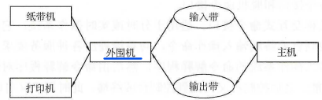
    -为解决低速输入设备与CPU速度不匹配的问题，可以将用户程序和数据在### ### 台外围机
(又称卫星机)的控制下，预先从低速输入设备(纸带机)输入到输入带上，当CPU需要这
些程序和数据时，再直接从输入带高速输入到内存，从而大大加快输入速度，减少CPU等待
输入的时间，这就是脱机输入技术。
类似地，当程序运行完毕或告-段落，当CPU需要输出时，无须直接把计算结果送至低
速输出设备(图1-3中为打印机),而是高速地把结果送到输出带上,然后在外围机的控制下，
把磁带上的计算结果由相应的输出设备输出，这就是脱机输出技术。
若输入/输出操作在主机控制下进行，则称为联机输入/输出。

### 单道批处理系统

- 把一批作业以脱机输入方式输入到磁带上，并在系统中配置监督程序(管
理作业的运行，负责装入和运行各种系统程序来完成作业的自动过渡)，在其控制下，先把磁
带_上的第一个作业传送到内存，并把运行的控制权交给第-一个作业，当第### -个作业处理完后
又把控制权交还给监督程序，由监督程序再把第二个作业调入内存。计算机系统按这种方式
对磁带上的作业自动地一个接-一个进行处理，直至把磁带上的所有作业全部处理完毕。

### 多道批处理系统

  1.资源利用率高 2.系统吞吐量大 3.平均周转时间长 4.无交互能力，用户失去运行的控制
  

- (宏观并行，微观串行)
- 多道批处理操作系统中，不仅在主存( 也称内存)中可以同时有多道作业运行，而且作业可随
时(不一-定集中成批)被接受进入系统，并存放在外存中形成作业队列，然后由操作系统按
一定的原则从作业队列中调度-一个或多个作业进入主存运行。多道批处理操作系统### -般用于
计算中心的大型计算机系统。
- 多道批处理操作系统的主要特点如下:
●用户脱机使用计算机。 用户提交作业之后，在获得结果之前几乎不和计算机交互。
成批处理。工作人员把用户提交的作业分批进行处理，由监督程序负责每批作业间
的自动调度。
●多道程序运行。 按多道程序设计的调度原则，从一批后备作业中选取多个作业调入
内存并组织其运行，成为名道批处理系统。

### 分时操作系统

  特征: 1.多路性（若干台终端相连） 2.独占性（使用时间片轮提供用户独占使用的体验） 3.及时性（系统较短时间内响应用户请求） 4.交互性（操作方式联级方式）
  

- 简单分时操作

    -在简单分时操作系统中，内存只驻留一道作业，其他作业都在外存上。每当内存中的作业运行一个时间片后，便被调至外存(称为调出),再从外存上选一个作业装入内存(称为调入)并运行一个时间片，按此方法使所有作业都能在规定的时间内
轮流运行一个时间片，这样，所有用户都能与自己的作业交互。

- “前台”与“后台”分时操作

    -为了改善系统性能，引入了“前台”和
“后台”的概念。这里，把作业划分为“前台”和“后台”两类。“前台”存放按时间片调入/
调出的作业流，其工作方式与简单分时操作系统相同;“后台”存放批处理作业。仅当“前台”
正在调入/调出或无调入/调出作业流时，才运行“后台”的批处理作业，并给它分配更长的时间片。

- 多道分时操作

    -在分时操作系统中引入多道程序设计技术后，内存中可以同时装入多道作业，系统把所有具备运行条件的作业排成-一个队列，使它们依次轮流获得一个时间片运行。

### 实时系统

- 操作系统能够在秒级、毫秒级甚至微秒级进行响应
- 分类

    -实时操作系统，通常是指以计算机为中心的生产过程控制系统。
    -实时信息处理，及时接收远程终端发来的服务请求，根据用户提出的问题对信息进行检索和处理，并在很短时间内对用户做出正确的响应

- 实时操作系统的主要特点是提供及时响应和高可靠性。系统必须保证对实时信息的分析
和处理的速度要快，而且系统本身要安全可靠。

### 其他操作系统

- 嵌入式操作系统

    -嵌入式操作系统是运行在嵌入式系统环境中，对整个嵌入式系统以及它所操作和控制的
各种部件装置等资源进行统一协调、 调度、指挥和控制的软件系统。主要应用平台是各种电器

- 集群系统

    -集群系统(Clustered System)将两个或多个独立的系统耦合起来，共同完成一项任务。
集群的定义尚未定性,通常被大家接受的定义是集群计算机共享存储并通过LAN网络紧密连
接。集群通常有若干个节点计算机和一个或多个监视计算机，其中监视计算机对节点进行管
理控制、发布工作指令等。
集群通常用来提供高可用性，比如集群中某个节点失效，其他节点可以迅速接替其工作，
使用户感觉不到服务中断。

- 网路操作系统

    -网络操作系统是基于计算机网络的，是在各种计算机操作系统上按网络体系结构协议标
准开发的软件，包括网络管理、通信、资源共享、系统安全和各种网络应用服务。其目标是
实现相互通信及资源共享。
    -特点

    - 1、网络操作系统是-一个互连的计算机系统的群体。
2、计算机是自治的，每台计算机都有自己的操作系统，各自独立工作，它们在网络协议控制下协同工作。系统互连要通过通信设施(硬件、软件)来实现。
3、系统通过通信设施执行信息交换、资源共享、互操作和协作处理，实现多种应用要
求。互操作和协作处理是计算机应用中更高层次的要求特征，它需要由一个环境支持互联网络环境下的异种计算机系统之间的进程通信，实现协同工作和应用集成。

- 分布式操作系统

    -分布式系统是指多个分散的处理单元经互联网络连接而成的系统，其中每个处理单元既
具有高度自治性又相互协同，能在系统范围内实现资源管理、动态分配任务，还能并行地运
行分布式程序。
    -特点：统一性、共享性、透明性、自治性
    -分布式操作系统的一个优点是它的分布式:分布式操作系统可以用较低的成本获得较高
的运算性能。分布式操作系统的另一个优点是它的可靠性:由于有多个CPU系统，因此当一
个CPU系统发生故障时，整个系统仍旧能够工作。

## 5、运行环境

### cpu执行状态

- 为了避免操作系统及其关键数据(如PCB等)受到用户程序有意或无意的破坏，通常将
处理器的执行状态分为两种:核心态与用户态。
- 核心态又称管态、系统态，是操作系统管理程序执行时机器所处的状态。它具有较高的特权，能执行包括特权指令的一-切指令，能访问所有寄存器和存储区。
- 用户态又称目态，是用户程序执行时机器所处的状态，是具有较低特权的执行状态，它只能执行规定的指令，只能访问指定的寄存器和存储区。
- 划分核心态与用户态之后，这两类程序以及各自的存储空间被严格区分了，而且在CPU
执行时有着完全不同的待遇。用户态程序不能直接调用核心态程序，而是通过执行访问核心
态的命令，引起中断，由中断系统转入操作系统内的相应程序，例如，在系统调用时，将由
用户态转换到核心态。
- 特权指令:只能由操作系统内核部分使用，不允许用户直接使用的指令，如I/O指令、
设置中断屏蔽指令、清内存指令、存储保护指令和设置时钟指令。
- 内核

    -操作系统中### -些与硬件关联较紧密的模块(如时钟管理、中断处理、设备驱动等)以及运行频率较高的程序(如进程管理、存储器管理、设备管理等)构成了操作系统的内核。内
核的指令操作工作在核心态
    -1)时钟管理。时钟是计算机的各部件中最关键的设备，操作系统通过时钟管理，向用户
提供标准的系统时间。另外通过时钟中断的管理，可以实现进程的切换，如时间片轮转调度
    -2)中断机制。中断机制中，只有一小部分属于内核，负责保护和恢复中断现场的信息，转移控制权到相关的处理程序。这样可以减少终端的处理时间，提高系统的并行处理能力。
    -3)原语。原语是一些关闭中断的公用小程序，主要有以下特点。
●处于操作 系统最底层，是最接近硬件的部分。
●程序运行具有原子性，操作只能一气呵成。
●这些程序的运行时间较短，调用频繁。
    -4)系统控制的数据结构及处理。

### 中断与异常

- 中断也称外中断，是系统正常功能；处理中断后，系统会继续执行中断前的进程。
异常也称内中断，是由错误引起的。

### 系统调用

- 用户需要执行系统调用时，首先准备并传
递系统调用所需的参数，通过陷入(trap) 指令进入操作系统的系统内核，此时将从用户态进
入内核态;之后执行相应的系统调用函数，使用特定的系统内核功能;最后将处理结果返回
给用户进程，此时将从内核态返回用户态。
- 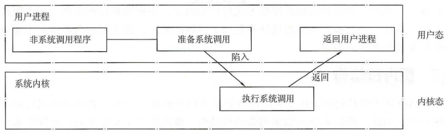

## 6、体系结构

### 模块组合结构

- 操作系统是一个有多种功能的系统程序，可以看作-个整体模块，也可以看作若干个模
块按一定的结构方式组成的。系统中的每### ### 个模块都是根据它们要完成的功能来划分的，这
些功能模块按照一定的结构方式组合起来，协同完成整个系统的功能。
- 优点:结构紧密、接口简单直接、系统的效率相对较高。
- 缺点：
1、模块之间可以随意转接，独立性差，导致系统结构不清晰
2、结构可扩展性差，确定接口的连接信息复杂
3、结构系统可适应性差，只适用于系统小，模块少，使用环境比较稳定的系统。

### 层次结构

- 力求使模块之间调用的无序性变为有序，减少了模块调用的无规则性。按层次结构来设计操
作系统，就是将操作系统的所有功能模块按功能的调用次序排列成若干层，使得功能模块之
间只存在单向调用和单向依赖。
- 优点: 模块间的组织和依赖关系清晰明了，上层功能是建立在下层功能基础之上的，
系统的可读性、可适应性以及可靠性都得到了增强。此外，对某### -层进行修改或替换时，最
多只影响到邻近的两层，便于修改和扩充。
缺点：需要合理有效的进行各功能模块分层
- 为了增强其适应性，必须把与机器特点紧密相关的软件(如中断处理、输入/输出管理等)放在最底层;其次，要将最常用的操作方式放在最内层，而把随着这些操作方式改变的部分
放在外层。另外，当前操作系统的设计都是基于进程的概念，通常要将为进程提供服务的系
统调用模块放在系统的内层。

### 微内核结构

- 在操作系统内核中只留下一些最基本的功能，而将其他服务尽可能地从内核中分离出去，用若干个运行在用户态下的进程(即服务器进程)来实现，形成所谓的“客户/服务器”模式，即C/S模式。普通用户进程(即客户进程)可通过内核向服务器进程发送请求，以取得操作系统的服务。
- ●优点:首先，每个服务进程运行在独立的用户进程中，即便某个服务器失败或产生
问题，也不会引起系统其他服务器和其他组成部分的崩溃，可靠性好;其次，系统具有很好
的灵活性，只要接口规范，操作系统可以方便地增删服务功能;再次，便于维护，即修改服
务器的代码不会影响系统其他部分;最后,这种结构的操作系统适合分布式处理的计算环境。
- ●缺点: 这种结构的操作系统效率不高，因为所有用户进程都要通过微内核相互通信，
所以微内核本身就成了系统的“瓶颈”尤其是通信频繁的系统。

# 第二章进程管理

## 进度和线程

### 基本概念

- 前驱图

    -前趋图是一个有向无循环图，每个结点可以表示一条语句、一个程序段或一个进程，结点间的有向边表示两个结点之间存在的偏序或前趋关系“→”:

- 程序顺序执行的特征

    -顺序性
    -封闭性：程序运行时独占系统各种资源
    -可再现性：初始条件和执行环境相同，程序可以复现结果，与时间无关

- 程序并发执行时的特征

    -间断性：共享资源产生的间接制约关系
    -失去封闭性：程序在并发执行时，多个程序共享系统中的各种资源，因而这些资源的状态将由多个程序来改变，致使程序的运行失去封闭性。
    -不可再现性：失去封闭性会导致不可再现性

### 进程的描述

- 进程的定义

    -进程是程序在处理器的一次执行
    -进程是一个程序及其数据在处理机上顺序执行时所发生的活动
    -进程是具有独立功能的程序在一个数据集合上运行的过程，它是系统进行资源分配和调度的一个独立单位

- 进程的特征

    -动态性
    -并发性
    -独立性
    -异步性
    -结构特征：每个进程都由程序段、数据段和一个进程控制块（PCB)组成。

    - 由程序段、相关数据段和PCB三部分构成了进程映像,也叫进程实体。进程映像是静态的，进程是动态的，进程是进程实体的运行过程。

- 进程和程序的关系

    -进程和程序的区别

    - 进程是动态概念，而程序则是静态概念
    - 程序是指令的有序集合，永远存在；进程强调是程序在数据集上的一次执行，有创建有撤销，存在是暂时的；
    - 进程具有并发性，而程序没有
    - 进程可创建其他进程，而程序并不能形成新的程序
    - 进程是竞争计算机资源的基本单位，程序不是

    -进程和程序的联系

    - 进程是程序在数据集上的一次执行
    - 程序是构成进程的组成部分，一个程序可对应多个进程，一个进程可包括多个程序
    - 进程的运行目标是执行所对应的程序
    - 从静态看，进程由程序、数据和进程控制块（PCB）组成

- 进程与作业的关系

    -联系

    - 作业是用户需要计算机完成某项任务而要求计算机所做工作的集合。一个作业的完成要
经过作业提交、作业收容、作业执行和作业完成4个阶段。而进程是已提交完毕的作业的执
行过程，是资源分配的基本单位。

    -区别

    - ●作业是用户向计算机提交任务的任务实体。在用户向计算机提交作业之后，系统将它放入外存中的作业等待队列中等待执行;而进程则是完成用户任务的执行实体，是向系统
申请分配资源的基本单位。任一进程，只要它被创建，总有相应的部分存在于内存中。
●一个作业可由多个进程组成，且必须至少由一个进程组成，但一个进程不能构成多个作业。
●作业的概念主要用在批处理系统中。像UNIX这样的分时系统则没有作业的概念;而进程的概念则用在几乎所有的多道程序系统中。

- 进程的组成

    -●进程控制块 (PCB)。每个进程均有-一个 PCB,它是一个既能标识进程的存在、又能刻画执行瞬间特征的数据机构。当进程被创建时，系统为它申请和构造一个相应的PCB。

    - 进程标识符（PID），进程创建时，被分配唯一的进程标识符，区别于其他进程。
    - 进程当前状态
    - 进程队列指针，记录PCB队列中下一个PCB的地址
    - 程序和数据地址
    - 进程优先级
    - CPU现场保护区：当进程因某种原因释放处理器时，CPU现场信息(如指令计数器、状态寄存器、通用寄存器等)被保存在PCB的该区域中，以便该进程重新获得处理器后能继续执行。
    - 通信信息
    - 家庭联系：允许进程创建子进程，形成进程家族树
    - 占有资源清单：所需及已分配
    - 进程控制块PCB的作用

	    - 作为独立运行基本单位的标志
	    - 能实现间断性运行方式
	    - 提供进程管理所需要的信息
	    - 提供进程调度所需要的信息
	    - 实现与其他进程的同步与通信

    -●程序段。程序段是进程中能被进程调度程序调度到CPU.上执行的程序代码段，能实现相应的特定功能。
    -●数据段。一个进程的数据段可以是进程对应的程序加工处理的原始数据，也可以是程序执行时产生的中间或结果数据。

### 进程的基本状态及转换

- 就绪状态ready：已获取除处理器意外的所有资源。
- 执行状态running：获取所有必要的资源并在CPU上执行
- 阻塞状态block：分配CPU也不会运行
- 创建状态：正在被创建，申请空白PCB并填充，然后等待系统分配资源。
- 终止状态：进程正从系统消失
- 状态转换

- 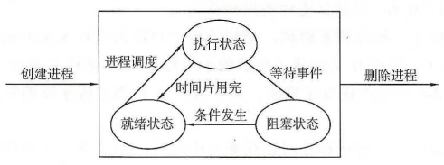
    -●进程状态 的转换并非都是可逆的，进程既不能从阻塞状态变为执行状态，也不能从
就绪状态变为阻塞状态。
●进程之间的状态转换并非都是主动的，在很多情况下都是被动的，只有从执行状态
到阻塞状态是程序的自我行为(因事件而主动调用阻塞原语)，其他都是被动的。
●进程状态的唯一性。-一个具体的进程在任何一个指定的时刻必须且只能处于一种状态。

- 挂起操作的目的

    -终端用户的需要: 修改、检查进程
    -父进程的需要：修改、协调子进程
    -对换的需要：缓和内存
    -负荷调节的需要：保证实时任务的执行

### 进程控制

- 操作系统内核

    -两大功能

    - 支撑功能

	    - 中断管理
	    - 时钟管理
	    - 原语操作

		    - 进程的管理，由若干原语（primitive）来执行

    - 资源管理功能

	    - 进程管理
	    - 存储器管理
	    - 设备管理

    -状态

    - 系统态，管态，内核态
    - 用户态，目态

- 进程的创建

    -进程的层次结构

    - 父进程
    - 子进程

    -引起创建进程的事件

    - 用户登录
    - 作业调度
    - 提供服务
    - 应用请求

    -进程的创建过程

    - 1.申请空白PCB
    - 2.为新进程分配其运行所需的资源
    - 3.初始化进程块PCB
    - 4.如果进程就绪队列能够接纳新进程，便将新进程插入就绪队列

    -进程的终止

    - 引起进程终止的事件

	    - 1.正常结束
	    - 2.异常结束
	    - 3.外界干预

    - 进程的终止过程

	    - 1.根据被终止进程的标识符

    -进程的阻塞与唤醒

    - 引起进程阻塞和唤醒的事件

	    - 请求系统服务而未满足
	    - 启动某种操作而阻塞当前进程
	    - 新数据尚未到达
	    - 无新工作可做：系统进程

    - 进程阻塞过程(自己阻塞自己)
    - 进程唤醒过程(系统或其他进程唤醒自己)

    -进程的挂起与激活

    - suspend
    - active

- 进程同步

    -基本概念

    - 两种形式的制约关系

	    - 间接相互制约关系

		    - 互斥——竞争

	    - 直接相互制约关系

		    - 同步——协作

    - 临界资源
    - 分区

	    - 进入区enter section
	    - 临界区critical section
	    - 退出区exit section
	    - 剩余区remainder section

    - 同步机制应遵循的规则

	    - 1.空闲让进
	    - 2.忙则等待
	    - 3.有限等待
	    - 4.让权等待

    -进程同步机制

    - 软件同步机制:都没有解决让权等待，而且部分方法还会产生死锁的情况
    - 硬件同步机制

	    - 关中断
	    - 利用Test-and-Set指令实现互斥
	    - 利用swap指令实现进程互斥

    - 信号量机制

	    - 整型信号量
	    - 记录型信号量

		    - 由于整型信号量没有遵循让权等待原则，记录型允许负数，即阻塞链表

	    - AND型信号量
	    - 信号量集

		    - 理解:AND型号量的wait和signal仅能对信号施以加1或减1操作，意味着每次只能对某类临界资源进行一个单位的申请或释放。当一次需要N个单位时，便要进行N次wait操作，这显然是低效的，甚至会增加死锁的概率。此外，在有些情况下，为确保系统的安全性，当所申请的资源数量低于某一下限值时，还必须进行管制，不予以分配。因此，当进程申请某类临界资源时，在每次分配前，都必须测试资源数量，判断是否大于可分配的下限值，决定是否予以分配
		    - 操作

			    - Swait(S1，t1，d1…Sn，tn，dn)
			    - Ssignal(S1，d1…Sn，dn)

		    - 特殊情况

    -经典进程的同步问题

    - 生产者–消费者问题
    - 哲学家进餐问题
    - 读者–写者问题

### 线程的基本概念

- 线程的引入

    -线程的引入正是为了简化线程间的通信，以小的开销来提高进程内的并发程度
    -多进程并发的不足

    - 进程的两个基本属性

	    - 一个拥有资源的独立单位，可独立分配系统资源
	    - 一个可独立调度和分派的基本单位，PCB

    - 程序并发执行所需付出的时空开销

	    - 创建进程
	    - 撤销进程
	    - 进程切换

    - 进程间通信效率低
    - 将分配资源和调度两个属性分开

    -线程——作为调度和分派的基本单位

    - 进程是系统资源分配的单位，线程是处理器调度的单位
    - 线程表示进程的一个控制点，可以执行一系列的指令。通常，和应用程序的一个函数相对应
    - 进程分解为线程还可以有效利用多处理器和多核计算机

- 线程与进程的比较

    -不同点

    - 调度的基本单位
    - 并发性

    -相似点

    - 状态：运行、阻塞、就绪
    - 线程具有一定的生命期
    - 进程可创建线程，一个线程可创建另一个子线程
    - 多个线程并发执行时仍然存在互斥与同步

- 线程的实现

    -线程的实现方式

    - 内核支持线程KST
    - 用户级线程ULT
    - 组合方式

    -多线程OS中的进程属性

    - 进程是一个可拥有资源的基本单位
    - 多个线程可并发执行
    - 进程已不是可执行的实体

    -线程的状态和线程控制块

    - 线程运行的三个状态

	    - 执行状态
	    - 就绪状态
	    - 阻塞状态

    - 线程控制块TCB

### 进程通信

- 低级进程通信：进程通信是指进程之间的信息交换，进程互斥与同步是一种进程间通信方式，P、V原语称为两条低级进程通信原语
- 高级进程通信的类型

    -共享存储器系统

    - 基于共享数据结构的通信方式

	    - 生产者和消费者

    - 基于共享存储区的通信方式

	    - 在通信前，进程向系统申请建立-一个共享存储区，并指定该共享存储区的关键字。若该共享存储区已经建立，则将该共享存储区的描述符返回给申请者。然后,申请者把获得的共享存储区附接到进程上。

    -管道通信系统(pipe)

    - 管道是用于连接读进程和写进程以实现它们之间通信的共享文件。向管道提供输入的发送进程(即写进程)以字符流形式将大量的数据送入管道，而接收管道输出的进程(即读进程)可以从管道中接收数据。
★注:管道是一个共享文件，不能单纯地从字面.上仅将管道理解为一个传输通道。

    -消息传递系统

    - 在消息传递系统中，进程间以消息为单位交换数据，用户直接利用系统提供的一组通信
命令(原语)来实现通信。
    - 方式分类

	    - 直接通信

		    - 发送进程直接把消息发送给接收进程，并将它挂在接收进程的消息缓冲队列上,接收进程从消息缓冲队列中取得消息。

	    - 间接通信

		    - 发送进程把消息发送到某个中间实体(通常称为信箱)中，接收进程从中取得消息。这种通信方式又称为信箱通信方式。该通信方式广泛应用于计算机网络中，与之相应的通信系统称为电子邮件系统。

    -客服机–服务器系统

## 处理机调度与死锁

### 处理机调度算法

- 处理机调度的层次

    -高级调度（作业调度）

    - 度主要任务是按照一定的原则从外存 上处于后备
状态的作业中选择一个或者多个， 给它们分配内存、.输入/输出设备等必要资源，并建立相应的进程，以使该作业具有获得竞争处理器的权利(作业是用户在一次运算过程或一次事务处理中要求计算机所做工作的总和)。作业调度的运行频率较低，通常为几分钟一次。
    - 批处理系统需要作业调度

	    - 在批处理系统或通用操作系统中的批处理部分，
新提交的作业先存放在磁盘上,因此需要通过作业调度将它们分批装入内存。而在其他类型的操作系统中，通常不需要配置作业调度。
	    - 多道程序的并发程度应根据系统的规模和运行速度来确定。并发程度决定作业调度每次接纳作业的个数
	    - 调度算法选择接纳的作业

    - 分时系统无需作业调度，因为需要交互

    -中级调度（和挂起有关）

    - 主要任务是按照给定的原则和策略，将处于外存对换区中的具备运行条件的进程调
入内存，并将其状态修改为就绪状态，挂在就绪队列上等待;或者将处于内存中的暂时不能
运行的进程交换到外存对换区，将此时的进程状态称为挂起状态。

    -低级调度（进程调度）

    - 进程调度是最基本的调度，任何操作系统都有进程调度。主要任务是按照某种策略和方法从就绪队列中选取一个进程。
    - 作业调度和进程调度的区分

	    - ●作 业调度为进程被调用做准备，进程调度使进程被调用。换言之，作业调度的结果
是为作业创建进程，而进程调度的结果是进程被执行。
●作业调度次数少，进程调度频率高。
●有的系统可以不设置作业调度，但进程调度必须有。

    - 低级调度的三个基本机制

	    - 排队器
	    - 分派器
	    - 上下文切换

- 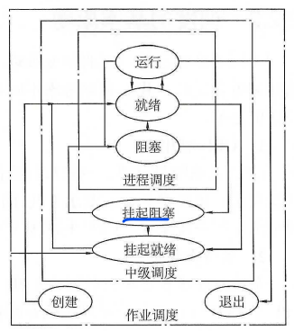

- 调度的基本原则

    -CPU利用率
    -系统吞吐量（单位时间内CPU完成的作业数量），长作业的吞吐量低
    -响应时间，相对于是面向对象的，调度策略保证尽量短的响应时间。
    -周转时间

    - 周转时间指作业从提交到完成的时间间隔，包括等待时间和执行时间。
    - 平均周转时间
    - 带权周转时间，指作业周转时间和运行时间的比
    - 平均带权周转时间

- 进程调度

    -进程调度的功能

    - 记录系统中所有进程的有关情况以及状态特征；使用PCB记录，并形成队列，根据其在不同状态队列之间转换。
    - 选择获得处理器的进程，考虑选择策略
    - 处理器分配，考虑中断服务

    -产生调度

    - ●当前运行进程运行结束。因任务完成而正常结束，或者因出现错误而异常结束。
●当前运行进程因某种原因，比如I/O请求、P操作、阻寒原语等，从运行状态进入
阻塞状态。
●执行完系统调用等系统程序后返回用户进程，这时可以看作系统进程执行完毕，从而可以调度一个新的用户进程。
●在采用抢占调度方式的系统中，-一个具有更高优先级的进程要求使用处理器，则使
当前运行进程进入就绪队列(这与调度方式有关)。
●在分时 系统中，分配给该进程的时间片己用完(这与系统类型有关)。

    -不能调度的情况

    - ●处理 中断的过程中。中断处理过程复杂，在实现上很难做到进程切换，而且中断处
理是系统工作的一部分，逻辑上不属于某一进程， 不应被剥夺处理器资源。
●在操作系统内核程序临界区中。进程进入临界区后，需要独占式地访问共享数据，
理论上必须加锁，以防止其他并行程序进入，在解锁前不应切换到其他进程运行，以加快该
共享数据的释放。
●其他需要完全屏蔽中断的原子操作过程中。如加锁、解锁、中断现场保护、恢复等
原子操作。原子操作不可再分，必须### -次完成，不能进行进程切换。

    -进程调度方式

    - 非抢占方式，等待程序完成或进入完成或阻塞状态下，才将处理器分配给新进程
    - 抢占方式

	    - 优先权原则
	    - 短进程优先原则
	    - 时间片原则

    -进程调度的任务

    - 保存处理机的现场信息
    - 按某种算法选取进程
    - 把处理器分配给进程

    -进程调度的算法

    - 先来先服务调度算法
    - 短作业优先调度算法，平均等待时间最短，存在长作业“饥饿”。
    - 优先级调度算法

	    - 优先级调度算法的类型

		    - 非抢占式优先级调度算法

			    - 等当前进程执行完以后，再执行另一个优先权最高的进程
			    - 这种调度算法主要用于批处理系统中；也可用于某些对实时性要求不严的实时系统中。 

		    - 抢占式优先级调度算法

			    - 不等当前进程结束，直接抢处理机
			    - 常用于要求比较严格的实时系统中， 以及对性能要求较高的批处理和分时系统中。

	    - 优先级的类型

		    - 静态优先级

			    - 优先权是在创建进程时确定的，且在进程的整个运行期间保持不变。一般地，优先权是利用某一范围内的一个整数来表示的，例如，0~7或0~255中的某一整数， 又把该整数称为优先数。
			    - 可以参考BIOS系统中设置boot的优先级
			    - 按进程类确定，系统进程和用户进程，系统进程高于用户进程
			    - 按作业的资源要求确定，进程申请资源越多，运行时间越长，进程优先级越低
			    - 按用户类型和要求确定

		    - 动态优先级

			    - 在创建进程时所赋予的优先权，是可以随进程的推进或随其等待时间的增加而改变的，以便获得更好的调度性能。
			    - 按进程占有CPU的时间长短决定
			    - 按就绪进程等待CPU的时间长短

    - 轮转调度算法

	    - 基本原理:在轮转(RR)法中，系统根据FCFS策略，将所有的就绪进程排成一个就绪队列，并可设置每隔一定时间间隔(如30ms)即产生一次中断，激活系统中的进程调度程序，完成一次调度，将CPU分配给队首进程，令其执行
	    - 进程切换时机

		    - 时间片未用完，进程完成
		    - 时间片到，进程未完成

	    - 时间片大小的确定

		    - 影响结果

			    - 太小利于短作业，增加系统切换开销
			    - 太长就退化为FCFS算法
			    - 一般选择: q略大于一次交互所需要的时间，使大多数进程在一个时间片内完成

		    - 决定因素

			    - 系统响应时间，正比
			    - 就绪进程中的进程数，反比
			    - 系统处理能力，反比

	    - 一般来说，平均周转时间将比SJF长，但是有较好的响应时间

    - 高响应比优先调度算法(Highest Response Ratio Next,HRRN)

	    - 原理

		    - 在每次选择作业投入运行时，先计算此时后备作业队列中每个作业的响应比RP然后选择其值最大的作业投入运行
		    - 优先权=(等待时间+要求服务时间)/要求服务时间=响应时间/要求服务时间=1+等待时间/要求服务时间

	    - 特点

		    - 如果作业的等待时间相同，则要求服务的时间愈短，其优先权愈高，因而类似于SJF算法，有利于短作业
		    - 当要求服务的时间相同时，作业的优先权又决定于其等待时间，因而该算法又类似于FCFS算法
		    - 对于长时间的优先级，可以为随等待时间的增加而提高，当等待时间足够长时，也可获得处理机

    - 多队列调度算法

	    - 多级队列调度算法的基本思想是根据进程的性质或类型，将就绪队列划分为若干个独立
的队列，每个进程固定地分属于一个队列。每个队列采用一种调度算法，不同的队列可以采
用不同的调度算法。

    - 多级反馈队列调度算法

	    - 调度机制

		    - 设置多个就绪队列
		    - 每个队列都采用FCFS算法，第一队列优先级最高，递减
		    - 按照队列优先级调度，在第n队列中采取按时间片轮转的方式运行，队列优先级预告，其队列内的时间片越短，第i+1队列的时间片是第i列时间片的两倍。
		    - 在时间片内完成，可准备撤离系统；未完成可将线程转入下一下队列的末尾。

	    - 调度算法的性能

		    - 对于终端型用户，由于作业小，感觉满意
		    - 对于短批处理作业用户，周转时间也较小
		    - 长批处理作业用户，也能够得到执行

    - 基于公平原则的调度算法

	    - 保证调度算法
	    - 公平分享调度算法

- 实时调度(HRT和SRT任务)

    -实现实时调度的基本条件

    - 提供必要信息

	    - 就绪时间
	    - 开始截止时间和完成截止时间
	    - 处理时间
	    - 资源要求
	    - 优先级

    - 系统处理能力强

	    - ∑(Ci/Pi)≤1
	    - N个处理机:∑(Ci/Pi)≤N

    - 采用抢占式调度机制
    - 具有快速切换机制

	    - 对中断的快速响应能力
	    - 快速的任务分派能力

    -实时调度算法的分类

    - 非抢占式调度算法

	    - 非抢占式轮转调度算法
	    - 非抢占式优先调度算法

    - 抢占式调度算法

	    - 基于时钟中断的抢占式优先级调度算法
	    - 立即抢占的优先级调度算法

    -最早截止时间优先EDF(Earliest Deadline First)算法

    - 根据任务的开始截至时间来确定任务的优先级

	    - 截至时间越早，优先级越高

    - 非抢占式调度方式用于非周期实时任务
    - 抢占式调度方式用于周期实时任务

    -最低松弛度优先LLF(Least Laxity First)算法

    - 类似EDF
    - 算法根据任务紧急(或松弛)的程度，来确定任务的优先级。任务的紧急程度愈高，为该任务所赋予的优先级就愈高， 以使之优先执行。
    - 松弛度例子

	    - 例如，一个任务在200ms时必须完成，而它本身所需的运行时间就有100ms，因此，调度程序必须在100 ms之前调度执行，该任务的紧急程度(松弛程度)为100 ms

    -优先级倒置(Priority inversion problem)

    - 优先级倒置的形成

	    - 高优先级进程被低优先级进程延迟或阻塞。

    - 优先级倒置的解决方法

	    - 简单的:假如进程P3在进入临界区后P3所占用的处理机就不允许被抢占
	    - 实用的:建立在动态优先级继承基础上的

- 处理机调度算法的共同目标

    -资源利用率:CPU的利用率=CPU有效工作时间/(CPU有效工作时间+CPU空闲等待时间)
    -公平性
    -平衡性
    -策略强制执行

- 批处理系统的目标

    -平均周转时间短
    -系统吞吐量高
    -处理机利用率高

- 分时系统的目标

    -响应时间快
    -均衡性

- 实时系统目标

    -截止时间的保证
    -可预测性

### 同步与互斥

- 相互制约关系

    -间接相互制约（互斥），同种进程之间达到互斥地访问资源
    -直接相互制约（同步），不同进程之间以达到多种进程间同步

- 临界资源和临界区

    -临界资源是同时仅允许一个进程使用的资源
    -临界资源访问过程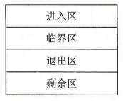

    - 进入区，检查是否可进入临界区，若可以，通常设置相应的“正在访问临界区”标志，以阻止其他进程同时进入临界区
    - 临界区，进程中用于访问临界资源的代码，又称临界段
    - 退出区，临界区后用于清除“正在访问临界区”标志的部分
    - 剩余区

    -临界资源必须不同进程互斥访问，临界区是每个进程中访问临界资源的一段代码，属于进程。

- 互斥要求

    -●空闲证进。 当没有进程处于临界区时，可以允许一个请求进入临界区的进程立即进入自己的临界区。
●忙则等待。 当已有进程进入其临界区时，其他试图进入临界区的进程必须等待。
●有限等待。对要求访问临界资源的进程，应保证能在有限的时间内进入自己的临界
区。
●让权等待。当一个进程因为某些原因不能进入自己的临界区时，应释放处理器给其
他进程。

- 同步要求

    -使用信号量实现同步，满足多个相互合作的进程在一些关键点上相互等待或相互交换信息。

- 互斥实现方法

    -软件实现方法，标志的检查和修改不能作为一个整体来执行，容易导致无法保证互斥访问的问题
    -硬件方法指中断屏蔽和硬件指令；
优点：适用范围广、简单、支持多个临界区
缺点：进入临界区耗费处理器时间，不能实现“让权等待”，也会发生“饥饿”

- 信号量

- 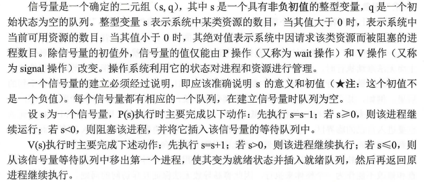

- 

    -分类

    - 整型信号量

- 

    - 记录型信号量（资源信号量）

- 

    -信号量的应用

    - 进程同步

- 

    - 进程互斥

- 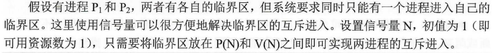

- 经典同步问题

    -生产者-消费者

- 
- 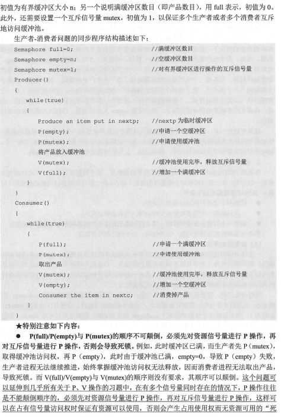
- 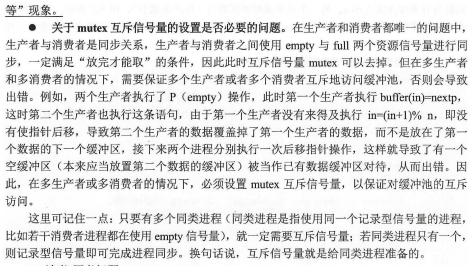

    -读者-写者

- 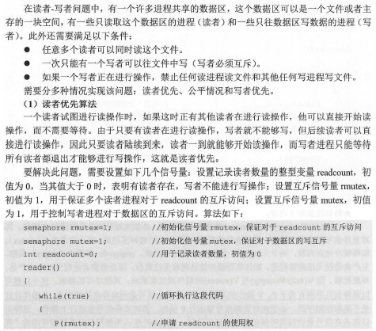
- 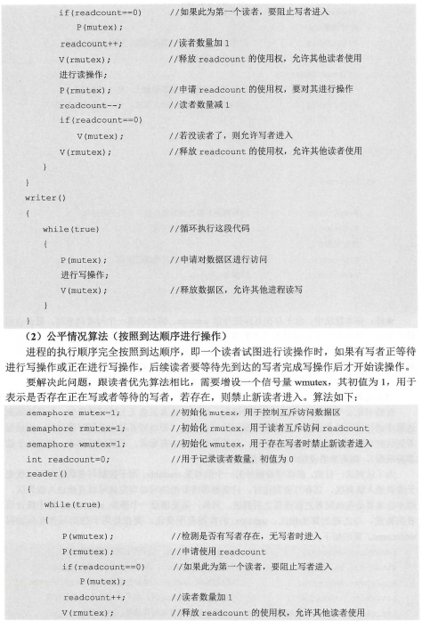
- 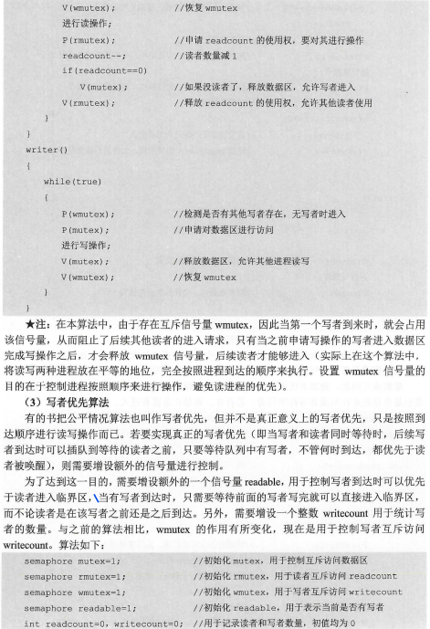
- 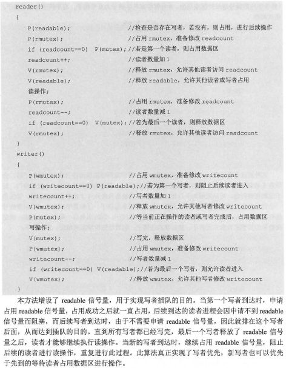

    -哲学家进餐

- 
- 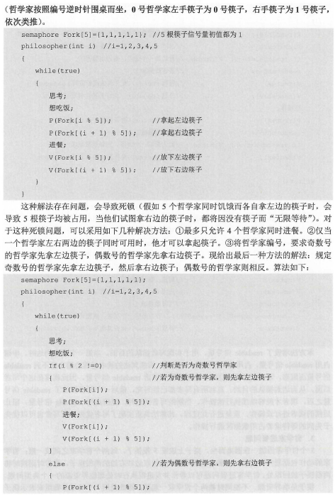
- 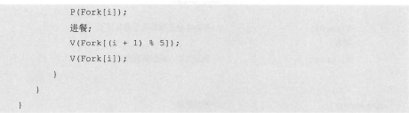

    -理发师问题

- 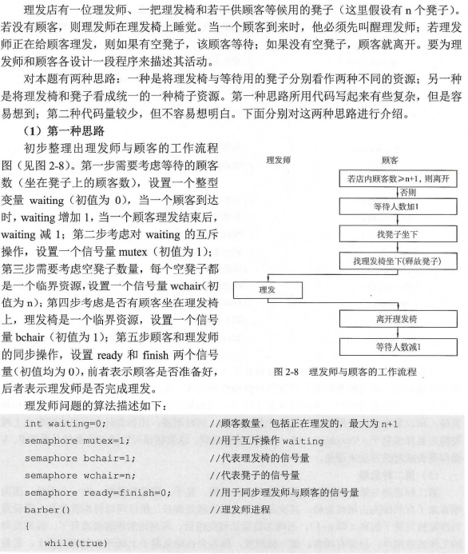
- 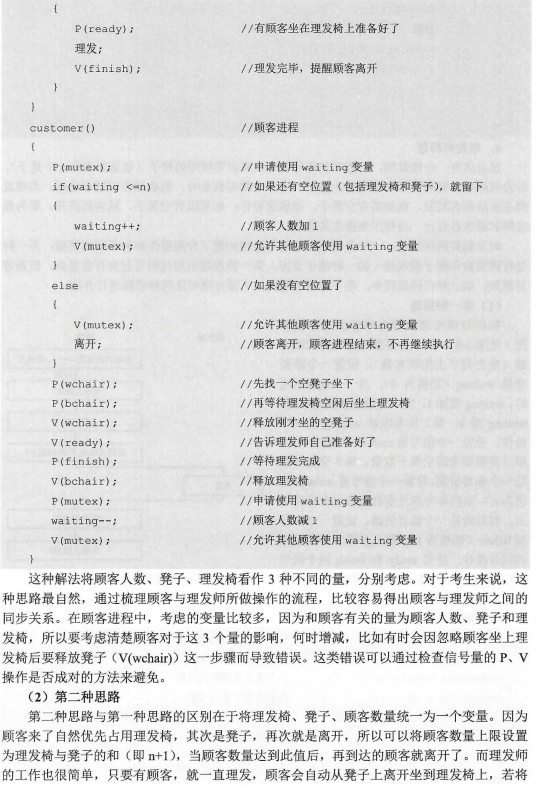
- 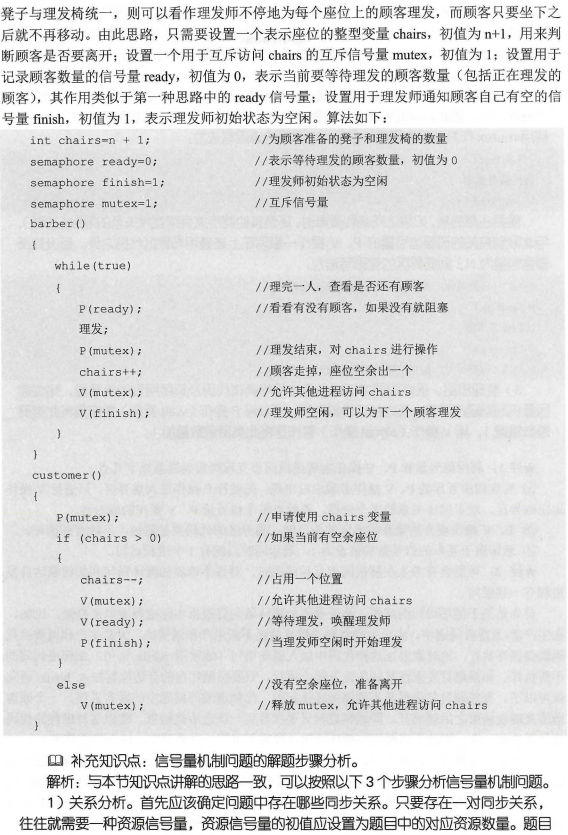
- 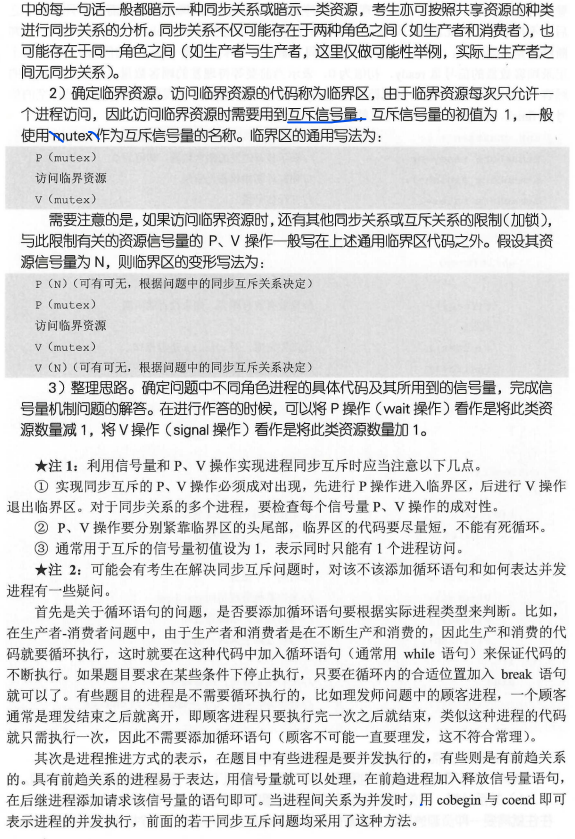

- 管程

    -管程由局部于管程的共享数据结构说明、操作这些数据结构的一组过程以及对局部于管程的数据结构设置初值的语句组成，管程把分散在各个进程中互斥访问公共变量的临界区集中起来，提供对它们的保护。
    -特征

    - ●局部于管程的数据 只能被局部于管程内的过程所访问。
●一个 进程只有通过调用管程内的过程才能进入管程访问共享数据。
●每次仅允许一个进程在管程内执行某个内部过程，即进程互斥地通过调用内部过程
进入管程。其他想进入管程的过程必须等待，并阻塞在等待队列。

    -互斥实现

    - 管程是-一个语言成分，互斥访问完全由编译程序在编译时自动添加，而且保证正确。

    -同步实现

    - ●局限于管程并仅 能从管程内进行访问的若干条件变量，用于区别各种不同的等待原
因。
●在条件变量上进行操作的两个函数过程wait和signal。wait将调用此函数的进程阻
塞在与该条件变量相关的队列中,并使管程可用，即允许其他进程进入管程。signal 唤醒在该
条件变量上一个阻塞的进程。管程的signal过程必须在wait过程调用之后调用。

### 死锁概述

- 资源分类

    -可重用性资源

    - 计算机外设

    -消耗性资源

    - 数据，消息

    -可抢占性资源

    -  不引起死锁
    - CPU，内存 

    -不可抢占性资源

    - 光驱，打印机

- 计算机系统中的死锁

    -系统资源不足

    - 竞争不可抢占性资源引起死锁
    - 竞争可消耗资源引起死锁

    -进程推进顺序不当引起死锁

- 定义:如果一组进程中的每一个进程都在等待仅由该进程中的其他进程占有的，自己永远得不到的资源，那么该组进程是死锁的
- 产生死锁的必要条件

    -互斥条件
    -请求和保存条件
    -不可抢占条件
    -循环等待条件

    - 如果每个资源只有一个实例，则环路等待条件是死锁存在的充分必要条件

- 处理死锁的方法

    -预防死锁

    - 静态方法，在进程执行前采取的措施，通过设置某些限制条件，去破坏产生死锁的四个条件之一，防止发生死锁。
    - 预防死锁的策略

	    - 破坏"请求和保存"条件

		    - 第一种协议

			    - 所有进程在开始运行之前，必须一次性地申请其在整个运行过程中所需的全部资源
			    - 优点:简单，易行，安全
			    - 缺点

				    - 资源被严重浪费，严重地恶化了资源的利用率
				    - 使进程经常会发生饥饿现象

		    - 第二种协议

			    - 它允许一个进程只获得运行初期所需的资源后，便开始运行。进程运行过程中再逐步释放已分配给自己的，且已用毕的全部资源，然后再请求新的所需资源

	    - 破坏"不可抢占"条件

		    - 当一个已经保存了某些不可被抢占资源的进程，提出新的资源请求而不能得到满足时，它必须释放已经保持的所有资源，待以后需要时再重新申请

	    - 破坏"循环等待"条件

		    - 对系统所以资源类型进行线性排序，并赋予不同的序号
		    - 例如令输入机的序号为1，打印机序号为2，磁盘机序号为3等。所有进程对资源的请求必须严格按资源序号递增的次序提出。

    -避免死锁

    - 动态的方法，在进程执行过程中采取的措施，不需事先采取限制措施破坏产生死锁的必要条件，而是在进程申请资源时用某种方法去防止系统进入不安全状态，从而避免发生死锁。如银行家算法
    - 避免死锁的策略

	    - 系统安全状态

		    - 安全状态

			    - 某时刻，对于并发执行的n个进程，若系统能够按照某种顺序如<p1,p2…pn>来为每个进程分配所需资源，直至最大需求，从而使每个进程都可顺利完成，则认为该时刻系统处于安全状态，这样的序列为安全序列

		    - 不安全状态指系统可能发生死锁

	    - 利用银行家算法避免死锁

		    - 含义:每一个新进程在进入系统时，它必须申明在运行过程中，可能需要每种资源类型的最大单元数目，其数目不应超过系统所拥有的资源总量。当进程请求一组资源时，系统必须首先确定是否有足够的资源分配给该进程。若有，再进一步计算在将这些资源分配给进程后，是否会使系统处于不安全状态。如果不会，才将资源分配给它，否则让进程等待
		    - 银行家算法中的数据结构

			    - 可用资源向量 Available[m]：m为系统中资源种类数，Available[j]=k表示系统中第j类资源数为k个。
			    - 最大需求矩阵 Max[n,m]：n为系统中进程数，Max[i,j]=k表示进程i对j类资源的最大需求数为中k。
			    - 分配矩阵 Allocation[n，m]:它定义了系统中每一类资源当前已分配给每一进程资源数，   Allocation[i,j] = k表示进程i已分得j类资源的数目为k个。
			    - 需求矩阵 Need[n,m]：它表示每个进程尚需的各类资源数，Need[i,j]=k 表示进程i   还需要j类资源k个。Need[i,j]=Max[i,j] ### Allocation[i,j]

		    - 银行家算法

- 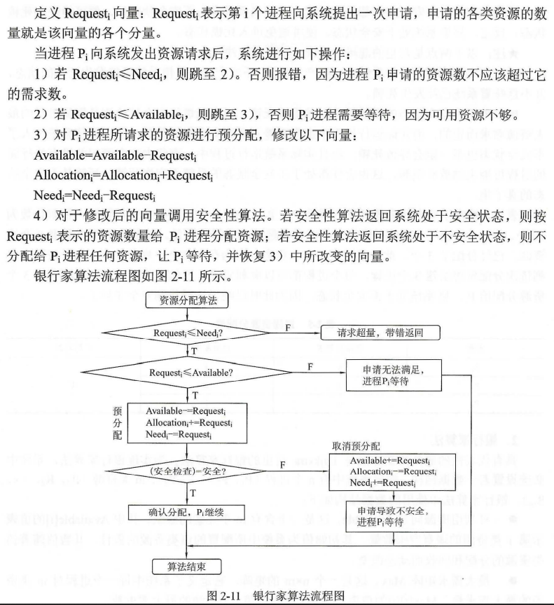

		    - 安全性算法

- 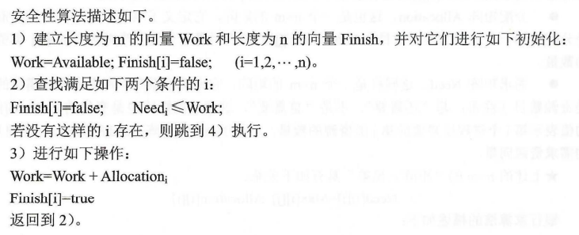

- 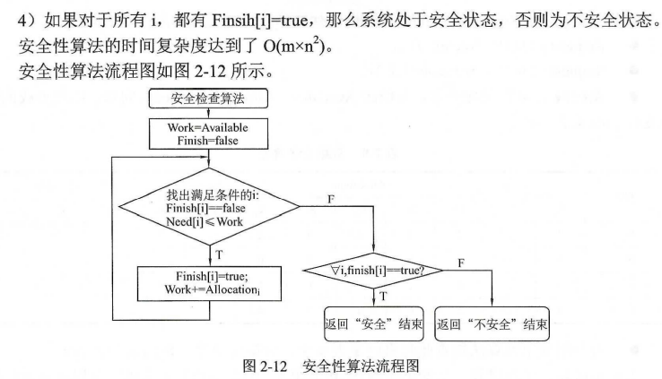

    -死锁的检测与解除

    - 死锁的检测

	    - 死锁定理

		    - ●在资源分配图中， 找出一个既不阻塞又非孤立的进程结点P; (即从进程集合中找到
一个存在连接的边，且资源申请数量小于系统中已有空闲资源数量的进程)。因进程P;获得
了所需要的全部资源，它能继续运行直到完成，然后释放其占有的所有资源(这相当于消去
P;的所有申请边与分配边，使之成为孤立的结点)。
●进程 P;释放资源后，可以唤醒因等待这些资源而阻塞的进程，原来阻塞的进程可能变为非阻塞进程，根据第-步中的简化方法消去分配边与申请边。
●重复前两步的简化过程后， 若能消去图中所有边，使所有进程成为孤立结点，则称
该图是可完全简化的;若通过任何过程均不能使该图完全简化，则称该图是不可完全简化的。
可以证明的是，不同简化顺序将得到相同的不可简化图。系统状态S为死锁状态的条件
是:当且仅当S状态的资源分配图是不可完全简化的，该定理称为死锁定理。

	    - 死锁检测算法

- 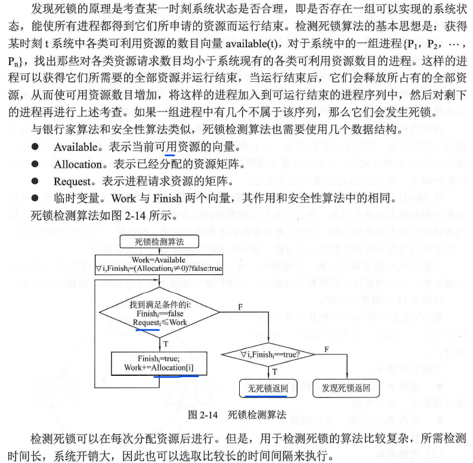

    - 死锁的解除

	    - 剥夺资源

		    - 从其他进程中抢占足够的资源给死锁的进程以解除其死锁状态。

	    - 撤销进程

		    - 撤销进程。撤销一些进程，直到有足够的资源分配给其他进程，解除死锁状态。

	    - 进程回退

		    - 让一个或多个进程回退到足以回避死锁的地步，进程回退时自愿释放资
源而不是被剥夺。要求系统保持进程的历史信息，设置还原点。

- 死锁与饿死

    -资源分配策略也可能是不公平的，即不能保证等待时间上界的存在。即使系统没有发生死锁，某些进程也可能会长时间等待。当等待时间给进程推进和响应带来明显影响时，则称此时发生了进程饥饿，当饥饿到一 定程度， 进程所赋予的任务即使完成也不再具有实际意义时，称该进程被饿死。
在忙时等待条件下发生的饥饿，称为活锁
    -区分

    - ●从进程状态考虑， 死锁进程都处于等待状态;忙时等待( 处于运行或就绪状态)的
进程并非处于等待状态，但却可能被饿死。
●死锁进程等待的是永远不会被释放的资源;而饿死进程等待的是会被释放但却不会
分配给自己的资源，表现为等待时间没有上界(排队等待或忙时等待)。
●死锁一定发生了 循环等待，而饿死则不然。这也表明通过资源分配图可以检测死锁
存在与否，但却不能检测是否有进程饿死。
●死锁### -定涉及多个进程，而饥饿或被饿死的进程可能只有一个。

# 第三章 内存管理

## 基础知识

### 内存管理功能

- 内存的分配与回收
- 地址变换，逻辑地址和物理地址转换(重定位）
- 扩充内存，虚拟存储或其他自动覆盖技术
- 存储保护，软硬件结合

### 应用程序的行为

- 应用程序从用户编写的源文件到内存中执行的进程，经过编译程序将源代码编译为若干个目标模块;其次，通过链接程序将编译好的目标模块以及所需的库函数链接在一起，形成完整的装入模块;最后，通过装入程序 将这些装入模块装入内存并执行。经历了编译、链接、装入三个步骤。

- 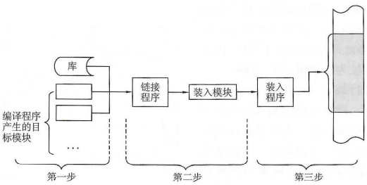

- 地址变换过程

- 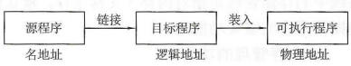

- 链接方式

    -静态链接

    - 运行之前，所有目标模块和库连接为可执行程序

    -装入时动态链接

    - 编译后目标模块边装入边链接

    -运行时动态链接

    - 将某些模块的链接推迟到执行时进行

- 装入方式

    -绝对装入

    - 编译程序产生有物理地址的目标代码

    -可重定位装入（静态重定位）

    - 根据内存情况，将装入模块装到合适位置，地址变换在装入时一次完成，需要提前分配连续的存储区

    -动态运行装入

    - 允许程序运行时在内存中移动位置，访问内存时，自动得到重定位寄存器（基址寄存器）的内容加到逻辑地址形成物理地址。

### 逻辑与物理地址

- 逻辑地址是由程序产生的与段（页不对用户可见）相关的偏移地址
- 物理地址是指出现在CPU外部地址总线上的寻址物理内存的地址信号

### 内存保护

- 界限寄存器

    -上、下界寄存器方法：指定作业的结束地址和开始地址
    -基址和限长寄存器方法：指定起始地址和作业的地址空间长度

- 存储保护键

    -每个存储块分配一个保护健进行匹配，不匹配发出保护性中断，停止运行
一个分区是由整数个相同大小的存储块组成。

### 存储器的层次结构

- 多层结构的存储系统

    -存储器的多层结构

    - CPU寄存器
    - 主存
    - 辅存

    -可执行存储器

    - 寄存器和主存的总称
    - 访问速度快，进程可以在很少的时钟周期内用一条load或store指令完成存取。

- 主存储器与寄存器
- 高速缓存和磁盘缓存

### 覆盖与交换

- 覆盖

    -覆盖盖技术，把一个大的程序划分为一系列相对独立的程序单位的覆盖。把程序执行时并不要求同时装入内存的覆盖组成一组， 称为覆盖段并分配到同一个存储区域（覆盖区），其大小应由覆盖段中的最大覆盖来确定。
    -覆盖技术的特点是打破了必须将一个进程的全部信息装入主存后才能运行的限制。但当
同时执行程序的代码量超过主存时，程序仍然不能运行。

- 交换

    -交换技术就是把暂时不用的某个程序及数据部分(或全部)从内存移到外存中，以便腾出必要的内存空间;或把指定的程序或数据从外存读到相应的内存中，并将控制权转给它，让其在系统上运行的一种内存扩充技术。
    -交换技术的特点是打破了一个程序一旦进入主存便一直运行到结束的限制。但运行的进程大小仍然受实际主存的限制。
    -注意事项

    - 1)交换需要备份存储，通常是使用快速磁盘。它必须足够大，并且提供对这些内存映像
的直接访问。
2)为了有效使用CPU，需要每个进程的执行时间比交换时间长，而影响交换时间的因
素主要是转移时间。
3)如果换出进程，必须确保该进程完全空闲。
4)交换空间通常作为磁盘的一整块， 且独立于文件系统。
5)交换通常在有许多进程运行且内存空间紧张时开始启动，而在系统负荷减轻时暂停。
6)普通的交换使用不多，但交换技术的某些变种在许多系统中(如UNIX系统)仍发挥作用

## 连续分配存储管理方式

### 内碎片：占用分区之内未被利用的空间，已经分配给作业但不能被利用的内存空间，作业所占内存区域没有装满
### 外碎片：占用分区之间难以利用的空闲分区（通常是小空闲分区），指系统中还没分配作业担碎片太小无法分配，存在内训区域不能分配给某作业也不能分配给其他作业。
### 连续分配

- 单一连续分配(DOS)，适用于单用户、单任务的操作系统

    -内存分为两个连续存户区域，一个固定分给操作系统（内存地址低部份），一个给用户作业使用。
    -单一连续分配方式的优点是管理简单，只需要很少的软件和硬件支持，且便于用户了解
和使用，不存在其他用户干扰的问题。其缺点是只能用于单用户、单任务的操作系统，内存
中只装入一道作业运行，从而导致各类资源的利用率都很低。

- 固定分区分配(浪费很多空间)

    -将内存空间划分为若千个固定大小的分区，每个分区中可以装入一道程序。分区的大小可以不等，但事先必须确定，在运行时不能改变。当有空闲分区时，便从后备队列中选择-一个适当大小的作业装入运行。固定分区分配中，程序通常采用静态重定位方式装入内存。
    -为了实现固定分区分配，系统需要建立### -张分区说明表，以记录可用于分配的分区号、分区的大小、分区的起始地址及状态，通常按照分区大小顺序排序
    -1)分区大小相等。缺乏灵活性，造成内存空间的浪费，当程序太大时，一个分区又不足
以装入该程序，导致程序无法运行。
2)分区大小不相等。可把内存区划分成含有多个较小的分区、适量的中等分区及少量的
大分区。可根据程序的大小为之分配适合的分区。
固定分区分配的优点是可用于多道程序系统最简单的存储分配，其缺点是不能实现多进
程共享一个主存区，利用率较低，会产生内部碎片。

- 动态分区分配

    -概念

    - 指在作业装入内存时，从可用的内存中划出一块连续的区域分配给它，且分区大小正好等于该作业的大小。可变式分区中分区的大小和分区的个数都是可变的，而且是根据作业的大小和多少动态地划分。

    -数据结构（记录内存使用）

    - 空闲分区表。设置-一个空闲分区表来登记系统中的空闲分区，每个空闲分区对应一个
表项，每个表项包含分区号、起始地址、大小及状态
    - 空闲分区链。用链头指针将内存中的空闲分区链接起来，构成空闲分区链。实现方法是用每个空闲分区的起始若千个字节存放控制信息，
其中存放空闲分区的大小和指向下一个空闲分区的指针。

    -分区分配算法

    - 基于顺序搜索的动态分区分配算法

	    - 首次适应算法（first fit,FF）

		    - 空闲分区表（空闲区链）中的空闲分区要按地址由低到高进行排序，顺序找，找到一个满足的就分配，但是可能存在浪费
		    - ●优点: 优先利用内存低地址部分的空闲分区，从而保留了高地址部分的大的空闲分
区，无内部碎片。
●缺点: 由于低地址部分不断被划分，致使低地址端留下许多难以利用的很小的空闲
分区(外部碎片),而每次查找又都是从低地址部分开始，这无疑增加了查找可用空闲分区的
开销。

	    - 循环首次适应算法（下次适应算法）（next fit，NF）

		    - 从上次找到的空闲区的下一个空闲区开始查找，直到找到第一个能满足要求的的空闲区为止，使用循环队列，按地址排序
		    - 优点:这样使得空闲分区的分布更加均匀，减少了查找空闲分区的开销。
缺点:导致缺乏大的空闲分区。

	    - 最佳适应算法（best fit，BF）

		    - 空闲分区表（空闲区链）中的空闲分区要按容量大小从小到大进行排序，自表头开始查找到第一个满足要求的自由分区分配。
		    - 优点:这种方法总能分配给作业最恰当的分区，并保留大的分区。
缺点:导致产生很多难以利用的碎片空间。

	    - 最坏适应算法（worst fit，WF）

		    - 要求空闲分区按照容量大小递减的次序排列。每
次为作业分配内存空间时，总是将满足要求且最大的内存空间分配给作业。
		    - 优点:这样使分给作业后剩下的空闲分区比较大，足以装入其他作业。
缺点:由于最大的空闲分区总是因首先分配而被划分，当有大作业到来时，其存储
空间的申请会得不到满足。

    - 基于索引搜索的动态分区分配算法

	    - 快速适应算法（quick fit）
	    - 伙伴系统（buddy system）
	    - 哈希算法

    -分区回收

    - 作业执行结束，系统根据回收分区的大小和首地址，在空闲分区表中检查是否有相邻的空闲分区进行合并操作

    -分区分配的动态管理

    - 紧凑（拼接）

	    - 将存 储器中所有已分配分区移动到主存的一端，使本来分散的多个小空闲区连成一个大的空闲区。这种通过移动把多个分散的小分区拼接成-一个大分区的方法称为拼接或紧凑，也可称为紧缩。
	    - 第一种方案是在某个分区回收时立即进行拼接，这样在主存中总是只有一个连续的空闲区。但拼接很费时间，拼接频率过高会使系统开销加大。
第二种方案是当找不到足够大的空闲分区且总容量可以满足作业要求时进行拼接。
这样拼接的频率比上= :种方案要低得多，但空闲分区的管理稍微复杂-一些。

    - 动态重定位分区分配技术

	    - 动态重定位分区分配算法与动态分区分配算法基本相同，两者的差别仅在于:在这种分配算法中增加了拼接功能，通常是在找不到足够大的空闲分区来满足作业要求，而系统中空闲分区容量总和大于作业要求时进行拼接。

    -优缺点

    - 优点:①实现了多道程序共用主存(共用是指多进程同时存在于主存中的不同位置);
②管理方案相对简单、不需要更多开销;③实现存储保护的手段比较简单。

缺点:①主存利用不够充分，存在外部碎片;②无法实现多进程共享存储器信息(共享
是指多进程都使用同一个主存段);③无法实现主存的扩充，进程地址空间受实际存储空间的
限制。

## 非连续分配管理方式

### 基本分页存储管理方式

- 页表

    -为了将逻辑地址上连续的页号映射到物理内存中后成为离散分布的多个物理块，需要将
每个页面和每个物理块一一对应， 这种映射关系就体现在页表上。页表中每个页表项都由页
号和块号组成，根据页表项就可以找到每个页号所对应物理内存中物理块的块号。页表通常
存放在内存中。

- 分页原理

    -页面

    - 将一个进程的逻辑地址空间分成若干个大小相等的区域

    -块

    - 将主存的存储空间分成与页面大小相等的区域

    -页框（frame）

    - 内存空间分成与页面相同大小的存储块

    -由于进程的最后一页经常装不满一块而形成了不可利用的碎片，称之为“页内碎片”
    -简单分页（纯分页）

    - 将作业所有页面一次性调入主存，若没足够物理块则作业等待

    -地址结构

    - 假设逻辑地址为A，页面大小为L，则页号P= (int) (A/L),页内位移W=A%L其中,( int)是强制类型转换为整型，“/”为取商操作，“%”是取余操作。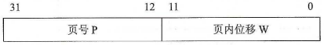

- 地址变换机构

    -基本的地址变换机构

    - 页表寄存器(PTR): 用来存放页表在内存中的起始地址和页表的长度。
- 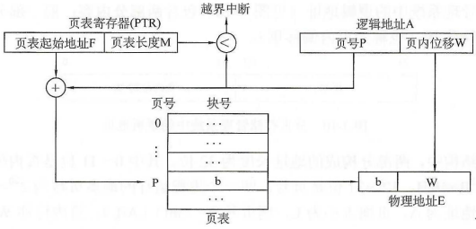

- 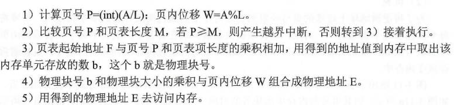

    - 在进程未执行时，每个进程对应的页表的始址和长度存放在进程的PCB中，当该进程被调度时，就将它们装入页表寄存器。
    - 存取数据和指令至少访问两次主存，执行速度慢了一半

    -具有快表的地址变换机构

    - 为了提高地址变换的速度，在地址变换机构中增设了一个具有并行查询功能的特殊的高速缓冲存储器，称为“联想存储器”或“快表”，用以存放当前访问的那些页表项。
    - 快表(TLB)一般是由半导体存储器实现的，其工作周期与CPU的周期大致相同，但造价较高。为了降低成本，通常是在快表中存放正在运行作业当前访问的那些页表项，页表的其余部分仍然存放
在内存中。
- 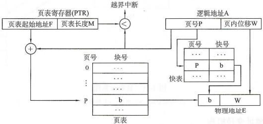

	    - 1)根据逻辑地址得出页号P与页内位移W。
2)先将页号与快表中的所有页号进行对比，若有匹配的页号，则直接读出对应块号，与页内位移拼接得到物理地址;若没有匹配的页号，则还需访问内存中的页表，从页表中取出
物理块号，与页内位移拼接得到物理地址，并将此次的页表项存入快表中。
3)用得到的物理地址访问内存。

- 两级和多级页表

    -页表大小计算

    - 页表的长度M是页号的位数决定的，宽度是每个页表项的大小，即块号的位数

    -两级页表

    - p1和P2位数都降低，页表大小也降低，页表的大小和页表长度成正比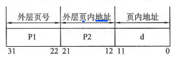

    -多级页表

    - 32位系统适合两级页表，64位系统需要增加页表的级数降低来减少页表的大小，但页表的数量增加，同时要多次访问内存

- 页的共享与保护

    -共享

    - 共享是使共享用户地址空间中的页指向相同的物理块
    - 分页存储不易实现共享

	    - 分页存储管理系统中将作业的地址空间划分成页面的做法对用户是透明的,同时作业的地址空间是线性连续的，当系统将作业的地址空间分成大小相同的页面时，被共享的部分不一定被包含在-一个完整的页面中，不利于保密。
	    - 共享部分的起始地址在各作业的地址空间划分成页的过程中，在各自页面中的页内位移可能不同，这也使得共享比较难。

    -保护

    - 地址越界保护，通过比较地址变换机构中的页表长度和所要访问的逻辑地址中的页号来完成;另一种是通过页表中的访问控制信息对内存信息提供保护。

- 基本分页存储管理的优缺点

    -优点:①内存利用率高;②实现了离散分配;③便于存储访问控制;④无外部碎片。
缺点:①需要硬件支持(尤其是快表);②内存访问效率下降;③共享困难;④内部碎片。

### 基本分段存储管理方式

- 引入

    -方便编程，作业可以按逻辑关系划分若干段
    -信息共享，页面是存放信息的物理单位，没有完整的意义;而段是信息的逻辑单位
    -信息保护，每一段包含相对独立的信息
    -动态增长，动态链接

- 分段存储原理

    -在分段存储管理方式中，作业的地址空间被划分为若干个段，每个段是一组完整的逻辑信息，每个段都有自己的名字，都是从零开始编址的一段连续的地址空间，各段长度是不等的。使用时各段之间不要求连续

- 段表及地址变换过程

    -段表项结构（逻辑结构）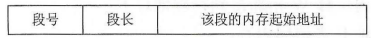
    -逻辑段到物理内存区的映射

- 

    -地址变换过程

- 

	    - 1)从逻辑地址A中取出前几位作为段号S,后几位作为段内位移W。
2)比较段号S和段表长度M，若S≥M，则产生越界中断，否则转到3)接着执行。
3)取出段表起始地址F和段号S,使其相加，用得到的地址值到内存中取出该内存单元
存放的数。取出来的数的前几位是段长C,后几位是段的起始地址(基址) b。若段内位移
W≥C，则产生越界中断，否则转到4)接着执行。
4)段的基址b和段内位移w相加得到物理地址E。
5)用得到的物理地址E去访问内存。

- 段的共享与保护

    -共享

    - 分段的共享是通过使多个作业的段表中相应表项都指向被共享段的同一个物理副本来实现的。
作业从共享段中读取数据时，必须防止另一作业修改共享段数据。

    -保护

    - 地址越界保护和访问控制保护

- 和分页的区别

- 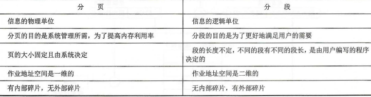

- 段页式存储管理优缺点

    -优点:①便于程序模块化处理和处理变换的数据结构;②便于动态链接和共享;③无内部碎片。
缺点:①与分页类似，需要硬件支持;②为满足分段的动态增长和减少外部碎片，要采用拼接技术;③分段的最大尺寸受到主存可用空间的限制;④有外部碎片。

### 基本段页式存储方式

- 在段页式存储管理系统中，作业的地址空间首先被分成若干个逻辑分段，每段都有自己.
的段号，然后再将每-段分成若千个大小固定的页。对于主存空间的管理仍然和分页管理一
样，将其分成若千个和页面大小相同的物理块，对主存的分配以物理块为单位。
- 

    -1)从逻辑地址A中取出前几位为段号S,中间几位为页号P,后几位为页内位移W。
2) 比较段号S和段表长度M，若S>M，则产生越界中断，否则转到3)接着执行。
3)取出段表起始地址F与段号s相加，用得到的地址值到内存中取出该内存单元存放的
数。取出来的数的前几位是页表长度C,后几位是页表起始地址d,若页号P>C，则产生越
界中断，否则转到4)接着执行。
4)页表起始地址d与页号P和页表项长度的乘积相加得到页表项在内存中的物理地址，
查找到该地址存放的数值为物理块号b。
5)用物理块号b与页内位移w组合成物理地址E。
6)用得到的物理地址E去访问内存。

- 段页式存储管理系统的地址变换需要访问内存3次，所以同样可以用高速缓冲寄存器(快表)来减少对内存的访问次数。

## 虚拟内存

### 常规存储管理方式的特征

- 一次性
- 驻留性
- 难以满足较大或较多的作业进入内存执行

### 局部性原理

- 程序在执行时将呈现出局部性特征，即在一较短的时间内，程序的执行仅局限于某个部分，相应地，它所访问的存储空间也局限于某个区域
- 时间局限性

    -如果程序中的某条指令一旦执行， 则不久以后该指令可能再次执行；如果某数据被访问过， 则不久以后该数据可能再次被访问。产生时间局限性的典型原因，是由于在程序中存在着大量的循环操作

- 空间局限性

    -一旦程序访问了某个存储单元，在不久之后，其附近的存储单元也将被访问，即程序在一段时间内所访问的地址，可能集中在一定的范围之内，其典型情况便是程序的顺序执行。

### 定义

- 指具有部分装入、请求调入功能和置换功能，能从逻辑上对内存容量加以扩充的一种存储器系统

### 优点

- 大程序：可在较小的可用内存中执行较大的用户程序；
- 大的用户空间：提供给用户可用的虚拟内存空间通常大于物理内存(real memory)
- 并发：可在内存中容纳更多程序并发执行；
- 易于开发：不必影响编程时的程序结构
- 以CPU时间和外存空间换取昂贵内存空间，这是操作系统中的资源转换技术

### 特征

- 离散性

    -指在内存分配时采用离散的分配方式，它是虚拟存储器的实现的基础

- 多次性

    -指一个作业被分成多次调入内存运行，即在作业运行时没有必要将其全部装入，只须将当前要运行的那部分程序和数据装入内存即可。多次性是虚拟存储器最重要的特征

- 对换性

    -指允许在作业的运行过程中在内存和外存的对换区之间换进、换出。

- 虚拟性

    -指能够从逻辑上扩充内存容量，使用户所看到的内存容量远大于实际内存容量。

### 请求分页存储管理方式

- 请求页表原理

    -在分页存储管理系统的基础上，通过增加请求调页功能、页面置换功能所形成的一种虛拟存储系统。在请求分页存储管理中，作业运行之前，只要将当前需要的一部分页面装入主存，便可以启动作业运行。在作业运行过程中，若所要访问的页面不在主存中，则通过调页功能将其调入，同时还可以通过置换功能将暂时不用的页面置换到外存上，以便腾出内存空间。

- 

- 缺页中断与地址变换

- 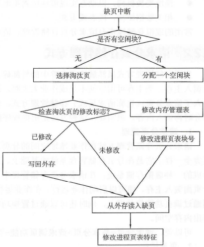

    - ●在指令的执行 期间产生和处理缺页中断。通常，CPU是在指令执行完毕后检查是否
有中断请求到达，若有，便响应。而缺页中断是在一条指令的执行期间发现要访问的指令和
数据不在内存时产生和处理的。
●### 条指令可以产生多个缺页中断。

- 请求分页管理的优缺点

    -优点:①可以离散储存程序，降低了碎片数量;②提供虛拟存储器，提高了主存利用率，
有利于多道程序运行，方便用户。
缺点:①必须有硬件支持;②有些情况下系统会产生抖动现象;③程序最后一页 仍然存
在未被利用的部分空间。

### 页面置换算法

- ●要注意把页面置换和连续分配方式中的交换区别开来，页面置换的单位是页面而不
是整个进程，交换的单位是整个进程。
●当发生缺页中断后，系统不一定会执行页面置换算法。因为发生缺页中断仅仅说明
需要执行的页面没有在内存中，如果内存空间中还有空闲块，只需用缺页中断处理程序把需
要的页面从外存调入内存即可，不需要页面置换算法;只有内存中没有空闲块时才需要页面
置换算法。所以，缺页中断不一定导致页面置换算法的执行。
- 最佳置换算法(预知进程的页面引号串，每次淘汰不再使用或最迟在使用的页面，需要预知后面进程，所以不能实现)
- 先进先出页面置换算法（FIFO）

    -每次淘汰最先进入内存的页面，内存驻留时间最长的页面

- 最近最久未使用置换算法（LRU）Recently

    -选择最近最长时间没被使用的页面来淘汰
    -利用寄存器支持、特殊的栈结构实现

- 最少使用置换算法（LFU）Frequently

    -淘汰当前访问次数最少的页面，页需要设置访问计数器

- clock置换算法（对访问位A的判断）

    -利用循环链表，访问链表存在页面，页面的访问位置为1；否则从上次淘汰页面的下一位开始遍历，页面访问位为1，则清零，否则淘汰页面

- 改进型——增加对修改位M思维判断

    -1)从指针的当前位置开始，扫描循环链表。在这次扫描过程中，对访问位和修改位不做
修改。选择遇到的第-一个(访问位=0，修改位=0)的页面用于替换。
2)如果第1)步没有找到，重新扫描，寻找(访问位=0，修改位=1)的页面用于替换。
在这个扫描过程中，每-一个非替换的页面都将其访问位置0。
3)如果第2)步仍没有找到，则回到起始位置，此时所有页面的访问位均为0，重新执
行第1)步和第2)步，则一定能找到替换页面。

- 页面缓冲算法（PBA,page buffering algorithm）

    -PBA算法是对FIFO算法的发展，通过建立置换页面的缓冲，找回刚被置换的页面，从
而减少系统I/O的消耗。PBA算法用FIFO算法选择被置换页，选择出的页面不是立即换出，
而是放入两个链表之### -中。如果页面未被修改，就将其归入到空闲页面链表的末尾，否则将
其归入到已修改页面链表的末尾。这些空闲页面和已修改页面会在内存中停留一段时间。如
果这些页面被再次访问，只需将其从相应链表中移出，就可以返回给进程，从而减少了一次
磁盘I/O。需要调入新的物理页时，将新页面读入到空闲页面链表的第一-个页面中， 然后将其
从该链表中移出。当已修改页达到### -定数目后，再将其一起写入磁盘，然后将它们归入空闲
页面链表。这样能大大减少I/O操作的次数。

### 抖动现象与缺页率

- Belady异常

    -产生Belady异常的原因是FIFO算法的置换特征与进程访问内存的动态特征相矛盾，即
被置换的页面并不是进程不会访问的。
FIFO算法可能出现Belady异常，而LRU算法和最佳置换算法永远不会出现Belady异
常，被归类为堆栈算法的页面置换算法也不可能出现Belady异常。

- 抖动现象

    -若选用的页面置换算法不合适，可能会出现这种现象:刚被淘汰的页面，过后不久又要
访问，并且调入不久后又调出，如此反复，使得系统把大部分时间用在了页面的调入调出，上，
而几乎不能完成任何有效的工作，这种现象称为抖动(或颠簸)。
抖动产生的原因是在请求分页系统中的每个进程只能分配到所需全部内存空间的一部分。

- 缺页率

    -假定一个作业共有n页，系统分配给该作业m页的空间(m≤n)。如果该作业在运行中
共需要访问A次页面(即引用串长度为A),其中所要访问页面不在内存，需要将所需页调
入内存的次数为F，则缺页率定义为f=F/A，命中率即为1-f。
缺页率是衡量页面置换算法的重要指标。通常缺页率会受置换算法、分配的页面数量、
页面大小等因素的影响。
缺页率对于请求分页管理系统是很重要的，如果缺页率过高，会直接导致读取页面的平
均时间增加，会使进程执行速度显著降低。因此，如何降低缺页率是--项非常重要的工作。

### 工作集与页面分配策略

- 工作集

    -工作集是最近n次内存访问的页面的集合，数字n称为工作集窗口，也就是工作集的大
小。经常被使用的页面会在工作集中，若一个页面不再使用，则它会被从工作集中丢弃。当
一个进程寻址一个不在工作集内的页面时，会产生-一个缺页中断。在处理缺页中断时，更新
工作集并在需要时从磁盘中读入此页面。
    -原理

    - 工作集模型的原理是:让操作系统监视各个进程的工作集，主要是监视各个工作集的大
小。若有空闲的物理块，则可以再调一个进程到内存以增加多道的程度;若工作集的大小总
和增加超过了所有可用物理块的数量总和，则操作系统可以选择一个内存中的进程对换到磁盘中去，以减少内存中的进程数量来防止抖动的发生。

- 页面分配策略

    -固定分配局部置换

    - 为每个进程分配一定数目的物理块，避免进程间争夺物理块，但导致有些进程因物理块少而频繁缺页中断
    - 物理块分配算法

	    - 平均分配算法
	    - 按比例分配算法
	    - 考虑优先权的分配算法

    -可变分配全局置换

    - 操作系统维护一个空闲物理块队列，每次有进程缺页时都从空闲物理块队列上取下一个分配给它，如果系统中已经没有空闲的物理块了，那么系统将有可能调出任何进程中的其中一页。

    -可变分配局部置换

    - 为每个进程分配### -定 量的物理块后，每次发生缺页中断且内存中没有空闲物理块时，只让进程换出自己的某个内存页，但当一一个进程频繁地发生缺页中断时，OS为它分配额外的物理块，直到缺页率降低到合适程度为止，当一个进程缺页率特别低时，适当减少分配给它的物理块的数量。可变分配局部置换策略在可以获得较高的内存空间利用率的同时，保证每个进程有较低的缺页率。

- 页面调入策略

    -请求调页策略

    - 个页面只有在被用到时才被调入到内存中，否则就放在外存中。进程启动时会频繁缺页中断

    -预调页策略

    - 将预计不久后会被使用的页面一并调入内存

- 页面调入来源

    -请用于存放文件的文件区和用于存放对换页面的对换区。通常，由于对换区是采用连续分配方式，而文件是采用离散分配方式，因此对换区的磁盘I/O速度比文件区的高。
    -调入情况

    - 有足够的对换区

	    - 可以全部从对换区调入所需页面，以提高调页速
度。在进程运行前，便应将与该进程有关的文件从文件区复制到对换区。

    - 无足够的对换区

	    - 凡是不会被修改的文件，都直接从文件区调入;
而当置换出这些页面时，由于它们未被修改而不必再将它们换出，以后再调入时，仍从文件区直接调入。但对于那些可能被修改的部分，在将它们换出时，就应调到对换区，以后需要
时再从对换区调入。

    - UNIX方式

	    - 与进程有关的文件都放在文件区，因此凡是未运行过的页面都应从文件区调入。而对于曾经运行过但又被换出的页面，由于是被放在对换区，因此在下次调入时，应从对换区调入。由于UNIX系统允许页面共享，因此某进程所请求的页面有可能已被其他进程调入内存，此时也就无须再从对换区调入。

### 请求分段系统

- 硬件

    -请求分段的段表机构
    -缺段中断机构
    -地址变换机构

### 内存管理方式比较

- 离散分配方式

- 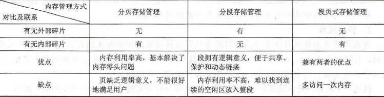

- 内存管理

- 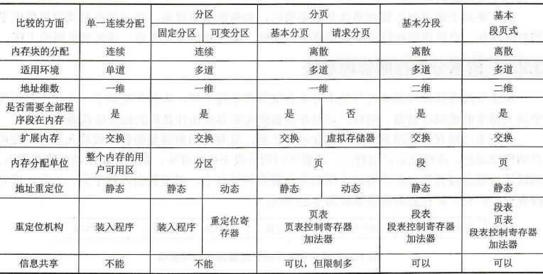

### 基本分页管理的有效访问时间

- 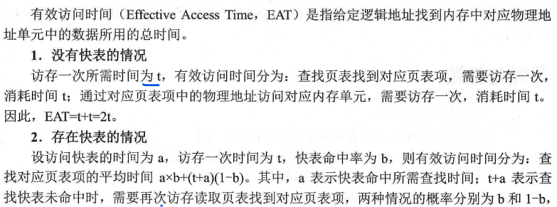
- 

### 请求分页管理的有效访问时间

- 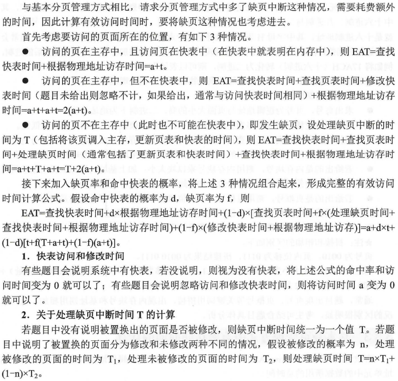

# 第五章：设备管理

## I/O设备和设备控制器

### 分类

- 使用特性分

    -存储设备
    -人机交互设备
    -网络通讯设备

- 信息交换单元分类

    -字符设备
    -快设备

- 传输速率分

    -低速设备（几字节——几百字节）

    - 典型的设备有键盘、鼠标、语音的输入

    -中速设备（数千——数万字节）

    - 典型的设备有行式打印机、激光打印机

    -高速设备（数十万——千兆字节）

    - 典型的设备有磁带机、磁盘机、光盘机

- 设备共享属性

    -独占设备，同一时刻只有一个进程可以使用设备，属于临界资源
    -共享设备，允许多个进程访问设备，若干进程交替地读写信息
    -虚拟设备，使用虚拟技术实现多进程同时使用设备

### I/O管理的任务和功能

- 设备分配：等待队列，设备的状态
- 设备处理：CPU与设备控制器之间的通信
- 缓冲管理：缓和CPU与I/O设备速度不匹配问题，缓冲区
- 设备独立性：程序独立于物理设备，避免直接使用实际设备名

### 设备并不是直接与CPU进行通信，而是与设备控制器通信。在设备与设备控制器之间应该有一个接口。

- 数据信号：控制器 ←  设备 ←  控制器

    -传送数据信号，输入、输出bit

- 控制信号: 控制器  →  设备

    -执行读、写操作的信号

- 状态信号：设备当前使用状态

### 设备控制器

- 主要功能：控制一个或多个I/O设备，以实现I/O设备和计算机之间的数据交换，是一个可编址设备
- 基本功能

    -接收和识别命令

    - 控制寄存器、命令译码器

    -数据交换

    - 实现CPU与控制器，控制器与设备间的数据交换

    -标识和报告设备的状态
    -地址识别

    - 配置地址译码器，识别不同的设备

    -数据缓冲区
    -差错控制

- 设备控制器的组成

    -设备控制器与处理机（CPU）的接口

    - 实现CPU与设备控制器之间的通信

    -设备控制器与设备的接口

    - 控制器可连接多个设备

    -I/O逻辑

    - 实现对设备的控制
    - CPU利用该逻辑向控制器发送I/O命令
    - 命令、地址译码

- 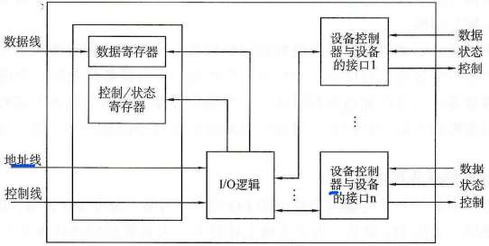

### I/O控制的宗旨

- 减少CPU对I/O控制的干预
- 充分利用CPU完成数据处理工作

### I/O控制方式

- 程序直接控制（轮询方式）

    -优点。程序直接控制方式的工作过程非常简单。
缺点。CPU的利用率相当低。因为I/O 设备的速度太慢，跟不上CPU,致使CPU
的绝大部分时间都在测试I/O设备是否已经完成数据传输，从而造成CPU的极大浪费。

- 中断控制

    -中断处理程序

    - 测定是否有未响应的中断信号
    - 保护被中断进程的CPU环境
    - 转入相应的设备处理程序
    - 中断处理
    - 恢复CPU 的现场并退出中断

    -优点。与程序直接控制方式相比，有了中断的硬件支持后，CPU和I/O设备间可以
并行工作了，CPU只需收到中断信号后处理即可，大大提高了CPU利用率。
●缺点。 这种控制方式仍然存在### -些问题，例如每台设备每输入/输出一个数据，都要
求中断CPU,这样在一次数据传送过程中的中断次数过多，从而耗费了大量CPU时间。

- DMA控制

    -在外设和内存之间开辟直接的数据交换通路。在DMA控制.方式中，设备控制器具有更强的功能，在其控制下，设备和内存之间可以成批地进行数据交换，而不用CPU干预。这样既大大减轻了CPU的负担，也使IO数据传输速度大大提高。
这种方式-般用于块设备的数据传输。
    -特征

    - 数据传输的基本单位是数据块;数据是单向传输，且从设备直接送入内存或者相反;仅在传送一个或多个数据块的开始和结束时，才需CPU干预，整块数据的传送是在控制器的控制下完成的。

    -DMA控制器组成

- 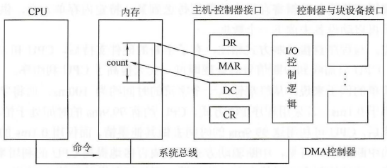
    - 组成的寄存器

	    - 1)命令/状态寄存器(CR):用于接收从CPU发来的I/O命令或有关控制信息，或设备
的状态。
2)内存地址寄存器(MAR):用于存放数据从设备传送到内存或从内存到设备的内存
地址。
3)数据寄存器(DR);用于暂存从设备到内存或从内存到设备的数据。
4)数据计数器(DC):存放本次要传送的字数。

    -●优点。DMA控制方式下，设备和CPU可以并行工作，同时设备与内存的数据交换
速度加快，并且不需要CPU干预。
●缺点。 DMA控制方式仍然存在### -定局限性，如数据传送的方向、存放输入数据的内
存起始地址及传送数据的长度等都由CPU控制，并且每台设备都需要-一个DMA控制器，当
设备增加时，多个DMA控制器的使用也不经济。

- I/O通道控制

    -目的：建立独立的I/O操作(组织, 管理和结束)，使由CPU处理的I/O工作转由通道完成（解放CPU，实现并行）
    -什么是I/O通道？

    -  是一种特殊的处理机，具有通过执行通道程序完成I/O操作的指令，cpu的干预更少，一通道控制多台设备
    -  特点：指令单一(局限于与I/O操作相关的指令)，与CPU共享内存

    -基本过程：

    - CPU向通道发出I/O指令->通道接收指令->从内存取出通道程序处理I/O->向CPU发出中断

    -通道类型

    - 字节多路通道

	    - 低中速连接子通道时间片轮转方式共享主通道
	    - 字节多路通道不适于连接高速设备，这推动了按数组方式进行数据传送的数组选择通道的形成。
- 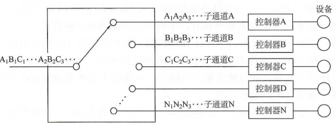

    - 数组选择通道

	    - 这种通道可以连接多台高速设备，但只含有一个分配型子通道，在一段时间内只能执行一道通道程序， 控制一台设备进行数据传送， 直至该设备传送完毕释放该通道。这种通道的利用率很低。

    - 数组多路通道

	    - 将数组选择通道传输速率高和字节多路通道能使各子通道(设备)分时并行操作的优点相
结合而形成的一种新通道。它含有多个非分配型子通道，因而这种通道既具有很高的数据传
输速率，又能获得令人满意的通道利用率。也正因此，才使该通道能广泛地用于连接多台高、
中速的外围设备，其数据传送是按数组方式进行的。

    -●优点。 通道控制方式解决了IO操作的独立性和各部件工作的并行性。通道把中央
处理器从烦琐的输入/输出操作中解放出来。采用通道技术后，不仅能实现CPU和通道的并
行操作，而且通道与通道之间也能实现并行操作，各通道上的外设也能实现并行操作，从而
可达到提高整个系统效率的根本目的。
●缺点。由于需要更多硬件(通道处理器)，因此其成本较高。通道控制方式通常应用
于大型数据交互的场合。
    -通道控制方式与DMA控制方式的区别:首 先，DMA控制方式中需要CPU来控制所传
输数据块的大小、传输的内存，而通道控制方式中这些信息都是由通道来控制管理的;其次，
一个DMA控制器对应一台设备与内存传递数据，而一个通道可以控制多台设备与内存的数
据交换。
    -瓶颈问题

    - 原因;通道不足
    - 解决办法：增加设备到主机间的通路，而不增加通道（结果类似RS触发器）

- 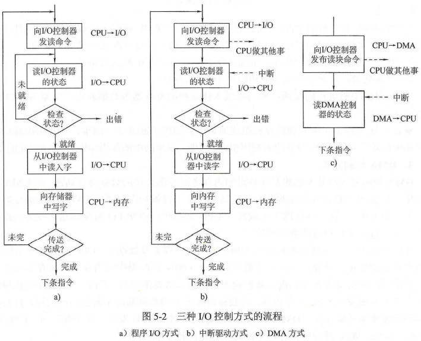

### 内存映像I/O

- 驱动程序将抽象I/O命令转换出的一系列具体的命令，参数等数据装入设备控制器的相应寄存器，由控制器来执行这些命令，具体实施对I/O设备的操作

## I/O系统的功能，模型和接口

### I/O系统管理的对象是I/O设备和相应的设备控制器。
### I/O系统的基本功能

- 隐藏物理设备的细节
- 与设备的无关性
- 提高处理机和I/O设备的利用率
- 对I/O设备进行控制
- 确保对设备的正确共享
- 错误处理

### I/O软件的层次结构

- 用户层I/O软件
- 设备独立性软件
- 设备驱动程序（厂家开发）
- 中断处理程序
- 硬件
- 

### I/O系统的分层

- 中断处理程序

    -分类

    - 中断（外部触发）

	    - 对外部I/O设备发出的中断信号的响应

    - 陷入（内部原因：除0）

	    - 由CPU内部事件引起的中断

    -中断向量表（类比51单片机）

    - 中断程序的入口地址表

    -中断优先级

    - 对紧急程度不同的中断处理方式

    -对多中断源的处理方式

    - 屏蔽中断
    - 嵌套中断

- 设备驱动程序

    -是I/O进程与设备控制器之间的通信程序，又由于它常以进程的形式存在，故以后就简称为设备驱动进程
    -主要任务是接受来自它上一层的与设备无关软件的抽象请求，并执行这个请求。
    -功能

    - 1) 接收由I/O进程发来的命令和参数， 并将命令中的抽象要求转换为具体要求。例如，将磁盘块号转换为磁盘的盘面、 磁道号及扇区号。
    - 2) 检查用户I/O请求的合法性，了解I/O设备的状态，传递有关参数，设置设备的工作方式。 
    - 3) 发出I/O命令，如果设备空闲，便立即启动I/O设备去完成指定的I/O操作；如果设备处于忙碌状态，则将请求者的请求块挂在设备队列上等待。
    - 4) 及时响应由控制器或通道发来的中断请求，并根据其中断类型调用相应的中断处理程序进行处理。
    - 5) 对于设置有通道的计算机系统，驱动程序还应能够根据用户的I/O请求，自动地构成通道程序。 

    -设备驱动程序的处理过程

    - 将用户和上层软件对设备控制的抽象要求转换成对设备的具体要求，如对抽象要求的盘块号转换为磁盘的盘面、磁道及扇区。
    - 检查I/O请求的合理性。
    - 读出和检查设备的状态，确保设备处于就绪态。
    - 传送必要的参数，如传送的字节数，数据在主存的首址等。
    - 工作方式的设置。
    - 启动I/O设备，并检查启动是否成功，如成功则将控制返回给I/O控制系统，在I/O设备忙于传送数据时，该用户进程把自己阻塞，直至中断到来才将它唤醒，而CPU可干别的事。

- 用户层的I/O软件

    -系统调用与库函数

    - OS向用户提供的所有功能，用户进程都必须通过系统调用来获取
    - 在C语言以及UNIX系统中，系统调用（如read）与各系统调用所使用的库函数（如read）之间几乎是一一对应的。而微软的叫Win32API

- 设备独立性I/O软件

    -基本概念

    - 含义： 应用程序独立于具体使用的物理设备。
    - 驱动程序是一个与硬件(或设备)紧密相关的软件。为实现设备独立性，须在驱动程序上设置一层软件，称为设备独立性软件。
    - 设备独立性(Device Independence)的优点

	    - 以物理设备名使用设备
	    - 引入了逻辑设备名
	    - 逻辑设备名称到物理设备名称的转换（易于实现I/O重定向）

    -与设备无关的软件

    - 设备驱动程序的统一接口
    - 缓存管理
    - 差错控制
    - 对独立设备的分配与回收
    - 独立于设备的逻辑数据块

### 设备分配和回收

- 设备分配中的数据结构

    -设备控制表DCT
    -控制器控制表COCT
    -通道控制表CHCT
    -显然，在有通道的系统中，一个进程只有获得了通道，控制器和所需设备三者之后，才具备了进行I/O操作的物理条件
    -系统设备表SDT
    -逻辑设备表LUT
    -分配的流程，从资源多的到资源紧张的:LUT->SDT->DCT->COCT->CHCT
    -在申请设备的过程中，根据用户请求的I/O设备的逻辑名，查找逻辑设备和物理设备的映射表；以物理设备为索引，查找SDT，找到该设备所连接的DCT；继续查找与该设备连接的COCT和CHCT，就找到了一条通路。
- 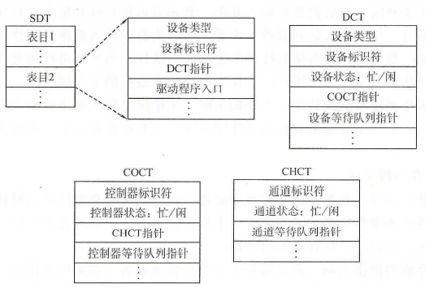

- 分配策略

    -使用性质

- 

    -分配算法

    - 先来先服务
    - 优先级高者优先

    -安全性

- 

- 设备独立性

- 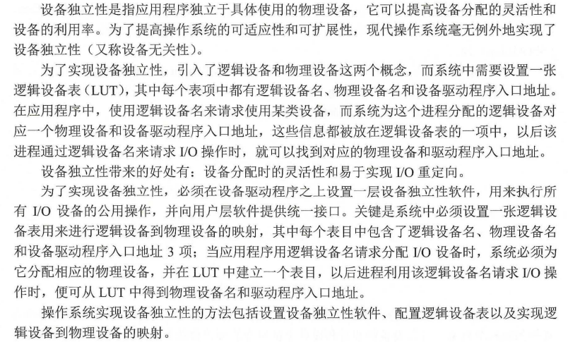

- 分配程序

- 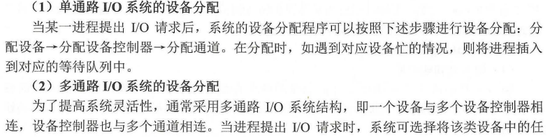
- 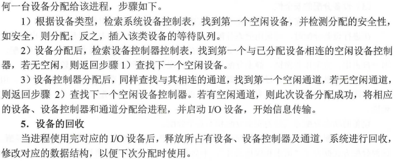

### I/O系统接口

- 块设备接口

    -指以数据块为单位来组织和传送数据信息的设备
    -典型的块设备是磁盘、光盘
    -块设备的基本特征

    - ①传输速率较高，通常每秒钟为几兆位；
    - ②它是可寻址的，即可随机地读/写任意一块；
    - ③磁盘设备的I/O采用DMA方式。

- 流设备接口

    -又称字符设备指以单个字符为单位来传送数据信息的设备
    -这类设备一般用于数据的输入和输出，有交互式终端、打印机
    -字符设备的基本特征

    - ①传输速率较低；
    - ②不可寻址，即不能指定输入时的源地址或输出时的目标地址；
    - ③字符设备的I/O常采用中断驱动方式。

- 网络通信接口

    -提供网络接入功能，使计算机能通过网络与其他计算机进行通信或上网浏览。

### 假脱机系统（spooling）

- spooling技术是同时外设联机操作，是对脱机输入/输出系统的模拟
- SPOOLing技术是低速输入/输出设备与主机交换的一种技术， 其核心思想是以联机的方
式得到脱机的效果。低速设备经通道和设在主机内存的缓冲存储器与高速设备相连，该高速
设备通常是辅存。为了存放从低速设备上输入的信息，在内存中形成缓冲区，在高速设备上
形成输出井和输入井，传递时信息从低速设备传入缓冲区，再传到高速设备的输入井，再从
高速设备的输出井传到缓冲区，再传到低速设备。

- 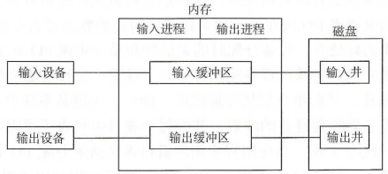

- 主要组成

    -输入/输出井

- 

    -输入/输出缓冲区

- 

    -输入/输出进程

- 

    -井管理程序

- 特点（体现操作系统的虚拟性）

    -提高了I/O的速度

    - 对数据所进行的I/O操作，已从对低速设备演变为对输入井或输出井中的数据存取。

    -将独占设备改造为共享设备

    - 实际分给用户进程的不是打印设备，而是共享输出井中的存储区域 

    -实现了虚拟设备功能

    - 将独占设备变成多台独占的虚拟设备。

## 缓冲区管理

### 缓冲的引入（原因）

- 缓和CPU与I/O设备间速度不匹配的矛盾
- 减少对CPU的中断频率，放宽对CPU中断响应时间的限制
- 提高CPU和I/O设备之间的并行性
- 解决数据粒度不匹配的问题

- 
### 单缓冲区

- 即在CPU计算的时候，将数据数据输入到缓冲区(大小取决与T和C的大小)
- 

### 双缓冲区

- 即允许CPU连续工作（T不断）
- 
- 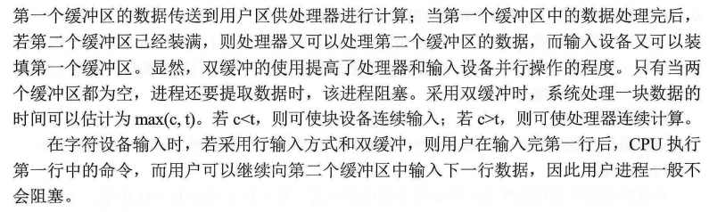

### 环形缓冲区（专为生产者和消费者打造）

- 组成

    -多个缓冲区
    -多个指针

- 使用

    -Getbuf过程
    -Releasebuf过程

- 同步问题
- 

### 缓冲池(理解为更大的缓冲区)

- 组成

    -空白缓冲队列（emq）

    - 由空缓冲区链接而成F(emq)，L(emq)分别指向该队列首尾缓冲区

    -输入队列（inq）

    - 由装满输入数据的缓冲区链接而成F(inq)，L(inq)分别指向该队列首尾缓冲区

    -输出队列（outq）

    - 由装满输出数据的缓冲区链接而成F(outq)， L(outq)分别指向该队列首尾缓冲

- Getbuf和Putbuf过程

    -收容：缓冲池接收外界数据
    -提取：外界从缓冲池获得数据

- 缓冲区工作方式（从缓冲区的角度来看）

    -收容输入
    -提取输入
    -收容输出
    -提取输出

- 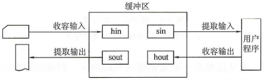
- 

### 高速缓存和缓冲区

- 

# 第四章：文件管理

## 文件基本概念

### 文件基础知识

- 文件组成结构

    -数据项

    - 基本数据项

	    - 描述对象某种属性的一个值

    - 组合数据项

	    - 多个基本数据项组成

    -记录

    - 记录是一组相关数据项的集合，用于描述一个对象在某个方面的属性

    -文件

    - 文件是指创建者所定义的一组相关信息的集合，逻辑上分为由一组相似记录组成的有结构文件和一个字符流组成的无结构文件
    - 属性

- 

- 文件分类

    -用途分类

    - 系统文件，由系统软件构成的文件，大部分只允许用户调用
    - 库文件，系统提供的各种标准过程、函数和应用程序文件，只允许调用执行
    - 用户文件，用户委托文件系统保存的文件，只能由文件所有者和授权用户使用

    -保护级别分类

    - 只读文件
    - 读写文件
    - 执行文件
    - 不保护文件

    -信息流向分类

    - 输入文件
    - 输出文件
    - 输入/输出文件

    -数据形式分类

    - 源文件，一般是ASCII码或者汉字
    - 目标文件，编译但尚未链接
    - 可执行文件，编译并链接

- 文件操作

    -创建文件，占用外存空间
    -删除文件
    -读文件，系统文件名和内存指针提交文件调用程序，查找目录，根据外存地址设置指针，更新动作指针
    -写文件
    -设置文件读写的位置
    -打开文件

    - 系统将文件的属性从外存复制到内存，并设定一个编号(或索引)返回给用户，再次进行操作时，只需利用编号(或索引号)向系统提出请求
    - 文件指针：系统跟踪上次读写位置，必须和磁盘文件属性分开保存
    - 文件打开计数：计数器为0时才关闭文件（多进程使用同一个文件）
    - 文件磁盘位置：该信息存在内存
    - 访问权限：该信息保存在进程的打开文件表中

    -关闭文件

    - 系统将打开的文件的编号(或索引号)删除，并销毁其文件控制块。若文件被修改，则需要将修改保存到外存。

### 文件的逻辑结构与物理结构

- 基础知识

    -文件的逻辑结构是从用户观点来看所观察到的文件的组织形式，是用户可以直接处理的
数据及其结构，因其独立于文件的物理特性，故又称为文件组织;而从计算机的角度出发，
文件在外存上的存放组织形式称为文件的物理结构。
文件的逻辑结构与存储设备的特性无关，而物理结构与存储设备特性的关系很大。
从逻辑结构上看，文件可以分为两种形式: ### -种是有结构的记录式文件;另一-种是无结
构的流式文件。而记录式文件的逻辑结构通常有顺序、索引和索引顺序。
从物理结构.上看，文件的组织形式有连续分配、链接分配和索引分配。

- 逻辑结构

    -顺序文件

    - 顺序结构又称为连续结构，是一种最简单的文件结构，其将一个逻辑文件的信息连续存
放。以顺序结构存放的文件称为顺序文件或连续文件。
按照记录是否定长，顺序文件分为定长记录顺序文件和变长记录顺序文件。
按照文件中记录是否按照关键字排序，顺序文件又分为串结构和顺序结构:串结构中各
记录之间的顺序与关键字无关，而顺序结构中所有记录按照关键字顺序排序。
顺序文件的主要优点是顺序存取时速度较快;若文件为定长记录文件，还可以根据文件
起始地址及记录长度进行随机访问。但因为文件存储要求连续的存储空间，所以会产生碎片，
同时也不利于文件的动态扩充。

    -索引文件

    - 索引结构为-一个逻辑文件的信息建立-一个索引表。 索引表中的表目存放文件记录的长度
和所在逻辑文件的起始位置，因此逻辑文件中不再保存记录的长度信息。索引表本身是-一个
定长文件，每个逻辑块可以是变长的，索引表和逻辑文件两者构成了索引文件。
索引文件的优点是可以进行随机访问，也易于进行文件的增删。但索引表的使用增加了
存储空间的开销，另外，索引表的查找策略对文件系统的效率影响很大。

    -索引顺序文件

    - 索引顺序文件是顺序文件和索引文件两种形式的结合。索引顺序文件将顺序文件中的所
有记录分为若干个组，为顺序文件建立-张索引表，并为每组中的第一个记录在索引表建立
一个索引项，其中含有该记录的关键字和指向该记录的指针。
索引表中包含关键字和指针两个数据项，索引表中索引项按照关键字顺序排列。索引顺
序文件的逻辑文件(主文件)是一个顺序文件，每个分组内部的关键字不必有序排列，但是
组与组之间的关键字是有序排列的。
索引顺序文件大大提高了顺序存取的速度，但是，仍然需要配置-个索引表，增加了存
储开销。

    -直接文件和哈希文件

    - 建立关键字和相应记录物理地址之间的对应关系，这样就可以直接通过关键字的值找到
记录的物理地址，也就是说，关键字的值决定了记录的物理地址，这种结构的文件称为直接
文件。这种映射结构不同于顺序文件或索引文件，没有顺序的特性。
散列文件是一种典型的直接文件。通过散列函数对关键字进行转换，转换结果直接决定
记录的物理地址。
散列文件有很高的存取速度，但是会因不同关键字的散列函数值相同而引起冲突。

### 文件目录

- 功能

    -实现“按名存取”
    -提高检索速度
    -允许文件同名
    -允许文件共享

- 文件控制块（FCB）

    -文件名、文件结构、文件物理位置、存取控制信息、管理信息

- 索引结点

    -磁盘索引结点

    - ●文件主标识符。 拥有该文件的个人或小组的标识符。
●文件类型。包括普通文件、目录文件或特别文件。
●文件存取权限。各类用户对该文件的存取权限。
●文件物理地址。每个索引结点以直接或间接方式给出数据文件所在盘块的编号。
●文件长度。 以字节为单位的文件长度。
●文件链接计数。表明在本文件系统中所有指向该文件的文件名的指针数。
●文件存取时间。本文件最近被存取的时间、最近被修改的时间以及索引结点最近被
修改的时间。

    -内存索引结点

    - ●索引结点编号。用于标识内存索引结点。
●状态。指示i结点是否上锁或被修改。
●访问计数。正在访问该文件的进程数。
●逻辑设备号。文件所属文件系统的逻辑设备号。
●链接指针。设置分别指向空闲链表和散列队列的指针。

- 简单的文件目录

    -单级文件目录

    - 缺点

	    - 查找慢
	    - 不允许重名
	    - 不便于实现文件共享

    - 操作

	    - 当建立一个新文件时，首先应确定该文件名在目录中是否唯-一， 若与已有文件名没有冲
突，则从目录表中找出一个空表目，将新文件的相关信息填入其中。在删除文件时，系统先
从目录表中找到该文件的目录项，从中找到该文件的物理地址，对文件占用的存储空间进行
回收，然后再清除它所占用的月录项。当对文件进行访问时，系统先根据文件名去查找月录
表以确定该文件是否存在，若文件存在，则找出文件的物理地址，进而完成对文件的操作。
	    - 只有一张目录表，每个文件占据一个表目

    -两级文件目录

    - 二级目录结构将文件目录分成主文件目录和用户文件目录。系统为每个用户建立一一个单
独的用户文件目录,其中的表项登记了该用户建立的所有文件及其说明信息。主文件目录则记录系统中各个用户文件目录的情况，每个用户占一个表目，表目中包括用户名及相应用户目录所在的存储位置等。
    - 文件访问

	    - 当用户要访问一个文件时，系统先根据用户名在主文件目录中查找该用户的文件目录, 
然后根据文件名在其用户文件目录中找出相应的目录项，从中得到该文件的物理地址，进而完成文件访问

    - 文件建立

	    - 当用户要建立-一个文件时，若为新用户，即主文件目录表中无此用户的相应登记项，则
系统为其在主月录中分配一个表目，并为其分配存放用户文件目录的存储空间，同时在用户
文件目录中为新文件分配-一个表目，然后在表目中填入有关信息。

    - 文件删除

	    - 文件删除时，只需在用户文件目录中删除该文件的目录项。若删除后该用户目录表为空，
则表明该用户已脱离了系统，从而可以将主文件目录表中该用户的对应项删除。

    - 优缺点

	    - 二级目录结构可以解决文件重名问题，并可以获得较高的查找速度，但二级目录结构缺
乏灵活性，特别是当用户需要在某些任务上进行合作和访问其他文件时会产生很多问题。

- 树形结构目录

    -路径名与当前目录

    - “..”是父目录
    - “/”是根目录
    - 区别绝对路径和相对路径（../.../.../1/2/3/）

    -优缺点

    - 树形目录结构可以很方便地对文件进行分类，层次结构清晰，也能够更有效地进行文件
的管理和保护。但是在树形目录中查找-一个文件，需要按照路径名逐级访问中间结点，增加
了磁盘访问次数，进而影响了查询速度。

- 图形目录结构

    -目的是实现文件共享，树形不方便
    -当某用户要求删除一个共享结点
时，系统不能将其简单地删除，否则会
导致其他用户访问时找不到结点。为此，
可以为每个共享结点设置一个共享计数
器，每当增加对该结点的共享链时，计
数器加1;每当有用户提出删除该结点
时，计数器减1。仅当共享计数器为0时，
才真正删除该结点，否则仅删除提出删
除请求用户的共享链。
图形目录结构方便实现文件的共
享，但使系统的管理变得复杂。

- 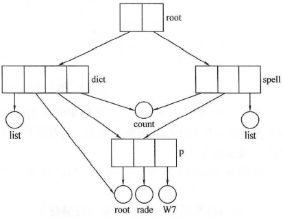

### 文件共享

- 基于索引结点的共享方式(硬链接)

    -索引结点是把FCB中的文件描述信息单独构成-一个数据结构，也就是说，物理块的信息在索引结点中。此时，目录项中只有文件名和指向索引结点的指针，两个不同的目录项只需要指向相同的索引结点即可实现共享，即一个共享文件只有一个索引结点。如果不同文件名的目录项需要共享该文件，只需目录项中的指针都指向该索引结点

- 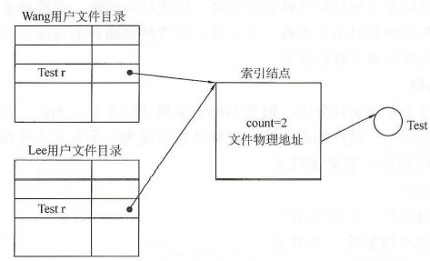

    -在索引结点中再增加一个计数值来统计指向该索引结点的目录项的个数，这样一来就需
要在删除该文件时可以先判断计数值，只有计数值为1时才删除该索引结点，若计数值大于1,
则把计数值减1即可。
这种方法能够实现文件的异名共享，但当文件被多个用户共享时，文件拥有者不能删除
文件。

- 利用符号链实现文件共享(软链接)

    -当需要访问一个文件时，就搜索目录表，如果目录项标记为链接，那么就可以获取真正
文件(或目录)的名称，再搜索目录。链接可以通过使用目录项格式(或通过特殊类型)而
加以标记，其实际上是具有名称的间接指针。在遍历目录树时，系统忽略这些链接以维护系
统的无环结构。
    -在利用符号链方式实现文件共享时，只有文件拥有者才拥有指向其索引结点的指针;而
共享该文件的其他用户只有该文件的路径名，并不拥有指向其索引结点的指针。这样就不会
发生在文件拥有者删除共享文件后留下悬空指针的情况。当文件拥有者把一-个共享文件删除
后，其他用户试图通过符号链去访问一个已被删除的共享文件时，会因系统找不到该文件而
使访问失败，于是再将符号链删除，此时不会产生任何影响。符号链方式有一个很大的优点，
就是它能够用于链接(通过计算机网络)世界上任何地方的计算机中的文件，此时只需提供
该文件所在机器的网络地址以及该机器中的文件路径即可。
- 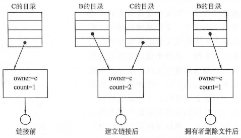
    -这种方法解决了基于索引结点共享方法中文件拥有者不能删除共享文件的问题，但是当
其他用户要访问共享文件时，需要逐层查找目录，开销较大。

### 文件保护

- 访问类型（读、写、执行、添加、删除等）
- 访问控制

    -访问控制矩阵
    -访问控制表
    -用户权限表
    -口令与密码

    - 口令指用户在建立-一个文件时提供一个口令， 系统为其建立FCB时附上相应口令,用户
请求访问时必须提供相应口令。这种方法的开销较小，但是口令直接存储在系统内部，不够
安全。
密码指用户对文件进行加密，文件被访问时需要使用密钥。这种方法的保密性强，节省
存储空间，但编码和译码要花费一定时间。

## 文件系统及实现

### 文件系统的层次结构

- 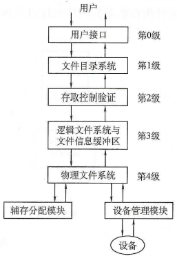

### 目录的实现

- 线性表

    -最为简单的目录实现方法是使用存储文件名和数据块指针的线性表(数组、链表等)。创建新文件时，必须首先搜索目录表以确定没有同名的文件存在，接着在目录表后增加一个目
录项。若要删除文件，根据给定的文件名搜索目录表，接着释放分配给它的空间。采用链表
结构可以减少删除文件的时间，其优点在于实现简单，不过由于线性表需要采用顺序方法查
找特定的项，故运行比较费时。

- 散列表

    -散列表根据文件名得到一一个值，并返回一个指向线性表中元素的指针。这种方法大大缩
短了查找目录的时间，插入和删除也比较简单，不过需要一些措 施来避免冲突(两个不同名
文件的散列函数值相同)。这种方法的特点是散列表长度固定以及散列函数对表长的依
赖性。

### 文件的实现（物理结构实现）

- 外存分配方式

    -静态分配：一次性到位
    -动态分配：动态增长
    -连续分配

    - 为文件分配连续的磁盘区域，用户在分配前说明文件所需要的存储空间大小
    - 采用连续分配方式时，可把逻辑文件中的记录顺序地存储到相邻的物理盘块中，这样所
形成的文件结构称为顺序文件结构，此时的物理文件称为顺序文件。这种分配方式保证了逻
辑文件中的记录顺序与存储器中文件占用盘块的顺序一致。
    - 优缺点

	    - 连续分配的优点是查找速度比其他方法快(只需要起始块号和文件大小)，目录中关于文
件物理存储位置的信息也比较简单。其主要缺点是容易产生碎片，需要定期进行存储空间的
紧缩。
很显然，这种分配方法不适合文件随时间动态增长和减少的情况，也不适合用户事先不
知道文件大小的情况。

- 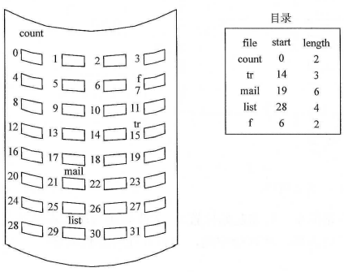

    -链接分配

    - 隐式链接

	    - 链接物理块的指针隐式地放在每个物理块中，目录项中有指向索引顺序文件的第-块盘块和最后一块盘块的指针，此外每个盘块中都含有指向下一
盘块的指针，存在随机访问效率低的问题;由于其中任何-一个盘块的指针错误都会导致后
面的盘块的位置丢失，因此这种实现方案可靠性较差。
- 

    - 显式链接

	    - 链接物理块的指针显式存放在内存的一张链接表中，每个磁盘设置一张链接表，又称为文件分配表( FAT)，MS-DOS、Windows和OS/2等操作系统都用了FAT。在FAT中找一个记录的对应物理块地址时还是需要一个个找下去，不能随机查找。但是与隐式链接相比，该方案是在内存中而非在磁盘中查找，所以能节省不少时间。
- 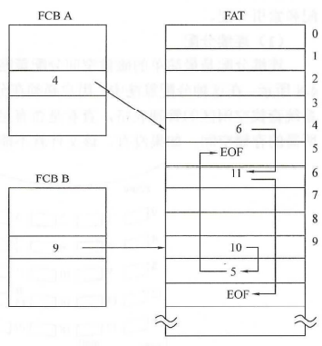

    - 优缺点

	    - 链接分配的优点是简单(只需起始位置)，文件创建与增长容易实现。其缺点是不能随机
访问盘块，链接指针会占用一些存储空间，而且存在可靠性问题。

    -索引分配

    - 在索引分配方式中，系统为每个文件分配-一个索引块，索引块中存放索引表，索引表中
的每个表项对应分配给该文件的一一个物理块
索引分配支持直接访问，而且没有外部碎片，但是索引块本身会占用空间，将索引表调入内存实现只访问外存一次。

- 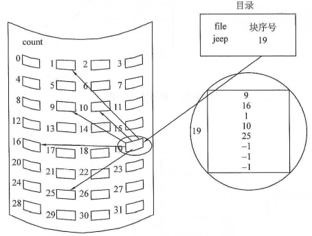

    - 单级索引分配

	    - 单级索引分配方法就是将每个文件所对应的盘块号集中放在一起，为每个文件分配-一个索引块(表)，再把分配给该文件的所有盘块号都记录在该索引块中，因而该索引块就是一个包含多个盘块号的数组。
- 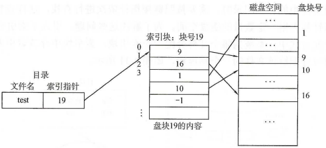

    - 两级索引分配（多级索引)

	    - 当文件较大，一个索引块放不下文件的块序列时，可以对索引块再建立索引，这样构成二级索引，还可以扩展形成多级索引
- 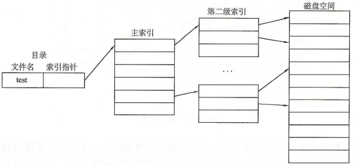

    - 混合索引（利用存储文件的大小区分不同分配方式）

- 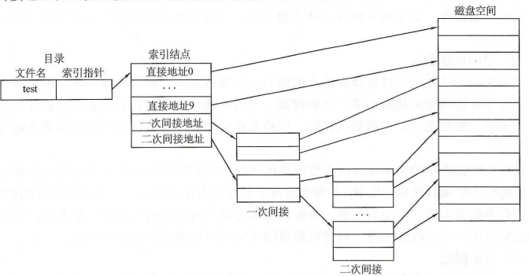

- 文件存储空间管理（空闲空间）

    -空闲文件表法

    - 空闲文件表方法为所有空闲文件单独建立-一个目录，每个空闲文件在这个目录中占一个
表目。表目的内容包括第一个空闲块号、物理块号和空闲块数目
    - 这种空闲文件目录方法类似于内存动态分区的管理。当请求的块数正好等于某个目录表
目中的空闲块数时，就把这些块全部分配给该文件并把该表目标记为空。若该项中的块数多
于请求的块数，则把多余的块号留在表中，并修改该表目中的各项。同样，在释放过程中，
若被释放的物理块号与某### -目录项中的物理块号相邻，则还要进行空闲文件的合并。
    - 仅当文件存储空间中只有少量空闲文件时，这种方法才有较好的效果。若存储空间中有
大量的小空闲文件，则空闲文件目录将变得很大，其效率将大为降低。这种管理方法仅适用
于连续文件。

    -空闲块链表法

    - 空闲块链表法是将文件存储设备.上的所有空闲块链接在-起，形成一条空闲块链， 并设
置一个头指针指向空闲块链的第一一个物理块。 当用户建立文件时，就按需要从链首依次取下
几个空闲块分配给文件。当撤销文件时，回收其存储空间，并将回收的空闲块依次链入空闲
块链表中。
也可以将链表中的空闲盘块改为空闲盘区(每个空闲盘区包含若千个连续的空闲盘块)，
这样的链称为空闲盘区链。其中，在每个盘区上除了含有用于指示下一个空闲盘区的指针外，
还应含有能指明本盘区大小的信息。分配盘区的方法与内存的动态分区分配类似，通常采用
首次适应算法。在回收盘区时，同样也要将回收区与相邻接的空闲盘区合并。

    -位示图法

    - 在位示图中，每一个二进制位都对应-一个
物理块，若某位为1，表示对应的物理块已分配;若为0,表示对应的物理块空闲。
当请求分配存储空间时,系统顺序扫描位示图并按需要从中找出一组值为 0的二进制位，
再经过简单的换算就可以得到相应的盘块号，然后将这些位变为1。当回收存储空间时，只需
要将位示图的相应位清0。
位示图的大小由磁盘空间的大小(物理块总数)确定，因为位示图仅用### 一个二进制位代
表一个物理块，所以它通常比较小，可以保存在主存中，这就使得存储空间的分配与回收较
快。但这种方法实现时，需要进行位示图中二进制所在位置与盘块号之间的转换。

- 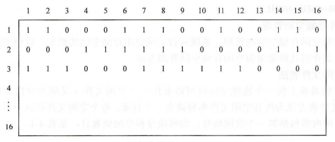

    -成组链接法

    - 成组链接法适用于大型文件系统。该方法将一个文件的所有空闲块按每组100 块分成若
干组，把每一组的盘块数目和该组的所有盘块号记入到前一-组的第一个盘块中， 第一-组的盘
块数目和第一组的所有盘块号记入到超级块中，如图4-16所示。这样每组的第一个盘块 就链
接成了一个链表，而组内的多个盘块形成了堆栈。每组的第一块是存放下 -组的块号的堆栈，
堆栈是临界资源，每次只能允许-一个进程访问，所以系统设置了一~把锁来对其互斥地访问。

- 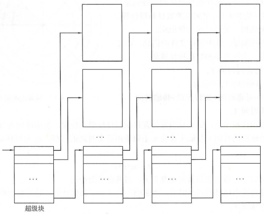

    - 分配空闲盘块法

	    - 当系统要为文件分配空闲盘块时，先查找第一组的盘块数， 若不止一块，则将超级块中的空闲盘块数减1,将栈顶的盘块分配出去。若第一 组只剩下一块(是放置下一组的盘块数和盘块号的那个块,不是空闲块)且栈顶的盘块号不是结束标记0(说
明这一组不是最后一组)，则先将该块的内容读到超级块中(下一组成了第### -组，所以下一组
的盘块数和盘块号需要放到超级块中),然后再将该块分配出去( 该块中的信息不再有用，这
-块成了空闲块);若栈顶的盘块号是结束标记0，则表示磁盘已无空闲盘块，分配不成功。

    - 空闲盘块回收法

	    - 当系统回收空闲块时，若第一组不满100块，则只要在超级块的空闲盘块的栈顶放入该空闲盘块的块号，并将其中的空闲盘块数加1即可;若第一组已经有100块了，则先将第一组中的盘块数和盘块号写入到该空闲盘块中，然后将“盘块数=1及栈顶块号=该空闲盘块块号”写入到超级块中( 该空闲盘块成了新的第一组，原本的第一组成
了第二组)。

    - 成组链接法占用的空间小，而且超级块不大，可以放在内存中，这样使得大多数分配和
回收空闲盘块的工作在内存中进行，提高了效率。

## 磁盘组织与管理

### 磁盘结构

- 物理结构

    -磁盘片、磁头、磁臂、柱面号、磁头号、扇区号

- 磁盘结构中的信息

    -●引导控制块。通常为分区的第一块，若该
分区没有操作系统，则为空。
●分区控制块。其中包括分区的详细信息，
如分区的块数、块的大小、空闲块的数目和指针等。
●目录结构。采用目录文件组织。
●文件控制块。其中包括文件的信息，如文
件名、拥有者、文件大小和数据块位置等。

- 磁盘访问时间

- 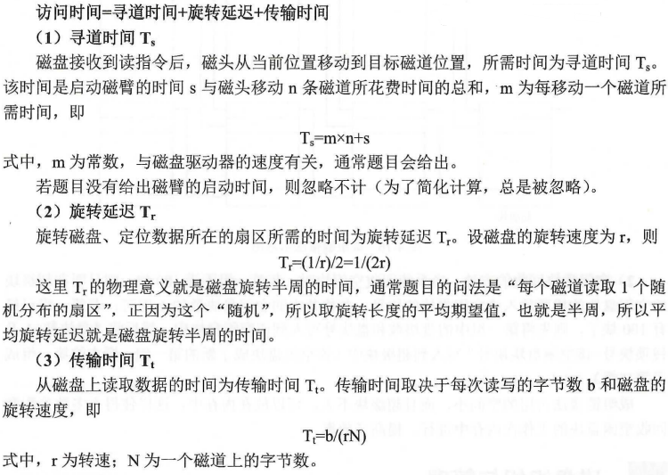

### 调度算法

- 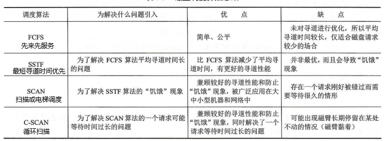

### 磁盘管理

- 磁盘格式化

    -一个新的磁盘只是-一个含有磁性记录材料的空白盘。在磁盘能存储数据前，它必须分成
扇区以便磁盘控制器能进行读和写操作，这个过程称为低级格式化。低级格式化为磁盘的每
个扇区采用独特的数据结构。每个扇区的数据结构通常由头部、数据区域(通常为512B)和
尾部组成。头部和尾部包含了一些磁盘控制器所使用的信息。
为了使用磁盘存储文件，操作系统还需要将自己的数据结构记录在磁盘上。
1)将磁盘分为由一个或多个柱面组成的分区(就是常见的C盘、D盘等分区)。
2)对物理分区进行逻辑格式化(创建文件系统)，操作系统将初始的文件系统数据结构
存储到磁盘上，这些数据结构包括空闲和已经分配的空间以及-一个初始为空的目录。

- 引导块

    -计算机启动时需要运行一一个初始化程序(自举程序)，它初始化CPU、寄存器、设备控
制器和内存等，接着启动操作系统。为此，该自举程序应找到磁盘上的操作系统内核，装入
内存，并转到初始地址，从而开始操作系统的运行。
自举程序通常保存在ROM中，为了避免改变自举代码需要改变ROM硬件的问题，只在
ROM中保留很小的自举装入程序，而将功能完整的自举程序保存在磁盘的启动块上，启动块
位于磁盘的固定位。拥有启动分区的磁盘称为启动磁盘或系统磁盘。

- 坏扇区

    -由于硬件有移动部件且容错能力差，因此容易导致-一个或多个扇区损坏。根据所使用的
磁盘和控制器，对这些块有多种处理方式。
对于简单磁盘，如电子集成驱动器(IDE)， 坏扇区可手工处理，如MS-DOS的Format 
命令执行逻辑格式化时会扫描磁盘检查坏扇区。坏扇区在FAT.上会标明，因此程序不会使用。
对于复杂的磁盘，如小型计算机系统接口(SCSI)， 其控制器维护-一个磁盘坏块链表。该
链表在出厂前进行低级格式化时就初始化了，并在磁盘的整个使用过程中不断更新。低级格
式化将一-些块保留作为备用，对操作系统透明。控制器可以用备用块来逻辑地替代坏块，这
种方案称为扇区备用。

