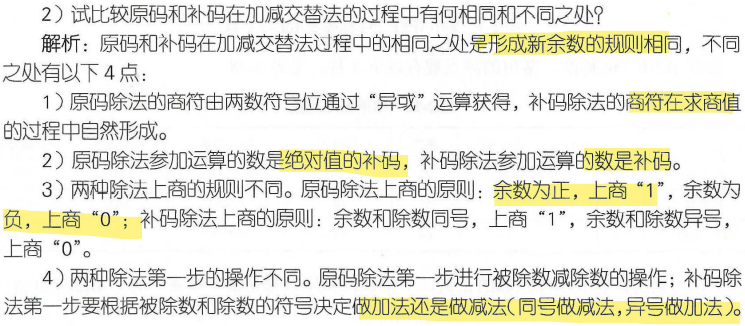
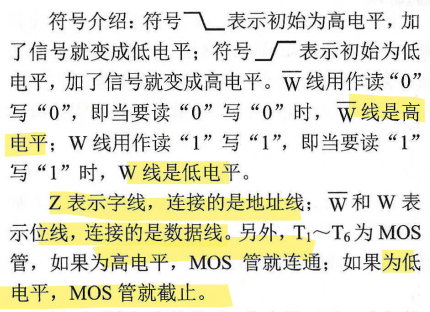
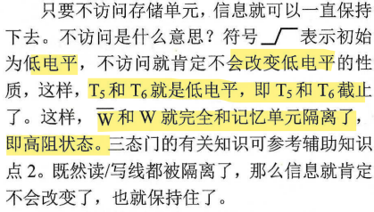
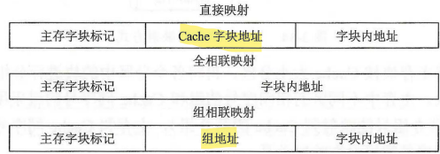
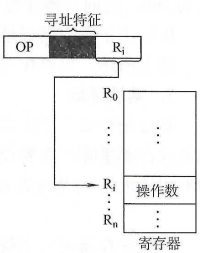
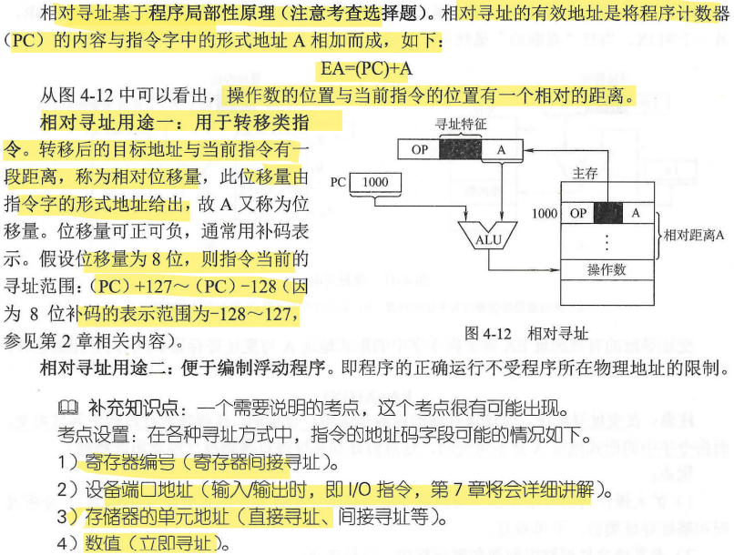
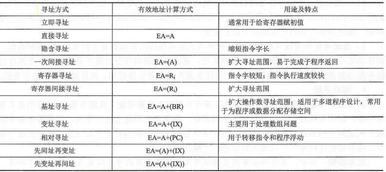

# 计算机组成

## 第一章 计算机系统概论

### 冯诺依曼型计算机特点

- 1.计算机由运算器，控制器，存储器，输入和输出设备5部分组成
- 2.采用存储程序的方式，程序和数据放在同一个存储器中，并以二进制表示。
- 3.指令由操作码和地址码组成
- 4.指令在存储器中按执行顺序存放，由指令计数器(即程序计数器PC)指明要执行的指令所在的储存单元地址，一般按顺序递增，但可按运算结果或外界条件而改变
- 5.机器以运算器为中心，输入输出设备与存储器间的数据传送都通过运算器
- 

### 计算机系统组成

- 计算机系统有硬件（效率高）和软件（灵活性强）组成，硬件包括中央处理器、存储器和外部设备等；计算机软件是指计算机系统中的程序和文档；程序是计算任务的处理对象和处理规则描述；文档是便于了解程序所需的阐明性资料。

### 区别以运算器为中心的计算机还是存储器的方法

- 看输入设备能否直接与存储器相连，是的话就是以存储器为中心

### 计算机系统

- 硬件

	- 结构

		- 主机

			- cpu

				- ALU运算器

					- 运算器是对信息进行处理和运算的部件，进行算术和逻辑运算，核心是算术逻辑单元（ALU),算术运算为加减乘除，逻辑运算为与、或、非、异或、比较、移位等。
运算器包括若干通用寄存器，用于暂存操作数和中间结果，必须有累加器（ACC)、乘商寄存器（MQ）、操作数寄存器（X)

				- CU控制器

					- 控制器由程序计数器（PC)、指令寄存器（IR）和控制单元（CU)组成。PC用于存放当前预执行指令的地址，可以自动+1形成下一条指令的地址，与主存的MAR有直接通路。IR存放当前指令。内容来自主存的MDR。指令中的操作码字段OP（IR）送至CU，用于分析指令并发出微操作命令序列；指令中的地址码字段Ad（IR）送至MAR来取操作数。
					- CPU可以根据指令周期的不同阶段区分指令和数据，再取值阶段取出指令，其他阶段为数据；也可以根据地址来源不同划分，指令地址来自程序计数器，数据地址来自地址形成部件或指令的地址码字段
指令寄存器的操作码送入操作码编译器译码，与时钟和节拍脉冲发生器合作产生一个时序控制信号，并将操作码译码器的结果一同送入微操作控制器，形成“一操作+一时间”的格式
指令的地址码送入地址形成部件，若为转移地址送入PC;若为操作数地址送入存储器的地址译码器去取操作数，取出的操作数先放在数据寄存器，再送往计算器进行运算。
每读取一条指令，PC内容自动+1，以上指令重复执行，直至打印出结果，最后执行停机指令，机器自动停机。

			- 存储器

				- 主存储器（CPU直接访问，存放程序和数据）
				- 辅助存储器（先进入主存后再被CPU访问，主要帮助主存记忆信息）
				- 
				- 存储体存放二进制信息，地址寄存器（MAR）存访存地址，须经地址译码器处理找到存贮单元，数据寄存器（MDR）用于暂存主存读写数据。MAR和MDR属于存储器但存在于CPU。

					- 
					- 存储器取出的数据要先存在数据寄存器中，数据寄存器的位数和存储字长要相等。

				- 寻址范围

					- 1、已知存储器容量和字长，按字节寻址操作为 【 容量8（1M = 8Mbit）】 / 【8 bit(一字节位数）】；按字寻址时： 【容量 * 8（1M = 8Mbit）】 / 【8 bit(一字节位数） 4 】
2、只知数据线和地址线的位数，按字节寻址操作为计算 【2 ^ (地址线数）】
3、按字寻址为 计算数据线数（存储滋字长）的平方根计算出一个存储字的字节数，推算出几个地址线作为字内寻址（2^n)，剩余的的地址线表示寻址范围。
字地址为连续存储单元地址的最小值，若地址一个字为32位，按字节编址，字地址为4倍数的地址。
4、存储器容量为1MB（1MB = 2^20 bit),如存储容量为nMB，一律默认为nMB8，地址线和数据线的总和为 【20*n + 8】

		- I/O

			- 输入设备
			- 输出设备

	- 
	- 五大结构的关系

		- 1、通过与控制器之间的信号请求，输入设备先输入信息给存储器，信息包括数据和程序
2、控制器调用相应的指令运行程序，然后发出相应的操作命令给运算器，控制器给出操作数的地址，根据地址从存储器调用操作数给运算器进行运算
3、运算结果返回存储器，需要打印，则通过输出设备和控制器之间的信号请求打印
		- 

	- 主要技术指标

		- 机器字长（CPI）

			- CPU一次能处理的数据位数

		- 存储容量

			- 存储容量＝存储单元个数×存储字长

		- 运算速度

			- 单位时间执行指令的平均条数，MIPS

- 软件

	- 系统软件

		- 用来管理整个计算机系统 

			- 语言处理程序
			- 操作系统
			- 服务性程序
			- 数据库管理系统
			- 网络软件

	- 应用软件

		- 按任务需要编制成的各种程序

	- 编译程序生成目标代码，使用高级语言源程序作为输入进行翻译转换为机器语言的目标程序并执行。
解释程序源语言书写的源程序作为输入，解释一句执行一句，不形成目标程序。

- 计算机的层次结构

	- 

### 计算机性能指标

- 吞吐量

	- 吞吐量指信息流入、处理和流出系统的速率。吞吐量只要取决于主存的存取周期。

- 响应时间

	- 响应时间是指提交作业到该作业得到的CPU响应所经历的时间。响应时间越短，吞吐量越大。

- 主频

	- 主频是机器内部的时钟频率，是衡量机器速度的重要参数; 时钟周期 = 1 / 主频（Hz) ；主频为24MHz的意思是每秒中包含24M个时钟周期

- CPU周期

	- 又称机器周期，用从内存读取一条指令字的最短时间定义。一个指令周期常由若干个CPU周期构成

- CPU时钟周期

	- 主频的倒数，是CPU的最小时间单位

- CPI、MIPS、FLOPS、IPC

	- CPI：执行一条指令所需要的时钟周期
MIPS：每秒可执行百万条指令数
FLOPS：每秒执行的浮点运算次数
IPC: CPU的每一个时间周期内执行的指令数。

- CPU执行时间

	- CPU执行时间是指CPU对某特定程序的执行时间。

- 程序执行时间=程序指令数x每条指令时钟(CPI)x时钟周期T,

## 第二章 运算方法和运算部件

### 数据的表示方法和转换

- 机器数正0负1

	- 符号数值化的带符号二进制数，称为机器数。

- 真值:符号位加绝对值
- 8421码

	- 权值从高到低为8、4、2、1

		- 算术运算时，需对运算结果进行修正。           方法：如果小于、等于(1001)2，不需要修正；否则加6修正

- 余三码:在8421码的基础上，把每个编码都加上0011

	- 当两个余三码相加不产生进位时，应从结果中减去0011;产生进位时，应将进位信号送入高位，本位加0011

- 2421 码

	- 和8421码相似

- 格雷码:任何两个相邻编码只有1个二进制位不同，而其余3个二进制位相同

### 带符号的二进制数据在计算机中的表示方法及加减法运算

- 原码

	- 定义

		- 最高位为符号位0/1+数值的绝对值形式

	- 特点

		- （1）值+0，-0的原码分别为00000、10000，形式不唯一；
		- （2）正数的原码码值随着真值增长而增长

			-      负数的原码码值随着真值增长而减少

		- （3）n+1位原码表示定点整数范围－(2^n－1)——2^n－1

			-      n+1位原码表示定点小数范围 －(1－2^－n)——1－2^－n

	- 运算

		- 绝对值相加减，由数值大小决定运算结果符号

- 补码

	- 定义，特点和运算

		- 运算:
结果不超过机器所能表示范围时，[X+Y]补=[X]补+[Y]补
减法运算:
[X–Y]补=[X+(–Y)]补=[X]补+[–Y]补
		- 结论

			- 负数的补数＝模＋负数
			- 互为补数的绝对值相加＝模
			- 在补数中，减法运算即加法运算

		- 定义

			- X为正数，则符号0+X的绝对值；X为负数，则X的绝对值取反+1。

		- 特点

			- 数值零的补码表示唯一
			- 正数补码码值随着真值增大而增大，负数补码码值随着真值增大而增大
			- 不论真值是正是负，只需将[x补],连同符号位在内每位取反，未位加1，即可得[-x补]
			- n+1位补码所表示定点整数范围－ 2^n——2^n－1，
n+1位补码所表示定点小数范围－1——1－2^－n

	- 加法运算逻辑事例

		- 加减法运算的溢出处理

			- 溢出定义

				-  当运算结果超出机器数所能表示的范围

			- 加减中，可能产生溢出的情况

				- 可能出现溢出

					- 同号数相加
					- 异号数相减

				- 不可能出现溢出

					- 异号数相加
					- 同号数相减

			- 判断溢出的方法

				- 法一：当符号相同两数相加，结果符号和加数（或被加数）不相同，则溢出

					- fa,fb表示两操作数（A,B）的符号位,fs为结果的符号位

				- 法二：任意符号相加，如果C=Cf，则结果正确，否则溢出；

					- C为数值最高位的进位，Cf为符号位的进位

				- 法三：采用双符号相加，如果fs1=fs2，则结果正确，否则溢出；

					- 运算结果的符号位为fs2；
					- 多符号位的补码，叫做变形补码；
					- 如果采用双符号位，当数为小数时，模m=4;当数为整数时，模m=2的n+2次方

- 反码

	- 定义

		- X是正数，[X]反=[X]原；X是负数，符号+数值取反。

	- 特点

		- 数值零的反码表示不唯一
		- 正数反码码值随着真值增大而增大，负数反码码值随着真值增大而增大
		- n+1位反码所表示定点整数范围－ (2^n－1)——2^n－1，n+1位反码所表示定点小数范围－(1－2^－n)——1－2^－n

	- 加减运算特点

		- 在机器数范围内，反码运算满足[X+Y]反=[X]反+[Y]反
，[X－Y]反=[X]反+[－Y]反

	- 反码运算在最高位有进位时，要在最低位+1，此时要多进行一次加法运算，增加了复杂性，又影响了速度，因此很少采用

- 移码

	- 由来及窍门

		- 为了从码值直接判断对应真值的大小，所以引进移码
		- [X]补的符号位取反，即得[X]移 

	- 特点

		- 最高位是符号位，1表示正，0表示负
		- 数据0有唯一的编码
		- 移码码值随着真值增大而增大
		- n+1位移码所表示定点整数范围－ 2^n——2^n－1， n+1位移码所表示定点小数范围－1——1－2^－n
		- 计算机中，移码常用于表示阶码，故只执行加、减运算
		- 计算机中，移码运算公式需要对结果进行修正

	- 浮点数的阶码运算

		- 移码定义:[X]移=2的n次方+X
		- 补码定义:[Y]补=2的n+1次方+Y
		- 阶码求和公式

			- [X]移+[Y]补=[X+Y]移  mod2的n+1次方
			- [X]移+[-Y]补=[X-Y]移
			- 判溢方法

				- 两位符号位

					- 双符号位参加运算，最高符号位恒置0
					- 当结果最高符号位=1则溢出

						- 低位符号=0，则下溢；低位符号=1，正常；

					-  当结果最高符号位=0则未溢出

						- 低位符号=0，正数；低位符号=1，上溢

				- 单符号位

					- 实际参加操作的两个数(减法时即为被减数和“求补”以后的减数)符号相同，结果又与原操作数的符号不同，即认为溢出。
					- 通过数值部分最高位的进位(或者称为最高有效位)和符号位产生的进位进行“异或”操作，然后按照“异或”的结果进行判断。

- 补，反，原，移码的相互转换

	- 反码-》原码

		- 方法：符号位不变，正数不变，负数数值部分取反。

	- 补码-》原码

		- 方法1：正数不变，负数数值部分求反加1。
		- 方法2：串行转换

			- 从最后开始数，遇到第一个“1”，除第一个“1”不变，前面数字分别取反

	- 移码-》原码

		- 方法：移码转换为补码，再转换为原码

- 移位运算

	- 逻辑移位

		- 逻辑左移时，高位移丢，低位补0；逻辑右移时，低位移丢，高位添0

	- 算术移位

		- 

- 定点数和浮点数

	- 定点数

		- 小数点固定在某个位置上的数据

			- 32位定点小数、定点整数补码的范围

				- 32位定点小数-1～1-2-31
				-  32位定点整数-231～231-1

	- 浮点数

		- 根据IEEE754国际标准，常用的浮点数有两种格式

			- Nmax=Mmax*2的Emax
Nmin=Mmin*2的Emax
			- 单精度(32位)=8位阶码+24位尾数

				- 单精度浮点数(32位)，阶码8位(含一位符号位)，尾数24(含一位符号位)，取值范围:-2的127次方～(1-2的-23次方)*2的127次方

			- 双精度(64位)=11位阶码+53位尾数

				- 双精度浮点数(64位)，阶码11位(含一位符号位)，尾数53位(含一位符号位)，取值范围:-2的1023次方～(1-2的-52次方)*2的1023次方

		- 为了保证数据精度，尾数通常用规格化形式表示:当R=2，且尾数值不为0时，其绝对值应大于或等于(0.5)10

			- 左规
			- 右规

		- 小数点位置可以浮动的数据。
		- 表示形式：N = M · R^E
		- 计算机中存储形式

			- Ms+Es+E(n位)+M(m位)

				- 阶码E，一般为整数，用补码或者移码表示；
				- 尾数M，一般为规格化的定点小数，用补码表示；

### 二进制乘法运算

- 定点原码一位乘法

	- 两个原码数相乘，其乘积的符号为相乘两数符号的异或值，数值则为两数绝对值之积

		- [X·Y]原=[X]原·[Y]原=(X0⊕Y0)|(X1X2..Xn) · (Y1Y2..Yn)

	- 几点结论

		- 从低到高根据乘数每位0、1决定相加被乘数还是0；
		- 相加数每次左移，最后一起求积；
		- 符号由异或决定

	- 修正

		- 1.在机器内多个数据一般不能同时相加，一次加法操作只能求出两数之和，因此每每求得一个相加数，就与上次部分积相加
		- 2.人工计算时，相加数逐次向左偏移一位，由于最后的乘积位数是乘数(或被乘数)的两倍，如按此算法在机器中运算，加法器也需增到两倍。观察计算过程很容易发现，在求本次部分积时，前一次部分积的最低位不再参与运算，因此可将其右移一位，相加数可直送而不必偏移，于是用N位加法器就可实现两个N位数相乘
		- 部分积右移时，乘数寄存器同时右移一位，这样可以用乘数寄存器的最低位来控制相加数(取被乘数或零)，同时乘数寄存器的最高位可接受部分积右移出来的一位，因此，完成乘法运算后，A寄存器中保存乘积的高位部分，乘数寄存器中保存乘积低位部分

			- 
			- 乘法运算可用移位和加法来实现，两个n位数相乘，共需要进行n次加法运算和n次移位操作

- 定点补码一位乘法

	- [X·Y]补=[X]补·(Y0+Y1·2-1+….Yn·2-n)
	- 校正法

		- 注意：此处为双符号位（用于避免移位操作丢失符号位），y（被乘数）为负数时，需要补充加上[-|x|]补的校正操作，否则不用校正
		- 
		- 

	- 比较法

		- 规则

			- ①使用双符号位，避免丢失符号位
②乘数取单符号位以决定最后一步是否需要校正， 即是否加[-x]补。
③乘数末尾增设附件位yn+I,初始值为0。
④根据yn，yn+I判断位，进行运算，步骤同上。
⑤按上述算法进行n+1步，但是第n+1步不再移位，仅根据yo、y1 比较结果决定是否要加减[x]补。
⑥按补码移位规则，即部分积为正时，右移过程中有效位最高位补0;部分积为负时，右移过程中有效位最高位补1;双符号的移位前面已经讲过了，次高符号位是参与移位的，最高符号位不参与。

				- 

		- 

			- 

### 二进制除法

- 加减交替法(不恢复余数）

	- 当余数为正时，商上1，求下一位商的办法是，余数左移一位，再减去除数;当余数为负时，商上0，求下一位商的办法是，余数左移一位，再加上除数。此方法不用恢复余数，所以又叫不恢复余数法。但若最后一次上商为0而又需得到正确余数，则在这最后需恢复余数
	- 原码不恢复

		- 过程

			- 

		- 示例

			- 

	- 补码不恢复

		- 过程

			- 确定商值

				- 

			- 形成商符

				- 

			- 确定新余数

				- 

		- 示例

			- 

- 原码恢复余数法

	- 过程

		- 
		- 

	- 示例

		- 

			- 

- 扩展

	- 
	- 

### 浮点数的运算方法

- 浮点数的加减法运算

	- 1.对阶操作

		- 求出△E，再对小的进行移位

	- 2.尾数的加减运算
	- 3.规格化操作

		- 规则简化是符号位和数值最高位不同，即00.1xxxx或11.0xxxx

			- 

	- 4.舍入

		- 超出表示范围的高位为1舍入，考虑尾数右移丢失的数值位

			- 0舍1入
			- 恒置1法

	- 5.检查阶码是否溢出

		- 

	- 示例

		- 
		- 

- 浮点数的乘除法运算

	- 1.浮点数阶码运算(移码)

		- 牢记公式

			- [X+Y]移=[X]移+[Y]补
			- [X–Y]移=[X]移+[–Y]补

	- 2.按照一位乘或加减交替除运算

		- 先确定符号，在列式子计算

- 表示

	- 尾数用原码表示，阶码用移码表示

		- 

	- 

### 运算部件

- ABC寄存器作业
- 定点运算部件
- 浮点运算部件

	- 由阶码运算部件和尾数运算部件组成

### 数据校验码

- 码距

	- 任意两个合法码之间不相同的二进制位数的最小值

		- 要具有差错能力，则码距>1
		- 合理增大码距，就能提高发现错误的能力

- 鉴定方法

	- 有无差错能力
	- 是否能合理增大码距

- 奇偶校验码

	- 能发现数据代码中一位或奇数个位出错情况的编码，方式为添加一个校验码，使得码字中1的个数为奇数或偶数。
	- 结论

		- （1）奇偶校验码只能发现一位或奇位错，且不能确定出错位置
		- （2）奇偶校验码的码距=2

- 海明校验码

	- 海明码位号和校验位位号的关系

		- Pi的位置在2的i-1次方，但是除了最高位

	- 海明码码距为4
	- 纠一位错，查一位错

		- 2∧r≥k+r+1

	- 纠一位错，查两位错

		- 2∧(r–1)≥k+r

	- 编写过程

		- 1)确定校验位的位数r，2^r-1>=k+r
		- 2)把海明码按序写出来MN，.，. M1,校验码Pi(i取1、2、3、.... m)在编码中的位置为2^(i-1),将校验码的位置写出来，然后将数据位按序填入海明码。

			- 

		- 3)根据校验位和数据位的关系，依次计算出校验码Pi(i取1、2、3、.... m),将Pi填入海明码。

a、每个数据码都由多个校验码共同校验，但要满足一个条件:被校验数据码的海明位号等于校验该数据码的各校验码海明位号之和，且校验码不需要再被校验。例如，DI的海明位号为3(D1放在M3的位置上)，则D1由P2P1校验,(P2放在M2的位置上,PI放在M1的位置上,3=2+1)
b、校验位Pi的值即为所有需要Pi校验的数据位求异或。

	- 校验过程

		- 1)直接写出出错位eN，.，. e1与MN，.，. M1的对应关系，计算eN，.，. e1的值。针对海明码的下标使用二进制表示，其中ei的值为1，则说明ei与Mi有关，使用“异或”操作进行计算，若海明码没有错误，eN，.，. e1全为0.
2)求出二进制序列eN，.，. e1对应十进制的值，则此十进制数就是出错的位数，取反即可得到正确的编码

- 循环冗余校验码(CRC)

	- CRC码可以发现并纠正信息存储或传送过程中连续出现的多位错误
	- CRC码一般是指k位信息码之后拼接r位校验码
	- 模2运算

		- 模2加减
		- 模2乘除

			- 1、除法过程中，计算余数，全部使用“异或”操作
2、上商规则取部分余数的首位
3、部分余数的位数小于除数的位数时，得到最后余数

				- 

		- 异或逻辑

	- CRC的译码与纠错

		- 更换不同的待测码字可以证明:余数与出错位的对应关系是不变，只与码制和生成多项式有关
		- M(x)代表发送信息的多项式，G（x)为生成多项式，代表校验位信息

1、将M(x)和G(x)转化为二进制，多项式各项次数代表位置，系数为该位置上二进制位的值。
2、将M(x)表示的二进制码左移G(x)的最高位数，等到M'(x）
3、将M'(x）对G(x)进行模2除法的余数，将余数与M(x)合并得到循环冗余校验码。

## 第三章 存储器层次结构

### 存储器分类

- 存储介质

	- 半导体存储器可随机访问任一单元，而辅助存储器一般为串行访问存储器
	- 磁表面存储器

		- 数字式磁记录

			- 硬盘、软盘和磁带

		- 模拟式磁记录

			- 录音、录像设备

	- 光存储器

		- 光盘

- 存取方式

	- 随机存储器

		- 随机存储器(RAM)按存储元件在运行中能否长时间保存信息分为静态存储器和动态存储器
		- 静态存储器，利用触发器保存信息，只要不断电，信息就不会丢失
		- 动态存储器，利用MOS电容存储电荷来保存信息，需要不断给电容充电才能使信息来保存信息

	- 只读存储器（ROM)

		- 只读存储器ROM

			- 只读不能写

		- 可编程序的只读存储器PROM

			- 一次性写入

		- 可擦可编程序的只读存储器EPROM

			- 可多次写入、读出

		- 可电擦可编程序只读存储器E2PROM

			- 可多次读出但写入次数有限

		- 快擦除读写存储器Flash Memory

			- 重复写入、读出

	- 串行存储器

		- 顺序存取存储器
		- 直接存取存储器

- 作用

	- 主存储器(主存)、辅助存储器(辅存)、缓冲存储器

### 存储器性能

- 1)存储容量=存储字数x字长。存储字数表示存储器的地址空间大小即存储器的存储单元
数目，字长即存储字长，表示一次存取操作的数据量。
2)单位成本:每位价格=总成本/总容量。
3)存储速度:数据传输率=数据的宽度/存储周期。存储周期又称为读写周期或访问周期，
指连续两次独立地访问存储器操作之间所需的最小时间间隔。

### 层次化结构

- 
- 
- 

### 半导体随机存取存储器

- 译码的驱动方式

	- 线选法

		- 首先假设该矩阵有N行，然后就可以通过公式
【log2N 】算出地址线所需要的根数
		- 

	- 重合法

		- 矩阵中的定位元素的行列坐标需要行地址线也需要列地址线
		- 

- 静态存储器（SRAM)使用六管静态MOS存储单元电路，利用触发器保存信息，只要不断电，信息就不会丢失

	- 基本单元电路简图

		- 
		- 
		- 

	- 保持存储信息

		- 

	- 读数据

		- 
		- 读周期指对芯片两次连续读操作的最小时间间隔(tc);读时间表示进行一次存储器读操作的时间(ta)，显然读时间小于读周期。

	- 写数据

		- 
		- 写周期指对芯片两次连续写操作的最小时间间隔(twc);写时间表示进行一次存储器写操作的时间(tw)，显然写时间小于写周期。

- 动态存储器（DRAM)，利用MOS电容存储电荷来保存信息，需要不断给电容充电才能使信息来保存信息

	- 单管MOS的DRAM基本单元电路简图

		- 

	- 保持存储信息

		- 

	- 读数据

		- 

	- 写数据

		- 

	- 刷新

		- 集中式

			- 
			- 

		- 分散式

			- 
			- 

		- 异步刷新

			- 
			- 

### 存储器容量扩展

- 位扩展:用多个存储器芯片对字长进行扩充
- 字扩展:增加存储器中字的数量，提高存储器的寻址范围
- 字位扩展，假设一个存储器的容量为M×N位，若使用L×K位存储器芯片，那么，这个存储器共需要(M/L)×(N/K)个存储器芯片

### 双口RAM和多模块存储器

- 多体交叉存储器

	- 提高访存速度的方式

		- 采用高速器件
		- 采用层次结构
		- 调整主存结构

	- 计算机中大容量的主存可由多个存储体组成，每个存储体都具有自己的读写线路，地址寄存器和数据寄存器，称为"存储模块"。这种多模块存储器可以实现重叠与交叉存取
	- 第i个模块M的地址编号应按下式给出:M×j+i
	- 连续地址分布在相邻的不同模块内，而同一模块内的地址都是不连续的
	- 
	- 

- 双口RAM

	- 只要有写操作，就不能同时进行
	- 

- 单体多字存储器

	- 
	- 1、需要指令和数据在主存中必须连续存放
2、需要先把属于一个存储字的n个数据字读到数据寄存器中，等数据寄存器达到了一个存储字的长度，再将其写入存储器。

### 高速缓冲存储器

- cache的工作原理

	- 局部性原理，cache使用高速SRAM制作，主存一般是DRAM。
	- 主存地址和cache地址，两者的地址分为前m位寻找某个字块，剩下的n位查找该字块中的字或字节

		- cpu与cache传输数据的基本单位是字，主存和cache的基本单位是块。
		- CPU访问主存时，会将地址同时送给Cache和主存，Cache控制逻辑依据地址判断此
字是否在Cache中。若此字在Cache中，立即传送给CPU,否则，用主存读周期把此字从主
存读出并送到CPU。与此同时，把含有这个字的整个数据块，从主存读出并送到Cache中。

	- 块长

		- 块长一般取一个主存周期所能调出的信息长度（一般为16个字）

	- cache的容量和块的大小是影响cache的效率的重要因素
	- 命中率

		- CPU所要访问的信息是否在cache中的比率，而将所要访问的信息不在cache中的比率称为失败率
		- 

	- 一致性策略

		- 标志交换方式（写回法）
		- 通过式写入（写通法）
		- 写操作直接对主存进行，而不写入cache

	- cache的存取时间

		- 平均存取时间=h*tc+(1-h)(tc+tm) 

	- 最好替换策略

		- 按照被替换的字块是下一段时间最少使用的，由替换部件实现

- cache和主存的映射方式

	- 直接映像

		- 
		- cache中许多空的位置被浪费
		- 主存地址：主存字块标记+cache字块地址+字块内地址

	- 全相联映像

		- 
		- 成本太高而不能采用
		- 主存地址：主存字块标记+字块内地址
		- 优点

			- 方式灵活，缩小了块发生冲突的概率

		- 缺点

			- 增加了标识位位数
			- 增加了寻找主存块在cache中对应块的时间

	- 组相联映像

		- 
		- 直接映像和全相联映像的折衷
		- 主存地址：主存字块标记+组地址+块内地址

	- 

- cache的主存块的替换算法

	- 先进先出算法（FIFO），没有用到访存的局部性原理，不能提高命中率
	- 近期最少使用（LRU），只记录每个块最近一次使用的时间。命中率提高
	- 随机法，没有用到访存的局部性原理，不能提高命中率

- 写操作策略

	- 写回法

		- cache的每行设置一个修改位（脏位），根据其值（0或1）进行修改；
写cache命中时，只修改cache内容，只有此行被换出时才写入主存，减少访问主存次数。

	- 全写法：当写cache命中时，cache和主存同时发生写修改。
	- 写一次法

		- 仅仅第一次写命中时同时写入主存，剩下的与写回法相同

### 虚拟存储器

- 
- 页式虚拟存储器

	- 页式虚拟存储器就是将其基本单位划分为页，且将主存的物理空间划分为与虚拟存储器
等长的页。划分的页称为页面，主存的页称为实页，虚拟存储器的页称为虚页。
系统基本信息的传送单位是定长的页，需要通过地址变换机构实现访存过程，当访问页
面不在主存时，通过页面置换算法将需要的页面调入主存。
优点:由于页面的起点、终点地址是固定的，因此页表简单，调入方便，主存空间浪费
小。
缺点:由于页面不是逻辑上的独立实体，因此处理、保护和共享都不如段式虚拟存储器
方便。

- 段式虚拟存储器

	- 段式虚拟存储器是-种将主存按段分配的存储管理方式，各段的长度因程序而异。段是
利用程序的模块化性质，按照程序的逻辑结构划分成的多个相对独立部分。系统的基本信息
传送单位为段，并通过地址变换机构实现访存过程。
优点:段的分界与程序的自然分界相对应;段的逻辑独立性使它易于编译、管理、修改
和保护，也便于多道程序共享;某些类型的段(堆栈、队列)具有动态可变长度，允许自由
调度以便有效利用主存空间。
缺点:段的长度各不相同，段的起点和终点不定，给主存空间分配带来麻烦，而且容易
在段间留下许多空余的不易利用的零碎存储空间，造成浪费。

- 段页式虚拟存储器

	- 段页式虚拟存储器是段式虚拟存储器和页式虚拟存储器的结合。在这种方式中，把程序
按逻辑单位分段以后，再把每个段分成固定大小的页。程序对主存的调入/调出是按页面进行
的，但它又可以按段实现共享和保护。
优点:兼备页式虚拟存储器和段式虚拟存储器的优点。
缺点:在地址映射过程中需要多次查表。

- TLB（快表）

	- 页表分为快表和慢表，慢表在主存，快表在高速的虚拟存储器中，快表是慢表的一部分，快表命中，页表一定命中。同时命中可以确定页面调入内存，不能确定cache
	- 具有Cache并采用动态重定位存储管理的系统中，一次存储访问操作的过程

		- 
		- 

- 访问关系

	- 

- 缺失处理

	- 

### 外存储器

- 辅助存储器的技术指标

	- 存储密度

		- 定义：单位长度或单位面积磁层表面磁层所存储的二进制信息量
		- 道密度

			- 沿磁盘半径方向单位长度的磁道数称为道密度，单位为道/英寸tpi或道/毫米tpmm

		- 位密度或线密度

			- 单位长度磁道所能记录二进制信息的位数叫位密度或线密度，单位为位/英寸bpi或位/毫米bpmm

		- 每个磁道所存储的信息量是一样相等的

	- 存储容量

		- C = n × k × s
C为存储总容量; n为存放信息的盘面数; k 为每个盘面的磁道数; s为每条磁道上记录的二进制代码数。

	- 寻址时间

		- 平均寻址时间Ta=平均找道时间Ts+平均等待时间Tw =(最大寻道时间+最小寻道时间)/2+(最大等待时间+最小等待时间)/2
		- 辅存的速度

			- 寻址时间
			- 磁头读写时间

	- 数据传输率

		- Dr  = D × V

	- 误码率

- 硬盘存储器记录数据

	- 1)归零制(RZ)。记录“1”时，通正向脉冲电流;记录“0”时，通反向脉冲电流。“0”.和“1”信息之间驱动电流归零。
2)不归零制(NRZ)。记录“1”时，通正向脉冲电流;记录“0”时，通反向脉冲电流。只有当相邻信息代码不同时，电流才改变方向，故称为“见变就翻”。
3)“见1就翻”的不归零制(NRZ1)。 只有记录“1”时，电流才改变方向，
	- 

- 硬磁盘存储器的类型

	- (1) 固定磁头和移动磁头
	- (2) 可换盘和固定盘

- 磁盘存储器

	- 磁盘存储器由驱动器（HDD），控制器（HDC）和盘片组成
	- 最外面的同心圆叫0磁道，最里面的同心圆假设称为n磁道
	- 驱动器的定位驱动系统实现快速精准的磁头定位
	- 主轴系统的作用是带动盘片按额定转速稳定旋转
	- 数据控制系统的作用是控制数据的写入和读出，包括寻址，磁头旋转，写电流控制，读出放大，数据分离
	- 磁盘控制器有两个方向的接口

		- 与主机的接口
		- 与驱动器（设备）的接口

- 磁盘阵列（RAID)

	- RAID是指多个小容量磁盘代替一个大容量磁盘，实现将数据分块并能并行处理
	- RAID0是简单的磁盘阵列架构，分块存储读取
	- RAID1是镜像备份

- 光盘

	- 采用光存储技术

		- 利用激光写入和读出
		- 第一代光存储技术

			- 采用非磁性介质

				- 不可擦写

		- 第二代光存储技术

			- 采用磁性介质

				- 可擦写

	- 光盘的存储原理

		- 只读型和只写一次型

			- 热作用（物理或化学变化）

		- 可擦写光盘

			- 热磁效应

## 第四章:指令系统

### 指令格式

- 结构(操作码+地址码)

	- 操作码：定长和不定长；位于每条指令的前一个字节或前多个字节
	- 操作数的地址
	- 操作结果的存储地址
	- 下一条指令的地址

- 地址码

	- 零地址指令

		- 

	- 一地址指令

		- 寻址范围  2^24 = 16 M

			- 2次访存

				- 

	- 二地址指令

		- 寻址范围  2^12 = 4 K

			- 4 次访存

				- 
				- 

	- 三地址指令

		- 寻址范围  2^8 = 256

			- 4 次访存

				- 

	- 多地址指令

		- 寻址范围  2^6 = 64

			- 4 次访存

				- 

- 指令字长

	- 取决因素

		- 操作码的长度
		- 操作数地址的长度
		- 操作数地址的个数

	- 指令字长 固定

		- 指令字长 = 存储字长

	- 指令字长 可变

		- 按字节的倍数变化

			- 1、不允许较短的操作码是较长操作码的前缀
2、各条指令的操作码一定不能重复

	- 对准边界存放

		- 不连续存放数据
		- 按字节编址

			- a.半字地址最低位恒为0
			-  b.字地址最低两位恒为0
			- c.双字地址的最低三位恒为0

		- 减少访存次数，浪费存储空间

	- 不 对 准 边 界 存 放

		- 连续存放数据
		- 节约存储器空间，但增加访存次数，对多字节数据存在调整高 低字节位置的问题

- 寻址方式

	- 数据寻址

		- 
		- 分类

			- 立即寻址

				- 
				- 优点:只需取出指令，便可立即获得操作数。采用立即寻址特征的指令只需在取指令时
访问存储器，而在执行阶段不必再访问存储器。
缺点:由于A表示的就是立即数，因此A的位数限制了立即数表示的范围
立即寻址方式通常用于对某寄存器或内存单元赋初值

			- 直接寻址

				- 
				- 优点:寻找操作数非常简单，因为直接就给出了操作数的有效地址，而不需要经过某些
变换。
缺点:操作数的有效地址仅由A决定，而A的位数- -般都比较小,因此寻址范围比较小。
在执行阶段需要访问一次存储器去取操作数

			- 隐含寻址

				- 
				- 隐含寻址指指令字中不明显地给出操作数地址，其操作数地址隐含在操作码或者某个寄
存器中。

			- 间接寻址

				- 
				- 优点:便于子程序返回和查表(
缺点:一次间接寻址在指令的执行阶段还需要访问两次存储器(-一次取操作数
的有效地址，一次取操作数)，而N次间接寻址却需要访问存储寻址特征器N+1次(前面N次找操作数的有效地址,第N+1次找操作数)。

			- 寄存器寻址

				- 
				- 优点:
1)由于操作数在寄存器中，因此指令在执行阶段不需要访存，即减少了执行时间。
2)减少了指令字的长度

			- 寄存器间接寻址

				- 
				- Ri的内容不是操作数,而是操作数所在主存单元的
地址号，即有效地址EA=(Ri)。
注意: XX寄存器名加了一个括号，表示此寄存器中的内容。
优点:便于编制循环程序。
缺点:寄存器间接寻址需要访问一次存储器去取操作数。

			- 基址寻址

				- 
				- 
				- 优点:
1)扩大操作数的寻址范围(因为基址寄存器的位数可以大于形式地址A的位数)。只要对基地址寄存器的内容进行修改，就可以访问主存的任意单元。
2)便于解决多道程序问题，继续跳过，知道基址寻址可以用在多道程序即可。
注意:
1)基址寄存器的内容由操作系统确定，在程序执行过程中不能由用户随意改变!
2)虽然基址寄存器的内容不可以由用户改变，但是当采用通用寄存器组来作为基址寄存器时，用户有权知道到底使用了哪个通用寄存器来作为基址寄存器。

			- 变址寻址

				- 
				- 

			- 相对寻址

				- 

		- 寻址方式总结

			- 

	- 指令寻址

		- 

	- 标志寄存器与转移条件的逻辑表达式总结

		- 

	- 操作数的存放地址

		- 

- 指令操作码的扩展技术

	- 指令操作码的长度决定了指令系统中完成不同操作的指令数
	- 若某机器的操作码长度固定为K位，则它最多只能有2^K条不同指令
	- 指令操作码两种格式

		- 固定格式

			- 优点:对于简化硬件设计，减少指令译码时间非常有利
			- 缺点:指令少，浪费地址

		- 可变格式(分散地放在字的不同字段)

			- 优点:指令多，缩短指令平均长度，减少程序总位数，增加指令字所能表示的操作信息
			- 缺点:译码复杂，控制器的设计难度增大

	- 拓展方法的一个重要原则

		- 使用频度(即指令在程序中出现概率)高的指令应分配短的操作码，使用频度低的指令相应地分配较长的操作码

- 指令系统的兼容性

	- 保持系统向上兼容

### 精简指令系统计算机（RISC）——用于小型机

- 1)选取使用频率较高的一些简单指令以及一些很有用但又不复杂的指令，让复杂指令的
功能由使用频率高的简单指令的组合来实现。
2)指令长度固定，指令格式种类少，寻址方式种类少。
3)只有取数/存数指令访问存储器，其余指令的操作都在寄存器内完成。
4) CPU中有多个通用寄存器(比CISC的多)。
5)采用流水线技术(注意: RISC一定是采用流水线)，大部分指令在一个时钟周期内完
成。采用超标量和超流水线技术，可使每条指令的平均执行时间小于一个时钟周期。
6)控制器采用组合逻辑控制，不用微程序控制。
7)采用优化的编译程序。

### 复杂指令系统计算机（CISC）——用于大型机

- 1)指令系统复杂庞大，指令数目-般多达200~300条。
2)指令长度不固定，指令格式种类多，寻址方式种类多。
3)可以访存的指令不受限制(RISC 只有取数/存数指令访问存储器)。
4)由于80%的程序使用其20%的指令，因此CISC各指令的使用频率差距太大。
5)各种指令执行时间相差很大，大多数指令需多个时钟周期才能完成。
6)控制器大多数采用微程序控制。
7)难以用优化编译生成高效的目标代码程序。
- 1) RISC比CISC更能提高计算机的运算速度，由于RISC寄存器多，因此就可以减少访存次数;其次，由于指令数和寻址方式少，因此指令译码较快。
2) RISC比CISC更便于设计，可降低成本，提高可靠性。
3) RISC 能有效支持高级语言程序。

## 第五章：中央处理器

### 计算机工作过程

- 加电——》产生reset信号——》执行程序——》停机——》停电
- 产生reset信号的任务

	- 任务一：使计算机处于初始状态
	- 任务二：从PC中取出指令地址

- 控制器作用是协调并控制计算机各部件执行程序的指令序列

### CPU

- 功能分析

	- 1)控制器能自动地形成指令的地址，并能发出取指令的命令，将对应此地址的指令取到
控制器中，称为指令控制。
2)取到指令之后，应该产生完成每条指令所需要的控制命令，称为操作控制。
3)控制命令产生后，需要对各种控制命令加以时间上的控制，称为时间控制。
4)在执行的过程中，可能需要进行算术运算和逻辑运算，称为数据加工。
5)最后当然还有处理中断的能力，称为中断处理。
	- 

- 基本结构

### 控制器的组成

- 控制器的功能

	- 取指令

		- 发出指令地址，取出指令的内容

	- 分析指令

		- （1）对操作码译码产生操作相应部件的控制信号
		- （2）根据寻址方式形成操作数地址

	- 执行指令

		- （1）根据分析指令后产生控制信号、操作数地址信号序列，通过CPU及输入输出设备的执行实现每条指令的功能
		- （2）结果回送存储器
		- （3）形成下条指令的地址

	- 控制程序和数据的输入和结果输出
	- 对异常情况和某些请求的处理

		- 异常情况的处理：例如算术运算的溢出、数据传送奇偶错
		- 某些请求的处理

			- “中断请求”信号
			- DMA请求信号

- 控制器的组成

	- 程序计数器（PC）

		- 即地址寄存器，用来存放当前正在执行的指令地址或即将要执行的下一条指令地址

	- 指令寄存器（IR）

		- 用以存放当前正在执行的指令，以便在指令执行过程中控制完成一条指令的全部功能

	- 指令译码器或操作码译码器

		- 对指令寄存器中的操作码进行分析解释，产生相应的控制信号

	- 脉冲源及启停线路

		- 脉冲源参数一定评率的脉冲作为整个机器的时钟脉冲，是机器周期和工作脉冲的基准信号，在机器刚加电时，还应产生一个总清信号（reset）

	- 时序控制信号形成部件

		- 当程序启动后，在CLK时钟作用下，根据当前正在执行的指令的需要，产生相应的时序控制信号，并根据被控制功能部件的反馈信号调整时序控制信号

			- 控制存储器
			- 微指令寄存器

				- 控制字段+下址

	-  周期概念

		- 指令周期

			- 完成一条指令所需的时间，包括取指令、分析指令、执行指令

		- 机器周期

			- 也称为CPU周期，是CPU从内存中读取一个指令的时间，通常等于取指周期

		- 时钟周期

			- 称为节拍脉冲或T周期，是基准脉冲信号

	- 三条假设

		- 程序是存放在主存中的，当执行完一条指令后才从主存中取下一条指令（非流水线）
		- 指令的长度是固定的，并限制了寻址方式的多样化
		- 在程序运行前，程序和数据都已存在主存中

- 指令执行过程（运算器和控制器配合）

	- 组成控制器的基本电路

		- 具有记忆功能的触发器以及由它组成的寄存器，计数器和存储单元
		- 没有记忆功能的门电路及由它组成的加法器，算术逻辑运算单元（ALU）和各种逻辑电路

	- 举例

		- 加法

			- 取指令——》计算操作数地址——》取操作数——》执行结果并运算送结果

		- 要能看懂时序图

			- 哪些指令在对应的时间有效

		- 条件转移指令

			- 取指令——》计算地址

	- 控制器的功能就是按每一条指令的要求产生所需的控制信号
	- 产生控制信号的方法

		- 微程序控制
		- 硬布线控制

### 微程序控制计算机的基本工作原理

- 基本概念

	- 微指令

		- 在微程序控制的计算机中，将由同时发出的控制信号所执行的一组微操作

	- 微命令

		- 将指令分为若干条微指令，按次序执行这些微指令。组成微指令的操作即微命令

	- 微程序

		- 计算机的程序由指令序列构成，而计算机每条指令的功能均由微指令序列解释完成，这些微指令序列的集合就叫做微程序

	- 控制存储器

		- 微程序一般是存放在专门的存储器中的，由于该存储器主要存放控制命令（信号）与下一条执行的微指令地址（简称下址）
		- 存储单元内容

			- （1）微指令的控制信号——控制位
			- （2）下条微指令的地址——下址字段

		- 存储芯片：ROM

	- 执行一条指令实际上就是执行一段存放在控制存储器中的微程序

- 实现微程序控制的基本原理

	- 控制信号（23条）
	- 书上P123页为加法的过程
	- 微指令格式：控制字段+下址字段
	- 23个控制位，12个下址位——》容量为4K
	- 取址微指令的操作对所有指令都是相同的，所以是一条公用的微指令，其下址由操作码译码产生

- 微程序控制器
- 时序信号及工作脉冲的形成
- 停机和停电的区别

	- 停机

		- 电压：稳定

			- 存放内容：保持

				- 重启PC内容：断点指令地址

	- 停电

		- 电压：消失

			- 存放内容：RAM的内容消失

				- 重启PC内容：第一条指令地址

### 微程序设计技术

- 如何缩短微指令字长

	- 直接控制法（容量太小）

		- 编译方法：每一位代表一个控制信号，直接送往相应的控制点
		- 优点：控制简单
		- 缺点：微指令字长过大

	- 字段直接编译法

		- 选出互斥的微指令
		- 每个字段都要留出一个代码，表示本段不发出任何指令（000）
		- 优点：节省微指令的字长
		- 缺点：增加了额外的硬件开销

	- 字段间接编译法

		- 指令之间相互联系的情况
		- 举例：A为0-7，B为0-3，如果是直接编译——3+2=5，如果是间接编译——3+1=4
		- 编码方法：在字段直接编译法中，译码输出端要兼由另一字段中的某些微命令配合解释
		- 优点：减少了微指令长度
		- 缺点：可能削弱微指令的并行控制能力，同时增加硬件开销

	- 常熟源字段E(了解)

- 如何减少微指令长度

	- 现行微指令/微地址

		- 现行微指令：当前正在执行的指令
		- 现行微地址：存放现行微指令的控制器存储单元

	- 后继微指令/微地址

		- 后继微指令：下一条要执行的微指令
		- 后继微地址：存放后继微指令的控制器存储单元

	- 增量与下址字段结合产生后继微指令的方法

		- 下址字段分成：转移控制字段BCF和转移地址字段BAF

			- BCF：控制微程序的转移情况
			- BAF：转移后的微指令所在地址

		- BAF有两种情况

			- 与uPC的位数相等——转移灵活，但增加微指令长度
			- 比uPC短——转移地址收到限制，但可缩短微指令长度

		- 优点

			-  微指令的下址字段很短，仅用于选择输入uPC计数器的某条线路有效

		- 缺点

			- 微程序转移不灵活，使得微程序在控存中的物理空间分配有困难

	- 多路转移方式

		- 一条微指令存在多个转移分支的情况称为多路转移

	- 微中断

		- 1.微中断请求信号是由程序中断请求信号引起的
		- 2.在完成现行指令的微程序后响应该微中断请求
		- 3.由硬件产生对应微中断处理程序在控存中的入口地址

- 如何提高微程序的执行速度
- 微指令格式

	- 水平型微指令——直接控制，字段编译（直接、间接）

		- 特点：在一条微指令中定义并并行执行多个微命令

	- 垂直型微指令

		- 特点：不强调实现微指令的并行控制功能
		- 定义：采用微操作码编译法，由操作码规定微指令的功能

- 微程序控制存储器

	- 一般采用ROM存储器
	- 也可采用RAM，为防止断电后内容消失，则必须开机后将外存中存放的微程序调入控存RAM，然后才能执行程序。
	- 当前为了能不断扩展指令系统，通常采用ROM+RAM

- 动态微程序设计

	- 定义：能根据用户要求改变微程序
	- 优点：是计算机能更灵活、有效的适应于各种不同的应用目标

- 控制存储器的操作（P136）

	- 串行方式
	- 并行方式——比串行多了微指令寄存器

		- 微周期=max(取微指令时间,执行微指令时间)
		- 由于取微指令、执行微指令同时进行，故对于某些后继微地址的产生根据处理结果而定的微指令，则延迟一个微周期再取微指令

### 硬布线控制的计算机（RISC）——特点快

- 形成操作控制信号的逻辑框图（P141）
- 操作控制信号的产生

	- 取值周期cy1所产生的信号对所有指令都是相同的，即与当前执行的指令无关，逻辑式得到最简单的形式
	- 通常，同一个控制控制信号在若干条指令的某些周期（或再加上一些条件）中都需要，为此需要把它们组合起来
	- 同种类型的指令所需要的控制信号大部分是相同的，仅有少量区别
	- 在确定指令的操作码时（即对具体指令赋予二进制操作码），为了便于逻辑表达式的化简以减少逻辑电路数量，往往给予特别关注

- 设计组合逻辑电路从而产生需要的控制信号的步骤

	- 1.实际逻辑问题2.真值表3.公式化简4.逻辑电路图

- 设计目标

	- 使用最少的电路元件达到最高的操作速度

### 流水线工作原理

- 几点结论

	- 每条指令的执行时间不变
	- 每条指令处理结果的时间缩短
	- 流水线处理速率最高时=流水线处于满载的稳定状态
	- 流水线处理速率最低时=流水线未满载状态
	- 为了满足在重叠时间段不同指令的机器周期能够完成指定的操作，将时间段=操作完成的最长时间
	- 为了保证一个周期内流水线的输入信号不变，相邻时间段之间必须设置锁存器或寄存器
	- 除了指令执行流水线，还有运算操作流水线

- 相关问题

	- 流水线阻塞（P163-6.15）

		- 数据相关产生

			- 假设第二条指令需要的操作数是第一条指令运算的结果，那么出现了数据相关

		- 指令执行时间不同产生
		- 程序转移的影响
		- 异常情况响应中断

## 第九/十章：输出输出（I/O）设备/系统

### 设备控制器（I/O）的基本功能

- 实现主机和外部设备之间的数据传送
- 实现数据缓冲，以达到主机同外部设备之间的速度匹配
- 接受主机的命令，提供设备接口的设备，并按照主机的命令控制设备

### I/O 编址方式

- (1) 统一编址：用取数、存数指令
- (2) 不统一编址：有专门的 I/O 指令

### I/O 与主机的连接方式

- 辐射式连接

	- 每台设备都配有一套
	- 控制线路和一组信号线
	- 不便于增删设备

- 总线连接

	- 便于增删设备

### I/O设备

- 人机交互设备

	- 键盘、鼠标等

- 计算机信息的驻留设备

	- 硬盘、光盘等

- 机——机通信设备

	- MODEN等

### 为什么要设置接口？

- 1. 实现设备的选择
- 2. 实现数据缓冲达到速度匹配
- 3. 实现数据串     并格式转换
- 4. 实现电平转换
- 5. 传送控制命令
- 6. 反映设备的状态

	- （“忙”、“就绪”、“中断请求”）

### 中断服务程序的流程

- (1) 保护现场

	- 程序断点的保护
	- 寄存器内容的保护

- (2) 中断服务

	- 对不同的 I/O 设备具有不同内容的设备服务

- (3) 恢复现场

	- 出栈指令

- (4) 中断返回

	- 中断返回指令

### 单重中断和多重中断

- 单重 中断

	- 不允许中断 现行的 中断服务程序

- 多重 中断

	- 允许级别更高 的中断源
	- 中断 现行的 中断服务程序

### DMA 方式

- 主存和 I/O 之间有一条直接数据通道
- CPU 和 I/O 并行工作
- DMA 的三种工作方式

	- (1) CPU暂停方式
	- (2) CPU周期窃取方式
	- (3)直接访问存储器

- DMA 接口功能

	- (1) 向 CPU 申请 DMA 传送
	- (2) 处理总线 控制权的转交
	- (3) 管理 系统总线、控制 数据传送
	- (4) 确定 数据传送的 首地址和长度，修正 传送过程中的数据地址和长度
	- (5) DMA 传送结束时，给出操作完成信号

- DMA 传送过程

	- 预处理、数据传送、后处理

### 外设接口

- 设备与主机相连时，必须按照规定的物理互连特性、电气特性等进行连接，这些特性的技术规范称为接口标准

